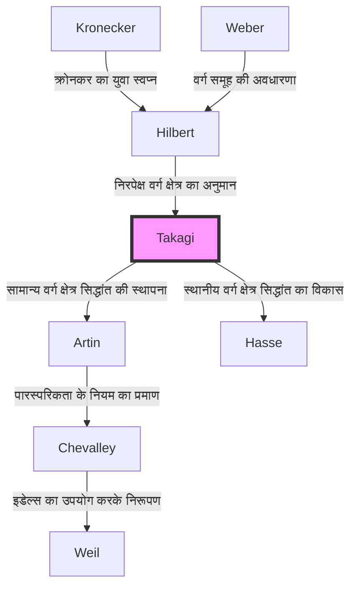

## परिचय

आधुनिक संख्या सिद्धांत में, विशेष रूप से बीजगणितीय संख्या सिद्धांत में सबसे सुंदर और शक्तिशाली सैद्धांतिक ढांचों में से एक **क्लास फील्ड थ्योरी** (Class Field Theory) है। जिस व्यक्ति ने अकेले दम पर इस शानदार सैद्धांतिक प्रणाली का निर्माण किया और अचानक जापानी गणित को दुनिया के उच्चतम स्तर तक पहुँचाया, वे **तेजी ताकागी** (1875–1960) थे।

उन्होंने जो स्मारकीय उपलब्धि हासिल की, वह केवल एक खुली समस्या को हल करने तक सीमित नहीं थी। उन्होंने उस गणितीय परिदृश्य को शानदार ढंग से चित्रित किया जिसका क्रोनकर और हिल्बर्ट जैसे पश्चिमी दिग्गजों ने सपना देखा था, वह भी सुदूर पूर्व में अलग-थलग रहते हुए, और इस प्रकार वह मार्ग प्रशस्त किया जिस पर गणितीय समुदाय को आगे चलना चाहिए था। इस लेख में, हम तेजी ताकागी के जीवन पथ और उनके द्वारा स्थापित क्लास फील्ड थ्योरी के मूल में गहराई से उतरेंगे।

## 1. प्रारंभिक जीवन और गणित के प्रति जागरण

### गिफू के एक कृषि गांव से इंपीरियल विश्वविद्यालय तक

तेजी ताकागी का जन्म 1875 (मीजी 8) में गिफू प्रान्त के ओनो जिले (वर्तमान मोटोसु शहर) के कज़ुया नामक एक शांत कृषि गांव में हुआ था। कम उम्र से ही असाधारण प्रतिभा दिखाते हुए, उन्होंने स्थानीय स्कूलों से पढ़ाई की और क्योटो में थर्ड हायर मिडिल स्कूल (बाद में थर्ड हाई स्कूल) में प्रवेश लिया। यहां, वे किटारो निशिदा के सहपाठी बने, जो बाद में जापानी दार्शनिक दुनिया का नेतृत्व करने वाले थे।

इसके बाद उन्होंने इंपीरियल यूनिवर्सिटी (अब टोक्यो विश्वविद्यालय) के विज्ञान कॉलेज में गणित विभाग में प्रवेश लिया। उस समय जापान मीजी बहाली से कुछ ही दशक दूर था और उसने अभी-अभी पश्चिमी आधुनिक गणित को पूरी तरह से अपनाना शुरू ही किया था। जापान में गणित की शिक्षा की शुरुआत का समर्थन करने वाले अपने गुरुओं, डाइरोकू किकुची और रिकिटारो फुजिसावा के मार्गदर्शन में, ताकागी की गणितीय प्रतिभा तेजी से निखरी।

### विदेश में अध्ययन और गोटिंगेन में दिन

1898 में, ताकागी शिक्षा मंत्रालय के एक विदेशी छात्र के रूप में जर्मनी गए। उन्होंने शुरुआत में बर्लिन विश्वविद्यालय में अध्ययन किया, लेकिन बाद में गोटिंगेन विश्वविद्यालय में स्थानांतरित हो गए, जो उस समय दुनिया में गणित का केंद्र था।

वहाँ उनकी प्रतीक्षा में ऐसे महान गणितज्ञ थे जिन्होंने गणित के इतिहास में अपना नाम छोड़ दिया, जैसे कि [डेविड हिल्बर्ट](https://kenji.blog/hi/p/hilbert/) और फेलिक्स क्लेन। विशेष रूप से, हिल्बर्ट ने हाल ही में अपना "Zahlbericht" (संख्याओं पर रिपोर्ट) प्रकाशित किया था, जो बीजगणितीय संख्या सिद्धांत की पराकाष्ठा थी, और इसकी सामग्री का ताकागी पर गहरा प्रभाव पड़ा। हिल्बर्ट के मार्गदर्शन में, उन्होंने "क्रोनकर के युवा स्वप्न" (जटिल गुणन के सिद्धांत से संबंधित एक समस्या) के एक हिस्से को हल किया, 1903 में अपनी डॉक्टरेट की उपाधि प्राप्त की और जापान लौट आए।

## 2. अलगाव में सफलता: क्लास फील्ड थ्योरी का जन्म

### प्रथम विश्व युद्ध के कारण शैक्षणिक अलगाव

जापान लौटने के बाद, ताकागी ने टोक्यो इंपीरियल विश्वविद्यालय में प्रोफेसर के रूप में युवा विद्वानों को पढ़ाते हुए अपना शोध जारी रखा। हालाँकि, जब 1914 में प्रथम विश्व युद्ध छिड़ गया, तो जापान और यूरोप के बीच शैक्षणिक आदान-प्रदान पूरी तरह से कट गया। नवीनतम शोध पत्र या पत्रिकाएँ प्राप्त किए बिना, ताकागी के पास अपनी प्रयोगशाला में अकेले अपने विचारों को गहरा करने के अलावा कोई विकल्प नहीं था।

यह "अलगाव" विडंबना यह है कि वह मिट्टी बन गया जिसने एक महान रचना को जन्म दिया। ताकागी ने अपने अनूठे दृष्टिकोण से हिल्बर्ट द्वारा प्रस्तावित सापेक्ष एबेलियन विस्तार से संबंधित समस्याओं की फिर से जांच करना शुरू कर दिया।

### क्लास फील्ड थ्योरी की अवधारणा

हिल्बर्ट ने एक दिए गए बीजगणितीय संख्या क्षेत्र $K$ के लिए एक "निरपेक्ष वर्ग क्षेत्र" (absolute class field) के अस्तित्व का अनुमान लगाया था और आंशिक रूप से सिद्ध किया था, जो एक अधिकतम गैर-शाखित एबेलियन विस्तार है जिसका गैलोइस समूह $K$ के आदर्श वर्ग समूह के समरूपी (isomorphic) है।

ताकागी ने सोचा कि "गैर-शाखित" (unramified) होने के इस प्रतिबंध को हटाकर, किसी भी एबेलियन विस्तार के लिए एक समान रूप से सुंदर पत्राचार सही हो सकता है। यह ताकागी की **क्लास फील्ड थ्योरी** का मूल विचार था।

## 3. गणित का शिखर: क्लास फील्ड थ्योरी का मूल

आइए गणितीय सूत्रों का उपयोग करके क्लास फील्ड थ्योरी के दावों को देखें। एक बीजगणितीय संख्या क्षेत्र $K$ के एक परिमित एबेलियन विस्तार $L$ पर विचार करें। ताकागी ने दिखाया कि $K$ के आदर्श समूह के भीतर एक सर्वांगसमता आदर्श समूह $H$ पर विचार करके जो विशिष्ट शर्तों को पूरा करता है, $L$ और $H$ के बीच एक-से-एक पत्राचार है।

### ताकागी का अस्तित्व प्रमेय और मौलिक प्रमेय

तेजी ताकागी द्वारा सिद्ध किए गए मुख्य प्रमेय इस प्रकार हैं:

1. **समरूपता प्रमेय** (Isomorphism Theorem): किसी भी एबेलियन विस्तार $L/K$ के लिए, $K$ का एक उपयुक्त सर्वांगसमता आदर्श समूह $H$ मौजूद है, और गैलोइस समूह $\text{Gal}(L/K)$ भागफल समूह $I/H$ के समरूपी है।
   
   $$ \text{Gal}(L/K) \cong I/H $$
   
   यहाँ, $I$ एक निश्चित मापांक (modulus) के सापेक्ष एक आदर्श समूह है।

2. **अस्तित्व प्रमेय** (Existence Theorem): इसके विपरीत, $K$ के किसी भी सर्वांगसमता आदर्श समूह $H$ के लिए, $H$ के अनुरूप एक एबेलियन विस्तार $L$ (वर्ग क्षेत्र) हमेशा मौजूद होता है।

3. **पूर्ण विभाजन प्रमेय** (Complete Splitting Theorem): $K$ के एक अभाज्य आदर्श $\mathfrak{p}$ के लिए $L$ में पूरी तरह से विभाजित होने के लिए एक आवश्यक और पर्याप्त शर्त यह है कि $\mathfrak{p}$ समूह $H$ से संबंधित हो।

हिल्बर्ट का अनुमान एक विशेष मामले के रूप में शामिल है जहां मापांक तुच्छ है (जब कोई शाखाकरण नहीं होता है)। ताकागी ने इसे एक ऐसे रूप में सामान्यीकृत किया जो मनमाने शाखाकरण की अनुमति देता है, जिससे बीजगणितीय संख्या क्षेत्रों के एबेलियन विस्तार के संबंध में एक पूर्ण सिद्धांत स्थापित हुआ।

### गणितीय सुंदरता: क्रोनकर-वेबर प्रमेय का सामान्यीकरण

क्लास फील्ड थ्योरी की सुंदरता परिमेय संख्याओं के क्षेत्र $\mathbb{Q}$ के लिए **क्रोनकर-वेबर प्रमेय** को सामान्य बीजगणितीय संख्या क्षेत्रों तक विस्तारित करने में निहित है। क्रोनकर-वेबर प्रमेय कहता है कि "परिमेय संख्या क्षेत्र का कोई भी परिमित एबेलियन विस्तार कुछ साइक्लोटोमिक क्षेत्र $\mathbb{Q}(\zeta_n)$ के एक उपक्षेत्र में निहित होता है।"

$$ L \subset \mathbb{Q}(\zeta_n) \quad (\text{जहाँ } \zeta_n \text{ इकाई का एक अभाज्य } n\text{-वाँ मूल है}) $$

ताकागी की क्लास फील्ड थ्योरी ने पूरी तरह से यह निर्धारित किया कि जब इस $\mathbb{Q}$ को एक मनमाने बीजगणितीय संख्या क्षेत्र $K$ से बदल दिया जाता है, तो किस प्रकार का क्षेत्र साइक्लोटोमिक क्षेत्र की भूमिका निभाता है।

## 4. वैश्विक मान्यता और आर्टिन का पारस्परिकता का नियम

1920 में, प्रथम विश्व युद्ध की समाप्ति के बाद स्ट्रासबर्ग में आयोजित अंतर्राष्ट्रीय गणितज्ञ कांग्रेस में, ताकागी ने इस क्लास फील्ड थ्योरी को प्रस्तुत किया। हालाँकि, चूँकि सामग्री पहले इतनी नवीन थी, इसलिए इसे पूरी तरह से समझा नहीं गया था।

बाद में, जर्मनी में कार्ल सीगल को उनके पेपर का एक पुनर्मुद्रण भेजने से एमिल आर्टिन और हेल्मुट हसे जैसे उभरते हुए गणितज्ञों का ध्यान आकर्षित हुआ। वे तुरंत ताकागी के सिद्धांत की महानता को समझ गए और इस नींव के आधार पर आगे के शोध को आगे बढ़ाया।

विशेष रूप से, आर्टिन ने ताकागी के सिद्धांत का उपयोग करके **आर्टिन के पारस्परिकता के नियम** (Artin's Reciprocity Law) को सिद्ध किया, जिससे क्लास फील्ड थ्योरी का निरूपण पूरा हुआ। इसके साथ ही तेजी ताकागी का नाम गणित के इतिहास में हमेशा के लिए अंकित हो गया।

## 5. सिद्धांत की वंशावली: क्लास फील्ड थ्योरी का प्रसार

तेजी ताकागी के सिद्धांत का बाद के गणितज्ञों पर जबरदस्त प्रभाव पड़ा। यह वंशावली नीचे दिए गए Mermaid आरेख में दिखाई गई है।

## 6. एक शिक्षक और उत्कृष्ट कृतियों के रूप में योगदान

अपनी गणितीय उपलब्धियों से परे, तेजी ताकागी ने जापान में गणित की शिक्षा में अथाह योगदान दिया। उनकी किताबें जापान में पीढ़ियों से विज्ञान के छात्रों के लिए बाइबिल रही हैं।

- **"विश्लेषण का परिचय" (Kaiseki Gairon)**: जापान में कैलकुलस की निश्चित पाठ्यपुस्तक। यह एक उत्कृष्ट कृति है जो सुरुचिपूर्ण जापानी के साथ कठोर तार्किक विकास को मिश्रित करती है।
- **"प्राथमिक संख्या सिद्धांत पर व्याख्यान"**: एक पाठ्यपुस्तक जो संख्या सिद्धांत की मूल बातों से लेकर गॉस के पारस्परिकता के नियम तक सब कुछ समझाती है।
- **"आधुनिक गणित की ऐतिहासिक कहानियाँ"**: एक ऐतिहासिक पुस्तक जो 19वीं सदी के गणितज्ञों के समूह को स्पष्ट रूप से दर्शाती है। यह गणितीय विकास के नाटक को व्यक्त करती है।

उनके द्वारा बोए गए बीज उन जापानी गणितज्ञों को दिए गए जो बाद में दुनिया भर में सक्रिय हुए, जैसे कि [कुनिहिको कोडैरा](https://kenji.blog/hi/p/kodaira-kunihiko/), कियोशी इटो, और इसके अलावा, गोरो शिमुरा और [युताका तानियामा](https://kenji.blog/hi/p/taniyama-yutaka/)।

## निष्कर्ष

**तेजी ताकागी** ने पश्चिम में पैदा हुए गणित के शैक्षणिक अनुशासन को जापान के पूर्वी देश में विशिष्ट रूप से विकसित किया, और सिद्धांत के विश्व के सर्वोच्च शिखर का निर्माण किया। युद्ध के दौरान अलगाव की प्रतिकूल परिस्थितियों पर काबू पाने और केवल शुद्ध विचार पर भरोसा करते हुए शानदार "क्लास फील्ड थ्योरी" को पूरा करने का उनका जीवन हमें मानव बुद्धि की अनंत संभावनाओं को सिखाता है।

आज, वे क्षेत्र जहां बीजगणितीय संख्या सिद्धांत लागू होता है, जैसे कि क्रिप्टोग्राफी और गणितीय भौतिकी, का विस्तार जारी है। तेजी ताकागी की उपलब्धियां, जिन्होंने इसकी नींव रखी, युगों से परे चमकती रहती हैं।
