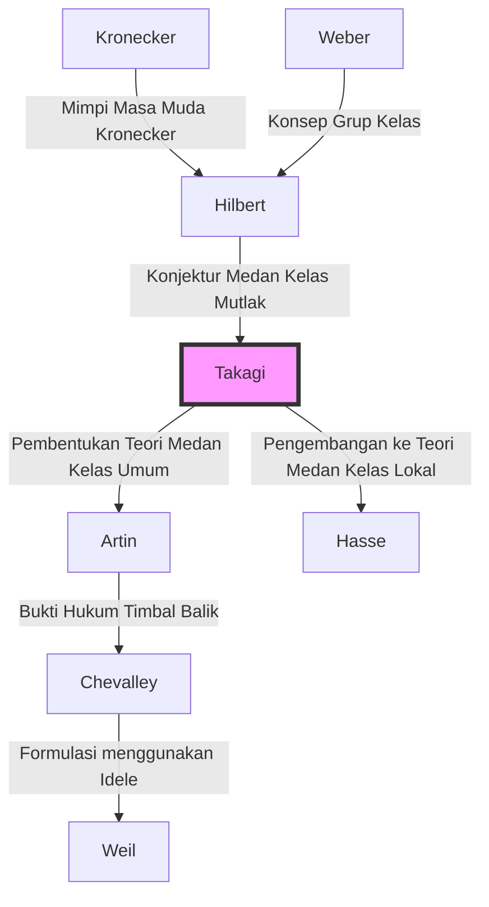

## Pengantar

Salah satu kerangka teoretis yang paling indah dan kuat dalam teori bilangan modern, khususnya dalam teori bilangan aljabar, adalah **Teori Medan Kelas** (Class Field Theory). Orang yang membangun sistem teoretis yang luar biasa ini sendirian dan tiba-tiba mengangkat matematika Jepang ke standar tertinggi dunia adalah **Teiji Takagi** (1875–1960).

Pencapaian monumental yang diraihnya tidak hanya memecahkan satu masalah yang belum terpecahkan. Ia dengan cemerlang menggambarkan lanskap matematika yang diimpikan oleh raksasa Barat seperti Kronecker dan Hilbert, saat terisolasi di Timur Jauh, dan dengan demikian menunjukkan jalan yang harus diikuti oleh komunitas matematika setelah itu. Dalam artikel ini, kita akan mempelajari lintasan kehidupan Teiji Takagi dan inti dari Teori Medan Kelas yang didirikannya.

## 1. Kehidupan Awal dan Kebangkitan pada Matematika

### Dari Desa Pertanian di Gifu ke Universitas Kekaisaran

Teiji Takagi lahir pada tahun 1875 (Meiji 8) di sebuah desa pertanian yang tenang bernama Desa Kazuya di Distrik Ono, Prefektur Gifu (sekarang Kota Motosu). Menunjukkan bakat luar biasa sejak usia muda, ia melewati sekolah menengah setempat dan maju ke Sekolah Menengah Atas Ketiga (kemudian Sekolah Menengah Atas Ketiga) di Kyoto. Di sini, ia menjadi teman sekelas Kitaro Nishida, yang nantinya akan memimpin dunia filsafat Jepang.

Ia kemudian melanjutkan ke Departemen Matematika di Sekolah Tinggi Sains di Universitas Kekaisaran (sekarang Universitas Tokyo). Jepang pada waktu itu baru beberapa dekade keluar dari Restorasi Meiji dan baru saja mulai sepenuhnya merangkul matematika modern Barat. Di bawah bimbingan para mentornya, Dairoku Kikuchi dan Rikitaro Fujisawa, yang mendukung fajar pendidikan matematika di Jepang, bakat matematika Takagi dengan cepat berkembang.

### Belajar di Luar Negeri dan Hari-hari di Göttingen

Pada tahun 1898, Takagi pergi ke Jerman sebagai mahasiswa luar negeri dari Kementerian Pendidikan. Ia awalnya belajar di Universitas Berlin, tetapi kemudian pindah ke Universitas Göttingen, yang merupakan pusat matematika di dunia pada saat itu.

Menunggunya di sana adalah matematikawan hebat yang meninggalkan nama mereka dalam sejarah matematika, seperti [David Hilbert](https://kenji.blog/id/p/hilbert/) dan Felix Klein. Secara khusus, Hilbert baru saja menerbitkan "Zahlbericht" (Laporan tentang Bilangan) miliknya, yang merupakan puncak dari teori bilangan aljabar, dan isinya berdampak mendalam pada Takagi. Di bawah bimbingan Hilbert, ia memecahkan bagian dari "Mimpi Masa Muda Kronecker" (sebuah masalah mengenai teori perkalian kompleks), memperoleh gelar doktornya pada tahun 1903, dan kembali ke Jepang.

## 2. Terobosan dalam Isolasi: Lahirnya Teori Medan Kelas

### Isolasi Akademik akibat Perang Dunia I

Setelah kembali ke Jepang, Takagi melanjutkan penelitiannya sendiri sambil mengajar sarjana yang lebih muda sebagai profesor di Universitas Kekaisaran Tokyo. Namun, ketika Perang Dunia I meletus pada tahun 1914, pertukaran akademik antara Jepang dan Eropa terputus sama sekali. Tanpa menerima makalah atau jurnal terbaru, Takagi tidak punya pilihan selain memperdalam pemikirannya sendiri sendirian di laboratoriumnya.

"Isolasi" ini ironisnya menjadi tanah yang menghasilkan ciptaan yang hebat. Takagi mulai memeriksa kembali masalah mengenai ekstensi Abelian relatif yang diusulkan oleh Hilbert dari sudut pandangnya yang unik.

### Konsepsi Teori Medan Kelas

Hilbert telah memperkirakan dan membuktikan sebagian keberadaan "medan kelas mutlak" (absolute class field) untuk suatu medan bilangan aljabar $K$ yang diberikan, yang merupakan ekstensi Abelian tidak bercabang maksimal yang grup Galois-nya isomorfik terhadap grup kelas ideal dari $K$.

Takagi berpikir bahwa dengan menghilangkan batasan "tidak bercabang" ini, korespondensi yang sama indahnya mungkin berlaku untuk ekstensi Abelian apa pun. Ini adalah ide inti dari **Teori Medan Kelas** Takagi.

## 3. Puncak Matematika: Inti dari Teori Medan Kelas

Mari kita lihat klaim Teori Medan Kelas menggunakan rumus matematika. Pertimbangkan ekstensi Abelian berhingga $L$ dari medan bilangan aljabar $K$. Takagi menunjukkan bahwa dengan mempertimbangkan grup ideal kongruensi $H$ di dalam grup ideal $K$ yang memenuhi kondisi spesifik, ada korespondensi satu-ke-satu antara $L$ dan $H$.

### Teorema Eksistensi dan Teorema Fundamental Takagi

Teorema utama yang dibuktikan oleh Teiji Takagi adalah sebagai berikut:

1. **Teorema Isomorfisme**: Untuk setiap ekstensi Abelian $L/K$, ada grup ideal kongruensi yang sesuai $H$ dari $K$, dan grup Galois $\text{Gal}(L/K)$ isomorfik terhadap grup hasil bagi $I/H$.
   
   $$ \text{Gal}(L/K) \cong I/H $$
   
   Di sini, $I$ adalah grup ideal modulo suatu modulus tertentu.

2. **Teorema Eksistensi**: Sebaliknya, untuk setiap grup ideal kongruensi $H$ dari $K$, ekstensi Abelian $L$ (medan kelas) yang sesuai dengan $H$ selalu ada.

3. **Teorema Pemisahan Lengkap**: Syarat perlu dan cukup agar suatu ideal prima $\mathfrak{p}$ dari $K$ terpisah sepenuhnya dalam $L$ adalah bahwa $\mathfrak{p}$ termasuk dalam grup $H$.

Konjektur Hilbert dimasukkan sebagai kasus khusus di mana modulusnya trivial (ketika tidak ada percabangan). Takagi menggeneralisasi ini ke bentuk yang memungkinkan percabangan sewenang-wenang, menetapkan teori lengkap mengenai ekstensi Abelian dari medan bilangan aljabar.

### Keindahan Matematika: Generalisasi Teorema Kronecker-Weber

Keindahan Teori Medan Kelas terletak pada perluasan **Teorema Kronecker-Weber** untuk medan bilangan rasional $\mathbb{Q}$ ke medan bilangan aljabar umum. Teorema Kronecker-Weber menyatakan bahwa "setiap ekstensi Abelian berhingga dari medan bilangan rasional terkandung dalam submedan dari suatu medan siklotomik $\mathbb{Q}(\zeta_n)$."

$$ L \subset \mathbb{Q}(\zeta_n) \quad (\text{di mana } \zeta_n \text{ adalah akar primitif ke-} n \text{ dari kesatuan}) $$

Teori Medan Kelas Takagi sepenuhnya menentukan medan seperti apa yang memainkan peran medan siklotomik ketika $\mathbb{Q}$ ini digantikan oleh medan bilangan aljabar sewenang-wenang $K$.

## 4. Pengakuan Global dan Hukum Timbal Balik Artin

Pada tahun 1920, di Kongres Internasional Matematikawan yang diadakan di Strasbourg setelah berakhirnya Perang Dunia I, Takagi mempresentasikan Teori Medan Kelas ini. Namun, karena isinya sangat inovatif pada awalnya, hal itu tidak sepenuhnya dipahami.

Kemudian, mengirimkan cetak ulang makalahnya kepada Carl Siegel di Jerman menarik perhatian matematikawan pendatang baru seperti Emil Artin dan [Helmut Hasse](https://kenji.blog/id/p/hasse/). Mereka segera memahami kehebatan teori Takagi dan memajukan penelitian lebih lanjut berdasarkan fondasi ini.

Secara khusus, Artin membuktikan **Hukum Timbal Balik Artin** menggunakan teori Takagi, menyelesaikan perumusan Teori Medan Kelas. Dengan ini, nama Teiji Takagi terukir selamanya dalam sejarah matematika.

## 5. Silsilah Teori: Penyebaran Teori Medan Kelas

Teori Teiji Takagi memiliki pengaruh luar biasa pada matematikawan selanjutnya. Silsilah ini ditunjukkan dalam diagram Mermaid di bawah ini.

## 6. Kontribusi sebagai Pendidik dan Karya Besar

Di luar pencapaian matematikanya, Teiji Takagi memberikan kontribusi yang tak terukur pada pendidikan matematika di Jepang. Buku-bukunya telah menjadi Alkitab bagi generasi mahasiswa sains di Jepang.

- **"Pengantar Analisis" (Kaiseki Gairon)**: Buku teks definitif kalkulus di Jepang. Ini adalah karya agung yang memadukan pengembangan logis yang ketat dengan bahasa Jepang yang elegan.
- **"Pelajaran tentang Teori Bilangan Dasar"**: Buku teks yang menjelaskan semuanya mulai dari dasar-dasar teori bilangan hingga hukum timbal balik Gauss.
- **"Kisah Sejarah Matematika Modern"**: Buku sejarah yang dengan jelas menggambarkan kelompok matematikawan di abad ke-19. Buku ini menyampaikan drama perkembangan matematika.

Benih yang ditaburnya diwariskan kepada matematikawan Jepang yang nantinya akan aktif di seluruh dunia, seperti [Kunihiko Kodaira](https://kenji.blog/id/p/kodaira-kunihiko/), Kiyoshi Ito, dan selanjutnya, [Goro Shimura](https://kenji.blog/id/p/shimura-goro/) dan [Yutaka Taniyama](https://kenji.blog/id/p/taniyama-yutaka/).

## Kesimpulan

**Teiji Takagi** mengembangkan disiplin akademik matematika, yang lahir di Barat, secara unik di negara Timur, Jepang, dan membangun puncak teori tertinggi di dunia. Kehidupannya mengatasi kesulitan isolasi selama perang dan menyelesaikan "Teori Medan Kelas" yang luar biasa dengan hanya mengandalkan pemikiran murni mengajarkan kita kemungkinan tak terbatas dari kecerdasan manusia.

Hari ini, bidang-bidang di mana teori bilangan aljabar diterapkan, seperti kriptografi dan fisika matematika, terus berkembang. Pencapaian Teiji Takagi, yang meletakkan fondasinya, terus bersinar melampaui zaman.
