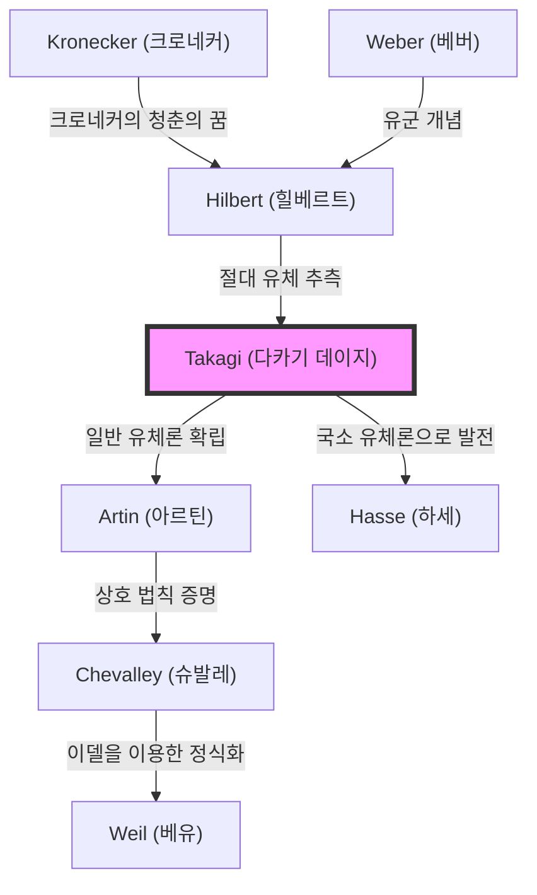

## 서론

현대 정수론, 특히 대수적 정수론에서 가장 아름답고 강력한 이론적 틀 중 하나는 **유체론(Class Field Theory)**입니다. 이 장대한 이론 체계를 홀로 구축하고 일본의 수학을 단숨에 세계 최고 수준으로 끌어올린 인물이 바로 **다카기 데이지([高木貞治](https://kenji.blog/ko/p/takagi-teiji/))**(1875–1960)입니다.

그가 이룬 기념비적인 업적은 단순히 미해결 문제 하나를 푼 것에 그치지 않습니다. 그는 극동의 땅에서 고립되어 있으면서도 크로네커나 힐베르트 같은 서양의 거장들이 꿈꿨던 수학적 풍경을 훌륭하게 그려냈고, 이를 통해 그 후 수학계가 나아가야 할 길을 제시했습니다. 본 기사에서는 다카기 데이지의 생애의 궤적과 그가 확립한 유체론의 핵심에 대해 깊이 파헤쳐 보겠습니다.

## 1. 생애 초기와 수학에 대한 눈뜸

### 기후현의 농촌에서 제국 대학으로

다카기 데이지는 1875년(메이지 8년) 기후현 오노군 카즈야 촌(현재의 모토스시)이라는 조용한 농촌에서 태어났습니다. 어릴 적부터 비범한 재능을 보인 그는 지역 학교를 거쳐 교토의 제3고등중학교(이후 제3고등학교)로 진학했습니다. 이곳에서 그는 훗날 일본 철학계를 이끌게 되는 니시다 키타로 등과 동기동창이 됩니다.

그 후 제국 대학(현재의 도쿄 대학) 이과 대학 수학 성학과에 진학했습니다. 당시 일본은 메이지 유신 이후 불과 수십 년밖에 지나지 않아 서양의 근대 수학을 본격적으로 수용하기 시작한 지 얼마 안 된 시기였습니다. 일본 수학 교육의 여명을 지탱한 은사 기쿠치 다이로쿠와 후지사와 리키타로의 지도 아래 다카기는 빠르게 수학적 재능을 꽃피웠습니다.

### 유학과 괴팅겐에서의 나날

1898년, 다카기는 문부성의 해외 유학생으로 독일로 건너갔습니다. 처음에는 베를린 대학에서 공부했지만, 이후 당시 세계 수학의 중심지였던 괴팅겐 대학으로 옮겼습니다.

그곳에서 그를 기다리고 있던 것은 [다비트 힐베르트](https://kenji.blog/ko/p/hilbert/)와 펠릭스 클라인 등 수학사에 이름을 남긴 위대한 수학자들이었습니다. 특히 힐베르트는 대수적 정수론의 집대성인 '수론 보고서(Zahlbericht)'를 갓 발표한 참이었고, 그 내용은 다카기에게 강렬한 영향을 미쳤습니다. 힐베르트 밑에서 '크로네커의 청춘의 꿈'(허수 곱셈론에 관한 문제)의 일부를 해결하고 1903년 박사 학위를 취득한 후 일본으로 귀국했습니다.

## 2. 고독 속의 돌파구: 유체론의 탄생

### 제1차 세계 대전으로 인한 학술적 고립

귀국 후 다카기는 도쿄 제국 대학의 교수로 후학을 양성하며 자신의 연구를 계속했습니다. 그러나 1914년 제1차 세계 대전이 발발하자 일본과 유럽의 학술 교류는 완전히 단절되고 맙니다. 최신 논문이나 잡지를 받아보지 못하는 가운데, 다카기는 연구실에서 홀로 자신의 사색을 깊게 할 수밖에 없었습니다.

이러한 '고립'이 역설적으로 위대한 창조를 낳는 토양이 되었습니다. 다카기는 힐베르트가 제기한 상대 아벨 확대에 관한 문제를 자신의 독자적인 시각으로 재검토하기 시작했습니다.

### 유체론의 구상

힐베르트는 주어진 대수체 $K$에 대해, 갈루아 군이 $K$의 이데알 유군과 동형이 되는 분기되지 않은 최대 아벨 확대인 '절대 유체(absolute class field)'의 존재를 추측하고 일부를 증명했습니다.

다카기는 이 '분기되지 않은'이라는 제약을 없애면 임의의 아벨 확대에 대해서도 마찬가지로 아름다운 대응 관계가 성립하지 않을까 생각했습니다. 이것이 다카기 **유체론**의 핵심 아이디어였습니다.

## 3. 수학의 극치: 유체론의 핵심

수식을 사용하여 유체론의 주장을 살펴보겠습니다. 대수체 $K$의 유한차 아벨 확대 $L$을 고려합니다. 다카기는 $K$의 이데알 군 안에서 특정 조건을 만족하는 합동 이데알 군 $H$를 생각함으로써 $L$과 $H$ 사이에 일대일 대응 관계가 있음을 보여주었습니다.

### 다카기의 존재 정리와 기본 정리

다카기 데이지가 증명한 주요 정리는 다음과 같습니다.

1. **동형 정리**: 임의의 아벨 확대 $L/K$에 대해 $K$의 적당한 합동 이데알 군 $H$가 존재하며, 갈루아 군 $\text{Gal}(L/K)$는 몫군 $I/H$와 동형이 된다.
   
   $$ \text{Gal}(L/K) \cong I/H $$
   
   여기서 $I$는 어떤 모듈러스를 법으로 하는 이데알 군입니다.

2. **존재 정리**: 반대로 $K$의 임의의 합동 이데알 군 $H$에 대해, $H$에 대응하는 아벨 확대 $L$(유체)이 항상 존재한다.

3. **완전 분해 정리**: $K$의 소이데알 $\mathfrak{p}$가 $L$에서 완전 분해되기 위한 필요충분조건은 $\mathfrak{p}$가 군 $H$에 속하는 것이다.

힐베르트의 추측은 모듈러스가 자명한 경우(분기가 없는 경우)의 특수한 경우로 포함됩니다. 다카기는 이를 임의의 분기를 허용하는 형태로 일반화하여 대수체의 아벨 확대에 관한 완전한 이론을 확립한 것입니다.

### 수학적 아름다움: 크로네커-베버 정리의 일반화

유체론의 아름다움은 유리수체 $\mathbb{Q}$에 대한 **크로네커-베버 정리**를 일반 대수체로 확장했다는 점에 있습니다. 크로네커-베버 정리는 '유리수체의 임의의 유한차 아벨 확대는 어떤 원분체 $\mathbb{Q}(\zeta_n)$의 부분체에 포함된다'는 것입니다.

$$ L \subset \mathbb{Q}(\zeta_n) \quad (\text{단, } \zeta_n \text{ 은 1의 원시 } n \text{ 제곱근이다}) $$

다카기의 유체론은 이 $\mathbb{Q}$를 임의의 대수체 $K$로 바꾸었을 때 어떤 체가 원분체의 역할을 하는지를 완전히 결정지었습니다.

## 4. 세계적 평가와 아르틴의 상호 법칙

1920년, 제1차 세계 대전 종결 후 스트라스부르에서 열린 세계 수학자 대회에서 다카기는 이 유체론을 발표했습니다. 하지만 처음에는 내용이 너무 혁신적이었기 때문에 충분히 이해받지 못했습니다.

그 후 독일의 카를 지겔에게 논문 별쇄본을 보낸 것이 계기가 되어 에밀 아르틴이나 [헬무트 하세](https://kenji.blog/ko/p/hasse/) 등 신진 기예의 수학자들의 눈에 띄게 되었습니다. 그들은 다카기 이론의 위대함을 즉시 이해하고 이 이론을 기반으로 한층 더 연구를 진행했습니다.

특히 아르틴은 다카기의 이론을 사용하여 **아르틴의 상호 법칙**을 증명하고 유체론의 정식화를 완성했습니다. 이로써 다카기 데이지의 이름은 수학사에 영원히 새겨지게 되었습니다.

## 5. 이론의 계보: 유체론의 확산

다카기 데이지의 이론은 후대 수학자들에게 지대한 영향을 미쳤습니다. 그 계보를 아래의 Mermaid 다이어그램으로 보여줍니다.

## 6. 교육자로서의 공헌과 명저들

수학적인 업적뿐만 아니라 다카기 데이지는 일본의 수학 교육에서도 헤아릴 수 없는 공헌을 했습니다. 그의 저서는 여러 세대에 걸쳐 일본 이공계 학생들의 바이블이 되었습니다.

- **『해석개론』(解析概論)**: 일본 미적분학의 결정판이라고 할 수 있는 교과서. 엄밀한 논리 전개와 유려한 일본어가 융합된 명저입니다.
- **『초등 정수론 강의』**: 정수론의 기초부터 가우스의 상호 법칙까지 해설한 교과서.
- **『근세 수학 사담』**: 19세기 수학자들의 군상을 생생하게 그린 역사서. 수학 발전의 드라마를 전해줍니다.

그가 뿌린 씨앗은 [고다이라 구니히코](https://kenji.blog/ko/p/kodaira-kunihiko/)나 이토 기요시, 나아가 [시무라 고로](https://kenji.blog/ko/p/shimura-goro/)나 다니야마 유타카 등 훗날 세계에서 활약하는 일본의 수학자들에게로 이어졌습니다.

## 결론

**다카기 데이지**는 서양에서 탄생한 수학이라는 학문을 일본이라는 동양의 국가에서 독자적으로 발전시켜 세계 최고봉의 이론을 쌓아 올렸습니다. 전시 중의 고립이라는 역경을 이겨내고 순수한 사고력에만 의지하여 장대한 '유체론'을 완성시킨 그의 생애는 우리에게 인간 지성의 무한한 가능성을 가르쳐 줍니다.

오늘날 암호 이론이나 수리 물리학 등 대수적 정수론이 응용되는 영역은 계속 넓어지고 있습니다. 그 기초를 다진 다카기 데이지의 업적은 시대를 넘어 계속 빛나고 있습니다.
