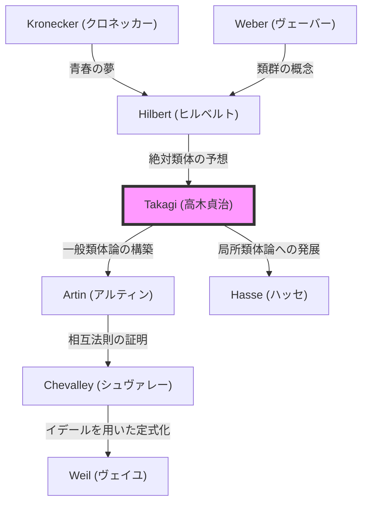

## はじめに

現代の数論、特に代数的整数論において最も美しく、かつ強力な理論の一つとされる **類体論** （Class Field Theory）。この壮大な理論体系を一人で構築し、日本の数学を世界最高水準へと一気に引き上げた人物が、 **[高木貞治](https://kenji.blog/p/takagi-teiji/)** （1875–1960）です。

彼が成し遂げた偉業は、単に一つの未解決問題を解いたというにとどまりません。[クロネッカー](https://kenji.blog/p/kronecker/)や[ヒルベルト](https://kenji.blog/p/hilbert/)といった西洋の巨星たちが夢見た数学の風景を、極東の地で孤立しながらも見事に描き出し、その後の数学界の進むべき道を示したのです。本記事では、[高木貞治](https://kenji.blog/p/takagi-teiji/)の生涯の軌跡と、彼が構築した類体論の核心について、深く掘り下げていきます。

## 1. 生い立ちと数学への目覚め

### 岐阜県の農村から帝国大学へ

[高木貞治](https://kenji.blog/p/takagi-teiji/)は1875年（明治8年）、岐阜県大野郡数屋村（現在の本巣市）という静かな農村に生まれました。幼少期から非凡な才能を示した彼は、地元の学校を経て、京都の第三高等中学校（後の三高）へと進学します。ここで彼は、後に日本の哲学界を牽引することになる西田幾多郎らと同窓になります。

その後、帝国大学（現在の東京大学）理科大学数学星学科に進学しました。当時の日本は明治維新からまだ数十年しか経っておらず、西洋の近代数学を本格的に受容し始めたばかりの時期でした。高木は菊池大麓や藤沢利喜太郎といった、日本の数学教育の黎明期を支えた恩師たちの指導のもと、急速に数学の才能を開花させていきました。

### 留学とゲッティンゲンでの日々

1898年、高木は文部省の海外留学生としてドイツへ渡ります。最初はベルリン大学で学びましたが、その後、当時の世界の数学の中心地であったゲッティンゲン大学へ移りました。

そこで彼を待っていたのは、[ダフィット・ヒルベルト](https://kenji.blog/p/hilbert/)やフェリックス・クラインといった、数学史に名を残す偉大な数学者たちでした。特に[ヒルベルト](https://kenji.blog/p/hilbert/)は、代数的整数論の集大成である「数論報告（Zahlbericht）」を発表したばかりであり、その内容は高木に強烈な影響を与えました。[ヒルベルト](https://kenji.blog/p/hilbert/)のもとで「[クロネッカー](https://kenji.blog/p/kronecker/)の青春の夢」（虚数乗法論に関する問題）の一部を解決し、1903年に博士号を取得して日本へと帰国します。

## 2. 孤独の中のブレイクスルー：類体論の誕生

### 第一次世界大戦による学術的孤立

帰国後、高木は東京帝国大学の教授として後進の指導にあたりながら、自身の研究を続けていました。しかし、1914年に第一次世界大戦が勃発すると、日本とヨーロッパの学術的交流は完全に途絶えてしまいます。最新の論文や雑誌が届かない中、高木は研究室で一人、自身の思索を深めるしかありませんでした。

この「孤立」が、皮肉にも偉大な創造を生み出す土壌となりました。高木は[ヒルベルト](https://kenji.blog/p/hilbert/)が提起した相対[アーベル](https://kenji.blog/p/abel/)拡大に関する問題を独自の視点で見つめ直し始めました。

### 類体論の構想

[ヒルベルト](https://kenji.blog/p/hilbert/)は、ある代数体 $K$ に対して、分岐を持たない最大[アーベル](https://kenji.blog/p/abel/)拡大が存在し、その[ガロア](https://kenji.blog/p/galois/)群が $K$ のイデアル類群と同型になるという「絶対類体（absolute class field）」の存在を予想し、一部を証明していました。

高木は、この「分岐を持たない」という制約を取り払い、任意の[アーベル](https://kenji.blog/p/abel/)拡大において同様の美しい対応関係が成り立つのではないかと考えました。これが高木の **類体論** の中核となるアイデアでした。

## 3. 数学の極致：類体論の核心

類体論の主張を数式を用いて見てみましょう。代数体 $K$ の有限次[アーベル](https://kenji.blog/p/abel/)拡大 $L$ を考えます。高木は、 $K$ のイデアル群の中に、特定の条件を満たす合同イデアル群 $H$ を考えることで、 $L$ と $H$ の間に一対一の対応関係があることを示しました。

### 高木の存在定理と基本定理

[高木貞治](https://kenji.blog/p/takagi-teiji/)が証明した主要な定理は以下の通りです。

1. **同型定理** : 任意の[アーベル](https://kenji.blog/p/abel/)拡大 $L/K$ に対して、 $K$ の適当な合同イデアル群 $H$ が存在し、[ガロア](https://kenji.blog/p/galois/)群 $\text{Gal}(L/K)$ は商群 $I/H$ と同型になる。
   
   $$ \text{Gal}(L/K) \cong I/H $$
   
   ここで、 $I$ はあるモジュラスを法とするイデアル群です。

2. **存在定理** : 逆に、 $K$ の任意の合同イデアル群 $H$ に対して、 $H$ に対応する[アーベル](https://kenji.blog/p/abel/)拡大 $L$ （類体）が必ず存在する。

3. **完全分解定理** : $K$ の素イデアル $\mathfrak{p}$ が $L$ で完全分解するための必要十分条件は、 $\mathfrak{p}$ が群 $H$ に属することである。

[ヒルベルト](https://kenji.blog/p/hilbert/)の予想は、モジュラスが自明な場合（分岐がない場合）の特別なケースとして包含されます。高木はこれを任意の分岐を許す形へと一般化し、代数体の[アーベル](https://kenji.blog/p/abel/)拡大に関する完全な理論を打ち立てたのです。

### 数学的な美しさ：[クロネッカー](https://kenji.blog/p/kronecker/)・ヴェーバーの定理の一般化

類体論の美しさは、有理数体 $\mathbb{Q}$ に対する **[クロネッカー](https://kenji.blog/p/kronecker/)・ヴェーバーの定理** を、一般の代数体に拡張した点にあります。[クロネッカー](https://kenji.blog/p/kronecker/)・ヴェーバーの定理は、「有理数体の任意の有限次[アーベル](https://kenji.blog/p/abel/)拡大は、ある円分体 $\mathbb{Q}(\zeta_n)$ の部分体に含まれる」というものです。

$$ L \subset \mathbb{Q}(\zeta_n) \quad (\text{ただし、} \zeta_n \text{は} 1 \text{の原始} n \text{乗根}) $$

高木の類体論は、この $\mathbb{Q}$ を任意の代数体 $K$ に置き換えたとき、どのような体が円分体の役割を果たすのかを完全に決定づけました。

## 4. 世界的評価とアルティンの相互法則

1920年、第一次世界大戦終結後に行われたストラスブールでの国際数学者会議で、高木はこの類体論を発表しました。しかし、当初はあまりに革新的な内容であったため、十分に理解されませんでした。

その後、ドイツのカール・[ジーゲル](https://kenji.blog/p/siegel/)に論文の別刷りを送ったことがきっかけとなり、エミール・アルティンやヘルムート・[ハッセ](https://kenji.blog/p/hasse/)といった新進気鋭の数学者たちの目に留まりました。彼らは高木の理論の偉大さを即座に理解し、この理論を基盤としてさらなる研究を進めました。

特にアルティンは、高木の理論を用いて **アルティンの相互法則** を証明し、類体論の定式化を完成させました。これにより、[高木貞治](https://kenji.blog/p/takagi-teiji/)の名は数学史に永遠に刻まれることとなったのです。

## 5. 理論の系譜：類体論の広がり

[高木貞治](https://kenji.blog/p/takagi-teiji/)の理論は、後の数学者たちに多大な影響を与えました。その系譜をMermaidの図で示します。

## 6. 教育者としての貢献と名著の数々

数学的な業績だけでなく、[高木貞治](https://kenji.blog/p/takagi-teiji/)は日本の数学教育においても計り知れない貢献をしました。彼の著書は、何世代にもわたって日本の理系学生のバイブルとなっています。

- **『解析概論』** : 日本における微積分学の決定版とも言える教科書。厳密な論理展開と流麗な日本語が融合した名著です。
- **『初等整数論講義』** : 整数論の基礎から[ガウス](https://kenji.blog/p/gauss/)の相互法則までを解説した教科書。
- **『近世数学史談』** : 19世紀の数学者たちの群像を生き生きと描いた歴史書。数学の発展のドラマを伝えてくれます。

彼が蒔いた種は、[小平邦彦](https://kenji.blog/p/kodaira-kunihiko/)や[伊藤清](https://kenji.blog/p/ito-kiyosi/)、さらには[志村五郎](https://kenji.blog/p/shimura-goro/)や[谷山豊](https://kenji.blog/p/taniyama-yutaka/)といった、後に世界で活躍する日本の数学者たちへと受け継がれていきました。

## おわりに

**[高木貞治](https://kenji.blog/p/takagi-teiji/)** （Teiji [Takagi](https://kenji.blog/p/takagi-teiji/)）は、西洋で生まれた数学という学問を、日本という東洋の国で独自に発展させ、世界最高峰の理論を築き上げました。戦時中の孤立という逆境を跳ね返し、純粋な思考のみを頼りに壮大な「類体論」を完成させた彼の生涯は、私たちに人間の知性の無限の可能性を教えてくれます。

今日、暗号理論や数理物理学など、代数的整数論が応用される領域は広がり続けています。その基礎を築いた[高木貞治](https://kenji.blog/p/takagi-teiji/)の業績は、時代を超えて輝き続けています。
