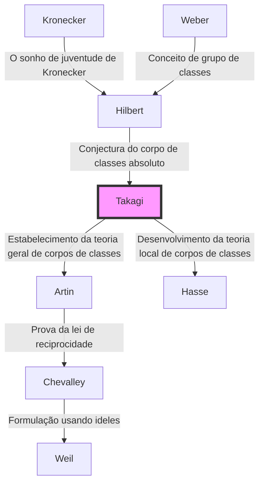

## Introdução

Um dos mais belos e poderosos referenciais teóricos da moderna teoria dos números, particularmente na teoria algébrica dos números, é a **teoria de corpos de classes**. A pessoa que construiu sozinho este magnífico sistema teórico e subitamente elevou a matemática japonesa ao mais alto padrão mundial foi **Teiji Takagi** (1875–1960).

A conquista monumental que ele realizou não foi apenas a resolução de um único problema em aberto. Ele retratou de forma brilhante a paisagem matemática com a qual os gigantes ocidentais, como Kronecker e Hilbert, haviam sonhado, enquanto esteve isolado no Extremo Oriente e, assim, mostrou o caminho que a comunidade matemática deveria seguir a partir de então. Neste artigo, vamos nos aprofundar na trajetória de vida de Teiji Takagi e no cerne da teoria de corpos de classes que ele estabeleceu.

## 1. Início da vida e despertar para a matemática

### De uma vila agrícola em Gifu à Universidade Imperial

Teiji Takagi nasceu em 1875 (Meiji 8) em uma pacata vila agrícola chamada vila Kazuya no distrito de Ono, província de Gifu (atual cidade de Motosu). Mostrando um talento extraordinário desde cedo, ele passou pelas escolas locais e avançou para a Terceira Escola Secundária Superior (mais tarde Terceira Escola Superior) em Quioto. Aqui, ele se tornou colega de classe de Kitaro Nishida, que mais tarde lideraria o mundo filosófico japonês.

Ele então prosseguiu para o Departamento de Matemática da Faculdade de Ciências da Universidade Imperial (agora Universidade de Tóquio). O Japão daquela época estava a apenas algumas décadas da Restauração Meiji e apenas começara a adotar plenamente a matemática moderna ocidental. Sob a orientação de seus mentores, Dairoku Kikuchi e Rikitaro Fujisawa, que apoiaram os primórdios da educação matemática no Japão, Takagi rapidamente floresceu em seus talentos matemáticos.

### Estudos no exterior e dias em Göttingen

Em 1898, Takagi viajou para a Alemanha como estudante no exterior pelo Ministério da Educação. Ele inicialmente estudou na Universidade de Berlim, mas depois se transferiu para a Universidade de Göttingen, que era o centro da matemática no mundo naquela época.

Esperando por ele lá estavam grandes matemáticos que deixaram seus nomes na história da matemática, como [David Hilbert](https://kenji.blog/pt/p/hilbert/) e Felix Klein. Em particular, Hilbert acabara de publicar o seu "Zahlbericht" (Relatório sobre os Números), que era o culminar da teoria algébrica dos números, e o seu conteúdo teve um impacto profundo em Takagi. Sob a orientação de Hilbert, ele resolveu uma parte do "Sonho de Juventude de Kronecker" (um problema relativo à teoria da multiplicação complexa), obteve seu doutorado em 1903 e retornou ao Japão.

## 2. Avanço no isolamento: O nascimento da teoria de corpos de classes

### Isolamento acadêmico devido à Primeira Guerra Mundial

Depois de retornar ao Japão, Takagi continuou sua própria pesquisa enquanto ensinava jovens acadêmicos como professor na Universidade Imperial de Tóquio. No entanto, quando a Primeira Guerra Mundial eclodiu em 1914, o intercâmbio acadêmico entre o Japão e a Europa foi completamente cortado. Sem receber os últimos artigos ou periódicos, Takagi não teve escolha a não ser aprofundar seus próprios pensamentos sozinho em seu laboratório.

Esse "isolamento" ironicamente se tornou o solo que produziu uma grande criação. Takagi começou a reexaminar os problemas relativos a extensões abelianas relativas propostos por Hilbert a partir de sua perspectiva única.

### A concepção da teoria de corpos de classes

Hilbert havia conjeturado e provado parcialmente a existência de um "corpo de classes absoluto" para um dado corpo de números algébricos $K$, que é uma extensão abeliana não ramificada máxima cujo grupo de Galois é isomorfo ao grupo de classes de ideais de $K$.

Takagi pensou que, ao remover essa restrição de ser "não ramificada", uma correspondência igualmente bela poderia ser válida para qualquer extensão abeliana. Esta foi a ideia central da **teoria de corpos de classes** de Takagi.

## 3. O pináculo da matemática: O núcleo da teoria de corpos de classes

Vejamos as afirmações da teoria de corpos de classes usando fórmulas matemáticas. Considere uma extensão abeliana finita $L$ de um corpo de números algébricos $K$. Takagi mostrou que, ao considerar um grupo de ideais de congruência $H$ dentro do grupo de ideais de $K$ que satisfaz condições específicas, há uma correspondência biunívoca entre $L$ e $H$.

### Teorema de existência e teorema fundamental de Takagi

Os principais teoremas provados por Teiji Takagi são os seguintes:

1. **Teorema do Isomorfismo**: Para qualquer extensão abeliana $L/K$, existe um grupo de ideais de congruência adequado $H$ de $K$, e o grupo de Galois $\text{Gal}(L/K)$ é isomorfo ao grupo quociente $I/H$.
   
   $$ \text{Gal}(L/K) \cong I/H $$
   
   Aqui, $I$ é um grupo de ideais módulo um certo módulo.

2. **Teorema de Existência**: Reciprocamente, para qualquer grupo de ideais de congruência $H$ de $K$, uma extensão abeliana $L$ (corpo de classes) correspondente a $H$ sempre existe.

3. **Teorema da Decomposição Completa**: Uma condição necessária e suficiente para que um ideal primo $\mathfrak{p}$ de $K$ se decomponha completamente em $L$ é que $\mathfrak{p}$ pertença ao grupo $H$.

A conjectura de Hilbert é incluída como um caso especial em que o módulo é trivial (quando não há ramificação). Takagi generalizou isso para uma forma que permite a ramificação arbitrária, estabelecendo uma teoria completa em relação a extensões abelianas de corpos de números algébricos.

### Beleza matemática: Generalização do teorema de Kronecker-Weber

A beleza da teoria de corpos de classes reside na extensão do **teorema de Kronecker-Weber** para o corpo dos números racionais $\mathbb{Q}$ para corpos de números algébricos gerais. O teorema de Kronecker-Weber afirma que "qualquer extensão abeliana finita do corpo de números racionais está contida em um subcorpo de algum corpo ciclotômico $\mathbb{Q}(\zeta_n)$".

$$ L \subset \mathbb{Q}(\zeta_n) \quad (\text{onde } \zeta_n \text{ é uma raiz primitiva } n\text{-ésima da unidade}) $$

A teoria de corpos de classes de Takagi determinou completamente que tipo de corpo desempenha o papel de corpo ciclotômico quando este $\mathbb{Q}$ é substituído por um corpo de números algébricos arbitrário $K$.

## 4. Reconhecimento global e a lei de reciprocidade de Artin

Em 1920, no Congresso Internacional de Matemáticos realizado em Estrasburgo, após o fim da Primeira Guerra Mundial, Takagi apresentou esta teoria de corpos de classes. No entanto, pelo fato de o conteúdo ser tão inovador a princípio, ele não foi totalmente compreendido.

Mais tarde, o envio de uma separata do seu artigo a Carl Siegel, na Alemanha, chamou a atenção de matemáticos promissores, como Emil Artin e [Helmut Hasse](https://kenji.blog/pt/p/hasse/). Eles compreenderam imediatamente a grandeza da teoria de Takagi e avançaram em pesquisas posteriores baseadas nessa base.

Em particular, Artin provou a **lei de reciprocidade de Artin** usando a teoria de Takagi, completando a formulação da teoria de corpos de classes. Com isso, o nome de Teiji Takagi ficou para sempre gravado na história da matemática.

## 5. Genealogia da teoria: A difusão da teoria de corpos de classes

A teoria de Teiji Takagi teve uma enorme influência nos matemáticos posteriores. Esta genealogia é mostrada no diagrama Mermaid abaixo.

## 6. Contribuições como educador e obras-primas

Além de suas realizações matemáticas, Teiji Takagi fez contribuições incomensuráveis ​​para o ensino de matemática no Japão. Seus livros foram as bíblias por gerações de estudantes de ciências no Japão.

- **"Introdução à Análise" (Kaiseki Gairon)**: O livro definitivo de cálculo no Japão. É uma obra-prima que combina um rigoroso desenvolvimento lógico com um elegante japonês.
- **"Lições sobre a Teoria Elementar dos Números"**: Um livro que explica tudo, desde os fundamentos da teoria dos números até a lei de reciprocidade de Gauss.
- **"Contos Históricos da Matemática Moderna"**: Um livro histórico que descreve vividamente o conjunto de matemáticos do século XIX. Ele transmite o drama do desenvolvimento matemático.

As sementes que ele plantou foram passadas a matemáticos japoneses que mais tarde atuaram mundialmente, como [Kunihiko Kodaira](https://kenji.blog/pt/p/kodaira-kunihiko/), Kiyoshi Ito e, além disso, [Goro Shimura](https://kenji.blog/pt/p/shimura-goro/) e [Yutaka Taniyama](https://kenji.blog/pt/p/taniyama-yutaka/).

## Conclusão

**Teiji Takagi** desenvolveu a disciplina acadêmica da matemática, nascida no Ocidente, de forma singular no país oriental do Japão e construiu o mais alto pico teórico do mundo. Sua vida de superar a adversidade do isolamento durante a guerra e concluir a magnífica "Teoria de corpos de classes" confiando apenas no pensamento puro ensina-nos as infinitas possibilidades do intelecto humano.

Hoje, os campos onde a teoria algébrica dos números é aplicada, como a criptografia e a física matemática, continuam a expandir-se. As conquistas de Teiji Takagi, que estabeleceu seus fundamentos, continuam a brilhar além de sua época.
