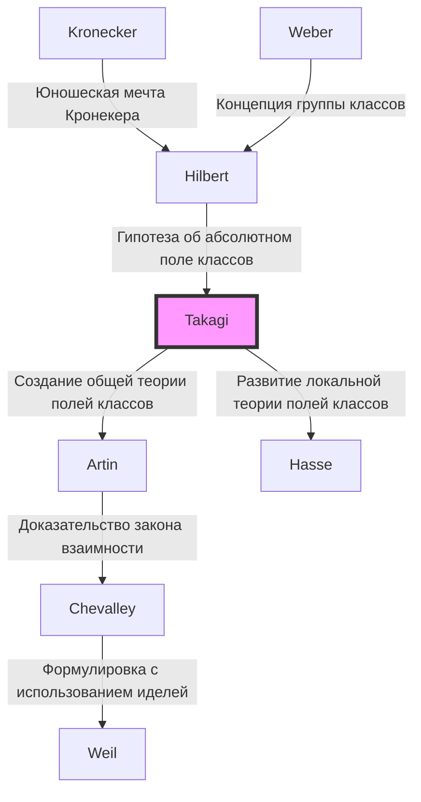

## Введение

Одной из самых красивых и мощных теоретических структур в современной теории чисел, особенно в алгебраической теории чисел, является **теория полей классов**. Человеком, который в одиночку построил эту великолепную теоретическую систему и внезапно поднял японскую математику на высочайший мировой уровень, был **Тэйдзи Такаги** (1875–1960).

Монументальное достижение, которое он совершил, заключалось не просто в решении одной открытой проблемы. Он блестяще обрисовал математический ландшафт, о котором мечтали такие западные гиганты, как Кронекер и Гильберт, находясь в изоляции на Дальнем Востоке, и тем самым указал путь, по которому математическому сообществу следовало идти дальше. В этой статье мы подробно рассмотрим жизненный путь Тэйдзи Такаги и суть созданной им теории полей классов.

## 1. Ранние годы и пробуждение интереса к математике

### От фермерской деревни в Гифу до Императорского университета

Тэйдзи Такаги родился в 1875 году (8-й год эпохи Мэйдзи) в тихой фермерской деревне Кадзуя в уезде Оно префектуры Гифу (современный город Мотосу). Проявив незаурядный талант с юных лет, он прошел обучение в местных школах и поступил в Третью высшую среднюю школу (позже Третью высшую школу) в Киото. Здесь он стал одноклассником Китаро Нисиды, который позже возглавит японский философский мир.

Затем он поступил на математическое отделение Научного колледжа Императорского университета (ныне Токийский университет). Япония в то время находилась всего в нескольких десятилетиях от реставрации Мэйдзи и только начала в полной мере перенимать западную современную математику. Под руководством своих наставников Дайроку Кикути и Рикитаро Фудзисавы, которые поддерживали зарождение математического образования в Японии, математические таланты Такаги быстро расцвели.

### Учеба за границей и дни в Гёттингене

В 1898 году Такаги отправился в Германию в качестве иностранного студента Министерства образования. Сначала он учился в Берлинском университете, но затем перевелся в Гёттингенский университет, который в то время был мировым центром математики.

Там его ждали великие математики, оставившие свои имена в истории математики, такие как [Давид Гильберт](https://kenji.blog/ru/p/hilbert/) и Феликс Клейн. В частности, Гильберт только что опубликовал свой «Zahlbericht» (Отчет о числах), который стал кульминацией алгебраической теории чисел, и его содержание оказало глубокое влияние на Такаги. Под руководством Гильберта он решил часть «юношеской мечты Кронекера» (проблему, касающуюся теории комплексного умножения), получил докторскую степень в 1903 году и вернулся в Японию.

## 2. Прорыв в изоляции: Рождение теории полей классов

### Академическая изоляция из-за Первой мировой войны

По возвращении в Японию Такаги продолжил свои собственные исследования, обучая молодых ученых в качестве профессора Токийского императорского университета. Однако, когда в 1914 году разразилась Первая мировая война, академический обмен между Японией и Европой был полностью прерван. Не получая последних статей и журналов, Такаги не оставалось ничего другого, как углублять свои собственные мысли в одиночестве в своей лаборатории.

Эта «изоляция» по иронии судьбы стала почвой, на которой выросло великое творение. Такаги начал по-новому, со своей уникальной точки зрения, рассматривать проблемы, касающиеся относительных абелевых расширений, предложенные Гильбертом.

### Концепция теории полей классов

Гильберт высказал гипотезу и частично доказал существование «абсолютного поля классов» для данного алгебраического числового поля $K$, которое является максимальным неразветвленным абелевым расширением, чья группа Галуа изоморфна группе классов идеалов поля $K$.

Такаги подумал, что если снять это ограничение «неразветвленности», то столь же красивое соответствие может иметь место для любого абелева расширения. Это была основная идея **теории полей классов** Такаги.

## 3. Вершина математики: Суть теории полей классов

Давайте посмотрим на утверждения теории полей классов, используя математические формулы. Рассмотрим конечное абелево расширение $L$ алгебраического числового поля $K$. Такаги показал, что при рассмотрении конгруэнц-группы идеалов $H$ внутри группы идеалов поля $K$, удовлетворяющей определенным условиям, существует взаимно однозначное соответствие между $L$ и $H$.

### Теорема существования и основная теорема Такаги

Основные теоремы, доказанные Тэйдзи Такаги, заключаются в следующем:

1. **Теорема об изоморфизме**: Для любого абелева расширения $L/K$ существует подходящая конгруэнц-группа идеалов $H$ поля $K$, и группа Галуа $\text{Gal}(L/K)$ изоморфна факторгруппе $I/H$.
   
   $$ \text{Gal}(L/K) \cong I/H $$
   
   Здесь $I$ — группа идеалов по некоторому модулю.

2. **Теорема существования**: Обратно, для любой конгруэнц-группы идеалов $H$ поля $K$ всегда существует абелево расширение $L$ (поле классов), соответствующее $H$.

3. **Теорема о полном расщеплении**: Необходимым и достаточным условием того, что простой идеал $\mathfrak{p}$ поля $K$ полностью расщепляется в $L$, является принадлежность $\mathfrak{p}$ группе $H$.

Гипотеза Гильберта включена в качестве частного случая, когда модуль тривиален (когда нет ветвления). Такаги обобщил это до формы, допускающей произвольное ветвление, создав полную теорию, касающуюся абелевых расширений алгебраических числовых полей.

### Математическая красота: Обобщение теоремы Кронекера-Вебера

Красота теории полей классов заключается в распространении **теоремы Кронекера-Вебера** для поля рациональных чисел $\mathbb{Q}$ на общие алгебраические числовые поля. Теорема Кронекера-Вебера гласит, что «любое конечное абелево расширение поля рациональных чисел содержится в подполе некоторого кругового поля $\mathbb{Q}(\zeta_n)$».

$$ L \subset \mathbb{Q}(\zeta_n) \quad (\text{где } \zeta_n \text{ — первообразный корень } n\text{-й степени из единицы}) $$

Теория полей классов Такаги полностью определила, какой тип поля играет роль кругового поля, когда это $\mathbb{Q}$ заменяется произвольным алгебраическим числовым полем $K$.

## 4. Мировое признание и закон взаимности Артина

В 1920 году на Международном конгрессе математиков, состоявшемся в Страсбурге после окончания Первой мировой войны, Такаги представил эту теорию полей классов. Однако из-за того, что изначально ее содержание было настолько новаторским, оно не было полностью понято.

Позже отправка оттиска его статьи Карлу Зигелю в Германию привлекла внимание таких многообещающих математиков, как Эмиль Артин и [Гельмут Хассе](https://kenji.blog/ru/p/hasse/). Они сразу поняли величие теории Такаги и на этой основе продвинули дальнейшие исследования.

В частности, Артин доказал **закон взаимности Артина**, используя теорию Такаги, завершив формулировку теории полей классов. Благодаря этому имя Тэйдзи Такаги было навсегда вписано в историю математики.

## 5. Генеалогия теории: Распространение теории полей классов

Теория Тэйдзи Такаги оказала колоссальное влияние на последующих математиков. Эта генеалогия показана на диаграмме Mermaid ниже.

## 6. Вклад в качестве педагога и шедевры

Помимо своих математических достижений, Тэйдзи Такаги внес неизмеримый вклад в математическое образование в Японии. Его книги были библиями для поколений студентов-естественников в Японии.

- **«Введение в анализ» (Кайсэки Гайрон)**: Самый авторитетный учебник по математическому анализу в Японии. Это шедевр, сочетающий в себе строгое логическое развитие и элегантный японский язык.
- **«Лекции по элементарной теории чисел»**: Учебник, объясняющий все, от основ теории чисел до закона взаимности Гаусса.
- **«Исторические очерки о современной математике»**: Историческая книга, ярко изображающая плеяду математиков 19 века. Она передает драматизм развития математики.

Семена, которые он посеял, были переданы японским математикам, которые позже вели активную деятельность по всему миру, таким как Кунихико Кодайра, [Киёси Ито](https://kenji.blog/ru/p/ito-kiyosi/), а также [Горо Симура](/ru/p/shimura-goro/) и [Ютака Танияма](https://kenji.blog/ru/p/taniyama-yutaka/).

## Заключение

**Тэйдзи Такаги** развил академическую дисциплину математики, зародившуюся на Западе, уникальным образом в восточной стране, Японии, и построил высочайшую теоретическую вершину в мире. Его жизнь, в которой он преодолел невзгоды изоляции во время войны и завершил великолепную «Теорию полей классов», опираясь исключительно на чистое мышление, учит нас безграничным возможностям человеческого интеллекта.

Сегодня области применения алгебраической теории чисел, такие как криптография и математическая физика, продолжают расширяться. Достижения Тэйдзи Такаги, заложившего их основы, продолжают сиять сквозь эпохи.

