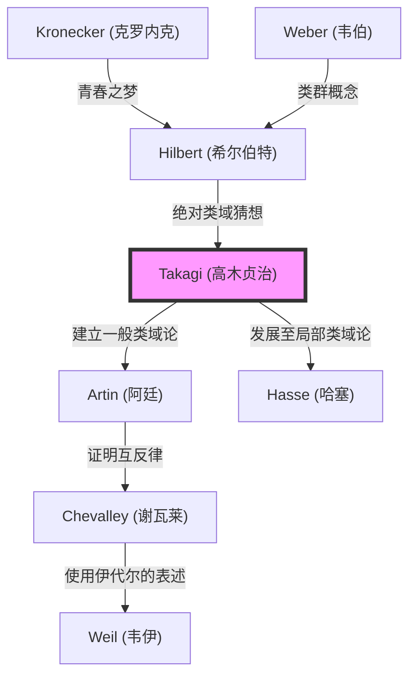

## 引言

在现代数论，特别是代数数论中，最美丽且最强大的理论框架之一就是 **类域论** （Class Field Theory）。凭借一己之力构建了这一宏大理论体系，并使日本数学水平一跃跻身世界最高行列的人，正是 **高木贞治** （1875–1960）。

他所取得的伟大成就，不仅仅是解决了一个未决问题。他在极东之地虽然孤立无援，却完美地描绘出了克罗内克（[Kronecker](https://kenji.blog/zh-cn/p/kronecker/)）和希尔伯特（[Hilbert](https://kenji.blog/zh-cn/p/hilbert/)）等西方巨星所梦想的数学图景，并为之后的数学界指明了前进的道路。本文将深入探讨高木贞治一生的轨迹以及他所创立的类域论的核心内容。

## 1. 早年生活与数学的觉醒

### 从岐阜县的农村到帝国大学

高木贞治于1875年（明治8年）出生在岐阜县大野郡数屋村（现本巢市）一个宁静的农村。他从小就展现出非凡的才华，在当地学校就读后，升入京都的第三高等中学校（后来的三高）。在这里，他与后来引领日本哲学界的西田几多郎等人成为同窗。

之后，他升入帝国大学（现东京大学）理科大学数学星学科。当时的日本距离明治维新仅过了几十年，才刚刚开始全面接受西方的近代数学。在支撑了日本数学教育黎明期的恩师菊池大麓和藤泽利喜太郎等人的指导下，高木的数学才华迅速绽放。

### 留学与在哥廷根的岁月

1898年，高木作为文部省的海外留学生前往德国。他最初在柏林大学学习，后来转入当时世界数学的中心——哥廷根大学。

在那里等待他的是[大卫·希尔伯特](https://kenji.blog/zh-cn/p/hilbert/)（[David Hilbert](https://kenji.blog/zh-cn/p/hilbert/)）和费利克斯·克莱因（Felix Klein）等在数学史上名垂千古的伟大数学家。特别是希尔伯特刚刚发表了代数数论的集大成之作《数论报告》（Zahlbericht），其内容对高木产生了强烈的冲击。在希尔伯特的指导下，他解决了“克罗内克的青春之梦”（关于虚乘法理论的问题）的一部分，于1903年获得博士学位后返回日本。

## 2. 孤独中的突破：类域论的诞生

### 第一次世界大战导致的学术孤立

回国后，高木作为东京帝国大学的教授，在指导后辈的同时继续自己的研究。然而，当1914年第一次世界大战爆发时，日本与欧洲的学术交流被完全切断。在收不到最新论文和期刊的情况下，高木只能在研究室里独自深化自己的思考。

这种“孤立”讽刺般地成为了孕育伟大创造的土壤。高木开始以独特的视角重新审视希尔伯特提出的关于相对阿贝尔扩张的问题。

### 类域论的构想

希尔伯特曾猜想并部分证明了“绝对类域”（absolute class field）的存在，即对于某个代数数域 $K$，存在一个无分歧的最大阿贝尔扩张，其伽罗瓦群与 $K$ 的理想类群同构。

高木认为，如果去掉“无分歧”这一限制，在任意的阿贝尔扩张中，也许同样成立这种美丽的对应关系。这就是高木 **类域论** 的核心思想。

## 3. 数学的极致：类域论的核心

让我们用数学公式来看看类域论的主张。考虑代数数域 $K$ 的有限次阿贝尔扩张 $L$。高木证明，通过在 $K$ 的理想群中考虑满足特定条件的同余理想群 $H$，在 $L$ 和 $H$ 之间存在着一一对应关系。

### 高木的存在定理与基本定理

高木贞治证明的主要定理如下：

1. **同构定理** ：对于任意的阿贝尔扩张 $L/K$，存在 $K$ 的适当同余理想群 $H$，且伽罗瓦群 $\text{Gal}(L/K)$ 与商群 $I/H$ 同构。
   
   $$ \text{Gal}(L/K) \cong I/H $$
   
   其中， $I$ 是以某个模为法数的理想群。

2. **存在定理** ：反之，对于 $K$ 的任意同余理想群 $H$，必然存在对应于 $H$ 的阿贝尔扩张 $L$ （类域）。

3. **完全分裂定理** ： $K$ 的素理想 $\mathfrak{p}$ 在 $L$ 中完全分裂的充要条件是， $\mathfrak{p}$ 属于群 $H$。

希尔伯特的猜想被作为模为平凡情况（无分歧的情况）的特例包含在内。高木将其推广为允许任意分歧的形式，从而建立了一个关于代数数域阿贝尔扩张的完整理论。

### 数学之美：克罗内克-韦伯定理的推广

类域论的优美之处在于，它将关于有理数域 $\mathbb{Q}$ 的 **克罗内克-韦伯定理** 推广到了一般的代数数域。克罗内克-韦伯定理指出：“有理数域的任意有限次阿贝尔扩张都包含在某个分圆域 $\mathbb{Q}(\zeta_n)$ 的子域中。”

$$ L \subset \mathbb{Q}(\zeta_n) \quad (\text{其中，} \zeta_n \text{ 是 1 的本原 } n \text{ 次根}) $$

高木的类域论完全确定了，当将这个 $\mathbb{Q}$ 替换为任意代数数域 $K$ 时，什么样的域将扮演分圆域的角色。

## 4. 世界级的评价与阿廷互反律

1920年，在第一次世界大战结束后于斯特拉斯堡举行的国际数学家大会上，高木发表了这一类域论。然而，由于内容最初过于创新，并没有被充分理解。

后来，以将论文单行本寄给德国的卡尔·西格尔（Carl Siegel）为契机，引起了埃米尔·阿廷（Emil Artin）和[赫尔穆特·哈塞](https://kenji.blog/zh-cn/p/hasse/)（[Helmut Hasse](https://kenji.blog/zh-cn/p/hasse/)）等新锐数学家们的注意。他们立刻理解了高木理论的伟大，并以该理论为基础推进了进一步的研究。

特别是阿廷，他利用高木的理论证明了 **阿廷互反律**，完成了类域论的表述。由此，高木贞治的名字被永远地铭刻在了数学史上。

## 5. 理论的谱系：类域论的扩展

高木贞治的理论对后来的数学家产生了巨大的影响。下方的 Mermaid 图表展示了这一谱系。

## 6. 作为教育家的贡献与经典名著

除了数学上的成就，高木贞治在日本数学教育上的贡献也是不可估量的。他的著作世世代代都是日本理科学生的圣经。

- **《解析概论》** ：可以说是日本微积分学的决定版教科书。这是一部将严密的逻辑推导与优美的日语完美融合的经典之作。
- **《初等数论讲义》** ：一本从数论基础一直讲解到高斯互反律的教科书。
- **《近世数学史谈》** ：一部生动描绘了19世纪数学家群像的历史书。它传递了数学发展的戏剧性。

他播下的种子，传承给了[小平邦彦](https://kenji.blog/zh-cn/p/kodaira-kunihiko/)、伊藤清，乃至志村五郎和[谷山丰](https://kenji.blog/zh-cn/p/taniyama-yutaka/)等后来在世界上大放异彩的日本数学家们。

## 结语

**高木贞治** 将诞生于西方的数学这门学问，在东方国家日本进行了独特的发展，并构建了世界最高峰的理论。他克服了战时孤立的逆境，仅凭纯粹的思考便完成了宏大的“类域论”，他的一生向我们展示了人类智慧的无限可能性。

今天，代数数论被应用于密码学和数学物理学等领域的范围正在不断扩大。为其奠定基础的高木贞治的成就，跨越时代，持续闪耀着光芒。
