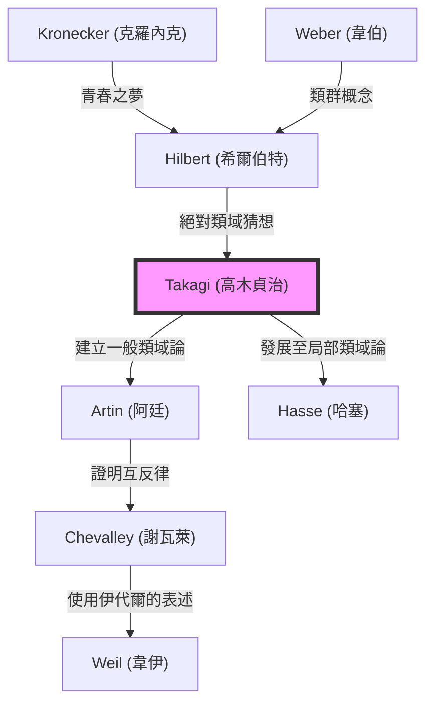

## 引言

在現代數論，特別是代數數論中，最美麗且最強大的理論框架之一就是 **類域論** （Class Field Theory）。憑藉一己之力構建了這一宏大理論體系，並使日本數學水準一躍躋身世界最高行列的人，正是 **[高木貞治](https://kenji.blog/zh-tw/p/takagi-teiji/)** （1875–1960）。

他所取得的偉大成就，不僅僅是解決了一個未決問題。他在極東之地雖然孤立無援，卻完美地描繪出了克羅內克（[Kronecker](https://kenji.blog/zh-tw/p/kronecker/)）和希爾伯特（Hilbert）等西方巨星所夢想的數學圖景，並為之後的數學界指明了前進的道路。本文將深入探討[高木貞治](https://kenji.blog/zh-tw/p/takagi-teiji/)一生的軌跡以及他所創立的類域論的核心內容。

## 1. 早年生活與數學的覺醒

### 從岐阜縣的農村到帝國大學

[高木貞治](https://kenji.blog/zh-tw/p/takagi-teiji/)於1875年（明治8年）出生在岐阜縣大野郡數屋村（現本巢市）一個寧靜的農村。他從小就展現出非凡的才華，在當地學校就讀後，升入京都的第三高等中學校（後來的三高）。在這裡，他與後來引領日本哲學界的西田幾多郎等人成為同窗。

之後，他升入帝國大學（現東京大學）理科大學數學星學科。當時的日本距離明治維新僅過了幾十年，才剛剛開始全面接受西方的近代數學。在支撐了日本數學教育黎明期的恩師菊池大麓和藤澤利喜太郎等人的指導下，高木的數學才華迅速綻放。

### 留學與在哥廷根的歲月

1898年，高木作為文部省的海外留學生前往德國。他最初在柏林大學學習，後來轉入當時世界數學的中心——哥廷根大學。

在那裡等待他的是[大衛·希爾伯特](https://kenji.blog/zh-tw/p/hilbert/)（[David Hilbert](https://kenji.blog/zh-tw/p/hilbert/)）和費利克斯·克萊因（Felix Klein）等在數學史上名垂千古的偉大數學家。特別是希爾伯特剛剛發表了代數數論的集大成之作《數論報告》（Zahlbericht），其內容對高木產生了強烈的衝擊。在希爾伯特的指導下，他解決了「克羅內克的青春之夢」（關於虛乘法理論的問題）的一部分，於1903年獲得博士學位後返回日本。

## 2. 孤獨中的突破：類域論的誕生

### 第一次世界大戰導致的學術孤立

回國後，高木作為東京帝國大學的教授，在指導後輩的同時繼續自己的研究。然而，當1914年第一次世界大戰爆發時，日本與歐洲的學術交流被完全切斷。在收不到最新論文和期刊的情況下，高木只能在研究室裡獨自深化自己的思考。

這種「孤立」諷刺般地成為了孕育偉大創造的土壤。高木開始以獨特的視角重新審視希爾伯特提出的關於相對阿貝爾擴張的問題。

### 類域論的構想

希爾伯特曾猜想並部分證明了「絕對類域」（absolute class field）的存在，即對於某個代數數域 $K$，存在一個無分歧的最大阿貝爾擴張，其伽羅瓦群與 $K$ 的理想類群同構。

高木認為，如果去掉「無分歧」這一限制，在任意的阿貝爾擴張中，也許同樣成立這種美麗的對應關係。這就是高木 **類域論** 的核心思想。

## 3. 數學的極致：類域論的核心

讓我們用數學公式來看看類域論的主張。考慮代數數域 $K$ 的有限次阿貝爾擴張 $L$。高木證明，透過在 $K$ 的理想群中考慮滿足特定條件的同餘理想群 $H$，在 $L$ 和 $H$ 之間存在著一對一的對應關係。

### 高木的存在定理與基本定理

[高木貞治](https://kenji.blog/zh-tw/p/takagi-teiji/)證明的主要定理如下：

1. **同構定理** ：對於任意的阿貝爾擴張 $L/K$，存在 $K$ 的適當同餘理想群 $H$，且伽羅瓦群 $\text{Gal}(L/K)$ 與商群 $I/H$ 同構。
   
   $$ \text{Gal}(L/K) \cong I/H $$
   
   其中， $I$ 是以某個模為法數的理想群。

2. **存在定理** ：反之，對於 $K$ 的任意同餘理想群 $H$，必然存在對應於 $H$ 的阿貝爾擴張 $L$ （類域）。

3. **完全分裂定理** ： $K$ 的素理想 $\mathfrak{p}$ 在 $L$ 中完全分裂的充要條件是， $\mathfrak{p}$ 屬於群 $H$。

希爾伯特的猜想被作為模為平凡情況（無分歧的情況）的特例包含在內。高木將其推廣為允許任意分歧的形式，從而建立了一個關於代數數域阿貝爾擴張的完整理論。

### 數學之美：克羅內克-韋伯定理的推廣

類域論的優美之處在於，它將關於有理數域 $\mathbb{Q}$ 的 **克羅內克-韋伯定理** 推廣到了一般的代數數域。克羅內克-韋伯定理指出：「有理數域的任意有限次阿貝爾擴張都包含在某個分圓域 $\mathbb{Q}(\zeta_n)$ 的子域中。」

$$ L \subset \mathbb{Q}(\zeta_n) \quad (\text{其中，} \zeta_n \text{ 是 1 的本原 } n \text{ 次根}) $$

高木的類域論完全確定了，當將這個 $\mathbb{Q}$ 替換為任意代數數域 $K$ 時，什麼樣的域將扮演分圓域的角色。

## 4. 世界級的評價與阿廷互反律

1920年，在第一次世界大戰結束後於斯特拉斯堡舉行的國際數學家大會上，高木發表了這一類域論。然而，由於內容最初過於創新，並沒有被充分理解。

後來，以將論文單行本寄給德國的卡爾·西格爾（Carl Siegel）為契機，引起了埃米爾·阿廷（Emil Artin）和[赫爾穆特·哈塞](https://kenji.blog/zh-tw/p/hasse/)（[Helmut Hasse](https://kenji.blog/zh-tw/p/hasse/)）等新銳數學家們的注意。他們立刻理解了高木理論的偉大，並以該理論為基礎推進了進一步的研究。

特別是阿廷，他利用高木的理論證明了 **阿廷互反律**，完成了類域論的表述。由此，[高木貞治](https://kenji.blog/zh-tw/p/takagi-teiji/)的名字被永遠地銘刻在了數學史上。

## 5. 理論的譜系：類域論的擴展

[高木貞治](https://kenji.blog/zh-tw/p/takagi-teiji/)的理論對後來的數學家產生了巨大的影響。下方的 Mermaid 圖表展示了這一譜系。

## 6. 作為教育家的貢獻與經典名著

除了數學上的成就，[高木貞治](https://kenji.blog/zh-tw/p/takagi-teiji/)在日本數學教育上的貢獻也是不可估量的。他的著作世世代代都是日本理科學生的聖經。

- **《解析概論》** ：可以說是日本微積分學的決定版教科書。這是一部將嚴密的邏輯推導與優美的日語完美融合的經典之作。
- **《初等數論講義》** ：一本從數論基礎一直講解到高斯互反律的教科書。
- **《近世數學史談》** ：一部生動描繪了19世紀數學家群像的歷史書。它傳遞了數學發展的戲劇性。

他播下的種子，傳承給了[小平邦彥](https://kenji.blog/zh-tw/p/kodaira-kunihiko/)、伊藤清，乃至志村五郎和[谷山豐](https://kenji.blog/zh-tw/p/taniyama-yutaka/)等後來在世界上大放異彩的日本數學家們。

## 結語

**[高木貞治](https://kenji.blog/zh-tw/p/takagi-teiji/)** 將誕生於西方的數學這門學問，在東方國家日本進行了獨特的發展，並構建了世界最高峰的理論。他克服了戰時孤立的逆境，僅憑純粹的思考便完成了宏大的「類域論」，他的一生向我們展示了人類智慧的無限可能性。

今天，代數數論被應用於密碼學和數學物理學等領域的範圍正在不斷擴大。為其奠定基礎的[高木貞治](https://kenji.blog/zh-tw/p/takagi-teiji/)的成就，跨越時代，持續閃耀著光芒。
