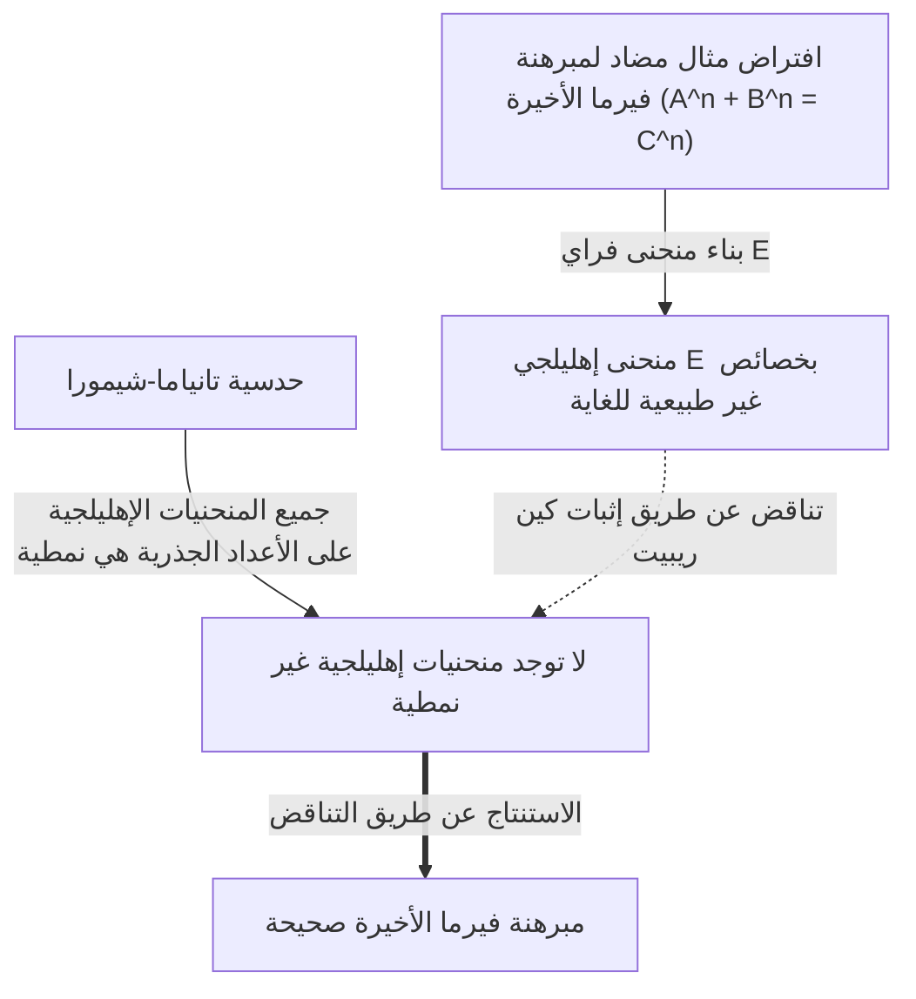

# [يوتاكا تانياما: حياة وإنجازات عالم الرياضيات العبقري الذي تحدى المشاكل التي لم تحل](https://kenji.blog/ar/p/taniyama-yutaka/)

يعد إثبات **[مبرهنة فيرما الأخيرة](https://kenji.blog/ar/p/fermats-last-theorem/)** واحداً من أكثر التطورات دراماتيكية وأهمية في الرياضيات الحديثة. وراء هذا الإنجاز الضخم تكمن حدسية مذهلة اقترحها عالما رياضيات يابانيان. أحدهما كان **[يوتاكا تانياما](https://kenji.blog/ar/p/taniyama-yutaka/)** (1927 - 1958)، الذي وافته المنية في سن مبكرة. في هذا المقال، نتعمق في الرؤية الكبيرة وراء "حدسية تانياما-شيمورا" التي اقترحها، وفي حياته الخاصة المضطربة.

## 1. الحياة المبكرة وشباب [يوتاكا تانياما](https://kenji.blog/ar/p/taniyama-yutaka/)

ولد [يوتاكا تانياما](https://kenji.blog/ar/p/taniyama-yutaka/) في عام 1927 في بلدة كيساي، محافظة سايتاما (الآن مدينة كازو). أظهر موهبة استثنائية في الرياضيات منذ سن مبكرة، لكن سنوات دراسته تزامنت مع الفترة الفوضوية للحرب العالمية الثانية. أصيب بالسل وغالباً ما غاب عن فترات طويلة من فصول المدرسة الثانوية. خلال فترة تعافيه، كان يقرأ كتب الرياضيات بمفرده وطور تفكيراً رياضياً عميقاً من خلال الدراسة الذاتية. يُقال إن فترة العزلة هذه صقلت حسه الرياضي الفريد والبديهي.

بعد التحاقه بقسم الرياضيات في كلية العلوم بجامعة طوكيو، طور اهتماماً قوياً بالجبر المجرد ونظرية الأعداد. على الرغم من أن المجتمع الرياضي الياباني كان في فترة إعادة إعمار ما بعد الحرب، إلا أنه كان يهدف إلى أبحاث عالمية المستوى، متأثراً بالباحثين الشباب الذين ألهمهم [تيجي تاكاغي](/ar/p/takagi-teiji/) وإميل أرتين. سمح تانياما لموهبته بالازدهار وسط هذا الحماس.

## 2. اللقاء مع جورو شيمورا

في جامعة طوكيو، التقى تانياما بـ **جورو شيمورا**، الذي سيصبح صديقه وحليفه مدى الحياة. كان الاثنان يتمتعان بشخصيتين متناقضتين، لكنهما اشتركا في شغف عميق بالرياضيات. في حين أن تانياما كان بديهياً وتتدفق منه الأفكار باستمرار، كان شيمورا يدعمه بمنطق صارم، مما شكل علاقة تكاملية رائعة.

قال جورو شيمورا لاحقاً عن تانياما: "لقد ارتكب العديد من الأخطاء، لكن معظمها كانت أخطاء في الاتجاه الصحيح". غالباً ما تضمن حدس تانياما قفزات منطقية، ولكن وراءها، كانت تتكشف دائماً آفاق رياضية جديدة. ألهم الاثنان بعضهما البعض وانغمسا في دراسة نظرية الضرب المركب والهندسة الجبرية، التي كانت في طليعة الرياضيات في ذلك الوقت.

## 3. حدسية تانياما-شيمورا: دمج عالمين

كان أعظم إنجاز لهما هو ربط كائنين رياضيين بدا أنهما غير مرتبطين تماماً: "المنحنيات الإهليلجية" و "النماذج النمطية". هذا الاكتشاف العظيم أصبح يُعرف لاحقاً باسم "حدسية تانياما-شيمورا" (أو مبرهنة النمطية).

### المنحنيات الإهليلجية (Elliptic Curves)

يتم التعبير عن المنحنى الإهليلجي بواسطة معادلة منحنى تكعيبي أملس على النحو التالي:

$$ E: y^2 = x^3 + a x + b $$

هنا، $a$ و $b$ ثوابت تحقق الشرط $4a^3 + 27b^2 \neq 0$. هذا الشرط يعني أن المنحنى ليس له نقاط شاذة (نقاط مدببة أو تقاطعات ذاتية). المنحنيات الإهليلجية هي كائنات ذات خصائص جبرية عميقة رغم كونها هندسية، مثل أن مجموعة النقاط الجذرية (النقاط ذات الإحداثيات الجذرية) تشكل بنية زمرة. كان العثور على النقاط الجذرية على المنحنيات الإهليلجية مشكلة قديمة وصعبة في نظرية الأعداد.

### النماذج النمطية (Modular Forms)

من ناحية أخرى، النموذج النمطي هو دالة تحليلية مركبة شديدة التناظر محددة على النصف العلوي للمستوى (مجموعة الأعداد المركبة ذات الأجزاء التخيلية الموجبة). يحقق النموذج النمطي $f(z)$ الخاصية التالية لمجموعة محددة من التحويلات (الزمرة النمطية):

$$ f\left( \frac{az+b}{cz+d} \right) = (cz+d)^k f(z) $$

هنا، $a, b, c, d$ هي عناصر مصفوفة صحيحة تحقق $ad-bc=1$. و $k$ هو عدد صحيح يسمى وزن (weight) النموذج النمطي. توصف النماذج النمطية أحياناً بأنها "دوال ذات تناظر رباعي الأبعاد" وهي كائنات معقدة ومجردة للغاية.

### محتوى ومعنى الحدسية

ببساطة، تنص "حدسية تانياما-شيمورا" على أن **"كل منحنى إهليلجي محدد على الأعداد الجذرية هو منحنى نمطي"**. وبدقة أكثر، تدعي أن دالة L التي تسمى $L(E, s)$ لأي منحنى إهليلجي $E$ على الأعداد الجذرية تتطابق تماماً مع دالة L التي تسمى $L(f, s)$ لنموذج نمطي معين $f$ من الوزن 2.

$$ \text{For any elliptic curve } E / \mathbb{Q}, \text{ there exists a modular form } f \text{ such that } L(E, s) = L(f, s) $$

هذا يعني أن الحمض النووي (DNA) لـ "المنحنى الإهليلجي"، وهو مواطن في عالم الهندسة الجبرية، متطابق مع الحمض النووي لـ "النموذج النمطي"، وهو مواطن في عالم التحليل المركب. كانت هذه الحدسية رؤية مذهلة بنت جسراً قوياً بين مجالين مختلفين تماماً من الرياضيات.

## 4. ندوة نيكو لعام 1955

تم اقتراح هذه الحدسية العظيمة علناً لأول مرة في عام 1955 في ندوة دولية حول نظرية الأعداد الجبرية عقدت في نيكو، اليابان. حضر هذه الندوة كبار علماء الرياضيات في العالم في ذلك الوقت، مثل أندريه ويل وجان بيير سير.

طبع تانياما ووزع على المشاركين عدة مشاكل غير محلولة مكتوبة باللغة الإنجليزية. احتوت المشكلتان 12 و 13 على بذور الأفكار التي ستتطور لاحقاً إلى "حدسية تانياما-شيمورا". اقترح تانياما بجرأة أنه يمكن الحصول على دالة زيتا لمنحنى إهليلجي من معاملات فورييه لنوع معين من النماذج النمطية.

في البداية، لم يصدق أحد تقريباً من علماء الرياضيات هذه الحدسية. بدت غريبة جداً، وكان من الصعب تخيل أن مجالين متميزين يمكن أن يكونا مرتبطين ارتباطاً وثيقاً. حتى أن ويل قيل إنه كان متشككاً في البداية (على الرغم من أن ويل أدرك لاحقاً أهميتها وساهم في صياغتها، مما أدى إلى تسميتها أحياناً "حدسية تانياما-شيمورا-ويل").

## 5. نهاية مأساوية

بدت مسيرة تانياما كعالم رياضيات تسير بسلاسة، بل وتلقى دعوة من معهد الدراسات المتقدمة في برينستون. ومع ذلك، في 17 نوفمبر 1958، أنهى حياته بيده. كان عمره 31 عاماً فقط. هذا الحدث، الذي وقع قبل شهر واحد فقط من حفل زفافه المقرر، أرسل موجات صدمة ليس فقط عبر المجتمع الرياضي الياباني ولكن لجميع من عرفوه.

لم تذكر رسالة انتحاره أي مخاوف محددة. كتب: "حتى الأمس لم يكن لدي نية محددة لقتل نفسي"، مما يشير إلى أنه حتى هو لم يستطع تفسير أفعاله منطقياً بالكامل. ربما كان الإرهاق بسبب العمل المفرط أو القلق الغامض بشأن المستقبل، لكن الأسباب الدقيقة تظل غير محلولة حتى يومنا هذا. بعد أسابيع قليلة، أنهت خطيبته، التي كانت تحبه بعمق، حياتها أيضاً، تاركة رسالة مفادها: "بما أنه رحل بمفرده، يجب أن أذهب لأكون بجانبه". تركت هذه النهاية المأساوية ندوباً عميقة في قلوب المعنيين.

## 6. جسر إلى [مبرهنة فيرما الأخيرة](https://kenji.blog/ar/p/fermats-last-theorem/)

بعد وفاة تانياما، صاغ جورو شيمورا هذه الحدسية بدقة ونشرها بين علماء الرياضيات في جميع أنحاء العالم. لفترة طويلة، اعتبرت هذه الحدسية هدفاً صعباً لدرجة أنها بدت "غير قابلة للإثبات". ومع ذلك، حدث تحول دراماتيكي في الثمانينيات. اقترح عالم الرياضيات الألماني جيرهارد فراي فكرة مذهلة: **"إذا كان ل[مبرهنة فيرما الأخيرة](https://kenji.blog/ar/p/fermats-last-theorem/) مثال مضاد، فإن المنحنى الإهليلجي المبني من هذا المثال المضاد لا يمكن أن يكون نمطياً."**

المنحنى الإهليلجي الذي بناه فراي (منحنى فراي) اتخذ الشكل التالي. لنفترض أن هناك حلاً صحيحاً لمعادلة فيرما $A^n + B^n = C^n$. باستخدام هذا الحل، ننشئ المنحنى الإهليلجي التالي:

$$ E: y^2 = x (x - A^n) (x + B^n) $$

هذا المنحنى له خصائص "غير طبيعية" للغاية وكان يعتقد أنه من المستحيل تماماً بناؤه من النماذج النمطية (مما يعني أنه ليس نمطياً). تم إثبات حدس فراي لاحقاً بدقة بواسطة عالم الرياضيات الأمريكي كين ريبيت، عبر "حدسية إبسيلون" التي صاغها عالم الرياضيات الفرنسي جان بيير سير.

أكمل هذا إطاراً منطقياً:
1. إذا كانت [مبرهنة فيرما الأخيرة](https://kenji.blog/ar/p/fermats-last-theorem/) خاطئة، يوجد منحنى إهليلجي غير نمطي (منحنى فراي).
2. ومع ذلك، وفقاً لحدسية تانياما-شيمورا، "جميع المنحنيات الإهليلجية هي نمطية".
3. لذلك، إذا كانت حدسية تانياما-شيمورا صحيحة، فلا يمكن لمنحنى فراي أن يوجد، ويجب أن تكون [مبرهنة فيرما الأخيرة](https://kenji.blog/ar/p/fermats-last-theorem/) صحيحة أيضاً.

بمعنى آخر، تم ربط سلسلة القدر: **"إذا تم إثبات حدسية تانياما-شيمورا، فإن [مبرهنة فيرما الأخيرة](https://kenji.blog/ar/p/fermats-last-theorem/)، التي لم تُحل لأكثر من 300 عام، سيتم إثباتها تلقائياً أيضاً."**

## 7. إثبات الحدسية وبرنامج لانجلاندز

الشخص الأكثر استلهاماً من هذه الحقيقة كان عالم الرياضيات البريطاني **[أندرو وايلز](https://kenji.blog/ar/p/wiles/)**. لقد كان مفتوناً بمبرهنة فيرما الأخيرة منذ طفولته وصمم على تكريس حياته لإثباتها. بعد سبع سنوات من البحث السري، أعلن في عام 1993 أنه قد "أثبت حدسية تانياما-شيمورا للمنحنيات الإهليلجية شبه المستقرة". على الرغم من العثور على فجوة في جزء من الإثبات، وبمساعدة تلميذه السابق ريتشارد تايلور، نجح في سد الفجوة في عام 1995 ونشر الإثبات الكامل. ونتيجة لذلك، تم إثبات الجزء الحاسم من الحدسية التي تركها تانياما، وفي الوقت نفسه، أصبحت [مبرهنة فيرما الأخيرة](https://kenji.blog/ar/p/fermats-last-theorem/) حقيقة أبدية.

في وقت لاحق، ومن خلال جهود إضافية من قبل كريستوف بروي، وبريان كونراد، وفريد دايموند، وريتشارد تايلور، تم إثبات حدسية تانياما-شيمورا بالكامل لجميع المنحنيات الإهليلجية في عام 2001. يُعرف هذا الإثبات اليوم باسم "مبرهنة النمطية (Modularity Theorem)".

تعد حدسية تانياما-شيمورا المثال الأجمل والأكثر نجاحاً للإطار الكبير في الرياضيات الحديثة المعروف باسم "برنامج لانجلاندز". برنامج لانجلاندز هو محاولة طموحة لتوحيد نظرية الأعداد، والهندسة الجبرية، ونظرية التمثيل، ويُطلق عليه غالباً "النظرية الموحدة الكبرى للرياضيات". كان حدس تانياما هو المفتاح الذي فتح هذا الباب.

## 8. الخاتمة

أصبحت الحدسية المتواضعة التي قدمها [يوتاكا تانياما](https://kenji.blog/ar/p/taniyama-yutaka/) في ندوة نيكو الأساس لإثبات [مبرهنة فيرما الأخيرة](https://kenji.blog/ar/p/fermats-last-theorem/)، وهي ذروة الفكر البشري، بعد نصف قرن. لا تزال بصيرته في "الروابط الخفية وراء الكائنات الرياضية المختلفة" تلهم علماء الرياضيات اليوم.

عالم الرياضيات العبقري [يوتاكا تانياما](https://kenji.blog/ar/p/taniyama-yutaka/)، الذي مات صغيراً. ستستمر الحدسية الجميلة التي تركها وراءه في أن تكون ضوءاً مرشداً ينير عالم الرياضيات الواسع. لا يسع المرء إلا أن يتساءل عن الحقائق العميقة الأخرى التي كان ليظهرها لنا لو كان قد عاش.
