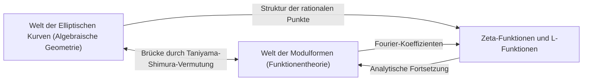
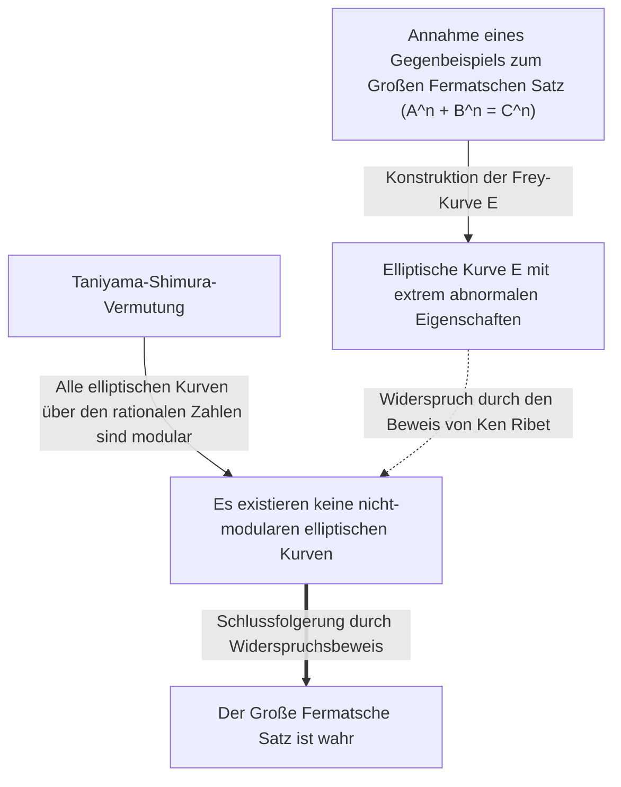

# [Yutaka Taniyama: Das Leben und die Errungenschaften des genialen Mathematikers, der ungelöste Probleme herausforderte](https://kenji.blog/de/p/taniyama-yutaka/)

Der Beweis des **Großen [Fermat](https://kenji.blog/de/p/fermat/)schen Satzes** ist eine der dramatischsten und wichtigsten Entwicklungen in der modernen Mathematik. Hinter dieser monumentalen Errungenschaft verbirgt sich eine erstaunliche Vermutung, die von zwei japanischen Mathematikern aufgestellt wurde. Einer von ihnen war **[Yutaka Taniyama](https://kenji.blog/de/p/taniyama-yutaka/)** (1927 - 1958), der in jungen Jahren verstarb. In diesem Artikel tauchen wir tief in die große Vision ein, die hinter der von ihm vorgeschlagenen "Taniyama-Shimura-Vermutung" steht, sowie in sein eigenes turbulentes Leben.

## 1. Frühes Leben und Jugend von [Yutaka Taniyama](https://kenji.blog/de/p/taniyama-yutaka/)

[Yutaka Taniyama](https://kenji.blog/de/p/taniyama-yutaka/) wurde 1927 in der Stadt Kisai in der Präfektur Saitama (heute Kazo-Stadt) geboren. Er zeigte schon in jungen Jahren ein außergewöhnliches Talent für Mathematik, doch seine Studienzeit fiel in die chaotische Zeit des Zweiten Weltkriegs. Er erkrankte an Tuberkulose und verpasste oft über lange Zeiträume den Schulunterricht. Während seiner Genesung las er allein Mathematikbücher und entwickelte durch Selbststudium ein tiefes mathematisches Denken. Man sagt, dass diese isolierte Zeit seinen einzigartigen und intuitiven mathematischen Sinn geschärft habe.

Nach seinem Eintritt in die Fakultät für Naturwissenschaften (Fachbereich Mathematik) der Universität Tokio entwickelte er ein starkes Interesse an abstrakter Algebra und Zahlentheorie. Obwohl sich die japanische Mathematikergemeinschaft in der Nachkriegszeit im Wiederaufbau befand, strebte sie nach Spitzenforschung, beeinflusst von jungen Forschern, die durch Teiji [Takagi](https://kenji.blog/de/p/takagi-teiji/) und Emil Artin inspiriert waren. Taniyama ließ sein Talent inmitten dieses Enthusiasmus erblühen.

## 2. Die Begegnung mit [Goro Shimura](https://kenji.blog/de/p/shimura-goro/)

An der Universität Tokio traf Taniyama **[Goro Shimura](https://kenji.blog/de/p/shimura-goro/)**, der sein lebenslanger Freund und Verbündeter werden sollte. Die beiden hatten gegensätzliche Persönlichkeiten, teilten aber eine tiefe Leidenschaft für die Mathematik. Während Taniyama intuitiv handelte und ständig vor Ideen übersprudelte, untermauerte Shimura diese mit strenger Logik, wodurch eine bemerkenswerte ergänzende Beziehung entstand.

[Goro Shimura](https://kenji.blog/de/p/shimura-goro/) sagte später über Taniyama: "Er machte viele Fehler, aber meistens waren es Fehler in die richtige Richtung." Taniyamas Intuition beinhaltete oft logische Sprünge, doch jenseits davon entfaltete sich stets eine neue mathematische Landschaft. Die beiden inspirierten sich gegenseitig und vertieften sich in das Studium der "Theorie der komplexen Multiplikation" und der "Algebraischen Geometrie", die damals an der Spitze der Mathematik standen.

## 3. Die Taniyama-Shimura-Vermutung: Integration zweier Welten

Ihre größte Errungenschaft bestand darin, zwei mathematische Objekte zu verbinden, die völlig unabhängig voneinander schienen: "elliptische Kurven" und "Modulformen". Diese großartige Entdeckung wurde später als "Taniyama-Shimura-Vermutung" (oder Modularitätssatz) bekannt.

### Elliptische Kurven (Elliptic Curves)

Eine elliptische Kurve wird durch die Gleichung einer glatten kubischen Kurve wie folgt ausgedrückt:

$$ E: y^2 = x^3 + a x + b $$

Hierbei sind $a$ und $b$ Konstanten, die $4a^3 + 27b^2 \neq 0$ erfüllen. Diese Bedingung bedeutet, dass die Kurve keine Singularitäten (Spitzen oder Selbstdurchdringungen) aufweist. Elliptische Kurven sind Objekte mit tiefgreifenden algebraischen Eigenschaften, obwohl sie geometrisch sind, wie zum Beispiel die Tatsache, dass die Menge der rationalen Punkte (Punkte mit rationalen Koordinaten) eine Gruppenstruktur bildet. Das Finden rationaler Punkte auf elliptischen Kurven war ein altes und schwieriges Problem der Zahlentheorie.

### Modulformen (Modular Forms)

Andererseits ist eine Modulform eine hochsymmetrische komplexe analytische Funktion, die in der oberen Halbebene (der Menge komplexer Zahlen mit positiven Imaginärteilen) definiert ist. Eine Modulform $f(z)$ erfüllt die folgende Eigenschaft für eine spezifische Gruppe von Transformationen (die Modulgruppe):

$$ f\left( \frac{az+b}{cz+d} \right) = (cz+d)^k f(z) $$

Hierbei sind $a, b, c, d$ ganzzahlige Matrixelemente, die $ad-bc=1$ erfüllen. Und $k$ ist eine ganze Zahl, die als Gewicht (weight) der Modulform bezeichnet wird. Modulformen werden manchmal als "Funktionen mit vierdimensionaler Symmetrie" beschrieben und sind extrem komplexe und abstrakte Objekte.

### Inhalt und Bedeutung der Vermutung

Einfach ausgedrückt besagt die "Taniyama-Shimura-Vermutung", dass **"jede elliptische Kurve, die über den rationalen Zahlen definiert ist, modular ist."** Genauer gesagt behauptet sie, dass die L-Funktion $L(E, s)$ jeder elliptischen Kurve $E$ über den rationalen Zahlen perfekt mit der L-Funktion $L(f, s)$ einer bestimmten Modulform $f$ vom Gewicht 2 übereinstimmt.

$$ \text{For any elliptic curve } E / \mathbb{Q}, \text{ there exists a modular form } f \text{ such that } L(E, s) = L(f, s) $$

Dies bedeutet, dass die DNA einer "elliptischen Kurve", eines Bewohners der Welt der algebraischen Geometrie, identisch ist mit der DNA einer "Modulform", eines Bewohners der Welt der Funktionentheorie. Diese Vermutung war eine erstaunliche Vision, die eine starke Brücke zwischen zwei völlig unterschiedlichen Gebieten der Mathematik schlug.

## 4. Das Nikko-Symposium 1955

Diese großartige Vermutung wurde erstmals 1955 auf einem internationalen Symposium zur algebraischen Zahlentheorie in Nikko, Japan, öffentlich angedeutet. An diesem Symposium nahmen die damals weltbesten Mathematiker teil, wie etwa [André Weil](https://kenji.blog/de/p/weil/) und Jean-Pierre Serre.

Taniyama druckte und verteilte an die Teilnehmer mehrere ungelöste Probleme, die auf Englisch verfasst waren. Die Probleme 12 und 13 enthielten die Keime der Ideen, die sich später zur "Taniyama-Shimura-Vermutung" entwickeln sollten. Taniyama schlug kühn vor, dass die Zeta-Funktion einer elliptischen Kurve aus den Fourier-Koeffizienten einer bestimmten Art von Modulform gewonnen werden könnte.

Anfangs glaubte fast kein Mathematiker an diese Vermutung. Sie schien zu bizarr, und es war schwer vorstellbar, dass zwei so unterschiedliche Gebiete so eng miteinander verbunden sein könnten. Sogar Weil soll anfangs skeptisch gewesen sein (obwohl Weil später deren Bedeutung erkannte und zu ihrer Formulierung beitrug, weshalb sie manchmal auch "Taniyama-Shimura-Weil-Vermutung" genannt wurde).

## 5. Ein tragisches Ende

Taniyamas Karriere als Mathematiker schien reibungslos zu verlaufen, und er hatte sogar eine Einladung an das Institute for Advanced Study in Princeton erhalten. Am 17. November 1958 nahm er sich jedoch das Leben. Er war erst 31 Jahre alt. Dieses Ereignis, das nur einen Monat vor seiner geplanten Hochzeit stattfand, löste nicht nur in der japanischen Mathematikergemeinschaft, sondern auch bei allen, die ihn kannten, Schockwellen aus.

Sein Abschiedsbrief erwähnte keine konkreten Sorgen. Er schrieb: "Bis gestern hatte ich nicht die feste Absicht, mich umzubringen", was darauf hindeutet, dass selbst er seine Handlungen nicht vollständig logisch erklären konnte. Es könnte Erschöpfung durch Überarbeitung oder eine vage Zukunftsangst gewesen sein, aber die genauen Gründe bleiben bis heute ungelöst. Wenige Wochen später nahm sich auch seine Verlobte, die ihn tief liebte, das Leben und hinterließ einen Brief mit dem sinngemäßen Inhalt: "Da er allein gegangen ist, muss ich an seine Seite gehen." Dieses tragische Ende hinterließ tiefe Narben in den Herzen der Beteiligten.

## 6. Eine Brücke zum Großen [Fermat](https://kenji.blog/de/p/fermat/)schen Satz

Nach Taniyamas Tod formulierte [Goro Shimura](https://kenji.blog/de/p/shimura-goro/) diese Vermutung rigoros und verbreitete sie unter Mathematikern weltweit. Lange Zeit galt diese Vermutung als ein Ziel, das so schwer zu erreichen war, dass es unbeweisbar schien. In den 1980er Jahren kam es jedoch zu einer dramatischen Wende. Der deutsche Mathematiker Gerhard Frey schlug eine erstaunliche Idee vor: **"Wenn der Große [Fermat](https://kenji.blog/de/p/fermat/)sche Satz ein Gegenbeispiel hat, kann die aus diesem Gegenbeispiel konstruierte elliptische Kurve nicht modular sein."**

Die von Frey konstruierte elliptische Kurve (Frey-Kurve) nahm folgende Form an. Angenommen, es gibt eine ganzzahlige Lösung der [Fermat](https://kenji.blog/de/p/fermat/)-Gleichung $A^n + B^n = C^n$. Mithilfe dieser Lösung erstellen wir die folgende elliptische Kurve:

$$ E: y^2 = x (x - A^n) (x + B^n) $$

Diese Kurve weist extrem "abnormale" Eigenschaften auf und man dachte, es sei absolut unmöglich, sie aus Modulformen zu konstruieren (was bedeutet, dass sie nicht modular ist). Freys Intuition wurde später durch den amerikanischen Mathematiker Ken Ribet streng bewiesen, basierend auf der "Epsilon-Vermutung", die vom französischen Mathematiker Jean-Pierre Serre formuliert worden war.

Dies vervollständigte einen logischen Rahmen:
1. Wenn der Große [Fermat](https://kenji.blog/de/p/fermat/)sche Satz falsch ist, existiert eine nicht-modulare elliptische Kurve (Frey-Kurve).
2. Nach der Taniyama-Shimura-Vermutung gilt jedoch: "Alle elliptischen Kurven sind modular".
3. Wenn also die Taniyama-Shimura-Vermutung wahr ist, kann die Frey-Kurve nicht existieren, und der Große [Fermat](https://kenji.blog/de/p/fermat/)sche Satz muss ebenfalls wahr sein.

Mit anderen Worten: Die Kette des Schicksals war geknüpft: **"Wenn die Taniyama-Shimura-Vermutung bewiesen ist, wird auch der über 300 Jahre ungelöste Große [Fermat](https://kenji.blog/de/p/fermat/)sche Satz automatisch bewiesen sein."**

## 7. Beweis der Vermutung und das Langlands-Programm

Die Person, die von dieser Tatsache am meisten inspiriert war, war der britische Mathematiker **[Andrew Wiles](https://kenji.blog/de/p/wiles/)**. Er war seit seiner Kindheit vom Großen Fermatschen Satz fasziniert und beschloss, sein Leben dem Beweis dieses Satzes zu widmen. Nach sieben Jahren geheimer Forschung verkündete er 1993, er habe "die Taniyama-Shimura-Vermutung für semistabile elliptische Kurven bewiesen". Obwohl in einem Teil des Beweises eine Lücke gefunden wurde, gelang es ihm mit Hilfe seines ehemaligen Studenten Richard Taylor, die Lücke 1995 erfolgreich zu schließen und den vollständigen Beweis zu veröffentlichen. Infolgedessen wurde der von Taniyama hinterlassene entscheidende Teil der Vermutung bewiesen, und gleichzeitig wurde der Große [Fermat](https://kenji.blog/de/p/fermat/)sche Satz zu einer ewigen Wahrheit.

Anschließend wurde die Taniyama-Shimura-Vermutung durch weitere Bemühungen von Christophe Breuil, Brian Conrad, Fred Diamond und Richard Taylor im Jahr 2001 für alle elliptischen Kurven vollständig bewiesen. Heute ist dieser Satz als "Modularitätssatz (Modularity Theorem)" bekannt.

Die Taniyama-Shimura-Vermutung ist das schönste und erfolgreichste Beispiel für den großen Rahmen der modernen Mathematik, der als "Langlands-Programm" bekannt ist. Das Langlands-Programm ist ein ehrgeiziger Versuch, Zahlentheorie, algebraische Geometrie und Darstellungstheorie zu vereinen, und wird oft als die "Große vereinheitlichte Theorie der Mathematik" bezeichnet. Taniyamas Intuition war genau der Schlüssel, der dieses Tor öffnete.

## 8. Fazit

Die bescheidene Vermutung, die [Yutaka Taniyama](https://kenji.blog/de/p/taniyama-yutaka/) auf dem Symposium in Nikko vorstellte, wurde ein halbes Jahrhundert später zur Grundlage für die Etablierung des Großen [Fermat](https://kenji.blog/de/p/fermat/)schen Satzes, einem Höhepunkt des menschlichen Intellekts. Seine Einsicht in die "verborgenen Verbindungen hinter verschiedenen mathematischen Objekten" inspiriert Mathematiker noch heute.

Das mathematische Genie [Yutaka Taniyama](https://kenji.blog/de/p/taniyama-yutaka/), das so jung starb. Die wunderschöne Vermutung, die er hinterließ, wird weiterhin ein Leitstern sein, der das weite Universum der Mathematik erhellt. Man kann nicht anders, als sich zu fragen, welch tiefgreifende Wahrheiten er uns noch gezeigt hätte, wenn er am Leben geblieben wäre.
