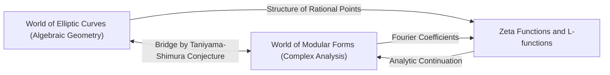
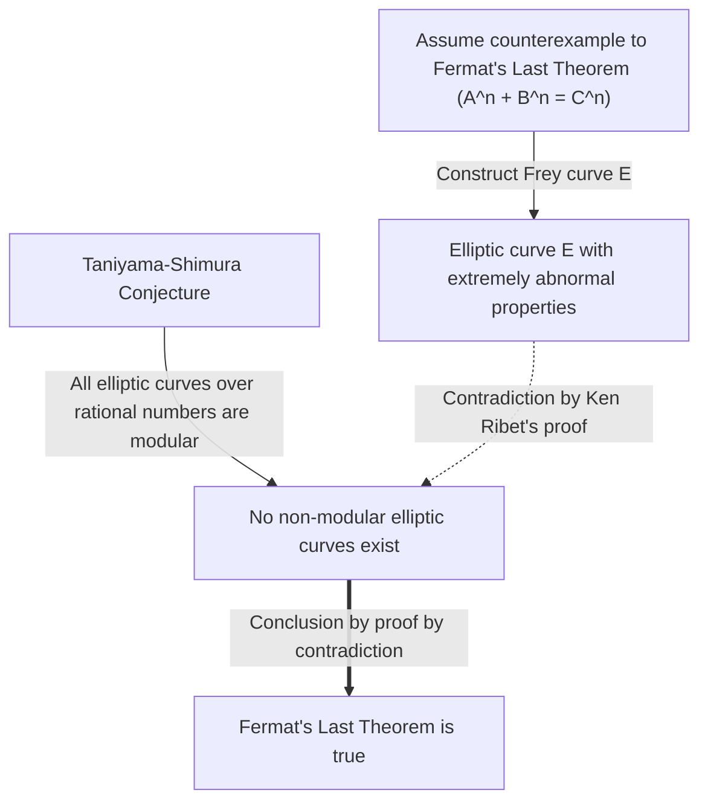

# Yutaka Taniyama: The Life and Achievements of the Genius Mathematician Who Challenged Unsolved Problems

The proof of **Fermat's Last Theorem** is one of the most dramatic and important developments in modern mathematics. Behind this monumental achievement lies an astonishing conjecture proposed by two Japanese mathematicians. One of them was **Yutaka Taniyama** (1927 - 1958), who passed away at a young age. In this article, we delve deeply into the grand vision behind the "Taniyama-Shimura Conjecture" he proposed, and his own turbulent life.

## 1. Early Life and Youth of Yutaka Taniyama

Yutaka Taniyama was born in 1927 in Kisai Town, Saitama Prefecture (now Kazo City). He showed an extraordinary talent for mathematics from a young age, but his student years coincided with the chaotic period of World War II. He contracted tuberculosis and often missed long periods of high school classes. During his recuperation, he read mathematics books alone and developed deep mathematical thinking through self-study. It is said that this isolated time honed his unique and intuitive mathematical sense.

After entering the Department of Mathematics at the University of Tokyo's Faculty of Science, he developed a strong interest in abstract algebra and number theory. Despite being in a post-war reconstruction period, the Japanese mathematical community at the time was aiming for world-class research, influenced by young researchers inspired by Teiji Takagi and Emil Artin. Taniyama let his talents blossom amidst this enthusiasm.

## 2. Meeting Goro Shimura

At the University of Tokyo, Taniyama met **Goro Shimura**, who would become his lifelong friend and ally. The two had contrasting personalities but shared a deep passion for mathematics. While Taniyama was intuitive and constantly brimming with ideas, Shimura backed them up with rigorous logic, forming a remarkable complementary relationship.

Goro Shimura later said of Taniyama, "He made a lot of mistakes, but mostly they were mistakes in a good direction." Taniyama's intuition often included logical leaps, but beyond them, a new mathematical landscape always unfolded. The two inspired each other and immersed themselves in the study of the theory of complex multiplication and algebraic geometry, which were at the forefront of mathematics at the time.

## 3. The Taniyama-Shimura Conjecture: Integration of Two Worlds

Their greatest achievement was connecting two mathematical objects that seemed completely unrelated: "elliptic curves" and "modular forms." This grand discovery later became known as the "Taniyama-Shimura Conjecture" (or the Modularity Theorem).

### Elliptic Curves

An elliptic curve is expressed by the equation of a smooth cubic curve as follows:

$$ E: y^2 = x^3 + a x + b $$

Here, $a$ and $b$ are constants that satisfy $4a^3 + 27b^2 \neq 0$. This condition means the curve has no singular points (cusps or self-intersections). Elliptic curves are objects with profound algebraic properties despite being geometric, such as the set of rational points forming a group structure. Finding the rational points on elliptic curves was an ancient and difficult problem in number theory.

### Modular Forms

On the other hand, a modular form is a highly symmetric complex analytic function defined on the upper half-plane (the set of complex numbers with positive imaginary parts). A modular form $f(z)$ satisfies the following property for a specific group of transformations (the modular group):

$$ f\left( \frac{az+b}{cz+d} \right) = (cz+d)^k f(z) $$

Here, $a, b, c, d$ are integer matrix entries satisfying $ad-bc=1$. And $k$ is an integer called the weight of the modular form. Modular forms are sometimes described as "functions with four-dimensional symmetry" and are extremely complex and abstract objects.

### Content and Meaning of the Conjecture

Simply put, the "Taniyama-Shimura Conjecture" states that **"every elliptic curve defined over the rational numbers is modular."** More precisely, it claims that the L-function $L(E, s)$ of any elliptic curve $E$ over the rational numbers perfectly matches the L-function $L(f, s)$ of some modular form $f$ of weight 2.

$$ \text{For any elliptic curve } E / \mathbb{Q}, \text{ there exists a modular form } f \text{ such that } L(E, s) = L(f, s) $$

This means that the DNA of an "elliptic curve," a resident of the algebraic geometry world, is identical to the DNA of a "modular form," a resident of the complex analysis world. This conjecture was an astonishing vision that built a strong bridge between two entirely different fields of mathematics.

## 4. The 1955 Nikko Symposium

This grand conjecture was first suggested publicly in 1955 at an international symposium on algebraic number theory held in Nikko, Japan. This symposium was attended by top mathematicians of the world at the time, such as André Weil and Jean-Pierre Serre.

Taniyama printed and distributed to the participants several unsolved problems written in English. Problems 12 and 13 contained the seeds of the ideas that would later develop into the "Taniyama-Shimura Conjecture." Taniyama boldly proposed that the zeta function of an elliptic curve might be obtained from the Fourier coefficients of a certain kind of modular form.

Initially, almost no mathematicians believed this conjecture. It seemed too bizarre, and it was hard to imagine that two distinct fields could be so closely connected. Even Weil was said to be skeptical at first (though Weil later recognized its importance and contributed to its formulation, leading to it being called the "Taniyama-Shimura-Weil Conjecture").

## 5. Tragic End

Taniyama's career as a mathematician seemed to be sailing smoothly, and he had even received an invitation from the Institute for Advanced Study in Princeton. However, on November 17, 1958, he took his own life. He was only 31 years old. This event, which occurred just a month before his planned wedding, sent shockwaves not only through the Japanese mathematical community but to all who knew him.

His suicide note did not state any specific worries. He wrote, "Until yesterday I had no definite intention of killing myself," suggesting that even he could not fully logically explain his actions. It might have been exhaustion from overwork or a vague anxiety about the future, but the exact reasons remain unsolved to this day. A few weeks later, his fiancée, who loved him deeply, also took her own life, leaving a note to the effect of, "Since he departed alone, I must go to be by his side." This tragic conclusion left deep scars on the hearts of those involved.

## 6. A Bridge to Fermat's Last Theorem

After Taniyama's death, Goro Shimura rigorously formulated this conjecture and spread it to mathematicians worldwide. For a long time, this conjecture was considered a goal so difficult that it seemed "unprovable." However, a dramatic turn of events occurred in the 1980s. The German mathematician Gerhard Frey proposed an astonishing idea: **"If Fermat's Last Theorem has a counterexample, the elliptic curve constructed from that counterexample cannot be modular."**

The elliptic curve constructed by Frey (the Frey curve) took the following form. Assume there is an integer solution to Fermat's equation $A^n + B^n = C^n$. Using that solution, we create the following elliptic curve:

$$ E: y^2 = x (x - A^n) (x + B^n) $$

This curve has extremely "abnormal" properties and was thought absolutely impossible to be constructed from modular forms (meaning it is not modular). Frey's intuition was later rigorously proved by the American mathematician Ken Ribet, via the "Epsilon Conjecture" formulated by the French mathematician Jean-Pierre Serre.

This completed a logical framework:
1. If Fermat's Last Theorem is false, a non-modular elliptic curve (Frey curve) exists.
2. However, according to the Taniyama-Shimura Conjecture, "all elliptic curves are modular."
3. Therefore, if the Taniyama-Shimura Conjecture is true, the Frey curve cannot exist, and Fermat's Last Theorem must also be true.

In other words, the chain of destiny was linked: **"If the Taniyama-Shimura Conjecture is proved, Fermat's Last Theorem, unsolved for over 300 years, will automatically be proved as well."**

## 7. Proof of the Conjecture and the Langlands Program

The person most inspired by this fact was the British mathematician **Andrew Wiles**. He had been fascinated by Fermat's Last Theorem since childhood and resolved to dedicate his life to proving it. After seven years of secret research, he announced in 1993 that he had "proved the Taniyama-Shimura Conjecture for semistable elliptic curves." Although a gap was found in part of the proof, with the help of his former student Richard Taylor, he successfully filled the gap in 1995 and published the complete proof. As a result, the crucial part of the conjecture left behind by Taniyama was proved, and simultaneously, Fermat's Last Theorem became an eternal truth.

Subsequently, through further efforts by Christophe Breuil, Brian Conrad, Fred Diamond, and Richard Taylor, the Taniyama-Shimura Conjecture was completely proved for all elliptic curves in 2001. Today, this theorem is known as the "Modularity Theorem."

The Taniyama-Shimura Conjecture is the most beautiful and successful example of the grand framework in modern mathematics known as the "Langlands Program." The Langlands Program is an ambitious attempt to unify number theory, algebraic geometry, and representation theory, often called the "Grand Unified Theory of Mathematics." Taniyama's intuition was precisely the key that unlocked its door.

## 8. Conclusion

The modest conjecture Yutaka Taniyama presented at the Nikko symposium became the foundation for establishing Fermat's Last Theorem, a pinnacle of human intellect, half a century later. His insight into the "hidden connections behind different mathematical objects" continues to inspire mathematicians today.

The genius mathematician Yutaka Taniyama, who died young. The beautiful conjecture he left behind will continue to be a guiding light illuminating the vast universe of mathematics. One cannot help but wonder what further profound truths he would have shown us had he lived.
