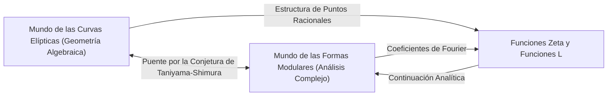
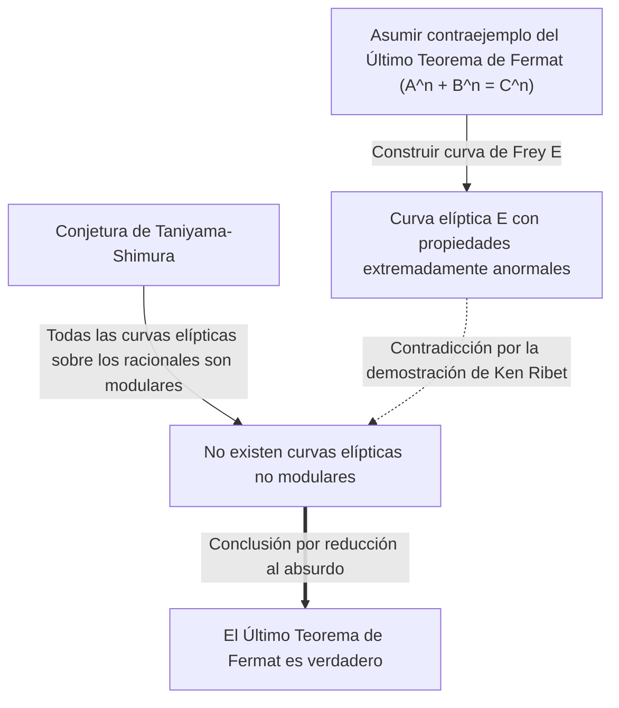

# [Yutaka Taniyama: La vida y los logros del genio matemático que desafió problemas sin resolver](https://kenji.blog/es/p/taniyama-yutaka/)

La demostración del **Último Teorema de [Fermat](https://kenji.blog/es/p/fermat/)** es uno de los desarrollos más dramáticos e importantes de las matemáticas modernas. Detrás de este logro monumental se esconde una asombrosa conjetura propuesta por dos matemáticos japoneses. Uno de ellos fue **[Yutaka Taniyama](https://kenji.blog/es/p/taniyama-yutaka/)** (1927 - 1958), quien falleció a una edad temprana. En este artículo, profundizaremos en la gran visión detrás de la "Conjetura de Taniyama-Shimura" que él propuso, y en su propia y turbulenta vida.

## 1. Primeros años y juventud de [Yutaka Taniyama](https://kenji.blog/es/p/taniyama-yutaka/)

[Yutaka Taniyama](https://kenji.blog/es/p/taniyama-yutaka/) nació en 1927 en el pueblo de Kisai, Prefectura de Saitama (ahora ciudad de Kazo). Mostró un talento extraordinario para las matemáticas desde temprana edad, pero sus años de estudiante coincidieron con el período caótico de la Segunda Guerra Mundial. Contrajo tuberculosis y a menudo perdió largos períodos de clases en la escuela secundaria. Durante su recuperación, leía libros de matemáticas en solitario y desarrolló un profundo pensamiento matemático a través del autoestudio. Se dice que este tiempo aislado perfeccionó su sentido matemático único e intuitivo.

Después de ingresar en el Departamento de Matemáticas de la Facultad de Ciencias de la Universidad de Tokio, desarrolló un fuerte interés en el álgebra abstracta y la teoría de números. A pesar de estar en un período de reconstrucción de posguerra, la comunidad matemática japonesa en ese momento aspiraba a investigaciones de clase mundial, influenciada por jóvenes investigadores inspirados por Teiji [Takagi](https://kenji.blog/es/p/takagi-teiji/) y Emil Artin. Taniyama dejó florecer su talento en medio de este entusiasmo.

## 2. El encuentro con [Goro Shimura](https://kenji.blog/es/p/shimura-goro/)

En la Universidad de Tokio, Taniyama conoció a **[Goro Shimura](https://kenji.blog/es/p/shimura-goro/)**, quien se convertiría en su amigo y aliado de toda la vida. Los dos tenían personalidades opuestas, pero compartían una profunda pasión por las matemáticas. Mientras Taniyama era intuitivo y constantemente desbordaba de ideas, Shimura las respaldaba con una lógica rigurosa, formando una relación complementaria notable.

[Goro Shimura](https://kenji.blog/es/p/shimura-goro/) dijo más tarde de Taniyama: "Cometió muchos errores, pero la mayoría fueron errores en la dirección correcta". La intuición de Taniyama a menudo incluía saltos lógicos, pero más allá de ellos, siempre se desplegaba un nuevo paisaje matemático. Los dos se inspiraron mutuamente y se sumergieron en el estudio de la "teoría de la multiplicación compleja" y la "geometría algebraica", que estaban a la vanguardia de las matemáticas en ese momento.

## 3. La Conjetura de Taniyama-Shimura: Integración de Dos Mundos

Su mayor logro fue conectar dos objetos matemáticos que parecían completamente ajenos: las "curvas elípticas" y las "formas modulares". Este gran descubrimiento más tarde se hizo conocido como la "Conjetura de Taniyama-Shimura" (o el Teorema de Modularidad).

### Curvas Elípticas (Elliptic Curves)

Una curva elíptica se expresa mediante la ecuación de una curva cúbica suave de la siguiente manera:

$$ E: y^2 = x^3 + a x + b $$

Aquí, $a$ y $b$ son constantes que satisfacen $4a^3 + 27b^2 \neq 0$. Esta condición significa que la curva no tiene puntos singulares (cúspides o autointersecciones). Las curvas elípticas son objetos con propiedades algebraicas profundas a pesar de ser geométricas, como el conjunto de puntos racionales (puntos con coordenadas racionales) que forman una estructura de grupo. Encontrar los puntos racionales en curvas elípticas era un problema antiguo y difícil en la teoría de números.

### Formas Modulares (Modular Forms)

Por otro lado, una forma modular es una función analítica compleja altamente simétrica definida en el semiplano superior (el conjunto de números complejos con partes imaginarias positivas). Una forma modular $f(z)$ satisface la siguiente propiedad para un grupo específico de transformaciones (el grupo modular):

$$ f\left( \frac{az+b}{cz+d} \right) = (cz+d)^k f(z) $$

Aquí, $a, b, c, d$ son elementos de matriz enteros que satisfacen $ad-bc=1$. Y $k$ es un entero llamado el peso (weight) de la forma modular. Las formas modulares a veces se describen como "funciones con simetría cuatridimensional" y son objetos extremadamente complejos y abstractos.

### Contenido y Significado de la Conjetura

En pocas palabras, la "Conjetura de Taniyama-Shimura" afirma que **"toda curva elíptica definida sobre los números racionales es modular"**. Más precisamente, sostiene que la función L $L(E, s)$ de cualquier curva elíptica $E$ sobre los números racionales coincide perfectamente con la función L $L(f, s)$ de alguna forma modular $f$ de peso 2.

$$ \text{For any elliptic curve } E / \mathbb{Q}, \text{ there exists a modular form } f \text{ such that } L(E, s) = L(f, s) $$

Esto significa que el ADN de una "curva elíptica", residente del mundo de la geometría algebraica, es idéntico al ADN de una "forma modular", residente del mundo del análisis complejo. Esta conjetura fue una visión asombrosa que construyó un puente fuerte entre dos campos matemáticos completamente diferentes.

## 4. El Simposio de Nikko de 1955

Esta gran conjetura se sugirió públicamente por primera vez en 1955 en un simposio internacional de teoría de números algebraicos celebrado en Nikko, Japón. Este simposio contó con la asistencia de los mejores matemáticos del mundo en ese momento, como [André Weil](https://kenji.blog/es/p/weil/) y Jean-Pierre Serre.

Taniyama imprimió y distribuyó a los participantes varios problemas sin resolver escritos en inglés. Los problemas 12 y 13 contenían las semillas de las ideas que más tarde se desarrollarían en la "Conjetura de Taniyama-Shimura". Taniyama propuso audazmente que la función zeta de una curva elíptica podría obtenerse a partir de los coeficientes de Fourier de cierto tipo de forma modular.

Inicialmente, casi ningún matemático creyó en esta conjetura. Parecía demasiado extraña y era difícil imaginar que dos campos distintos pudieran estar tan estrechamente conectados. Incluso se decía que Weil era escéptico al principio (aunque Weil reconoció más tarde su importancia y contribuyó a su formulación, lo que llevó a que a veces se la llamara la "Conjetura de Taniyama-Shimura-Weil").

## 5. Un Final Trágico

La carrera de Taniyama como matemático parecía ir sin problemas, e incluso había recibido una invitación del Instituto de Estudios Avanzados de Princeton. Sin embargo, el 17 de noviembre de 1958, se quitó la vida. Solo tenía 31 años. Este evento, que ocurrió justo un mes antes de su boda planificada, conmocionó no solo a la comunidad matemática japonesa sino a todos a su alrededor.

Su nota de suicidio no mencionaba ninguna preocupación específica. Escribió: "Hasta ayer no tenía la intención definida de suicidarme", lo que sugiere que ni siquiera él podía explicar completamente sus acciones de manera lógica. Pudo haber sido fatiga por exceso de trabajo o una vaga ansiedad sobre el futuro, pero las razones exactas siguen sin resolverse hasta el día de hoy. Unas semanas más tarde, su prometida, que lo amaba profundamente, también se quitó la vida, dejando una nota que decía: "Ya que él partió solo, debo ir a estar a su lado". Esta trágica conclusión dejó profundas cicatrices en los corazones de los involucrados.

## 6. Un Puente hacia el Último Teorema de [Fermat](https://kenji.blog/es/p/fermat/)

Después de la muerte de Taniyama, [Goro Shimura](https://kenji.blog/es/p/shimura-goro/) formuló rigurosamente esta conjetura y la difundió entre matemáticos de todo el mundo. Durante mucho tiempo, esta conjetura se consideró un objetivo tan difícil que parecía "indemostrable". Sin embargo, se produjo un giro dramático en la década de 1980. El matemático alemán Gerhard Frey propuso una idea asombrosa: **"Si el Último Teorema de [Fermat](https://kenji.blog/es/p/fermat/) tiene un contraejemplo, la curva elíptica construida a partir de ese contraejemplo no puede ser modular."**

La curva elíptica construida por Frey (la curva de Frey) tomó la siguiente forma. Supongamos que existe una solución entera a la ecuación de [Fermat](https://kenji.blog/es/p/fermat/) $A^n + B^n = C^n$. Usando esa solución, creamos la siguiente curva elíptica:

$$ E: y^2 = x (x - A^n) (x + B^n) $$

Esta curva tiene propiedades extremadamente "anormales" y se pensaba que era absolutamente imposible de construir a partir de formas modulares (lo que significa que no es modular). La intuición de Frey fue probada más tarde rigurosamente por el matemático estadounidense Ken Ribet, a través de la "Conjetura Épsilon" formulada por el matemático francés Jean-Pierre Serre.

Esto completó un marco lógico:
1. Si el Último Teorema de [Fermat](https://kenji.blog/es/p/fermat/) es falso, existe una curva elíptica no modular (curva de Frey).
2. Sin embargo, según la Conjetura de Taniyama-Shimura, "todas las curvas elípticas son modulares".
3. Por lo tanto, si la Conjetura de Taniyama-Shimura es verdadera, la curva de Frey no puede existir, y el Último Teorema de [Fermat](https://kenji.blog/es/p/fermat/) también debe ser verdadero.

En otras palabras, la cadena del destino estaba unida: **"Si se demuestra la Conjetura de Taniyama-Shimura, el Último Teorema de [Fermat](https://kenji.blog/es/p/fermat/), sin resolver durante más de 300 años, se demostrará automáticamente también."**

## 7. Prueba de la Conjetura y el Programa de Langlands

La persona más inspirada por este hecho fue el matemático británico **[Andrew Wiles](https://kenji.blog/es/p/wiles/)**. Había estado fascinado por el Último Teorema de Fermat desde la infancia y resolvió dedicar su vida a demostrarlo. Después de siete años de investigación secreta, anunció en 1993 que había "demostrado la Conjetura de Taniyama-Shimura para curvas elípticas semiestables". Aunque se encontró un error en parte de la demostración, con la ayuda de su antiguo alumno Richard Taylor, llenó con éxito el vacío en 1995 y publicó la demostración completa. Como resultado, se demostró la parte crucial de la conjetura dejada por Taniyama y, simultáneamente, el Último Teorema de [Fermat](https://kenji.blog/es/p/fermat/) se convirtió en una verdad eterna.

Posteriormente, mediante los esfuerzos adicionales de Christophe Breuil, Brian Conrad, Fred Diamond y Richard Taylor, la Conjetura de Taniyama-Shimura fue completamente demostrada para todas las curvas elípticas en 2001. Hoy en día, este teorema se conoce como el "Teorema de Modularidad (Modularity Theorem)".

La Conjetura de Taniyama-Shimura es el ejemplo más hermoso y exitoso del gran marco en las matemáticas modernas conocido como el "Programa de Langlands". El Programa de Langlands es un intento ambicioso de unificar la teoría de números, la geometría algebraica y la teoría de representación, a menudo llamado la "Gran Teoría Unificada de las Matemáticas". La intuición de Taniyama fue precisamente la llave que abrió esa puerta.

## 8. Conclusión

La modesta conjetura que [Yutaka Taniyama](https://kenji.blog/es/p/taniyama-yutaka/) presentó en el simposio de Nikko se convirtió en la base para establecer el Último Teorema de [Fermat](https://kenji.blog/es/p/fermat/), un pináculo del intelecto humano, medio siglo después. Su visión de las "conexiones ocultas detrás de diferentes objetos matemáticos" sigue inspirando a los matemáticos de hoy.

El genio matemático [Yutaka Taniyama](https://kenji.blog/es/p/taniyama-yutaka/), que murió joven. La hermosa conjetura que dejó atrás continuará siendo una luz guía que ilumina el vasto universo de las matemáticas. Uno no puede evitar preguntarse qué otras verdades profundas nos habría mostrado si hubiera vivido.
