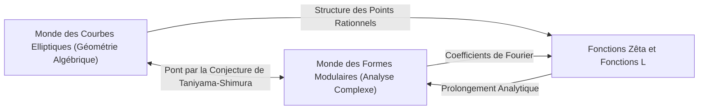
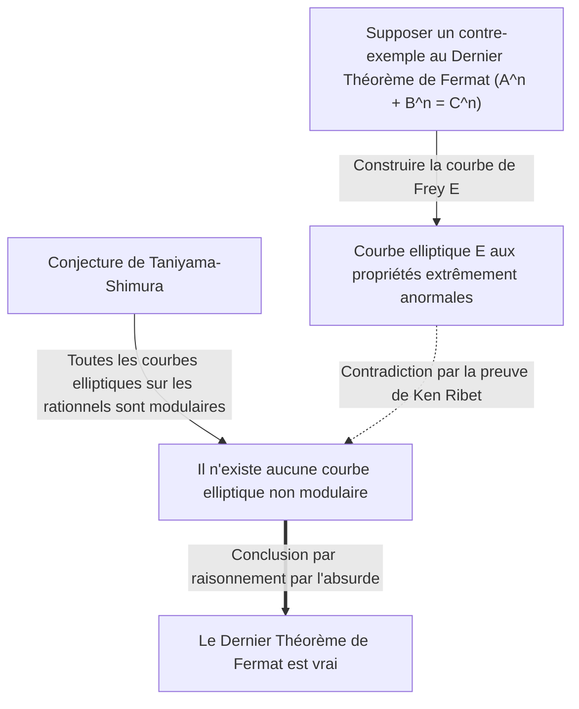

# [Yutaka Taniyama : La vie et les réalisations du génie mathématique qui a défié les problèmes non résolus](https://kenji.blog/p/taniyama-yutaka/)

La démonstration du **Dernier Théorème de [Fermat](https://kenji.blog/fr/p/fermat/)** est l'un des développements les plus spectaculaires et importants des mathématiques modernes. Derrière cette réalisation monumentale se cache une étonnante conjecture proposée par deux mathématiciens japonais. L'un d'eux était **[Yutaka Taniyama](https://kenji.blog/fr/p/taniyama-yutaka/)** (1927 - 1958), décédé prématurément. Dans cet article, nous plongeons profondément dans la vision grandiose qui sous-tend la "Conjecture de Taniyama-Shimura" qu'il a proposée, et dans sa propre vie tumultueuse.

## 1. Jeunesse de [Yutaka Taniyama](https://kenji.blog/fr/p/taniyama-yutaka/)

[Yutaka Taniyama](https://kenji.blog/fr/p/taniyama-yutaka/) est né en 1927 dans la ville de Kisai, préfecture de Saitama (aujourd'hui ville de Kazo). Il a montré un talent extraordinaire pour les mathématiques dès son plus jeune âge, mais ses années d'études ont coïncidé avec la période chaotique de la Seconde Guerre mondiale. Il a contracté la tuberculose et a souvent manqué de longues périodes de cours au lycée. Pendant sa convalescence, il lisait des livres de mathématiques seul et a développé une pensée mathématique profonde grâce à l'auto-apprentissage. On dit que cette période d'isolement a aiguisé son sens mathématique unique et intuitif.

Après être entré au département de mathématiques de la faculté des sciences de l'Université de Tokyo, il a développé un fort intérêt pour l'algèbre abstraite et la théorie des nombres. Bien qu'elle soit dans une période de reconstruction d'après-guerre, la communauté mathématique japonaise de l'époque visait une recherche de classe mondiale, influencée par de jeunes chercheurs inspirés par Teiji [Takagi](https://kenji.blog/fr/p/takagi-teiji/) et Emil Artin. Taniyama a laissé son talent s'épanouir au milieu de cet enthousiasme.

## 2. La rencontre avec [Goro Shimura](https://kenji.blog/fr/p/shimura-goro/)

À l'Université de Tokyo, Taniyama a rencontré **[Goro Shimura](https://kenji.blog/fr/p/shimura-goro/)**, qui allait devenir son ami et allié de toute une vie. Les deux hommes avaient des personnalités contrastées, mais partageaient une profonde passion pour les mathématiques. Alors que Taniyama était intuitif et débordait constamment d'idées, Shimura les étayait avec une logique rigoureuse, formant ainsi une relation complémentaire remarquable.

[Goro Shimura](https://kenji.blog/fr/p/shimura-goro/) dira plus tard de Taniyama : "Il a fait beaucoup d'erreurs, mais la plupart étaient des erreurs dans la bonne direction." L'intuition de Taniyama incluait souvent des sauts logiques, mais au-delà d'eux, un nouveau paysage mathématique se déployait toujours. Les deux hommes se sont inspirés mutuellement et se sont plongés dans l'étude de la théorie de la multiplication complexe et de la géométrie algébrique, qui étaient à la pointe des mathématiques à l'époque.

## 3. La Conjecture de Taniyama-Shimura : L'intégration de deux mondes

Leur plus grande réalisation a été de relier deux objets mathématiques qui semblaient totalement sans rapport : les "courbes elliptiques" et les "formes modulaires". Cette grande découverte a plus tard été connue sous le nom de "Conjecture de Taniyama-Shimura" (ou Théorème de Modularité).

### Courbes Elliptiques (Elliptic Curves)

Une courbe elliptique s'exprime par l'équation d'une courbe cubique lisse comme suit :

$$ E: y^2 = x^3 + a x + b $$

Ici, $a$ et $b$ sont des constantes qui satisfont $4a^3 + 27b^2 \neq 0$. Cette condition signifie que la courbe n'a pas de points singuliers (points de rebroussement ou auto-intersections). Les courbes elliptiques sont des objets aux propriétés algébriques profondes bien qu'elles soient géométriques, comme l'ensemble des points rationnels (points à coordonnées rationnelles) qui forment une structure de groupe. Trouver les points rationnels sur les courbes elliptiques était un problème ancien et difficile en théorie des nombres.

### Formes Modulaires (Modular Forms)

D'autre part, une forme modulaire est une fonction analytique complexe hautement symétrique définie sur le demi-plan supérieur (l'ensemble des nombres complexes à partie imaginaire positive). Une forme modulaire $f(z)$ satisfait la propriété suivante pour un groupe spécifique de transformations (le groupe modulaire) :

$$ f\left( \frac{az+b}{cz+d} \right) = (cz+d)^k f(z) $$

Ici, $a, b, c, d$ sont des entrées matricielles entières satisfaisant $ad-bc=1$. Et $k$ est un entier appelé le poids (weight) de la forme modulaire. Les formes modulaires sont parfois décrites comme des "fonctions à symétrie quadridimensionnelle" et sont des objets extrêmement complexes et abstraits.

### Contenu et signification de la conjecture

En termes simples, la "Conjecture de Taniyama-Shimura" stipule que **"toute courbe elliptique définie sur les nombres rationnels est modulaire"**. Plus précisément, elle affirme que la fonction L $L(E, s)$ de toute courbe elliptique $E$ sur les rationnels correspond parfaitement à la fonction L $L(f, s)$ d'une certaine forme modulaire $f$ de poids 2.

$$ \text{For any elliptic curve } E / \mathbb{Q}, \text{ there exists a modular form } f \text{ such that } L(E, s) = L(f, s) $$

Cela signifie que l'ADN d'une "courbe elliptique", résidente du monde de la géométrie algébrique, est identique à l'ADN d'une "forme modulaire", résidente du monde de l'analyse complexe. Cette conjecture était une vision étonnante qui a jeté un pont solide entre deux domaines des mathématiques entièrement différents.

## 4. Le symposium de Nikko de 1955

Cette grande conjecture a été suggérée publiquement pour la première fois en 1955 lors d'un symposium international sur la théorie des nombres algébriques tenu à Nikko, au Japon. Ce symposium a réuni les meilleurs mathématiciens du monde de l'époque, tels qu'[André Weil](https://kenji.blog/fr/p/weil/) et Jean-Pierre Serre.

Taniyama a imprimé et distribué aux participants plusieurs problèmes non résolus rédigés en anglais. Les problèmes 12 et 13 contenaient les germes des idées qui allaient plus tard se développer en la "Conjecture de Taniyama-Shimura". Taniyama a audacieusement proposé que la fonction zêta d'une courbe elliptique puisse être obtenue à partir des coefficients de Fourier d'un certain type de forme modulaire.

Initialement, presque aucun mathématicien n'a cru à cette conjecture. Cela semblait trop bizarre, et il était difficile d'imaginer que deux domaines distincts puissent être si étroitement liés. Même Weil, dit-on, était sceptique au début (bien que Weil ait plus tard reconnu son importance et contribué à sa formulation, ce qui l'a fait parfois appeler la "Conjecture de Taniyama-Shimura-Weil").

## 5. Une fin tragique

La carrière de Taniyama en tant que mathématicien semblait se dérouler sans heurts, et il avait même reçu une invitation de l'Institute for Advanced Study de Princeton. Cependant, le 17 novembre 1958, il s'est suicidé. Il n'avait que 31 ans. Cet événement, survenu juste un mois avant son mariage prévu, a provoqué une onde de choc non seulement dans la communauté mathématique japonaise, mais chez tous ceux qui le connaissaient.

Sa lettre de suicide n'indiquait aucun souci spécifique. Il a écrit : "Jusqu'à hier, je n'avais pas l'intention précise de me tuer", suggérant que même lui ne pouvait pas expliquer de manière totalement logique ses actes. Il s'agissait peut-être d'épuisement dû au surmenage ou d'une vague anxiété face à l'avenir, mais les raisons exactes restent inexpliquées à ce jour. Quelques semaines plus tard, sa fiancée, qui l'aimait profondément, s'est également suicidée, laissant un mot disant en substance : "Puisqu'il est parti seul, je dois aller à ses côtés." Cette conclusion tragique a laissé de profondes cicatrices dans les cœurs des personnes impliquées.

## 6. Un pont vers le Dernier Théorème de [Fermat](https://kenji.blog/fr/p/fermat/)

Après la mort de Taniyama, [Goro Shimura](https://kenji.blog/fr/p/shimura-goro/) a rigoureusement formulé cette conjecture et l'a diffusée auprès des mathématiciens du monde entier. Pendant longtemps, cette conjecture a été considérée comme un objectif si difficile qu'elle semblait "indémontrable". Cependant, un tournant dramatique s'est produit dans les années 1980. Le mathématicien allemand Gerhard Frey a proposé une idée étonnante : **"Si le Dernier Théorème de [Fermat](https://kenji.blog/fr/p/fermat/) admet un contre-exemple, la courbe elliptique construite à partir de ce contre-exemple ne peut pas être modulaire."**

La courbe elliptique construite par Frey (la courbe de Frey) a pris la forme suivante. Supposons qu'il existe une solution entière à l'équation de [Fermat](https://kenji.blog/fr/p/fermat/) $A^n + B^n = C^n$. En utilisant cette solution, nous créons la courbe elliptique suivante :

$$ E: y^2 = x (x - A^n) (x + B^n) $$

Cette courbe possède des propriétés extrêmement "anormales" et on pensait qu'il était absolument impossible de la construire à partir de formes modulaires (ce qui signifie qu'elle n'est pas modulaire). L'intuition de Frey a ensuite été rigoureusement prouvée par le mathématicien américain Ken Ribet, via la "Conjecture Epsilon" formulée par le mathématicien français Jean-Pierre Serre.

Cela a achevé un cadre logique :
1. Si le Dernier Théorème de [Fermat](https://kenji.blog/fr/p/fermat/) est faux, il existe une courbe elliptique non modulaire (courbe de Frey).
2. Cependant, selon la Conjecture de Taniyama-Shimura, "toutes les courbes elliptiques sont modulaires".
3. Par conséquent, si la Conjecture de Taniyama-Shimura est vraie, la courbe de Frey ne peut pas exister, et le Dernier Théorème de [Fermat](https://kenji.blog/fr/p/fermat/) doit également être vrai.

En d'autres termes, la chaîne du destin était liée : **"Si la Conjecture de Taniyama-Shimura est prouvée, le Dernier Théorème de [Fermat](https://kenji.blog/fr/p/fermat/), non résolu pendant plus de 300 ans, sera automatiquement prouvé également."**

## 7. Preuve de la conjecture et Programme de Langlands

La personne la plus inspirée par ce fait a été le mathématicien britannique **[Andrew Wiles](https://kenji.blog/fr/p/wiles/)**. Il était fasciné par le Dernier Théorème de Fermat depuis son enfance et a résolu de consacrer sa vie à le prouver. Après sept ans de recherche secrète, il a annoncé en 1993 qu'il avait "prouvé la Conjecture de Taniyama-Shimura pour les courbes elliptiques semi-stables". Bien qu'une faille ait été trouvée dans une partie de la démonstration, avec l'aide de son ancien élève Richard Taylor, il a réussi à combler cette faille en 1995 et a publié la preuve complète. Par conséquent, la partie cruciale de la conjecture laissée par Taniyama a été prouvée et, simultanément, le Dernier Théorème de [Fermat](https://kenji.blog/fr/p/fermat/) est devenu une vérité éternelle.

Par la suite, grâce aux efforts supplémentaires de Christophe Breuil, Brian Conrad, Fred Diamond et Richard Taylor, la Conjecture de Taniyama-Shimura a été complètement prouvée pour toutes les courbes elliptiques en 2001. Aujourd'hui, ce théorème est connu sous le nom de "Théorème de Modularité (Modularity Theorem)".

La Conjecture de Taniyama-Shimura est l'exemple le plus beau et le plus réussi du cadre grandiose des mathématiques modernes connu sous le nom de "Programme de Langlands". Le Programme de Langlands est une tentative ambitieuse d'unifier la théorie des nombres, la géométrie algébrique et la théorie des représentations, souvent appelée la "Grande théorie unifiée des mathématiques". L'intuition de Taniyama était précisément la clé qui a ouvert cette porte.

## 8. Conclusion

La modeste conjecture que [Yutaka Taniyama](https://kenji.blog/fr/p/taniyama-yutaka/) a présentée au symposium de Nikko est devenue le fondement de l'établissement du Dernier Théorème de [Fermat](https://kenji.blog/fr/p/fermat/), un sommet de l'intellect humain, un demi-siècle plus tard. Sa vision des "liens cachés derrière différents objets mathématiques" continue d'inspirer les mathématiciens aujourd'hui.

Le génie mathématique [Yutaka Taniyama](https://kenji.blog/fr/p/taniyama-yutaka/), mort jeune. La belle conjecture qu'il a laissée continuera d'être un phare illuminant le vaste univers des mathématiques. On ne peut s'empêcher de se demander quelles autres vérités profondes il nous aurait montrées s'il avait vécu.
