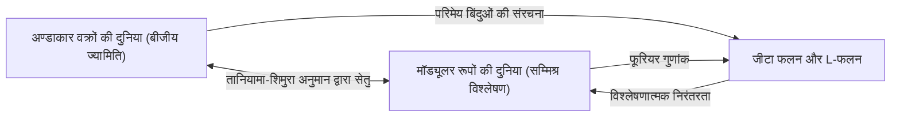
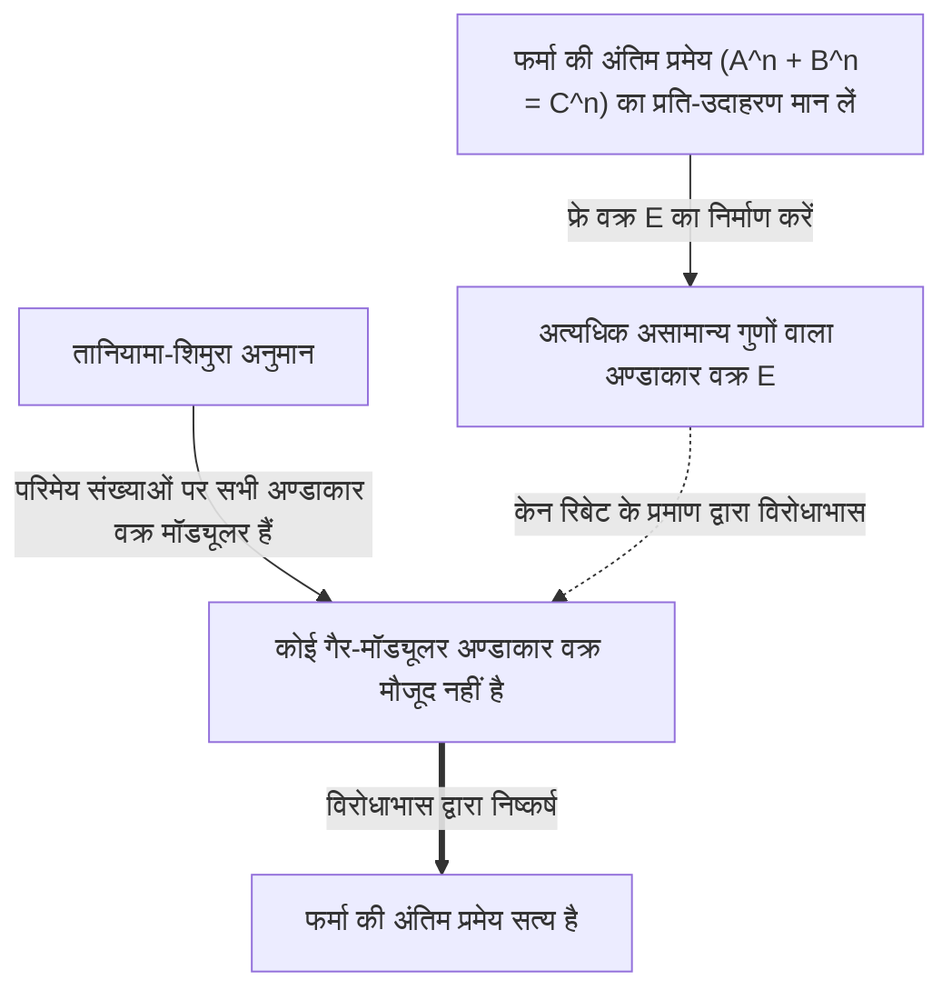

# [[युताका तानियामा](https://kenji.blog/hi/p/taniyama-yutaka/): अनसुलझी समस्याओं को चुनौती देने वाले प्रतिभाशाली गणितज्ञ का जीवन और उपलब्धियां](https://kenji.blog/p/taniyama-yutaka/)

**फर्मा की अंतिम प्रमेय** का प्रमाण आधुनिक गणित में सबसे नाटकीय और महत्वपूर्ण विकासों में से एक है। इस स्मारकीय उपलब्धि के पीछे दो जापानी गणितज्ञों द्वारा प्रस्तावित एक आश्चर्यजनक अनुमान छिपा है। उनमें से एक **[युताका तानियामा](https://kenji.blog/hi/p/taniyama-yutaka/)** (1927 - 1958) थे, जिनका कम उम्र में ही निधन हो गया था। इस लेख में, हम उनके द्वारा प्रस्तावित "तानियामा-शिमुरा अनुमान" के पीछे के भव्य दृष्टिकोण और उनके स्वयं के अशांत जीवन की गहराई में उतरेंगे।

## 1. [युताका तानियामा](https://kenji.blog/hi/p/taniyama-yutaka/) का प्रारंभिक जीवन और युवावस्था

[युताका तानियामा](https://kenji.blog/hi/p/taniyama-yutaka/) का जन्म 1927 में सैतामा प्रान्त (अब काज़ो शहर) के किसाई टाउन में हुआ था। उन्होंने कम उम्र से ही गणित के प्रति असाधारण प्रतिभा दिखाई, लेकिन उनके छात्र जीवन के वर्ष द्वितीय विश्व युद्ध की अराजक अवधि के साथ मेल खाते थे। उन्हें तपेदिक हो गया और वे अक्सर लंबे समय तक हाई स्कूल की कक्षाओं में नहीं जा पाए। अपने स्वास्थ्य लाभ के दौरान, उन्होंने अकेले ही गणित की किताबें पढ़ीं और स्व-अध्ययन के माध्यम से गहरी गणितीय सोच विकसित की। कहा जाता है कि अलगाव के इस समय ने उनके अद्वितीय और सहज गणितीय ज्ञान को निखारा।

टोक्यो विश्वविद्यालय के विज्ञान संकाय के गणित विभाग में प्रवेश करने के बाद, उन्होंने अमूर्त बीजगणित और संख्या सिद्धांत में गहरी रुचि विकसित की। युद्ध के बाद के पुनर्निर्माण की अवधि में होने के बावजूद, उस समय का जापानी गणितीय समुदाय विश्व स्तरीय अनुसंधान का लक्ष्य बना रहा था, जो तेइजी ताकागी और एमिल आर्टिन से प्रेरित युवा शोधकर्ताओं से प्रभावित था। तानियामा ने इस उत्साह के बीच अपनी प्रतिभा को खिलने दिया।

## 2. [गोरो शिमुरा](https://kenji.blog/hi/p/shimura-goro/) से मुलाकात

टोक्यो विश्वविद्यालय में, तानियामा की मुलाकात **[गोरो शिमुरा](https://kenji.blog/hi/p/shimura-goro/)** से हुई, जो उनके आजीवन मित्र और सहयोगी बन गए। दोनों के व्यक्तित्व विपरीत थे, लेकिन वे गणित के प्रति गहरा जुनून साझा करते थे। जहाँ तानियामा सहज ज्ञान युक्त थे और उनके दिमाग में लगातार विचार आते रहते थे, वहीं शिमुरा ने उन्हें कठोर तर्क के साथ समर्थन दिया, जिससे एक उल्लेखनीय पूरक संबंध बना।

[गोरो शिमुरा](https://kenji.blog/hi/p/shimura-goro/) ने बाद में तानियामा के बारे में कहा, "उन्होंने बहुत सी गलतियाँ कीं, लेकिन ज्यादातर वे सही दिशा में गलतियाँ थीं।" तानियामा की अंतर्ज्ञान में अक्सर तार्किक छलांग शामिल होती थी, लेकिन उनके परे, एक नया गणितीय परिदृश्य हमेशा सामने आता था। दोनों ने एक-दूसरे को प्रेरित किया और सम्मिश्र गुणन के सिद्धांत और बीजीय ज्यामिति के अध्ययन में डूब गए, जो उस समय गणित में सबसे आगे थे।

## 3. तानियामा-शिमुरा अनुमान: दो दुनियाओं का एकीकरण

उनकी सबसे बड़ी उपलब्धि दो गणितीय वस्तुओं को जोड़ना था जो पूरी तरह से असंबंधित लग रहे थे: "अण्डाकार वक्र" और "मॉड्यूलर रूप।" इस महान खोज को बाद में "तानियामा-शिमुरा अनुमान" (या मॉड्यूलरिटी प्रमेय) के रूप में जाना जाने लगा।

### अण्डाकार वक्र (Elliptic Curves)

एक अण्डाकार वक्र को एक चिकनी त्रिघाती वक्र के समीकरण द्वारा इस प्रकार व्यक्त किया जाता है:

$$ E: y^2 = x^3 + a x + b $$

यहाँ, $a$ और $b$ स्थिरांक हैं जो $4a^3 + 27b^2 \neq 0$ को संतुष्ट करते हैं। इस शर्त का अर्थ है कि वक्र में कोई विलक्षण बिंदु (कस्प या आत्म-प्रतिच्छेदन) नहीं है। ज्यामितीय होने के बावजूद अण्डाकार वक्र गहन बीजीय गुणों वाली वस्तुएं हैं, जैसे कि परिमेय बिंदुओं (परिमेय निर्देशांक वाले बिंदु) का समूह एक समूह संरचना बनाता है। अण्डाकार वक्रों पर परिमेय बिंदुओं को खोजना संख्या सिद्धांत में एक प्राचीन और कठिन समस्या थी।

### मॉड्यूलर रूप (Modular Forms)

दूसरी ओर, एक मॉड्यूलर रूप एक अत्यधिक सममित सम्मिश्र विश्लेषणात्मक फलन है जिसे ऊपरी अर्ध-तल (धनात्मक काल्पनिक भागों वाली सम्मिश्र संख्याओं का समुच्चय) पर परिभाषित किया गया है। एक मॉड्यूलर रूप $f(z)$ परिवर्तनों के एक विशिष्ट समूह (मॉड्यूलर समूह) के लिए निम्नलिखित गुण को संतुष्ट करता है:

$$ f\left( \frac{az+b}{cz+d} \right) = (cz+d)^k f(z) $$

यहाँ, $a, b, c, d$ पूर्णांक आव्यूह प्रविष्टियां हैं जो $ad-bc=1$ को संतुष्ट करती हैं। और $k$ एक पूर्णांक है जिसे मॉड्यूलर रूप का भार (weight) कहा जाता है। मॉड्यूलर रूपों को कभी-कभी "चार-आयामी समरूपता वाले फलनों" के रूप में वर्णित किया जाता है और ये अत्यंत जटिल और अमूर्त वस्तुएं हैं।

### अनुमान की सामग्री और अर्थ

सरल शब्दों में, "तानियामा-शिमुरा अनुमान" कहता है कि **"परिमेय संख्याओं पर परिभाषित प्रत्येक अण्डाकार वक्र मॉड्यूलर है।"** अधिक सटीक रूप से, यह दावा करता है कि परिमेय संख्याओं पर किसी भी अण्डाकार वक्र $E$ का L-फलन $L(E, s)$, भार 2 के किसी मॉड्यूलर रूप $f$ के L-फलन $L(f, s)$ से पूरी तरह मेल खाता है।

$$ \text{For any elliptic curve } E / \mathbb{Q}, \text{ there exists a modular form } f \text{ such that } L(E, s) = L(f, s) $$

इसका मतलब यह है कि बीजीय ज्यामिति की दुनिया के निवासी "अण्डाकार वक्र" का डीएनए, सम्मिश्र विश्लेषण की दुनिया के निवासी "मॉड्यूलर रूप" के डीएनए के समान है। यह अनुमान एक आश्चर्यजनक दृष्टि थी जिसने गणित के दो पूरी तरह से अलग क्षेत्रों के बीच एक मजबूत पुल बनाया।

## 4. 1955 का निक्को संगोष्ठी

यह भव्य अनुमान पहली बार 1955 में निक्को, जापान में आयोजित बीजीय संख्या सिद्धांत पर एक अंतर्राष्ट्रीय संगोष्ठी में सार्वजनिक रूप से सुझाया गया था। इस संगोष्ठी में [आंद्रे वेइल](https://kenji.blog/hi/p/weil/) और जीन-पियरे सेरे जैसे उस समय के दुनिया के शीर्ष गणितज्ञों ने भाग लिया था।

तानियामा ने अंग्रेजी में लिखी गई कई अनसुलझी समस्याओं को प्रिंट करके प्रतिभागियों को वितरित किया। समस्या 12 और 13 में उन विचारों के बीज थे जो बाद में "तानियामा-शिमुरा अनुमान" के रूप में विकसित हुए। तानियामा ने साहसपूर्वक प्रस्ताव दिया कि किसी अण्डाकार वक्र का जीटा फलन किसी विशेष प्रकार के मॉड्यूलर रूप के फूरियर गुणांक से प्राप्त किया जा सकता है।

शुरुआत में, लगभग किसी भी गणितज्ञ ने इस अनुमान पर विश्वास नहीं किया। यह बहुत अजीब लग रहा था, और यह कल्पना करना कठिन था कि दो अलग-अलग क्षेत्र इतने निकटता से जुड़े हो सकते हैं। यहां तक कि वेइल के बारे में भी कहा जाता है कि वे शुरू में संशय में थे (हालांकि वेइल ने बाद में इसके महत्व को पहचाना और इसके निर्माण में योगदान दिया, जिससे इसे कभी-कभी "तानियामा-शिमुरा-वेइल अनुमान" भी कहा जाता है)।

## 5. एक दुखद अंत

एक गणितज्ञ के रूप में तानियामा का करियर सुचारू रूप से चल रहा था, और उन्हें प्रिंसटन में इंस्टीट्यूट फॉर एडवांस्ड स्टडी से भी निमंत्रण मिला था। हालाँकि, 17 नवंबर, 1958 को उन्होंने अपनी जान ले ली। वे सिर्फ 31 वर्ष के थे। यह घटना, जो उनकी निर्धारित शादी से ठीक एक महीने पहले हुई थी, ने न केवल जापानी गणितीय समुदाय में बल्कि उनके आस-पास के सभी लोगों में सदमे की लहरें भेज दीं।

उनके सुसाइड नोट में किसी विशेष चिंता का उल्लेख नहीं था। उन्होंने लिखा, "कल तक मेरा खुद को मारने का कोई निश्चित इरादा नहीं था," जिससे पता चलता है कि वे खुद भी अपने कार्यों को पूरी तरह से तार्किक रूप से नहीं समझा सकते थे। यह अधिक काम करने के कारण थकान या भविष्य के बारे में अस्पष्ट चिंता हो सकती है, लेकिन सटीक कारण आज तक अनसुलझे हैं। कुछ हफ़्ते बाद, उनकी मंगेतर, जो उन्हें बहुत प्यार करती थी, ने भी अपनी जान ले ली, यह नोट छोड़कर, "चूंकि वह अकेले चले गए, इसलिए मुझे भी उनके पास जाना चाहिए।" इस दुखद निष्कर्ष ने शामिल लोगों के दिलों पर गहरे निशान छोड़े।

## 6. फर्मा की अंतिम प्रमेय के लिए एक सेतु

तानियामा की मृत्यु के बाद, [गोरो शिमुरा](https://kenji.blog/hi/p/shimura-goro/) ने इस अनुमान को सख्ती से तैयार किया और इसे दुनिया भर के गणितज्ञों तक फैलाया। लंबे समय तक, इस अनुमान को इतना कठिन लक्ष्य माना जाता था कि यह "असाध्य" लगता था। हालाँकि, 1980 के दशक में एक नाटकीय मोड़ आया। जर्मन गणितज्ञ गेरहार्ड फ्रे ने एक आश्चर्यजनक विचार प्रस्तावित किया: **"यदि फर्मा की अंतिम प्रमेय का कोई प्रति-उदाहरण है, तो उस प्रति-उदाहरण से निर्मित अण्डाकार वक्र मॉड्यूलर नहीं हो सकता है।"**

फ्रे द्वारा निर्मित अण्डाकार वक्र (फ्रे वक्र) ने निम्नलिखित रूप ले लिया। मान लें कि फर्मा समीकरण $A^n + B^n = C^n$ का एक पूर्णांक हल है। उस हल का उपयोग करते हुए, हम निम्नलिखित अण्डाकार वक्र बनाते हैं:

$$ E: y^2 = x (x - A^n) (x + B^n) $$

इस वक्र में अत्यंत "असामान्य" गुण हैं और इसे मॉड्यूलर रूपों से निर्मित होना बिल्कुल असंभव माना जाता था (जिसका अर्थ है कि यह मॉड्यूलर नहीं है)। फ्रे के अंतर्ज्ञान को बाद में फ्रांसीसी गणितज्ञ जीन-पियरे सेरे द्वारा तैयार किए गए "एप्सिलॉन अनुमान" के माध्यम से अमेरिकी गणितज्ञ केन रिबेट द्वारा सख्ती से सिद्ध किया गया था।

इसने एक तार्किक ढांचा पूरा किया:
1. यदि फर्मा की अंतिम प्रमेय असत्य है, तो एक गैर-मॉड्यूलर अण्डाकार वक्र (फ्रे वक्र) मौजूद है।
2. हालाँकि, तानियामा-शिमुरा अनुमान के अनुसार, "सभी अण्डाकार वक्र मॉड्यूलर हैं।"
3. इसलिए, यदि तानियामा-शिमुरा अनुमान सत्य है, तो फ्रे वक्र मौजूद नहीं हो सकता है, और फर्मा की अंतिम प्रमेय को भी सत्य होना चाहिए।

दूसरे शब्दों में, नियति की जंजीर जुड़ गई थी: **"यदि तानियामा-शिमुरा अनुमान सिद्ध हो जाता है, तो फर्मा की अंतिम प्रमेय, जो 300 से अधिक वर्षों से अनसुलझी थी, वह भी स्वतः सिद्ध हो जाएगी।"**

## 7. अनुमान का प्रमाण और लैंग्लैंड्स कार्यक्रम

इस तथ्य से सबसे अधिक प्रेरित होने वाले व्यक्ति ब्रिटिश गणितज्ञ **एंड्रयू वाइल्स** थे। वे बचपन से ही फर्मा की अंतिम प्रमेय से मोहित थे और उन्होंने इसे सिद्ध करने के लिए अपना जीवन समर्पित करने का संकल्प लिया था। सात वर्षों के गुप्त शोध के बाद, उन्होंने 1993 में घोषणा की कि उन्होंने "अर्ध-स्थिर अण्डाकार वक्रों के लिए तानियामा-शिमुरा अनुमान सिद्ध कर दिया है।" हालांकि प्रमाण के एक हिस्से में एक अंतर पाया गया था, अपने पूर्व छात्र रिचर्ड टेलर की मदद से, उन्होंने 1995 में उस अंतर को सफलतापूर्वक भर दिया और पूर्ण प्रमाण प्रकाशित किया। परिणामस्वरूप, तानियामा द्वारा छोड़े गए अनुमान का महत्वपूर्ण हिस्सा सिद्ध हो गया, और साथ ही, फर्मा की अंतिम प्रमेय एक शाश्वत सत्य बन गई।

इसके बाद, क्रिस्टोफ़ ब्रुइल, ब्रायन कॉनराड, फ्रेड डायमंड और रिचर्ड टेलर के आगे के प्रयासों के माध्यम से, तानियामा-शिमुरा अनुमान 2001 में सभी अण्डाकार वक्रों के लिए पूरी तरह से सिद्ध हो गया था। आज, इस प्रमेय को "मॉड्यूलरिटी प्रमेय (Modularity Theorem)" के रूप में जाना जाता है।

तानियामा-शिमुरा अनुमान आधुनिक गणित में भव्य ढांचे का सबसे सुंदर और सफल उदाहरण है जिसे "लैंग्लैंड्स कार्यक्रम" के रूप में जाना जाता है। लैंग्लैंड्स कार्यक्रम संख्या सिद्धांत, बीजीय ज्यामिति और प्रतिनिधित्व सिद्धांत को एकजुट करने का एक महत्वाकांक्षी प्रयास है, जिसे अक्सर "गणित का भव्य एकीकृत सिद्धांत" कहा जाता है। तानियामा का अंतर्ज्ञान वह कुंजी था जिसने उस दरवाजे को खोल दिया।

## 8. निष्कर्ष

निक्को संगोष्ठी में [युताका तानियामा](https://kenji.blog/hi/p/taniyama-yutaka/) द्वारा प्रस्तुत किया गया मामूली अनुमान आधी सदी बाद मानव बुद्धि के शिखर, फर्मा की अंतिम प्रमेय को स्थापित करने की नींव बन गया। "विभिन्न गणितीय वस्तुओं के पीछे छिपे संबंधों" में उनकी अंतर्दृष्टि आज भी गणितज्ञों को प्रेरित करती है।

प्रतिभाशाली गणितज्ञ [युताका तानियामा](https://kenji.blog/hi/p/taniyama-yutaka/), जिनका कम उम्र में निधन हो गया। उनके द्वारा छोड़ा गया सुंदर अनुमान गणित के विशाल ब्रह्मांड को रोशन करने वाला एक मार्गदर्शक प्रकाश बना रहेगा। कोई भी यह सोचे बिना नहीं रह सकता कि यदि वे जीवित होते तो हमें और कितनी गहरी सच्चाइयाँ दिखाते।
