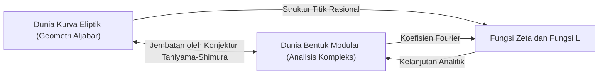
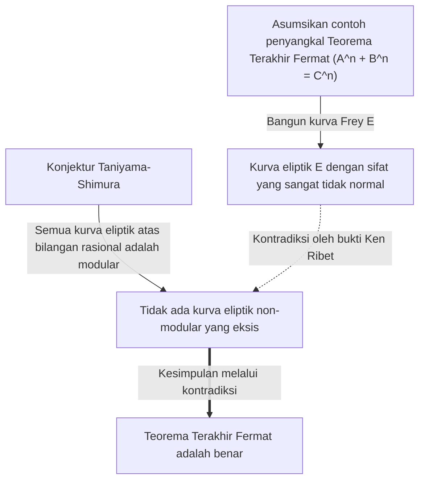

# [Yutaka Taniyama: Kehidupan dan Pencapaian Matematikawan Jenius yang Menantang Masalah Tak Terpecahkan](https://kenji.blog/id/p/taniyama-yutaka/)

Bukti dari **[Teorema Terakhir Fermat](https://kenji.blog/id/p/fermats-last-theorem/)** adalah salah satu perkembangan paling dramatis dan penting dalam matematika modern. Di balik pencapaian monumental ini terdapat konjektur menakjubkan yang diajukan oleh dua matematikawan Jepang. Salah satunya adalah **[Yutaka Taniyama](https://kenji.blog/id/p/taniyama-yutaka/)** (1927 - 1958), yang meninggal pada usia muda. Dalam artikel ini, kita akan menyelami visi besar di balik "Konjektur Taniyama-Shimura" yang ia ajukan, dan kehidupan turbulennya sendiri.

## 1. Kehidupan Awal dan Masa Muda [Yutaka Taniyama](https://kenji.blog/id/p/taniyama-yutaka/)

[Yutaka Taniyama](https://kenji.blog/id/p/taniyama-yutaka/) lahir pada tahun 1927 di Kota Kisai, Prefektur Saitama (sekarang Kota Kazo). Ia menunjukkan bakat luar biasa dalam matematika sejak usia muda, namun masa studinya bertepatan dengan periode kacau Perang Dunia II. Ia terjangkit tuberkulosis dan sering melewatkan kelas sekolah menengah untuk waktu yang lama. Selama masa pemulihannya, ia membaca buku-buku matematika sendirian dan mengembangkan pemikiran matematika yang mendalam melalui belajar mandiri. Dikatakan bahwa masa isolasi ini mengasah indera matematikanya yang unik dan intuitif.

Setelah masuk ke Departemen Matematika di Fakultas Sains Universitas Tokyo, ia mengembangkan minat yang kuat pada aljabar abstrak dan teori bilangan. Meskipun berada dalam periode rekonstruksi pasca-perang, komunitas matematika Jepang pada saat itu bertujuan untuk melakukan penelitian kelas dunia, dipengaruhi oleh peneliti muda yang terinspirasi oleh Teiji [Takagi](https://kenji.blog/id/p/takagi-teiji/) dan Emil Artin. Taniyama membiarkan bakatnya berkembang di tengah antusiasme ini.

## 2. Pertemuan dengan [Goro Shimura](https://kenji.blog/id/p/shimura-goro/)

Di Universitas Tokyo, Taniyama bertemu **[Goro Shimura](https://kenji.blog/id/p/shimura-goro/)**, yang akan menjadi teman seumur hidup dan sekutunya. Keduanya memiliki kepribadian yang bertolak belakang, tetapi berbagi hasrat yang mendalam terhadap matematika. Sementara Taniyama sangat intuitif dan terus-menerus dipenuhi dengan ide-ide, Shimura mendukungnya dengan logika yang kuat, membentuk hubungan komplementer yang luar biasa.

[Goro Shimura](https://kenji.blog/id/p/shimura-goro/) kemudian berkata tentang Taniyama, "Ia membuat banyak kesalahan, tetapi kebanyakan adalah kesalahan ke arah yang benar." Intuisi Taniyama sering kali mencakup lompatan logis, namun di balik itu semua, selalu terbentang lanskap matematika baru. Keduanya saling menginspirasi dan tenggelam dalam studi teori perkalian kompleks dan geometri aljabar, yang berada di garis depan matematika pada masa itu.

## 3. Konjektur Taniyama-Shimura: Integrasi Dua Dunia

Pencapaian terbesar mereka adalah menghubungkan dua objek matematika yang tampaknya sama sekali tidak berhubungan: "kurva eliptik" dan "bentuk modular." Penemuan besar ini kemudian dikenal sebagai "Konjektur Taniyama-Shimura" (atau Teorema Modularitas).

### Kurva Eliptik (Elliptic Curves)

Kurva eliptik dinyatakan oleh persamaan kurva kubik halus sebagai berikut:

$$ E: y^2 = x^3 + a x + b $$

Di sini, $a$ dan $b$ adalah konstanta yang memenuhi $4a^3 + 27b^2 \neq 0$. Kondisi ini berarti kurva tidak memiliki titik singular (titik puncak atau perpotongan mandiri). Kurva eliptik adalah objek dengan sifat aljabar yang mendalam meskipun bersifat geometris, seperti himpunan titik rasional (titik dengan koordinat rasional) yang membentuk struktur grup. Menemukan titik rasional pada kurva eliptik adalah masalah kuno dan sulit dalam teori bilangan.

### Bentuk Modular (Modular Forms)

Di sisi lain, bentuk modular adalah fungsi analitik kompleks yang sangat simetris yang didefinisikan pada setengah bidang atas (himpunan bilangan kompleks dengan bagian imajiner positif). Bentuk modular $f(z)$ memenuhi sifat berikut untuk grup transformasi tertentu (grup modular):

$$ f\left( \frac{az+b}{cz+d} \right) = (cz+d)^k f(z) $$

Di sini, $a, b, c, d$ adalah entri matriks bilangan bulat yang memenuhi $ad-bc=1$. Dan $k$ adalah bilangan bulat yang disebut bobot (weight) dari bentuk modular. Bentuk modular kadang-kadang dideskripsikan sebagai "fungsi dengan simetri empat dimensi" dan merupakan objek yang sangat kompleks dan abstrak.

### Isi dan Makna dari Konjektur

Secara sederhana, "Konjektur Taniyama-Shimura" menyatakan bahwa **"setiap kurva eliptik yang didefinisikan atas bilangan rasional adalah modular."** Secara lebih tepat, konjektur ini mengklaim bahwa fungsi L $L(E, s)$ dari sembarang kurva eliptik $E$ atas bilangan rasional cocok sempurna dengan fungsi L $L(f, s)$ dari suatu bentuk modular $f$ dengan bobot 2.

$$ \text{For any elliptic curve } E / \mathbb{Q}, \text{ there exists a modular form } f \text{ such that } L(E, s) = L(f, s) $$

Ini berarti bahwa DNA dari sebuah "kurva eliptik," penduduk dunia geometri aljabar, identik dengan DNA dari "bentuk modular," penduduk dunia analisis kompleks. Konjektur ini adalah visi menakjubkan yang membangun jembatan kuat antara dua bidang matematika yang sama sekali berbeda.

## 4. Simposium Nikko 1955

Konjektur besar ini pertama kali disarankan secara publik pada tahun 1955 di sebuah simposium internasional tentang teori bilangan aljabar yang diadakan di Nikko, Jepang. Simposium ini dihadiri oleh matematikawan top dunia pada saat itu, seperti [André Weil](https://kenji.blog/id/p/weil/) dan Jean-Pierre Serre.

Taniyama mencetak dan membagikan kepada peserta beberapa masalah yang belum terpecahkan yang ditulis dalam bahasa Inggris. Masalah 12 dan 13 mengandung benih ide yang kemudian akan berkembang menjadi "Konjektur Taniyama-Shimura." Taniyama dengan berani mengusulkan bahwa fungsi zeta dari kurva eliptik mungkin diperoleh dari koefisien Fourier dari jenis bentuk modular tertentu.

Awalnya, hampir tidak ada matematikawan yang memercayai konjektur ini. Tampaknya terlalu aneh, dan sulit dibayangkan bahwa dua bidang yang berbeda dapat terhubung begitu erat. Bahkan Weil dikatakan skeptis pada awalnya (meskipun Weil kemudian mengakui pentingnya konjektur ini dan berkontribusi pada formulasinya, yang menyebabkannya kadang-kadang disebut "Konjektur Taniyama-Shimura-Weil").

## 5. Akhir yang Tragis

Karier Taniyama sebagai matematikawan tampaknya berjalan lancar, dan ia bahkan menerima undangan dari Institute for Advanced Study di Princeton. Namun, pada 17 November 1958, ia mengakhiri hidupnya sendiri. Usianya baru 31 tahun. Peristiwa ini, yang terjadi hanya sebulan sebelum pernikahannya yang direncanakan, mengirimkan gelombang kejutan tidak hanya melalui komunitas matematika Jepang tetapi kepada semua yang mengenalnya.

Catatan bunuh dirinya tidak menyatakan kekhawatiran spesifik. Ia menulis, "Sampai kemarin saya tidak punya niat pasti untuk bunuh diri," yang menunjukkan bahwa ia pun tidak dapat sepenuhnya menjelaskan tindakannya secara logis. Mungkin karena kelelahan bekerja atau kecemasan yang samar-samar tentang masa depan, tetapi alasan pastinya tetap tidak terpecahkan hingga hari ini. Beberapa minggu kemudian, tunangannya, yang sangat mencintainya, juga mengakhiri hidupnya, meninggalkan catatan yang berbunyi, "Karena ia pergi sendiri, aku harus pergi untuk berada di sisinya." Kesimpulan tragis ini meninggalkan luka mendalam di hati mereka yang terlibat.

## 6. Jembatan ke [Teorema Terakhir Fermat](https://kenji.blog/id/p/fermats-last-theorem/)

Setelah kematian Taniyama, [Goro Shimura](https://kenji.blog/id/p/shimura-goro/) secara ketat merumuskan konjektur ini dan menyebarkannya kepada matematikawan di seluruh dunia. Untuk waktu yang lama, konjektur ini dianggap sebagai tujuan yang sangat sulit sehingga tampak "tidak dapat dibuktikan." Namun, titik balik dramatis terjadi pada tahun 1980-an. Matematikawan Jerman Gerhard Frey mengusulkan ide yang menakjubkan: **"Jika [Teorema Terakhir Fermat](https://kenji.blog/id/p/fermats-last-theorem/) memiliki contoh penyangkal, kurva eliptik yang dibangun dari contoh penyangkal tersebut tidak bisa menjadi modular."**

Kurva eliptik yang dibangun oleh Frey (kurva Frey) mengambil bentuk berikut. Asumsikan ada solusi bilangan bulat untuk persamaan [Fermat](https://kenji.blog/id/p/fermat/) $A^n + B^n = C^n$. Menggunakan solusi tersebut, kita membuat kurva eliptik berikut:

$$ E: y^2 = x (x - A^n) (x + B^n) $$

Kurva ini memiliki sifat yang sangat "abnormal" dan dianggap sama sekali mustahil dibangun dari bentuk modular (artinya tidak modular). Intuisi Frey kemudian dibuktikan secara ketat oleh matematikawan Amerika Ken Ribet, melalui "Konjektur Epsilon" yang dirumuskan oleh matematikawan Prancis Jean-Pierre Serre.

Ini menyelesaikan kerangka logis:
1. Jika [Teorema Terakhir Fermat](https://kenji.blog/id/p/fermats-last-theorem/) salah, ada kurva eliptik non-modular (kurva Frey).
2. Namun, menurut Konjektur Taniyama-Shimura, "semua kurva eliptik adalah modular."
3. Oleh karena itu, jika Konjektur Taniyama-Shimura benar, kurva Frey tidak mungkin ada, dan [Teorema Terakhir Fermat](https://kenji.blog/id/p/fermats-last-theorem/) juga harus benar.

Dengan kata lain, rantai takdir telah terhubung: **"Jika Konjektur Taniyama-Shimura terbukti, [Teorema Terakhir Fermat](https://kenji.blog/id/p/fermats-last-theorem/), yang tak terpecahkan selama lebih dari 300 tahun, akan secara otomatis terbukti juga."**

## 7. Bukti Konjektur dan Program Langlands

Orang yang paling terinspirasi oleh fakta ini adalah matematikawan Inggris **[Andrew Wiles](https://kenji.blog/id/p/wiles/)**. Ia telah terpesona oleh [Teorema Terakhir Fermat](/id/p/fermats-last-theorem/) sejak kecil dan bertekad mendedikasikan hidupnya untuk membuktikannya. Setelah tujuh tahun penelitian rahasia, ia mengumumkan pada tahun 1993 bahwa ia telah "membuktikan Konjektur Taniyama-Shimura untuk kurva eliptik semi-stabil." Meskipun celah ditemukan pada sebagian bukti, dengan bantuan mantan muridnya Richard Taylor, ia berhasil mengisi celah tersebut pada tahun 1995 dan menerbitkan bukti yang lengkap. Hasilnya, bagian krusial dari konjektur yang ditinggalkan oleh Taniyama telah terbukti, dan pada saat yang sama, [Teorema Terakhir Fermat](https://kenji.blog/id/p/fermats-last-theorem/) menjadi kebenaran abadi.

Selanjutnya, melalui upaya lebih lanjut oleh Christophe Breuil, Brian Conrad, Fred Diamond, dan Richard Taylor, Konjektur Taniyama-Shimura sepenuhnya terbukti untuk semua kurva eliptik pada tahun 2001. Saat ini, teorema ini dikenal sebagai "Teorema Modularitas (Modularity Theorem)."

Konjektur Taniyama-Shimura adalah contoh paling indah dan sukses dari kerangka besar dalam matematika modern yang dikenal sebagai "Program Langlands." Program Langlands adalah upaya ambisius untuk menyatukan teori bilangan, geometri aljabar, dan teori representasi, yang sering disebut "Teori Penyatuan Besar Matematika." Intuisi Taniyama adalah tepat kunci yang membuka pintu tersebut.

## 8. Kesimpulan

Konjektur sederhana yang disajikan [Yutaka Taniyama](https://kenji.blog/id/p/taniyama-yutaka/) di simposium Nikko menjadi fondasi untuk menegakkan [Teorema Terakhir Fermat](https://kenji.blog/id/p/fermats-last-theorem/), puncak kecerdasan manusia, setengah abad kemudian. Wawasannya tentang "koneksi tersembunyi di balik objek matematika yang berbeda" terus menginspirasi para matematikawan saat ini.

Matematikawan jenius [Yutaka Taniyama](https://kenji.blog/id/p/taniyama-yutaka/), yang meninggal muda. Konjektur indah yang ia tinggalkan akan terus menjadi cahaya penuntun yang menerangi alam semesta matematika yang luas. Kita tidak bisa tidak bertanya-tanya kebenaran mendalam apa lagi yang akan ia tunjukkan kepada kita jika ia masih hidup.
