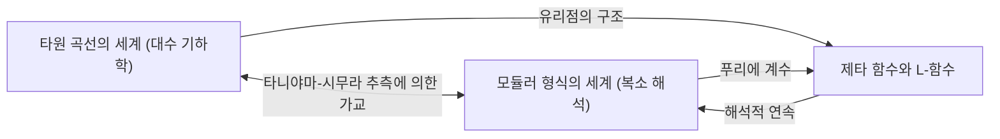
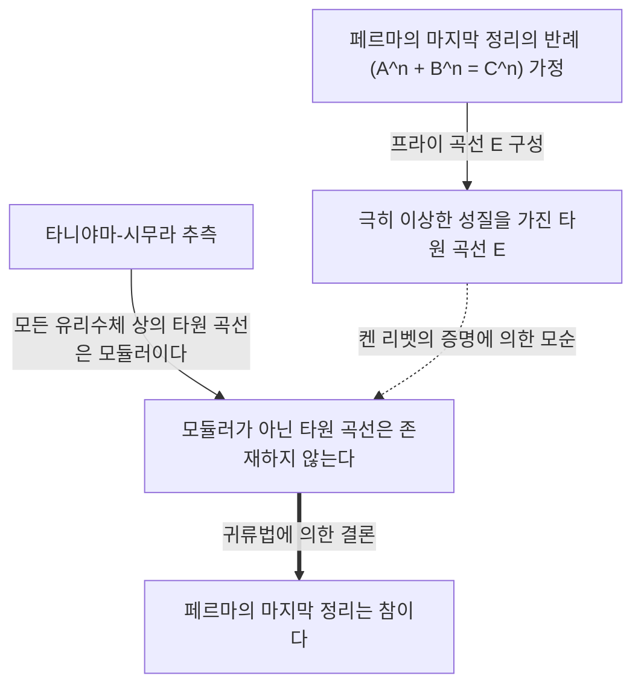

# [타니야마 유타카: 미해결 문제에 도전한 천재 수학자의 생애와 업적](https://kenji.blog/p/taniyama-yutaka/)

현대 수학에서 가장 극적이고 또 가장 중요한 진전 중 하나인 '[페르마의 마지막 정리](https://kenji.blog/ko/p/fermats-last-theorem/)'의 증명. 그 배경에는 두 명의 일본인 수학자가 제안한 놀라운 추측이 존재하고 있었습니다. 그 중 한 명이 젊은 나이에 세상을 떠난 **[타니야마 유타카](https://kenji.blog/ko/p/taniyama-yutaka/)** (1927년 - 1958년)입니다. 이 글에서는 그가 제창한 '타니야마-시무라 추측'이 얼마나 장대한 비전을 가지고 있었는지, 그리고 파란만장했던 그의 생애에 대해 자세히 해설합니다.

## 1. [타니야마 유타카](https://kenji.blog/ko/p/taniyama-yutaka/)의 생애와 청년기

[타니야마 유타카](https://kenji.blog/ko/p/taniyama-yutaka/)는 1927년 사이타마현 키사이마치(현재의 카조시)에서 태어났습니다. 어릴 적부터 수학에 비범한 재능을 보였지만, 그의 학창 시절은 제2차 세계대전의 혼란기와 겹쳐 있었습니다. 결핵을 앓아 고등학교 수업을 장기간 쉬기도 했지만, 그 요양 기간 동안 혼자서 수학 서적을 탐독하며 독학으로 깊은 수학적 사고를 길렀습니다. 이 고립된 시간이 그의 독특하고 직관적인 수학적 감각을 연마하게 했다고 전해집니다.

도쿄대학 이학부 수학과에 진학한 후, 그는 추상 대수학과 정수론에 강한 관심을 가집니다. 당시 일본의 수학계는 전후 복구기였음에도 불구하고 타카기 테이지와 Emil Artin의 영향을 받은 젊은 연구자들이 세계 최고 수준의 연구를 지향하고 있었습니다. 타니야마도 그 열기 속에서 자신의 재능을 꽃피워 나갔습니다.

## 2. [시무라 고로](https://kenji.blog/ko/p/shimura-goro/)와의 만남

도쿄대학에서 타니야마는 평생의 맹우가 될 **[시무라 고로](https://kenji.blog/ko/p/shimura-goro/)** 와 만나게 됩니다. 두 사람은 성격은 대조적이었지만, 수학에 대한 깊은 열정을 공유하고 있었습니다. 직관적이고 아이디어가 끊임없이 솟아나는 타니야마에 비해, 시무라는 그것을 엄밀한 논리로 뒷받침하는 훌륭한 보완 관계를 구축했습니다.

[시무라 고로](https://kenji.blog/ko/p/shimura-goro/)는 훗날 타니야마에 대해 "그는 많은 실수를 저질렀지만, 그것은 좋은 방향으로의 실수였다"고 회고했습니다. 타니야마의 직관은 종종 논리적인 비약을 포함하고 있었지만, 그 너머에는 항상 새로운 수학적 풍경이 펼쳐져 있었던 것입니다. 두 사람은 서로 자극을 주고받으며 당시 수학계의 최첨단이었던 '허수 곱셈론'과 '대수 기하학' 연구에 몰두했습니다.

## 3. 타니야마-시무라 추측: 두 세계의 통합

그들의 가장 큰 업적은 전혀 무관해 보이는 두 가지 수학적 대상인 '타원 곡선'과 '모듈러 형식'을 연결한 데 있습니다. 이것이 훗날 '타니야마-시무라 추측'(또는 모듈러성 정리)이라고 불리게 될 대발견입니다.

### 타원 곡선 (Elliptic Curves)

타원 곡선은 다음과 같이 매끄러운 3차 곡선의 방정식으로 표현됩니다.

$$ E: y^2 = x^3 + a x + b $$

여기서 $a$ 와 $b$ 는 상수이며, $4a^3 + 27b^2 \neq 0$ 을 만족합니다. 이 조건은 곡선이 특이점(첨점이나 자기 교차점)을 갖지 않음을 의미합니다. 타원 곡선은 유리수체 상의 점(유리점)의 집합이 군의 구조를 갖는 등 기하학적이면서도 깊은 대수적 성질을 갖는 대상입니다. 정수론에서 타원 곡선의 유리점을 구하는 것은 오래된 난제였습니다.

### 모듈러 형식 (Modular Forms)

반면에 모듈러 형식은 복소 상반평면(허수부가 양수인 복소수의 집합)에서 정의되는 매우 높은 대칭성을 가진 복소 해석적인 함수입니다. 모듈러 형식 $f(z)$ 는 특정 변환군(모듈러 군)에 대해 다음과 같은 성질을 만족합니다.

$$ f\left( \frac{az+b}{cz+d} \right) = (cz+d)^k f(z) $$

여기서 $a, b, c, d$ 는 정수 행렬의 성분이며, $ad-bc=1$ 을 만족합니다. $k$ 는 모듈러 형식의 무게(weight)라고 불리는 정수입니다. 모듈러 형식은 '4차원의 대칭성을 가진 함수'라고도 표현되며, 매우 복잡하고 난해한 대상입니다.

### 추측의 내용과 의미

'타니야마-시무라 추측'은 간단히 말해 **"유리수체 상에 정의된 모든 타원 곡선은 모듈러이다"** 라는 것입니다. 더 엄밀하게는 임의의 유리수체 상의 타원 곡선 $E$ 의 L-함수 $L(E, s)$ 가, 어떤 무게 2인 모듈러 형식 $f$ 의 L-함수 $L(f, s)$ 와 완전히 일치한다는 주장입니다.

$$ \text{For any elliptic curve } E / \mathbb{Q}, \text{ there exists a modular form } f \text{ such단 } L(E, s) = L(f, s) $$

이는 대수 기하학 세계의 주민인 '타원 곡선'의 DNA와 복소 해석 세계의 주민인 '모듈러 형식'의 DNA가 완전히 일치함을 의미합니다. 이 추측은 전혀 다른 두 수학 분야를 견고한 다리로 연결하는 경이로운 비전이었습니다.

## 4. 1955년 닛코 심포지엄

이 장대한 추측이 처음으로 공식적인 자리에서 시사된 것은 1955년 일본 닛코에서 열린 '대수적 정수론 국제 심포지엄'에서였습니다. 이 심포지엄에는 [앙드레 베유](https://kenji.blog/ko/p/weil/)나 장피에르 세르 같은 당시 세계 최고의 수학자들이 참가하고 있었습니다.

타니야마는 심포지엄 참가자들에게 영어로 쓰인 몇 가지 미해결 문제(Problem)를 인쇄하여 배포했습니다. 그 중 12번과 13번 문제에 훗날 '타니야마-시무라 추측'으로 발전할 아이디어의 씨앗이 담겨 있었습니다. 타니야마는 타원 곡선의 제타 함수가 어떤 종류의 모듈러 형식의 푸리에 계수로부터 얻어지지 않을까 하고 대담하게 제안한 것입니다.

처음에 이 추측을 믿는 수학자는 거의 없었습니다. 너무나 엉뚱하고 두 가지 다른 분야가 그토록 밀접하게 연결되어 있다고는 생각하기 어려웠기 때문입니다. 베유조차도 처음에는 회의적이었다고 합니다 (후에 베유는 이 추측의 중요성을 깨닫고 정식화에 공헌하여 '타니야마-시무라-베유 추측'으로도 불리게 되었습니다).

## 5. 비극적인 최후

수학자로서 순조로워 보였고 프린스턴 고등연구소의 초청까지 받았던 타니야마였지만, 1958년 11월 17일 스스로 목숨을 끊고 맙니다. 31세라는 젊은 나이였습니다. 결혼을 다음 달에 앞두고 벌어진 일이라 일본 수학계뿐만 아니라 주위에 큰 충격을 안겨주었습니다.

그의 유서에는 구체적인 고민이 적혀 있지 않았습니다. "어제까지 자살하겠다는 명확한 의사가 있었던 것은 아니다"라고 적혀 있어 그 자신조차 스스로의 행동을 완벽히 논리적으로 설명하지 못하는 듯했습니다. 과로로 인한 피로나 미래에 대한 막연한 불안이 있었을지도 모르지만, 그 이유는 오늘날까지 완전히 해명되지 않았습니다. 몇 주 후에는 그를 사랑했던 약혼녀도 "그가 혼자 가버렸으니 나도 곁에 가야만 한다"는 취지의 유서를 남기고 뒤따라 목숨을 끊었습니다. 이 비극적인 결말은 관계자들의 마음에 깊은 상처를 남겼습니다.

## 6. [페르마의 마지막 정리](https://kenji.blog/ko/p/fermats-last-theorem/)로 향하는 다리

타니야마의 죽음 이후, [시무라 고로](https://kenji.blog/ko/p/shimura-goro/)는 이 추측을 엄밀한 형태로 정식화하여 전 세계 수학자들에게 알렸습니다. 오랫동안 이 추측은 '증명 불가능'해 보일 정도로 어려운 목표로 여겨졌습니다. 그러나 1980년대에 극적인 전개가 일어납니다. 독일의 수학자 게르하르트 프라이가 **"만약 [페르마의 마지막 정리](https://kenji.blog/ko/p/fermats-last-theorem/)가 반례를 가진다면, 그 반례로 만들어지는 타원 곡선은 모듈러가 될 수 없다"** 는 놀라운 아이디어를 제안한 것입니다.

프라이가 구성한 타원 곡선(프라이 곡선)은 다음과 같은 형태를 띠고 있었습니다. 페르마 방정식 $A^n + B^n = C^n$ 에 정수 해가 존재한다고 가정합니다. 그 해를 이용하여 다음과 같은 타원 곡선을 만듭니다.

$$ E: y^2 = x (x - A^n) (x + B^n) $$

이 곡선은 극히 '이상한' 성질을 가지고 있어 모듈러 형식으로는 절대 만들 수 없다(즉 모듈러가 아니다)고 생각되었습니다. 이 프라이의 직관은 훗날 프랑스의 수학자 장피에르 세르의 '엡실론 추측'을 거쳐 미국의 수학자 켄 리벳에 의해 엄밀하게 증명되었습니다.

이로써 하나의 논리적 구도가 완성되었습니다.
1. 만약 [페르마의 마지막 정리](https://kenji.blog/ko/p/fermats-last-theorem/)가 거짓이라면, 모듈러가 아닌 타원 곡선(프라이 곡선)이 존재한다.
2. 하지만 타니야마-시무라 추측에 의하면 "모든 타원 곡선은 모듈러이다".
3. 따라서 타니야마-시무라 추측이 참이라면 프라이 곡선은 존재할 수 없고, [페르마의 마지막 정리](https://kenji.blog/ko/p/fermats-last-theorem/)도 참이어야 한다.

즉, **"타니야마-시무라 추측이 증명되면 300년 넘게 미해결이었던 [페르마의 마지막 정리](https://kenji.blog/ko/p/fermats-last-theorem/)도 자동으로 증명된다"** 는 운명의 사슬이 연결된 것입니다.

## 7. 추측의 증명과 랭글랜즈 프로그램

이 사실에 누구보다도 분발한 것은 영국의 수학자 **앤드루 와일스** 였습니다. 그는 어릴 적부터 [페르마의 마지막 정리](https://kenji.blog/ko/p/fermats-last-theorem/)에 매료되어 있었고, 이를 증명하는 데 평생을 바치기로 결심합니다. 그는 7년에 걸친 비밀스런 연구 끝에 1993년 "반안정 타원 곡선에 대해 타니야마-시무라 추측을 증명했다"고 발표했습니다. 증명 과정에서 약간의 논리적 결함이 발견되었으나, 옛 제자인 리처드 테일러의 협력을 얻어 1995년에 그 결함을 멋지게 메우고 완전한 증명 논문을 출판했습니다. 이로써 타니야마가 남긴 추측의 중요한 부분이 증명되었고, 동시에 [페르마의 마지막 정리](https://kenji.blog/ko/p/fermats-last-theorem/)도 영원한 진리가 되었습니다.

그 후 크리스토프 브루이, 브라이언 콘래드, 프레드 다이아몬드, 리처드 테일러 등의 추가적인 노력으로 2001년 모든 타원 곡선에 대한 타니야마-시무라 추측이 완전히 증명되었습니다. 현재 이 정리는 '모듈러성 정리(Modularity Theorem)'라는 이름으로 알려져 있습니다.

타니야마-시무라 추측은 현대 수학의 '랭글랜즈 프로그램'이라는 거대한 틀의 가장 아름답고 성공적인 예입니다. 랭글랜즈 프로그램은 정수론, 대수 기하학, 표현론 등을 통일적으로 이해하려는 장대한 시도이며 '수학의 대통일 이론'으로도 불립니다. 타니야마의 직관은 바로 그 문을 여는 열쇠였던 것입니다.

## 8. 맺음말

[타니야마 유타카](https://kenji.blog/ko/p/taniyama-yutaka/)가 닛코의 심포지엄에서 제시한 조심스러운 추측은 반세기의 세월을 거쳐 인류 지성의 금자탑인 [페르마의 마지막 정리](https://kenji.blog/ko/p/fermats-last-theorem/)를 세우는 토대가 되었습니다. 그가 간파한 "서로 다른 수학적 대상 이면에 숨겨진 연결 고리"는 오늘날의 수학자들에게도 계속해서 영감을 주고 있습니다.

젊은 나이에 스러진 천재 수학자, [타니야마 유타카](https://kenji.blog/ko/p/taniyama-yutaka/). 그가 남긴 아름다운 추측은 앞으로도 수학이라는 광활한 우주를 비추는 이정표로 계속 남아 있을 것입니다. 만약 그가 살아있었다면 더 얼마나 심오한 진리를 우리에게 보여주었을지 상상하지 않을 수 없습니다.
