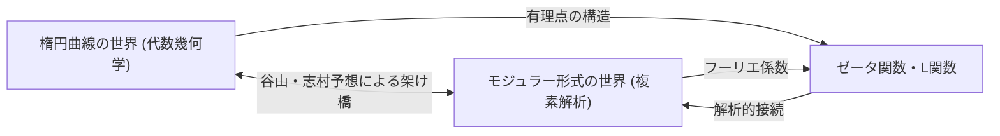
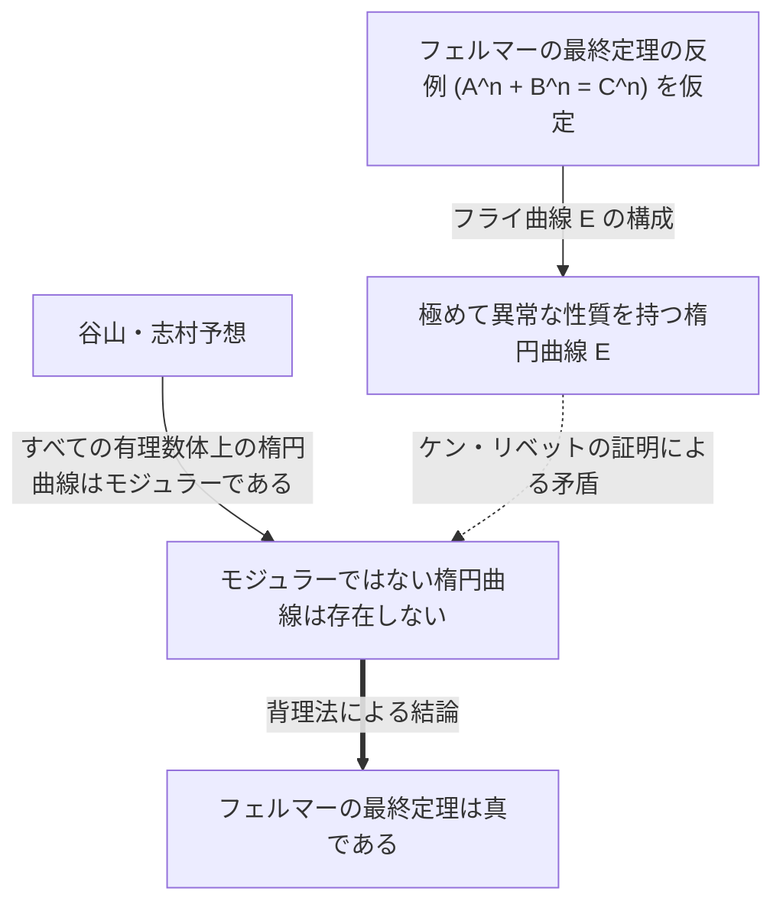

# [谷山豊](https://kenji.blog/p/taniyama-yutaka/)：未解決問題に挑んだ天才数学者の生涯と功績

現代数学において最も劇的で、そして最も重要な進展の一つである「[フェルマーの最終定理](https://kenji.blog/p/fermats-last-theorem/)」の証明。その背後には、二人の日本人数学者による驚くべき予想が存在していました。その一人が、若くしてこの世を去った **[谷山豊](https://kenji.blog/p/taniyama-yutaka/)** （たにやま ゆたか、1927年 - 1958年）です。本記事では、彼が提唱した「谷山・志村予想」がどれほど壮大なビジョンを持っていたのか、そして彼自身の波乱に満ちた生涯について詳しく解説します。

## 1. [谷山豊](https://kenji.blog/p/taniyama-yutaka/)の生い立ちと青年期

[谷山豊](https://kenji.blog/p/taniyama-yutaka/)は1927年、埼玉県騎西町（現在の加須市）に生まれました。幼い頃から数学に非凡な才能を示していましたが、彼の学生時代は第二次世界大戦の混乱期と重なっていました。結核を患い、高校の授業を長期間休むこともありましたが、その療養期間中に一人で数学書を読み漁り、独学で深い数学的思考を育んでいきました。この孤立した時間が、彼の独特で直感的な数学的センスを磨くことになったと言われています。

東京大学理学部数学科に進学した後、彼は抽象代数学や数論に強い関心を持ちます。当時の日本の数学界は、戦後の復興期でありながらも、[高木貞治](https://kenji.blog/p/takagi-teiji/)や Artin の影響を受けた若手研究者たちが世界トップレベルの研究を志向していました。谷山もその熱気の中で、自らの才能を開花させていきました。

## 2. [志村五郎](https://kenji.blog/p/shimura-goro/)との出会い

東京大学で谷山は、生涯の盟友となる **[志村五郎](https://kenji.blog/p/shimura-goro/)** と出会います。二人は性格こそ対照的でしたが、数学に対する深い情熱を共有していました。直感的でアイデアが次々と湧き出る谷山に対し、志村はそれを厳密な論理で裏付けるという、見事な補完関係を築き上げました。

[志村五郎](https://kenji.blog/p/shimura-goro/)は後に谷山について、「彼は多くの間違いを犯したが、それは良い方向への間違いであった」と語っています。谷山の直感は、しばしば論理的な飛躍を含んでいましたが、その先には常に新しい数学の風景が広がっていたのです。二人は互いに刺激を与え合いながら、当時の数学界の最先端であった「虚数乗法論」や「代数幾何学」の研究に没頭していきました。

## 3. 谷山・志村予想：二つの世界の統合

彼らの最大の功績は、一見まったく無関係に思える二つの数学的対象、「楕円曲線」と「モジュラー形式」を結びつけたことにあります。これが後に「谷山・志村予想」（またはモジュラリティ定理）と呼ばれるようになる大発見です。

### 楕円曲線（Elliptic Curves）

楕円曲線は、以下のようになめらかな三次曲線の方程式で表されます。

$$ E: y^2 = x^3 + a x + b $$

ここで、 $a$ と $b$ は定数であり、 $4a^3 + 27b^2 \neq 0$ を満たします。この条件は、曲線が特異点（尖点や自己交差）を持たないことを意味します。楕円曲線は有理数体上の点（有理点）の集合が群の構造を持つなど、幾何学的でありながら深い代数的性質を持つ対象です。数論において、楕円曲線の有理点を求めることは古くからの難問でした。

### モジュラー形式（Modular Forms）

一方、モジュラー形式は、複素上半平面（虚部が正である複素数の集合）で定義される非常に高い対称性を持つ複素解析的な関数です。モジュラー形式 $f(z)$ は、特定の変換群（モジュラー群）に対して以下のような性質を満たします。

$$ f\left( \frac{az+b}{cz+d} \right) = (cz+d)^k f(z) $$

ここで、 $a, b, c, d$ は整数の行列成分であり、 $ad-bc=1$ を満たします。 $k$ はモジュラー形式の重み（weight）と呼ばれる整数です。モジュラー形式は「四次元の対称性を持つ関数」とも表現され、非常に複雑で難解な対象です。

### 予想の内容と意味

「谷山・志村予想」は、簡単に言えば **「すべての有理数体上に定義された楕円曲線は、モジュラーである」** というものです。より厳密には、任意の有理数体上の楕円曲線 $E$ の L関数 $L(E, s)$ が、ある重み 2 のモジュラー形式 $f$ の L関数 $L(f, s)$ と完全に一致するという主張です。

$$ \text{For any elliptic curve } E / \mathbb{Q}, \text{ there exists a modular form } f \text{ such that } L(E, s) = L(f, s) $$

これは、代数幾何学の世界の住人である「楕円曲線」のDNAと、複素解析の世界の住人である「モジュラー形式」のDNAが、完全に一致していることを意味します。この予想は、数学の全く異なる二つの分野を強固な橋で結ぶ、驚異的なビジョンでした。

## 4. 1955年の日光シンポジウム

この壮大な予想が初めて公の場で示唆されたのは、1955年に日本の日光で開催された「代数的整数論の国際シンポジウム」でのことでした。このシンポジウムには、アンドレ・[ヴェイユ](https://kenji.blog/p/weil/)やジャン＝ピエール・セールといった当時の世界のトップ数学者たちが参加していました。

谷山は、シンポジウムの参加者に向けて、英語で書かれたいくつかの未解決問題（プロブレム）を印刷して配布しました。そのプロブレム12と13に、後に「谷山・志村予想」へと発展するアイデアの萌芽が含まれていました。谷山は、楕円曲線のゼータ関数が、ある種のモジュラー形式のフーリエ係数から得られるのではないかと大胆に提案したのです。

当初、この予想を信じる数学者はほとんどいませんでした。あまりにも突飛で、二つの異なる分野がそこまで密接に結びついているとは考えられなかったからです。[ヴェイユ](https://kenji.blog/p/weil/)でさえも、最初は懐疑的であったと言われています（後にヴェイユはこの予想の重要性に気づき、定式化に貢献したため、「谷山・志村・[ヴェイユ](https://kenji.blog/p/weil/)予想」とも呼ばれました）。

## 5. 悲劇的な最期

数学者として順風満帆に見え、プリンストン高等研究所からの招待も受けていた谷山ですが、1958年11月17日、彼は自ら命を絶ちました。31歳という若さでした。結婚を翌月に控えての出来事であり、日本の数学界のみならず、周囲に大きな衝撃を与えました。

彼の遺書には、具体的な悩みが書かれていたわけではありませんでした。「昨日まで自殺しようという明確な意思があったわけではない」と記されており、彼自身も自分の行動を完全に論理的に説明できていないようでした。激務による疲労や、将来への漠然とした不安があったのかもしれませんが、その理由は今日に至るまで完全には解明されていません。数週間後には、彼を愛していた婚約者の女性も、「彼が一人で逝ってしまったのだから、私も傍に行かなくてはならない」という旨の遺書を残し、後を追って命を絶ちました。この悲劇的な結末は、関係者の心に深い傷を残しました。

## 6. [フェルマーの最終定理](https://kenji.blog/p/fermats-last-theorem/)への架け橋

谷山の死後、[志村五郎](https://kenji.blog/p/shimura-goro/)はこの予想を厳密な形で定式化し、世界中の数学者に広めました。長い間、この予想は「証明不可能」とも思えるほど困難な目標とされていました。しかし1980年代になり、劇的な展開が訪れます。ドイツの数学者ゲルハルト・フライが、 **「もし[フェルマーの最終定理](https://kenji.blog/p/fermats-last-theorem/)が反例を持つならば、その反例から作られる楕円曲線はモジュラーになり得ない」** という驚くべきアイデアを提案したのです。

フライが構成した楕円曲線（フライ曲線）は次のような形をしていました。[フェルマー](https://kenji.blog/p/fermat/)方程式 $A^n + B^n = C^n$ に整数の解が存在したと仮定します。その解を用いて、以下の楕円曲線を作ります。

$$ E: y^2 = x (x - A^n) (x + B^n) $$

この曲線は非常に「異常な」性質を持っており、モジュラー形式からは絶対に作れない（つまりモジュラーではない）と考えられました。このフライの直感は、後にフランスの数学者ジャン＝ピエール・セールによる「イプシロン予想」を経て、アメリカの数学者ケン・リベットによって厳密に証明されました。

これにより、一つの論理的な構図が完成しました。
1. もし[フェルマーの最終定理](https://kenji.blog/p/fermats-last-theorem/)が偽なら、モジュラーではない楕円曲線（フライ曲線）が存在する。
2. しかし、谷山・志村予想によれば、「すべての楕円曲線はモジュラーである」。
3. したがって、谷山・志村予想が真であれば、フライ曲線は存在できず、[フェルマーの最終定理](https://kenji.blog/p/fermats-last-theorem/)も真でなければならない。

つまり、 **「谷山・志村予想が証明されれば、自動的に300年以上未解決だった[フェルマーの最終定理](https://kenji.blog/p/fermats-last-theorem/)も証明される」** という運命の鎖が繋がったのです。

## 7. 予想の証明とラングランズ・プログラム

この事実に誰よりも奮い立ったのが、イギリスの数学者 **[アンドリュー・ワイルズ](https://kenji.blog/p/wiles/)** でした。彼は幼い頃からフェルマーの最終定理に魅了されており、この証明に生涯を懸ける決意をします。彼は7年間に及ぶ秘密裏の研究の末、1993年に「半安定な楕円曲線に対して谷山・志村予想を証明した」と発表しました。証明には一部のギャップが見つかりましたが、かつての教え子であるリチャード・テイラーの協力を得て、1995年にそのギャップを見事に埋め、完全な証明論文を出版しました。これにより、谷山の遺した予想の重要な部分が証明され、同時に[フェルマーの最終定理](https://kenji.blog/p/fermats-last-theorem/)も永遠の真理となりました。

その後、クリストフ・ブルイユ、ブライアン・コンラッド、フレッド・ダイアモンド、リチャード・テイラーらのさらなる努力により、2001年にすべての楕円曲線に対して谷山・志村予想は完全に証明されました。現在、この定理は「モジュラリティ定理（Modularity Theorem）」という名で知られています。

谷山・志村予想は、現代数学における「ラングランズ・プログラム」という巨大な枠組みの最も美しく成功した一例です。ラングランズ・プログラムは、数論、代数幾何学、表現論などを統一的に理解しようとする壮大な試みであり、「数学の大統一理論」とも呼ばれます。谷山の直感は、まさにその扉を開く鍵だったのです。

## 8. おわりに

[谷山豊](https://kenji.blog/p/taniyama-yutaka/)が日光のシンポジウムで示した控えめな予想は、半世紀の時を経て、人類の知性の金字塔である[フェルマーの最終定理](https://kenji.blog/p/fermats-last-theorem/)を打ち立てる土台となりました。彼が見抜いた「異なる数学的対象の背後にある隠された結びつき」は、今日の数学者たちにもインスピレーションを与え続けています。

若くして散った天才数学者、[谷山豊](https://kenji.blog/p/taniyama-yutaka/)。彼が遺した美しい予想は、これからも数学という広大な宇宙を照らす道標であり続けるでしょう。彼が生きていれば、さらにどれほどの深遠な真理を私たちに見せてくれたのか、それを想像せずにはいられません。
