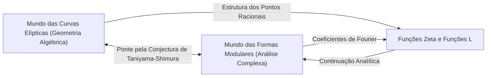
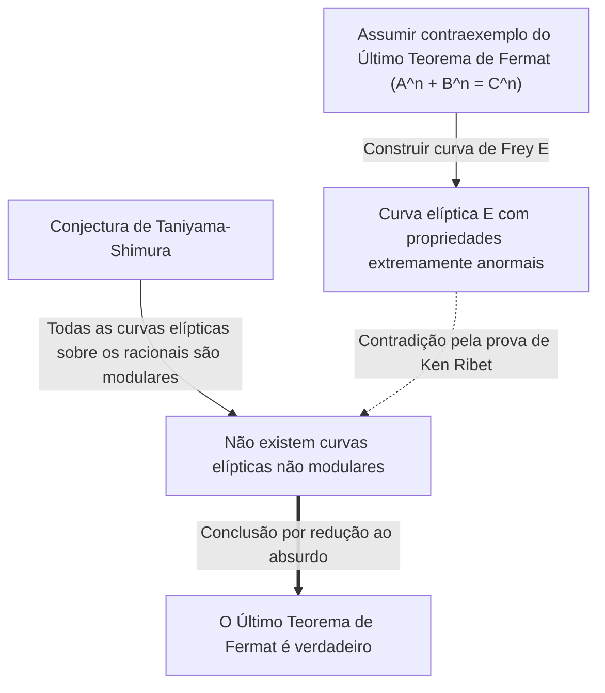

# [Yutaka Taniyama: A Vida e as Conquistas do Gênio Matemático que Desafiou Problemas Não Resolvidos](https://kenji.blog/p/taniyama-yutaka/)

A demonstração do **Último Teorema de [Fermat](https://kenji.blog/pt/p/fermat/)** é um dos desenvolvimentos mais dramáticos e importantes da matemática moderna. Por trás dessa conquista monumental, reside uma espantosa conjectura proposta por dois matemáticos japoneses. Um deles foi **[Yutaka Taniyama](https://kenji.blog/pt/p/taniyama-yutaka/)** (1927 - 1958), que faleceu muito jovem. Neste artigo, vamos nos aprofundar na grandiosa visão por trás da "Conjectura de Taniyama-Shimura" que ele propôs, bem como em sua própria vida turbulenta.

## 1. O Início da Vida e a Juventude de [Yutaka Taniyama](https://kenji.blog/pt/p/taniyama-yutaka/)

[Yutaka Taniyama](https://kenji.blog/pt/p/taniyama-yutaka/) nasceu em 1927, na cidade de Kisai, província de Saitama (hoje, cidade de Kazo). Ele demonstrou um talento extraordinário para a matemática desde a infância, mas seus anos de estudante coincidiram com o período caótico da Segunda Guerra Mundial. Ele contraiu tuberculose e muitas vezes perdeu longos períodos de aulas no ensino médio. Durante a sua recuperação, lia livros de matemática sozinho e desenvolveu um profundo pensamento matemático através do auto-estudo. Diz-se que esse tempo de isolamento aprimorou o seu sentido matemático, único e intuitivo.

Após ingressar no Departamento de Matemática da Faculdade de Ciências da Universidade de Tóquio, desenvolveu um forte interesse em álgebra abstrata e teoria dos números. Apesar de estar num período de reconstrução pós-guerra, a comunidade matemática japonesa da época ambicionava realizar pesquisas de nível mundial, influenciada por jovens investigadores inspirados por Teiji [Takagi](https://kenji.blog/pt/p/takagi-teiji/) e Emil Artin. Taniyama deixou o seu talento florescer no meio de todo esse entusiasmo.

## 2. O Encontro com [Goro Shimura](https://kenji.blog/pt/p/shimura-goro/)

Na Universidade de Tóquio, Taniyama conheceu **[Goro Shimura](https://kenji.blog/pt/p/shimura-goro/)**, que se tornaria seu amigo e aliado para toda a vida. Os dois tinham personalidades opostas, mas partilhavam uma profunda paixão pela matemática. Enquanto Taniyama era intuitivo e estava constantemente a transbordar de ideias, Shimura sustentava-as com uma lógica rigorosa, formando uma relação complementar notável.

Mais tarde, [Goro Shimura](https://kenji.blog/pt/p/shimura-goro/) disse sobre Taniyama: "Ele cometeu muitos erros, mas a maioria deles foram erros na direção certa". A intuição de Taniyama envolvia frequentemente saltos lógicos, mas além destes, um novo cenário matemático sempre se revelava. Os dois inspiraram-se mutuamente e mergulharam no estudo da teoria da multiplicação complexa e da geometria algébrica, que se encontravam na vanguarda da matemática da época.

## 3. A Conjectura de Taniyama-Shimura: A Integração de Dois Mundos

A sua maior conquista consistiu em ligar dois objetos matemáticos que pareciam não ter qualquer relação: "curvas elípticas" e "formas modulares". Essa grande descoberta ficou mais tarde conhecida como a "Conjectura de Taniyama-Shimura" (ou o Teorema de Modularidade).

### Curvas Elípticas (Elliptic Curves)

Uma curva elíptica é expressa pela equação de uma curva cúbica suave da seguinte forma:

$$ E: y^2 = x^3 + a x + b $$

Aqui, $a$ e $b$ são constantes que satisfazem $4a^3 + 27b^2 \neq 0$. Esta condição significa que a curva não tem pontos singulares (cúspides ou auto-interseções). As curvas elípticas são objetos com profundas propriedades algébricas, apesar de serem geométricas, como o facto de o conjunto de pontos racionais (pontos com coordenadas racionais) formar uma estrutura de grupo. Encontrar os pontos racionais nas curvas elípticas era um problema antigo e difícil na teoria dos números.

### Formas Modulares (Modular Forms)

Por outro lado, uma forma modular é uma função analítica complexa altamente simétrica, definida no semiplano superior (o conjunto de números complexos com partes imaginárias positivas). Uma forma modular $f(z)$ satisfaz a seguinte propriedade para um grupo específico de transformações (o grupo modular):

$$ f\left( \frac{az+b}{cz+d} \right) = (cz+d)^k f(z) $$

Aqui, $a, b, c, d$ são entradas de matriz inteiras que satisfazem $ad-bc=1$. E $k$ é um número inteiro chamado de peso (weight) da forma modular. As formas modulares são por vezes descritas como "funções com simetria quadridimensional", sendo objetos extremamente complexos e abstratos.

### Conteúdo e Significado da Conjectura

Simplificando, a "Conjectura de Taniyama-Shimura" afirma que **"toda a curva elíptica definida sobre os números racionais é modular"**. Mais precisamente, defende que a função L $L(E, s)$ de qualquer curva elíptica $E$ sobre os números racionais corresponde perfeitamente à função L $L(f, s)$ de uma determinada forma modular $f$ de peso 2.

$$ \text{For any elliptic curve } E / \mathbb{Q}, \text{ there exists a modular form } f \text{ such that } L(E, s) = L(f, s) $$

Isto significa que o ADN de uma "curva elíptica", residente no mundo da geometria algébrica, é idêntico ao ADN de uma "forma modular", residente no mundo da análise complexa. Esta conjectura foi uma visão espantosa que construiu uma ponte sólida entre dois campos da matemática inteiramente diferentes.

## 4. O Simpósio de Nikko de 1955

Esta grandiosa conjectura foi sugerida publicamente pela primeira vez em 1955, num simpósio internacional sobre teoria algébrica dos números realizado em Nikko, no Japão. O simpósio contou com a participação dos melhores matemáticos do mundo da época, como [André Weil](https://kenji.blog/pt/p/weil/) e Jean-Pierre Serre.

Taniyama imprimiu e distribuiu aos participantes vários problemas não resolvidos redigidos em inglês. Os problemas 12 e 13 continham as sementes das ideias que, mais tarde, se desenvolveriam na "Conjectura de Taniyama-Shimura". Taniyama propôs audaciosamente que a função zeta de uma curva elíptica poderia ser obtida a partir dos coeficientes de Fourier de um determinado tipo de forma modular.

Inicialmente, quase nenhum matemático acreditou nesta conjectura. Parecia demasiado bizarra, e era difícil imaginar que dois campos tão distintos pudessem estar tão intimamente ligados. Conta-se que até Weil se mostrou cético ao início (embora mais tarde tenha reconhecido a sua importância e contribuído para a sua formulação, o que levou a que fosse por vezes chamada de "Conjectura de Taniyama-Shimura-Weil").

## 5. Um Fim Trágico

A carreira de Taniyama como matemático parecia correr de feição, tendo recebido inclusive um convite do Institute for Advanced Study, em Princeton. No entanto, em 17 de novembro de 1958, tirou a sua própria vida. Tinha apenas 31 anos. Este acontecimento, que teve lugar a apenas um mês do seu planeado casamento, enviou ondas de choque não só à comunidade matemática japonesa, como a todos os que o conheciam.

A sua nota de suicídio não referia qualquer preocupação específica. Escreveu: "Até ontem não tinha uma intenção definida de me matar", o que sugere que nem ele próprio conseguia explicar as suas ações de forma totalmente lógica. Poderá ter sido exaustão por excesso de trabalho ou uma vaga ansiedade em relação ao futuro, mas as razões exatas continuam por desvendar até aos dias de hoje. Algumas semanas mais tarde, a sua noiva, que o amava profundamente, também tirou a sua própria vida, deixando uma nota com a seguinte mensagem: "Já que ele partiu sozinho, eu devo ir para ficar a seu lado." Este trágico desfecho deixou cicatrizes profundas nos corações dos envolvidos.

## 6. Uma Ponte para o Último Teorema de [Fermat](https://kenji.blog/pt/p/fermat/)

Após a morte de Taniyama, [Goro Shimura](https://kenji.blog/pt/p/shimura-goro/) formulou rigorosamente esta conjectura e difundiu-a aos matemáticos de todo o mundo. Durante muito tempo, esta conjectura foi considerada um objetivo tão difícil que parecia "impossível de provar". No entanto, uma dramática reviravolta ocorreu na década de 1980. O matemático alemão Gerhard Frey propôs uma ideia espantosa: **"Se o Último Teorema de [Fermat](https://kenji.blog/pt/p/fermat/) tiver um contraexemplo, a curva elíptica construída a partir desse contraexemplo não poderá ser modular."**

A curva elíptica construída por Frey (a curva de Frey) tomava a seguinte forma. Suponhamos que existe uma solução inteira para a equação de [Fermat](https://kenji.blog/pt/p/fermat/) $A^n + B^n = C^n$. Utilizando essa solução, criamos a seguinte curva elíptica:

$$ E: y^2 = x (x - A^n) (x + B^n) $$

Esta curva tem propriedades extremamente "anormais", e pensava-se ser absolutamente impossível ser construída a partir de formas modulares (o que significa que não é modular). A intuição de Frey viria mais tarde a ser rigorosamente provada pelo matemático norte-americano Ken Ribet, através da "Conjectura Epsilon", formulada pelo matemático francês Jean-Pierre Serre.

Isto completou um quadro lógico:
1. Se o Último Teorema de [Fermat](https://kenji.blog/pt/p/fermat/) for falso, existirá uma curva elíptica não modular (curva de Frey).
2. Porém, de acordo com a Conjectura de Taniyama-Shimura, "todas as curvas elípticas são modulares".
3. Portanto, se a Conjectura de Taniyama-Shimura for verdadeira, a curva de Frey não poderá existir, e o Último Teorema de [Fermat](https://kenji.blog/pt/p/fermat/) deverá também ser verdadeiro.

Por outras palavras, a cadeia do destino unia-se: **"Se a Conjectura de Taniyama-Shimura for provada, o Último Teorema de [Fermat](https://kenji.blog/pt/p/fermat/), por resolver durante mais de 300 anos, será automaticamente provado também."**

## 7. Prova da Conjectura e o Programa de Langlands

A pessoa que mais se sentiu inspirada por este facto foi o matemático britânico **[Andrew Wiles](https://kenji.blog/pt/p/wiles/)**. Desde a infância que era fascinado pelo Último Teorema de Fermat, e decidiu dedicar a sua vida a prová-lo. Após sete anos de pesquisa secreta, anunciou em 1993 que tinha "provado a Conjectura de Taniyama-Shimura para curvas elípticas semiestáveis". Embora tenha sido encontrada uma lacuna numa parte da demonstração, com a ajuda de um ex-aluno seu, Richard Taylor, conseguiu preenchê-la com sucesso em 1995 e publicou a demonstração completa. Como resultado, a parte crucial da conjectura deixada por Taniyama foi provada e, simultaneamente, o Último Teorema de [Fermat](https://kenji.blog/pt/p/fermat/) tornou-se numa verdade eterna.

Posteriormente, através dos esforços adicionais de Christophe Breuil, Brian Conrad, Fred Diamond e Richard Taylor, a Conjectura de Taniyama-Shimura foi completamente provada para todas as curvas elípticas em 2001. Atualmente, este teorema é conhecido como o "Teorema de Modularidade (Modularity Theorem)".

A Conjectura de Taniyama-Shimura é o exemplo mais belo e bem-sucedido da grandiosa estrutura da matemática moderna conhecida como "Programa de Langlands". O Programa de Langlands é uma ambiciosa tentativa de unificar a teoria dos números, a geometria algébrica e a teoria das representações, sendo muitas vezes designado por "Grande Teoria Unificada da Matemática". A intuição de Taniyama foi, precisamente, a chave que abriu essa porta.

## 8. Conclusão

A modesta conjectura apresentada por [Yutaka Taniyama](https://kenji.blog/pt/p/taniyama-yutaka/) no simpósio de Nikko tornou-se a base que estabeleceu o Último Teorema de [Fermat](https://kenji.blog/pt/p/fermat/), um pináculo do intelecto humano, meio século depois. A sua perceção das "ligações ocultas por detrás de diferentes objetos matemáticos" continua a inspirar os matemáticos dos dias de hoje.

O genial matemático [Yutaka Taniyama](https://kenji.blog/pt/p/taniyama-yutaka/) morreu jovem, mas a belíssima conjectura que deixou para trás continuará a ser um guia a iluminar o vasto universo da matemática. Não há como não questionar que outras profundas verdades ele nos teria revelado, caso tivesse sobrevivido.
