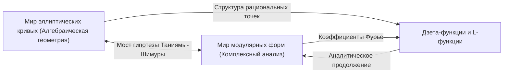
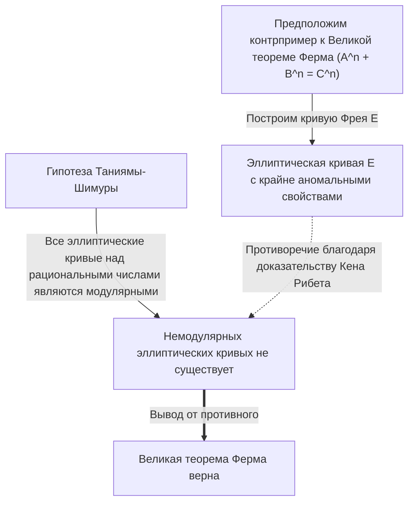

# [[Ютака Танияма](https://kenji.blog/ru/p/taniyama-yutaka/): Жизнь и достижения гениального математика, бросившего вызов нерешенным проблемам](https://kenji.blog/p/taniyama-yutaka/)

Доказательство **Великой теоремы Ферма** — одно из самых драматичных и важных событий в современной математике. За этим монументальным достижением скрывается поразительная гипотеза, предложенная двумя японскими математиками. Одним из них был **[Ютака Танияма](https://kenji.blog/ru/p/taniyama-yutaka/)** (1927 - 1958), ушедший из жизни в молодом возрасте. В этой статье мы глубоко погрузимся в грандиозное видение, стоящее за предложенной им "Гипотезой Таниямы-Шимуры", и его собственную бурную жизнь.

## 1. Ранние годы и юность Ютаки Таниямы

[Ютака Танияма](https://kenji.blog/ru/p/taniyama-yutaka/) родился в 1927 году в городе Кисай префектуры Сайтама (ныне город Кадзо). Он с раннего возраста проявлял выдающиеся способности к математике, но его студенческие годы пришлись на хаотичный период Второй мировой войны. Он заболел туберкулезом и часто подолгу пропускал занятия в старшей школе. Во время выздоровления он в одиночестве читал книги по математике и путем самообучения развил глубокое математическое мышление. Говорят, что это время изоляции отточило его уникальное и интуитивное математическое чутье.

Поступив на математический факультет Токийского университета, он проявил сильный интерес к абстрактной алгебре и теории чисел. Несмотря на период послевоенного восстановления, японское математическое сообщество того времени стремилось к исследованиям мирового уровня под влиянием молодых ученых, вдохновленных Тэйдзи Такаги и Эмилем Артином. В этой атмосфере энтузиазма талант Таниямы расцвел в полной мере.

## 2. Встреча с Горо Шимурой

В Токийском университете Танияма встретил **Горо Шимуру**, который стал его другом и соратником на всю жизнь. Эти двое обладали противоположными характерами, но их объединяла глубокая страсть к математике. В то время как Танияма был интуитивен и постоянно фонтанировал идеями, Шимура подкреплял их строгой логикой, образуя удивительные взаимодополняющие отношения.

Горо Шимура позже сказал о Танияме: "Он делал много ошибок, но в основном это были ошибки в правильном направлении". Интуиция Таниямы часто включала логические скачки, но за ними всегда открывался новый математический ландшафт. Они вдохновляли друг друга и погрузились в изучение теории комплексного умножения и алгебраической геометрии, которые находились на переднем крае математики того времени.

## 3. Гипотеза Таниямы-Шимуры: Интеграция двух миров

Их величайшим достижением стало соединение двух математических объектов, казавшихся совершенно не связанными друг с другом: "эллиптических кривых" и "модулярных форм". Это великое открытие позже стало известно как "Гипотеза Таниямы-Шимуры" (или Теорема о модулярности).

### Эллиптические кривые (Elliptic Curves)

Эллиптическая кривая выражается уравнением гладкой кубической кривой следующим образом:

$$ E: y^2 = x^3 + a x + b $$

Здесь $a$ и $b$ — константы, удовлетворяющие условию $4a^3 + 27b^2 \neq 0$. Это условие означает, что кривая не имеет особых точек (заострений или самопересечений). Эллиптические кривые являются объектами с глубокими алгебраическими свойствами, несмотря на их геометрическую природу, например, множество рациональных точек (точек с рациональными координатами) образует групповую структуру. Нахождение рациональных точек на эллиптических кривых было древней и сложной проблемой в теории чисел.

### Модулярные формы (Modular Forms)

С другой стороны, модулярная форма — это высокосимметричная комплексно-аналитическая функция, определенная в верхней полуплоскости (множестве комплексных чисел с положительной мнимой частью). Модулярная форма $f(z)$ удовлетворяет следующему свойству для определенной группы преобразований (модулярной группы):

$$ f\left( \frac{az+b}{cz+d} \right) = (cz+d)^k f(z) $$

Здесь $a, b, c, d$ — целочисленные элементы матрицы, удовлетворяющие условию $ad-bc=1$. А $k$ — целое число, называемое весом (weight) модулярной формы. Модулярные формы иногда описывают как "функции с четырехмерной симметрией", и они являются чрезвычайно сложными и абстрактными объектами.

### Содержание и значение гипотезы

Проще говоря, "Гипотеза Таниямы-Шимуры" утверждает, что **"каждая эллиптическая кривая, определенная над рациональными числами, является модулярной"**. Точнее, она утверждает, что L-функция $L(E, s)$ любой эллиптической кривой $E$ над рациональными числами идеально совпадает с L-функцией $L(f, s)$ некоторой модулярной формы $f$ веса 2.

$$ \text{For any elliptic curve } E / \mathbb{Q}, \text{ there exists a modular form } f \text{ such that } L(E, s) = L(f, s) $$

Это означает, что ДНК "эллиптической кривой", обитателя мира алгебраической геометрии, идентична ДНК "модулярной формы", обитателя мира комплексного анализа. Эта гипотеза была поразительным видением, проложившим прочный мост между двумя совершенно разными областями математики.

## 4. Симпозиум в Никко 1955 года

Эта грандиозная гипотеза была впервые публично предложена в 1955 году на международном симпозиуме по алгебраической теории чисел, проходившем в Никко, Япония. На этом симпозиуме присутствовали лучшие математики мира того времени, такие как [Андре Вейль](https://kenji.blog/ru/p/weil/) и Жан-Пьер Серр.

Танияма напечатал и раздал участникам несколько нерешенных проблем, написанных на английском языке. Проблемы 12 и 13 содержали семена идей, которые позже развились в "Гипотезу Таниямы-Шимуры". Танияма смело предположил, что дзета-функция эллиптической кривой может быть получена из коэффициентов Фурье определенного типа модулярной формы.

Поначалу почти никто из математиков не поверил в эту гипотезу. Она казалась слишком причудливой, и было трудно представить, что две различные области могут быть так тесно связаны. Говорят, даже Вейль поначалу был настроен скептически (хотя позже Вейль признал ее важность и внес вклад в ее формулировку, из-за чего ее иногда называли "Гипотезой Таниямы-Шимуры-Вейля").

## 5. Трагический конец

Карьера Таниямы как математика, казалось, шла гладко, и он даже получил приглашение от Института перспективных исследований в Принстоне. Однако 17 ноября 1958 года он покончил с собой. Ему был всего 31 год. Это событие, произошедшее всего за месяц до его запланированной свадьбы, потрясло не только японское математическое сообщество, но и всех, кто его знал.

В его предсмертной записке не было указано никаких конкретных проблем. Он написал: "До вчерашнего дня у меня не было определенного намерения убить себя", что говорит о том, что даже он сам не мог полностью логически объяснить свои действия. Возможно, это было истощение от переутомления или смутная тревога о будущем, но точные причины остаются невыясненными до сих пор. Несколько недель спустя его невеста, которая глубоко его любила, также покончила с собой, оставив записку, в которой говорилось: "Поскольку он ушел один, я должна пойти, чтобы быть рядом с ним". Этот трагический конец оставил глубокие шрамы в сердцах всех участников.

## 6. Мост к Великой теореме Ферма

После смерти Таниямы Горо Шимура строго сформулировал эту гипотезу и распространил ее среди математиков всего мира. Долгое время эта гипотеза считалась настолько трудной целью, что казалась "недоказуемой". Однако в 1980-х годах произошел драматический поворот. Немецкий математик Герхард Фрей предложил поразительную идею: **"Если у Великой теоремы Ферма есть контрпример, эллиптическая кривая, построенная на основе этого контрпримера, не может быть модулярной."**

Эллиптическая кривая, построенная Фреем (кривая Фрея), имела следующий вид. Предположим, существует целочисленное решение уравнения Ферма $A^n + B^n = C^n$. Используя это решение, мы создаем следующую эллиптическую кривую:

$$ E: y^2 = x (x - A^n) (x + B^n) $$

Эта кривая обладает крайне "аномальными" свойствами и считалась абсолютно невозможной для построения из модулярных форм (что означает, что она не является модулярной). Интуиция Фрея была позже строго доказана американским математиком Кеном Рибетом с помощью "Эпсилон-гипотезы", сформулированной французским математиком Жан-Пьером Серром.

Это завершило логическую структуру:
1. Если [Великая теорема Ферма](https://kenji.blog/ru/p/fermats-last-theorem/) ложна, существует немодулярная эллиптическая кривая (кривая Фрея).
2. Однако, согласно Гипотезе Таниямы-Шимуры, "все эллиптические кривые являются модулярными".
3. Следовательно, если Гипотеза Таниямы-Шимуры верна, кривая Фрея не может существовать, и [Великая теорема Ферма](https://kenji.blog/ru/p/fermats-last-theorem/) также должна быть верна.

Другими словами, цепь судьбы замкнулась: **"Если Гипотеза Таниямы-Шимуры будет доказана, [Великая теорема Ферма](https://kenji.blog/ru/p/fermats-last-theorem/), остававшаяся нерешенной более 300 лет, автоматически будет также доказана."**

## 7. Доказательство гипотезы и программа Ленглендса

Человеком, которого этот факт вдохновил больше всего, был британский математик **[Эндрю Уайлс](https://kenji.blog/ru/p/wiles/)**. Он был очарован Великой теоремой Ферма с детства и решил посвятить свою жизнь ее доказательству. После семи лет секретных исследований он объявил в 1993 году, что "доказал Гипотезу Таниямы-Шимуры для полустабильных эллиптических кривых". Хотя в части доказательства был обнаружен пробел, с помощью своего бывшего ученика Ричарда Тейлора он успешно восполнил его в 1995 году и опубликовал полное доказательство. В результате важнейшая часть гипотезы, оставленная Таниямой, была доказана, и одновременно [Великая теорема Ферма](https://kenji.blog/ru/p/fermats-last-theorem/) стала вечной истиной.

Впоследствии, благодаря дальнейшим усилиям Кристофа Брейля, Брайана Конрада, Фреда Даймонда и Ричарда Тейлора, Гипотеза Таниямы-Шимуры была полностью доказана для всех эллиптических кривых в 2001 году. Сегодня эта теорема известна как "Теорема о модулярности (Modularity Theorem)".

Гипотеза Таниямы-Шимуры — самый красивый и успешный пример грандиозной структуры в современной математике, известной как "Программа Ленглендса". Программа Ленглендса — это амбициозная попытка объединить теорию чисел, алгебраическую геометрию и теорию представлений, которую часто называют "Теорией Великого объединения математики". Интуиция Таниямы стала именно тем ключом, который открыл эту дверь.

## 8. Заключение

Скромная гипотеза, которую [Ютака Танияма](https://kenji.blog/ru/p/taniyama-yutaka/) представил на симпозиуме в Никко, стала основой для доказательства Великой теоремы Ферма — вершины человеческого интеллекта — полвека спустя. Его понимание "скрытых связей, стоящих за различными математическими объектами" продолжает вдохновлять математиков и сегодня.

Гениальный математик [Ютака Танияма](https://kenji.blog/ru/p/taniyama-yutaka/), умерший молодым. Оставленная им прекрасная гипотеза будет продолжать служить путеводной звездой, освещающей огромную вселенную математики. Остается только гадать, какие еще глубокие истины он открыл бы нам, если бы остался жив.
