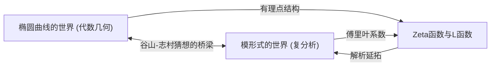
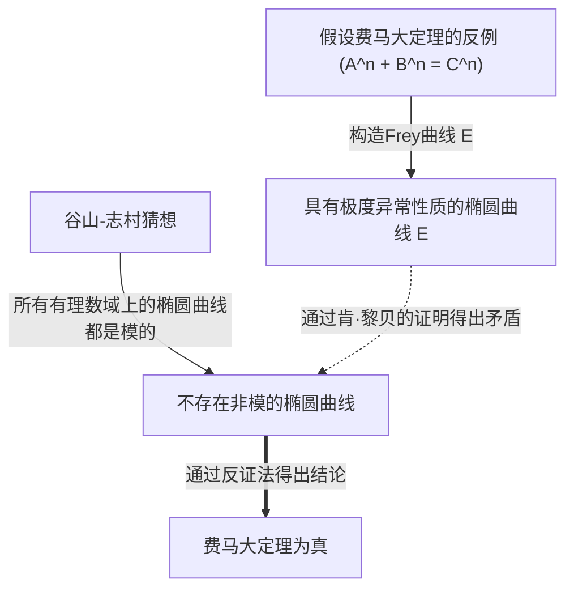

# [[谷山丰](https://kenji.blog/zh-cn/p/taniyama-yutaka/)：挑战未解决问题的天才数学家之一生与成就](https://kenji.blog/p/taniyama-yutaka/)

现代数学中最具戏剧性且最重要的进展之一，便是“[费马大定理](https://kenji.blog/zh-cn/p/fermats-last-theorem/)”的证明。在这一伟大成就的背后，存在着由两位日本数学家提出的惊人猜想。其中之一便是英年早逝的 **[谷山丰](https://kenji.blog/zh-cn/p/taniyama-yutaka/)** （1927年 - 1958年）。在本文中，我们将深入探讨他所提出的“谷山-志村猜想”蕴含着多么宏大的愿景，以及他本人波折跌宕的一生。

## 1. [谷山丰](https://kenji.blog/zh-cn/p/taniyama-yutaka/)的早年与青年时期

[谷山丰](https://kenji.blog/zh-cn/p/taniyama-yutaka/)于1927年出生于日本埼玉县骑西町（现加须市）。他从小就展现出非凡的数学天赋，但他的学生时代正值第二次世界大战的混乱时期。他曾患上结核病，导致长时间缺席高中课程，但在疗养期间，他独自阅读数学书籍，通过自学培养了深刻的数学思维。据说，这段孤独的时光磨砺了他独特而直觉敏锐的数学感官。

进入东京大学理学部数学科后，他对抽象代数和数论产生了浓厚的兴趣。当时的日本数学界虽处于战后重建期，但在深受高木贞治和 Emil Artin 影响的年轻研究者们的带领下，正致力于世界顶尖水平的研究。谷山在这样的热潮中，逐渐绽放了自己的才华。

## 2. 与[志村五郎](https://kenji.blog/zh-cn/p/shimura-goro/)的相遇

在东京大学，谷山遇到了将成为他一生挚友的 **[志村五郎](https://kenji.blog/zh-cn/p/shimura-goro/)** 。两人性格截然不同，但对数学有着同样深厚的热情。谷山凭直觉行事，脑海中不断涌现新想法，而志村则用严谨的逻辑将其加以证实，两人建立了堪称完美的互补关系。

[志村五郎](https://kenji.blog/zh-cn/p/shimura-goro/)后来评价谷山说：“他犯了很多错误，但大多都是朝着好方向的错误。”谷山的直觉常常包含逻辑上的跳跃，但在这跳跃之后，总能展现出全新的数学风景。两人相互启发，全身心地投入到当时数学界最前沿的“复乘理论”和“代数几何学”研究中。

## 3. 谷山-志村猜想：两个世界的统一

他们最大的成就，在于将看似毫不相干的两个数学对象——“椭圆曲线”和“模形式”联系在了一起。这一伟大发现后来被称为“谷山-志村猜想”（或模块性定理）。

### 椭圆曲线（Elliptic Curves）

椭圆曲线可以用如下平滑的三次曲线方程来表示：

$$ E: y^2 = x^3 + a x + b $$

在这里， $a$ 和 $b$ 是常数，且满足 $4a^3 + 27b^2 \neq 0$ 。这个条件意味着曲线没有奇异点（如尖点或自交点）。椭圆曲线上的有理点集合具有群的结构，因此它是一个既具有几何意义又包含深刻代数性质的对象。在数论中，求椭圆曲线上的有理点一直是一个古老的难题。

### 模形式（Modular Forms）

另一方面，模形式是定义在复上半平面（虚部为正的复数集合）上的、具有极高对称性的复解析函数。模形式 $f(z)$ 对于特定的变换群（模群）满足以下性质：

$$ f\left( \frac{az+b}{cz+d} \right) = (cz+d)^k f(z) $$

在这里， $a, b, c, d$ 是满足 $ad-bc=1$ 的整数矩阵元素，而 $k$ 是被称为模形式的权重（weight）的整数。模形式有时被称为“具有四维对称性的函数”，是一个极其复杂且抽象的对象。

### 猜想的内容与意义

简单来说，“谷山-志村猜想”主张 **“所有定义在有理数域上的椭圆曲线都是模的”** 。更严格地说，它断言任何有理数域上的椭圆曲线 $E$ 的L函数 $L(E, s)$ ，都与某个权重为2的模形式 $f$ 的L函数 $L(f, s)$ 完全一致。

$$ \text{For any elliptic curve } E / \mathbb{Q}, \text{ there exists a modular form } f \text{ such that } L(E, s) = L(f, s) $$

这意味着，代数几何世界的居民“椭圆曲线”的DNA，与复分析世界的居民“模形式”的DNA是完全相同的。这个猜想以一种惊人的视野，在数学中两个截然不同的领域之间架起了一座坚固的桥梁。

## 4. 1955年的日光研讨会

这个宏大的猜想首次在公开场合被提及，是在1955年于日本日光举办的代数数论国际研讨会上。当时世界上顶尖的数学家，如[安德烈·韦伊](https://kenji.blog/zh-cn/p/weil/)（[André Weil](https://kenji.blog/zh-cn/p/weil/)）和让-皮埃尔·塞尔（Jean-Pierre Serre）等都参加了此次会议。

谷山向研讨会的参与者分发了一些用英文打印的未解决问题。其中的第12个和第13个问题，包含了后来发展为“谷山-志村猜想”的思想萌芽。谷山大胆地提出，椭圆曲线的Zeta函数或许可以从某种模形式的傅里叶系数中得到。

最初，几乎没有数学家相信这个猜想。因为它太不可思议了，很难想象两个不同的领域会有如此紧密的联系。据说连韦伊起初也持怀疑态度（不过后来韦伊意识到了这个猜想的重要性，并为其形式化做出了贡献，因此它有时也被称为“谷山-志村-韦伊猜想”）。

## 5. 悲剧性的结局

作为一名数学家，谷山的事业似乎一帆风顺，他甚至收到了普林斯顿高等研究院的邀请。然而，在1958年11月17日，他选择了结束自己的生命，年仅31岁。这件事发生在他原定结婚的前一个月，给日本数学界以及他周围的人带来了巨大的震惊。

他的遗书中并未写明具体的烦恼。他写道：“直到昨天，我都没有明确的自杀意图。”这表明他自己也无法完全用逻辑解释自己的行为。也许是因为过度劳累，也许是对未来的莫明焦虑，但真正的原因至今仍是个谜。几周后，深爱着他的未婚妻也留下了“他一个人走了，我必须去陪他”的遗书，随他而去。这场悲剧性的结局，给所有相关人员的心中留下了深深的创伤。

## 6. 通往[费马大定理](https://kenji.blog/zh-cn/p/fermats-last-theorem/)的桥梁

谷山去世后，[志村五郎](https://kenji.blog/zh-cn/p/shimura-goro/)用严谨的形式重新表述了这个猜想，并将其推广给全世界的数学家。很长一段时间里，这个猜想被认为是如此困难，以至于几乎“不可证明”。然而到了20世纪80年代，事情迎来了戏剧性的转折。德国数学家格哈德·弗雷（Gerhard Frey）提出了一个惊人的想法： **“如果[费马大定理](https://kenji.blog/zh-cn/p/fermats-last-theorem/)存在反例，那么由该反例构造出的椭圆曲线，不可能是模的。”** 

弗雷构造的椭圆曲线（Frey曲线）形式如下。假设费马方程 $A^n + B^n = C^n$ 存在整数解。利用这个解，我们构造出以下椭圆曲线：

$$ E: y^2 = x (x - A^n) (x + B^n) $$

这条曲线具有极度“异常”的性质，被认为绝对无法由模形式构造出来（即它不是模的）。弗雷的直觉后来通过法国数学家让-皮埃尔·塞尔提出的“伊普西龙猜想”，由美国数学家肯·黎贝（Ken Ribet）给出了严格的证明。

由此，一个完整的逻辑链条形成了：
1. 如果[费马大定理](https://kenji.blog/zh-cn/p/fermats-last-theorem/)为假，则存在非模的椭圆曲线（Frey曲线）。
2. 然而，根据谷山-志村猜想，“所有的椭圆曲线都是模的”。
3. 因此，如果谷山-志村猜想为真，Frey曲线就不可能存在，[费马大定理](https://kenji.blog/zh-cn/p/fermats-last-theorem/)也就必须为真。

换句话说，命运的锁链被连通了： **“只要证明了谷山-志村猜想，悬而未决300多年的[费马大定理](https://kenji.blog/zh-cn/p/fermats-last-theorem/)就会自动得到证明。”** 

## 7. 猜想的证明与朗兰兹纲领

对这一事实感到最振奋的，莫过于英国数学家 **[安德鲁·怀尔斯](https://kenji.blog/zh-cn/p/wiles/)** 。他从小就对[费马大定理](https://kenji.blog/zh-cn/p/fermats-last-theorem/)着迷，并决心将其作为一生的追求。经过七年秘密的潜心研究，他于1993年宣布“证明了半稳定椭圆曲线的谷山-志村猜想”。尽管证明中后来发现了一个漏洞，但在他昔日学生理查德·泰勒（Richard Taylor）的帮助下，怀尔斯在1995年成功填补了漏洞，并发表了完整的证明论文。至此，谷山留下的猜想中至关重要的部分得到了证明，[费马大定理](https://kenji.blog/zh-cn/p/fermats-last-theorem/)也随之成为了永恒的真理。

随后，通过克里斯托夫·布勒伊（Christophe Breuil）、布莱恩·康拉德（Brian Conrad）、弗雷德·戴蒙德（Fred Diamond）和理查德·泰勒等人的进一步努力，在2001年，对于所有椭圆曲线的谷山-志村猜想被完全证明。今天，这个定理被称为“模块性定理（Modularity Theorem）”。

谷山-志村猜想是现代数学中被称为“朗兰兹纲领”这一宏大框架下，最美丽、最成功的一个例子。朗兰兹纲领是一项试图统一数论、代数几何、表示论等领域的宏伟计划，常被称为“数学的大统一理论”。而谷山的直觉，正是打开那扇门的一把钥匙。

## 8. 结语

半个世纪后，[谷山丰](https://kenji.blog/zh-cn/p/taniyama-yutaka/)在日光研讨会上提出的那个不起眼的猜想，成为了人类智慧金字塔——[费马大定理](https://kenji.blog/zh-cn/p/fermats-last-theorem/)的基石。他所洞察到的“不同数学对象背后隐藏的联系”，至今仍在激励着无数数学家。

英年早逝的天才数学家，[谷山丰](https://kenji.blog/zh-cn/p/taniyama-yutaka/)。他留下的美丽猜想，将继续作为照亮数学这片浩瀚宇宙的路标。如果我们不禁会去想象，若是他还活着，还会向我们展示多少深邃的真理。
