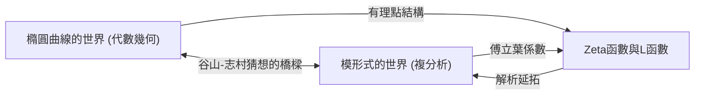
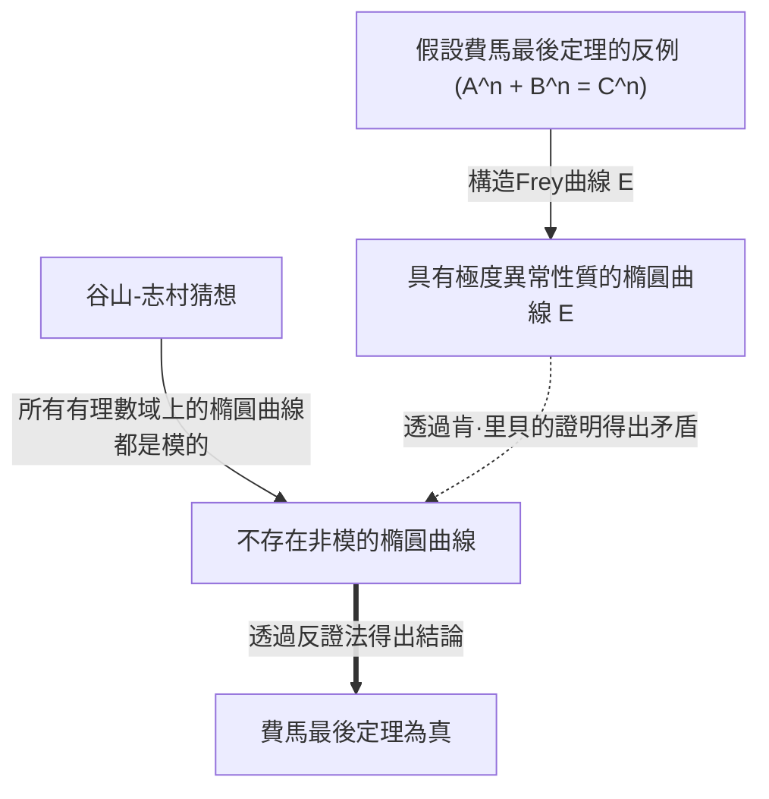

# [谷山豐：挑戰未解決問題的天才數學家之一生與成就](https://kenji.blog/zh-tw/p/taniyama-yutaka/)

現代數學中最具戲劇性且最重要的進展之一，便是「[費馬最後定理](https://kenji.blog/zh-tw/p/fermats-last-theorem/)」的證明。在這項偉大成就的背後，存在著由兩位日本數學家提出的驚人猜想。其中之一便是英年早逝的 **[谷山豐](https://kenji.blog/zh-tw/p/taniyama-yutaka/)** （1927年 - 1958年）。在本文中，我們將深入探討他所提出的「谷山-志村猜想」蘊含著多麼宏大的願景，以及他本人波折跌宕的一生。

## 1. [谷山豐](https://kenji.blog/zh-tw/p/taniyama-yutaka/)的早年與青年時期

[谷山豐](https://kenji.blog/zh-tw/p/taniyama-yutaka/)於1927年出生於日本埼玉縣騎西町（現加須市）。他從小就展現出非凡的數學天賦，但他的學生時代正值第二次世界大戰的混亂時期。他曾患上結核病，導致長時間缺席高中課程，但在療養期間，他獨自閱讀數學書籍，透過自學培養了深刻的數學思維。據說，這段孤獨的時光磨礪了他獨特而直覺敏銳的數學感官。

進入東京大學理學部數學科後，他對抽象代數和數論產生了濃厚的興趣。當時的日本數學界雖處於戰後重建期，但在深受[高木貞治](https://kenji.blog/zh-tw/p/takagi-teiji/)和 Emil Artin 影響的年輕研究者們的帶領下，正致力於世界頂尖水準的研究。谷山在這樣的熱潮中，逐漸綻放了自己的才華。

## 2. 與[志村五郎](https://kenji.blog/zh-tw/p/shimura-goro/)的相遇

在東京大學，谷山遇到了將成為他一生摯友的 **[志村五郎](https://kenji.blog/zh-tw/p/shimura-goro/)** 。兩人性格截然不同，但對數學有著同樣深厚的熱情。谷山憑直覺行事，腦海中不斷湧現新想法，而志村則用嚴謹的邏輯將其加以證實，兩人建立了堪稱完美的互補關係。

[志村五郎](https://kenji.blog/zh-tw/p/shimura-goro/)後來評價谷山說：「他犯了許多錯誤，但大多都是朝著好方向的錯誤。」谷山的直覺常常包含邏輯上的跳躍，但在這跳躍之後，總能展現出全新的數學風景。兩人相互啟發，全身心地投入到當時數學界最前沿的「複乘理論」和「代數幾何學」研究中。

## 3. 谷山-志村猜想：兩個世界的統一

他們最大的成就，在於將看似毫不相干的兩個數學對象——「橢圓曲線」和「模形式」聯繫在了一起。這項偉大發現後來被稱為「谷山-志村猜想」（或模組性定理）。

### 橢圓曲線（Elliptic Curves）

橢圓曲線可以用如下平滑的三次曲線方程式來表示：

$$ E: y^2 = x^3 + a x + b $$

在這裡， $a$ 和 $b$ 是常數，且滿足 $4a^3 + 27b^2 \neq 0$ 。這個條件意味著曲線沒有奇異點（如尖點或自交點）。橢圓曲線上的有理點集合具有群的結構，因此它是一個既具有幾何意義又包含深刻代數性質的對象。在數論中，求橢圓曲線上的有理點一直是一個古老的難題。

### 模形式（Modular Forms）

另一方面，模形式是定義在複上半平面（虛部為正的複數集合）上的、具有極高對稱性的複解析函數。模形式 $f(z)$ 對於特定的變換群（模群）滿足以下性質：

$$ f\left( \frac{az+b}{cz+d} \right) = (cz+d)^k f(z) $$

在這裡， $a, b, c, d$ 是滿足 $ad-bc=1$ 的整數矩陣元素，而 $k$ 是被稱為模形式的權重（weight）的整數。模形式有時被稱為「具有四維對稱性的函數」，是一個極其複雜且抽象的對象。

### 猜想的內容與意義

簡單來說，「谷山-志村猜想」主張 **「所有定義在有理數域上的橢圓曲線都是模的」** 。更嚴格地說，它斷言任何有理數域上的橢圓曲線 $E$ 的L函數 $L(E, s)$ ，都與某個權重為2的模形式 $f$ 的L函數 $L(f, s)$ 完全一致。

$$ \text{For any elliptic curve } E / \mathbb{Q}, \text{ there exists a modular form } f \text{ such that } L(E, s) = L(f, s) $$

這意味著，代數幾何世界的居民「橢圓曲線」的DNA，與複分析世界的居民「模形式」的DNA是完全相同的。這個猜想以一種驚人的視野，在數學中兩個截然不同的領域之間架起了一座堅固的橋樑。

## 4. 1955年的日光研討會

這個宏大的猜想首次在公開場合被提及，是在1955年於日本日光舉辦的代數數論國際研討會上。當時世界上頂尖的數學家，如[安德烈·韋伊](https://kenji.blog/zh-tw/p/weil/)（[André Weil](https://kenji.blog/zh-tw/p/weil/)）和讓-皮埃爾·塞爾（Jean-Pierre Serre）等都參加了此次會議。

谷山向研討會的參與者分發了一些用英文列印的未解決問題。其中的第12個和第13個問題，包含了後來發展為「谷山-志村猜想」的思想萌芽。谷山大膽地提出，橢圓曲線的Zeta函數或許可以從某種模形式的傅立葉係數中得到。

最初，幾乎沒有數學家相信這個猜想。因為它太不可思議了，很難想像兩個不同的領域會有如此緊密的聯繫。據說連韋伊起初也持懷疑態度（不過後來韋伊意識到了這個猜想的重要性，並為其形式化做出了貢獻，因此它有時也被稱為「谷山-志村-韋伊猜想」）。

## 5. 悲劇性的結局

作為一名數學家，谷山的事業似乎一帆風順，他甚至收到了普林斯頓高等研究院的邀請。然而，在1958年11月17日，他選擇了結束自己的生命，年僅31歲。這件事發生在他原定結婚的前一個月，給日本數學界以及他周圍的人帶來了巨大的震驚。

他的遺書中並未寫明具體的煩惱。他寫道：「直到昨天，我都沒有明確的自殺意圖。」這表明他自己也無法完全用邏輯解釋自己的行為。也許是因為過度勞累，也許是對未來的莫明焦慮，但真正的原因至今仍是個謎。幾週後，深愛著他的未婚妻也留下了「他一個人走了，我必須去陪他」的遺書，隨他而去。這場悲劇性的結局，給所有相關人員的心中留下了深深的創傷。

## 6. 通往[費馬最後定理](https://kenji.blog/zh-tw/p/fermats-last-theorem/)的橋樑

谷山去世後，[志村五郎](https://kenji.blog/zh-tw/p/shimura-goro/)用嚴謹的形式重新表述了這個猜想，並將其推廣給全世界的數學家。很長一段時間裡，這個猜想被認為是如此困難，以至於幾乎「不可證明」。然而到了20世紀80年代，事情迎來了戲劇性的轉折。德國數學家格哈德·弗雷（Gerhard Frey）提出了一個驚人的想法： **「如果[費馬最後定理](https://kenji.blog/zh-tw/p/fermats-last-theorem/)存在反例，那麼由該反例構造出的橢圓曲線，不可能是模的。」** 

弗雷構造的橢圓曲線（Frey曲線）形式如下。假設費馬方程式 $A^n + B^n = C^n$ 存在整數解。利用這個解，我們構造出以下橢圓曲線：

$$ E: y^2 = x (x - A^n) (x + B^n) $$

這條曲線具有極度「異常」的性質，被認為絕對無法由模形式構造出來（即它不是模的）。弗雷的直覺後來透過法國數學家讓-皮埃爾·塞爾提出的「伊普西龍猜想」，由美國數學家肯·里貝（Ken Ribet）給出了嚴格的證明。

由此，一個完整的邏輯鏈條形成了：
1. 如果[費馬最後定理](https://kenji.blog/zh-tw/p/fermats-last-theorem/)為假，則存在非模的橢圓曲線（Frey曲線）。
2. 然而，根據谷山-志村猜想，「所有的橢圓曲線都是模的」。
3. 因此，如果谷山-志村猜想為真，Frey曲線就不可能存在，[費馬最後定理](https://kenji.blog/zh-tw/p/fermats-last-theorem/)也就必須為真。

換句話說，命運的鎖鏈被連通了： **「只要證明了谷山-志村猜想，懸而未決300多年的[費馬最後定理](https://kenji.blog/zh-tw/p/fermats-last-theorem/)就會自動得到證明。」** 

## 7. 猜想的證明與朗蘭茲綱領

對這一事實感到最振奮的，莫過於英國數學家 **[安德魯·懷爾斯](https://kenji.blog/zh-tw/p/wiles/)** 。他從小就對[費馬最後定理](/zh-tw/p/fermats-last-theorem/)著迷，並決心將其作為一生的追求。經過七年秘密的潛心研究，他於1993年宣布「證明了半穩定橢圓曲線的谷山-志村猜想」。儘管證明中後來發現了一個漏洞，但在他昔日學生理查德·泰勒（Richard Taylor）的幫助下，懷爾斯在1995年成功填補了漏洞，並發表了完整的證明論文。至此，谷山留下的猜想中至關重要的部分得到了證明，[費馬最後定理](https://kenji.blog/zh-tw/p/fermats-last-theorem/)也隨之成為了永恆的真理。

隨後，透過克里斯多福·布勒伊（Christophe Breuil）、布萊恩·康拉德（Brian Conrad）、弗雷德·戴蒙德（Fred Diamond）和理查德·泰勒等人的進一步努力，在2001年，對於所有橢圓曲線的谷山-志村猜想被完全證明。今天，這個定理被稱為「模組性定理（Modularity Theorem）」。

谷山-志村猜想是現代數學中被稱為「朗蘭茲綱領」這一宏大框架下，最美麗、最成功的一個例子。朗蘭茲綱領是一項試圖統一數論、代數幾何、表示論等領域的宏偉計畫，常被稱為「數學的大統一理論」。而谷山的直覺，正是打開那扇門的一把鑰匙。

## 8. 結語

半個世紀後，[谷山豐](https://kenji.blog/zh-tw/p/taniyama-yutaka/)在日光研討會上提出的那個不起眼的猜想，成為了人類智慧金字塔——[費馬最後定理](https://kenji.blog/zh-tw/p/fermats-last-theorem/)的基石。他所洞察到的「不同數學對象背後隱藏的聯繫」，至今仍在激勵著無數數學家。

英年早逝的天才數學家，[谷山豐](https://kenji.blog/zh-tw/p/taniyama-yutaka/)。他留下的美麗猜想，將繼續作為照亮數學這片浩瀚宇宙的路標。如果我們不禁會去想像，若是他還活著，還會向我們展示多少深邃的真理。
