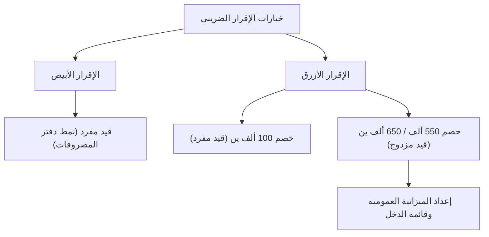

## 1. مقدمة: واجهة تُدعى نظام التقييم الضريبي الذاتي

يُعد الإقرار الضريبي النهائي (確定申告، *كاكوتيه شينكوكو*) الواجهة الأكثر أهمية التي تجري الدولة والأفراد من خلالها معاملاتهم المالية. ويستند النظام الضريبي في اليابان إلى مبدأ "نظام الإقرار الضريبي الذاتي" (申告納税制度)، حيث يقوم المكلف بنفسه باحتساب دخله ومقدار الضريبة المستحقة وتقديم إقراره إلى الدولة. ومع ذلك، وبما أن هذه العملية تتم آلياً لغالبية أصحاب الرواتب من خلال "نظام الاستقطاع من المنبع" (源泉徴収制度) و"التسوية السنوية للضريبة" (年末調整)، فإن فرصة إدراك المفهوم الشامل للتقييم الضريبي الذاتي تظل محدودة بالنسبة للكثيرين.

يتناول هذا المقال بشيء من التفصيل نظام تقديم الإقرارات الضريبية في اليابان، بدءاً من الخلفية التاريخية لنظام الاستقطاع من المنبع وتصنيفات الدخل العشرة، مروراً بالفروق في متطلبات مسك الدفاتر بين الإقرارين "الأزرق" و"الأبيض"، وصولاً إلى آليات الخصومات والإعفاءات الضريبية المتنوعة.

## 2. الخلفية التاريخية لنظام الاستقطاع من المنبع والتسوية السنوية

### نشأة نظام الاستقطاع من المنبع

تعود جذور نظام الاستقطاع الضريبي من المنبع في اليابان إلى ما قبل الحرب العالمية الثانية، وتحديداً عام 1940 (العام 15 من حقبة شووا). وبموجب إصلاح ضريبي استهدف تمويل النفقات الحربية، تم استحداث نظام يستقطع فيه أصحاب العمل الذين يدفعون الرواتب الضريبة مباشرة ويوردونها إلى خزينة الدولة لضمان تحصيل ضريبي أكثر موثوقية وكفاءة. أسهم هذا النظام في تخفيف شعور دافع الضرائب بوطأة العبء المالي (ما يُعرف بتخفيف "ألم الضريبة")، ووفر للدولة في الوقت ذاته مصدراً مستقراً للإيرادات المالية.

### التسوية السنوية: تسوية مبالغ الاستقطاع

يُعتبر الاستقطاع الضريبي من المنبع مجرد تحصيل "تقديري". فإذا تغير عدد المعالين في الأسرة خلال العام، أو سُددت أقساط تأمين على الحياة، تنشأ فجوة بين المبلغ المقتطع تقديرياً والضريبة الفعلية الواجب سدادها. وهنا يأتي دور "التسوية السنوية" (年末調整) لسد هذه الفجوة؛ حيث تعيد الشركات احتساب الدخل السنوي والخصومات نيابة عن موظفيها لتسوية الفائض أو النقص. وبفضل هذه الآلية، لا يحتاج معظم الموظفين إلى تقديم إقرار ضريبي نهائي بأنفسهم.

بيد أن العاملين لحسابهم الخاص (المستقلين)، وأصحاب المنشآت الفردية، ومن لديهم مصادر دخل متعددة، أو أولئك الراغبين في الاستفادة من خصومات محددة (مثل خصم قروض الإسكان للسنة الأولى أو النفقات الطبية المرتفعة)، يتعين عليهم تقديم الإقرار الضريبي النهائي بأنفسهم.

## 3. الهيكل التصاعدي لضريبة الدخل

تعتمد ضريبة الدخل في اليابان هيكلاً يُعرف بـ "الضريبة التصاعدية بالشرائح"، حيث تُطبق معدلات ضريبية أعلى تدريجياً كلما زاد الدخل. وتنقسم معدلات الضريبة إلى 7 شرائح تتراوح بين 5% وتصل إلى 45%:

- حتى 1,950,000 ين: 5%
- أكثر من 1,950,000 ين وحتى 3,300,000 ين: 10%
- أكثر من 3,300,000 ين وحتى 6,950,000 ين: 20%
- أكثر من 6,950,000 ين وحتى 9,000,000 ين: 23%
- أكثر من 9,000,000 ين وحتى 18,000,000 ين: 33%
- أكثر من 18,000,000 ين وحتى 40,000,000 ين: 40%
- أكثر من 40,000,000 ين: 45%

النقطة الجوهرية هنا هي أن أعلى معدل ضريبي لا يُفرض على إجمالي الدخل، وإنما يُطبق فقط على "الجزء الذي يتجاوز حداً معيناً". يحقق هذا التصميم توازناً دقيقاً بين أداء وظيفة إعادة توزيع الدخل والحفاظ على حوافز العمل دون تثبيطها.

## 4. تصنيفات الدخل العشرة

يصنف قانون ضريبة الدخل الياباني مصادر الدخل إلى 10 فئات وفقاً لطبيعتها، ويحدد لكل منها طريقة حساب مختلفة، وهو ما يُضفي طابع التعقيد على الإقرار الضريبي.

1. **دخل الفوائد (利子所得)**: الفوائد المتأتية من الودائع المصرفية والسندات الحكومية وسندات الشركات وغيرها.
2. **دخل الأرباح الموزعة (配当所得)**: أرباح الأسهم وتوزيعات الصناديق الاستثمارية.
3. **دخل العقارات (不動産所得)**: العائدات المتأتية من تأجير الأراضي والمباني.
4. **دخل الأعمال الحرة والتجارية (事業所得)**: الدخل الناشئ عن أنشطة الزراعة والصيد والتصنيع وتجارة الجملة والتجزئة والخدمات. وغالباً ما تندرج مستحقات المستقلين ضمن هذه الفئة.
5. **دخل الرواتب والأجور (給与所得)**: الرواتب والمكافآت التي يتقاضاها الموظفون والعاملون بدوام جزئي.
6. **دخل مكافأة نهاية الخدمة (退職所得)**: مكافآت التقاعد ونهاية الخدمة، وتخضع لحسابات خاصة لتخفيف العبء الضريبي.
7. **دخل الغابات والأخشاب (山林所得)**: الدخل المتحقق من قطع ونقل وبيع أشجار الغابات.
8. **دخل الأرباح الرأسمالية ونقل الملكية (譲渡所得)**: الأرباح الناتجة عن بيع الأصول مثل الأراضي والمباني والأسهم وعضويات أندية الغولف.
9. **الدخل العرضي أو المؤقت (一時所得)**: المداخيل غير المنتظمة مثل الجوائز النقدية، وأرباح سباقات الخيل، ومبالغ التأمين المقطوعة.
10. **الدخل المتنوع (雑所得)**: أي دخل لا ينطبق عليه أي من التصنيفات التسعة السابقة؛ ويشمل المعاشات التقاعدية الحكومية، والدخل من الأعمال الجانبية الصغيرة، وأرباح تداول الأصول المشفرة (العملات الرقمية).

## 5. متطلبات مسك الدفاتر: الإقرار الأزرق مقابل الإقرار الأبيض

عندما يقدم أصحاب الأعمال الفردية أو ملاك العقارات إقرارهم الضريبي، فإنهم يختارون عادة بين مسارين رئيسيين: "الإقرار الأزرق" (青色申告) و"الإقرار الأبيض" (白色申告).

### الإقرار الأبيض: قيود بسيطة بنظام القيد المفرد

يسمح الإقرار الأبيض بمسك الدفاتر بنظام "القيد المفرد"، وهو شبيه بدفتر المصروفات المنزلية؛ إذ يكتفي المكلف بتسجيل الإيرادات والمصروفات اليومية دون اشتراط تقديم طلب مسبق. غير أن الامتيازات الضريبية تكاد تكون منعدمة في هذا المسار. وفي حين كان هناك في السابق إعفاء من الالتزام بمسك الدفاتر لبعض الحالات، أصبح التوثيق وحفظ السجلات إلزامياً في الوقت الراهن لجميع مقدمي الإقرار الأبيض.

### الإقرار الأزرق: قيد مزدوج ومزايا توفير ضريبي قوية

يتطلب الإقرار الأزرق تقديم طلب موافقة مسبق إلى مكتب الضرائب. وتتمثل ميزته الكبرى في الأهلية للحصول على "الخصم الخاص بالإقرار الأزرق". فعند استيفاء الشروط، يمكن خصم ما يصل إلى 650,000 ين (أو 550,000 ين أو 100,000 ين) من الدخل الخاضع للضريبة، مما يوفر مزايا ضريبية مجزية.

وللحصول على خصم 650,000 ين أو 550,000 ين، يُشترط مسك دفاتر دقيقة بنظام "القيد المزدوج". في هذا النظام، تُسجل كل معاملة من زاويتين (مدين ودائن)، ويتم إعداد "الميزانية العمومية" و"قائمة الدخل"، مما يعكس بوضوح المركز المالي ونتائج الأعمال.

## 6. آليات الخصومات والإعفاءات

"الخصومات من الدخل" (الإعفاءات) هي مبالغ تُطرح من إجمالي الدخل مراعاةً للظروف الشخصية لدافع الضرائب (كالوضع العائلي، أو الحالات المرضية، أو نفقات محددة) بهدف تحقيق العدالة الضريبية.

### الخصم الأساسي
خصم يُمنح لجميع دافعي الضرائب دون قيد أو شرط مسبق. ويبلغ الخصم 480,000 ين إذا كان إجمالي الدخل 24 مليون ين أو أقل. ويتناقص الخصم تدريجياً مع زيادة الدخل، حتى ينعدم تماماً لمن يتجاوز دخلهم 25 مليون ين.

### خصم النفقات الطبية
إذا تجاوزت النفقات الطبية المدفوعة خلال العام (من 1 يناير إلى 31 ديسمبر) للشخص نفسه أو لأفراد أسرته حداً معيناً (100,000 ين مبدئياً)، يمكن خصم المبلغ الفائض (بحد أقصى 2,000,000 ين) من الدخل. ولا يشمل ذلك تكاليف مراجعة الأطباء والأدوية الموصوفة فحسب، بل يمتد أيضاً إلى بعض الأدوية المتاحة دون وصفة بموجب نظام الرعاية الذاتية.

### فوروساتو نوزيه (خصم التبرعات للبلديات المحلية)
"فوروساتو نوزيه" هو نظام تبرع اختياري للبلديات المحلية، يُتيح خصم الجزء الذي يتجاوز 2,000 ين من مبلغ التبرع من ضريبة الدخل وضريبة السكن للعام التالي (وفق سقف محدد). ورغم أنه يُعد عملياً دفعاً مسبقاً للضرائب، إلا أنه يحظى بإقبال واسع لأن المتبرعين يتلقون في المقابل هدايا رمزية ومنتجات محلية من البلديات. ويُعامل هذا التبرع ضريبياً ضمن بند "خصم التبرعات".

## الخاتمة

ليس الإقرار الضريبي مجرد "إجراء روتيني لسداد الضرائب"، بل هو واجهة دقيقة تُعنى بمزامنة البيانات المالية بين الدولة والفرد لتحديد الأعباء بعدالة ومسؤولية. وفي عصر باتت فيه معالم هذه المنظومة تتوارى خلف كواليس نظام الاستقطاع من المنبع، يغدو الفهم الدقيق لآليات الدخل والضرائب—والاستفادة الحكيمة من الإقرار الأزرق ومختلف الخصومات المتاحة—ركيزة جوهرية لا غنى عنها في إدارة الثروة وبناء الأصول الشخصية.
