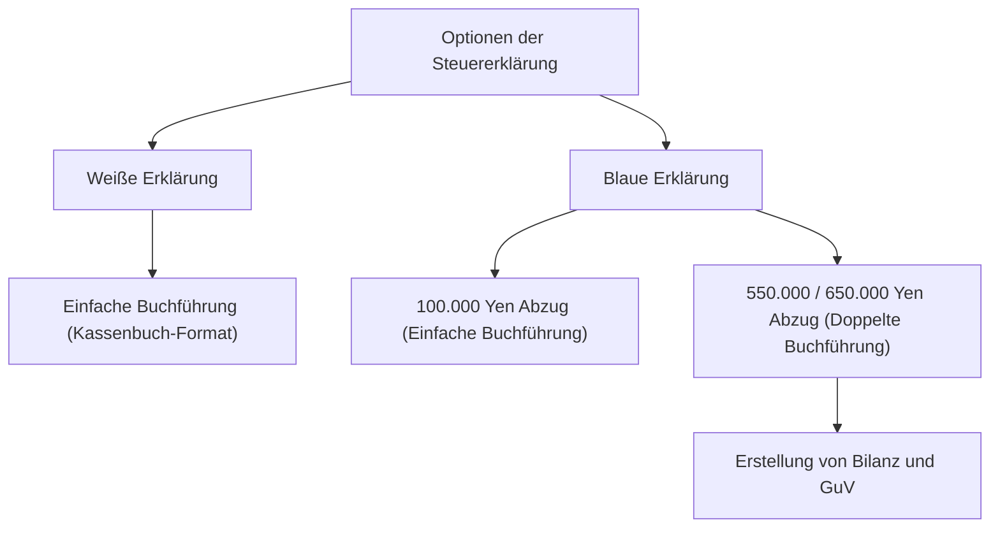

## 1. Einleitung: Eine Schnittstelle namens Selbstveranlagungssystem

Die Steuererklärung (確定申告, *Kakutei Shinkoku*) ist die wichtigste Schnittstelle für finanzielle Transaktionen zwischen Staat und Bürger. Das japanische Steuersystem basiert grundsätzlich auf dem Prinzip der Selbstveranlagung (申告納税制度), bei dem die Steuerzahler ihr Einkommen sowie den Steuerbetrag eigenständig ermitteln und an das Finanzamt melden. Da dieser Prozess für die meisten Angestellten durch das Quellensteuersystem (源泉徴収制度) und den Jahressteuerabgleich (年末調整) automatisiert abläuft, bietet sich selten die Gelegenheit, das Gesamtsystem der Selbstveranlagung bewusst wahrzunehmen.

In diesem Artikel beleuchten wir das japanische Steuererklärungssystem eingehend – von den historischen Hintergründen der Quellensteuer und den zehn Einkunftsarten über die buchhalterischen Anforderungen der blauen und weißen Steuererklärung bis hin zu den Mechanismen diverser Freibeträge und Abzüge.

## 2. Historischer Hintergrund der Quellensteuer und der Jahressteuerabgleich

### Die Entstehung der Quellensteuer

Der Ursprung des japanischen Quellensteuersystems reicht bis ins Jahr 1940 (Shōwa 15) vor dem Zweiten Weltkrieg zurück. Im Zuge einer Steuerreform zur Kriegsfinanzierung wurde ein System eingeführt, bei dem Arbeitgeber die Steuer direkt vom Gehalt einbehalten und an den Staat abführen, um Steuern verlässlicher und effizienter einzuziehen. Dies minderte die gefühlte Steuerlast (die sogenannte „Steuerschmerz“-Wahrnehmung) bei den Steuerzahlern und sicherte dem Staat zugleich stabile Einnahmen.

### Jahressteuerabgleich: Abrechnung der Quellensteuer

Die Quellensteuer stellt lediglich eine Schätzung dar. Ändert sich im Laufe des Jahres die Anzahl der unterhaltsberechtigten Angehörigen oder werden Beiträge zur Lebensversicherung geleistet, entsteht eine Differenz zwischen dem geschätzten Steuerabzug und der tatsächlich geschuldeten Steuer. Diese Lücke schließt der Jahressteuerabgleich (年末調整). Unternehmen berechnen das Jahreseinkommen und die Abzüge stellvertretend für ihre Mitarbeiter neu und gleichen Über- oder Unterzahlungen aus. Für die meisten Angestellten entfällt somit die Pflicht zur Abgabe einer Steuererklärung.

Freiberufler, Einzelunternehmer, Personen mit mehreren Einkommensquellen oder diejenigen, die bestimmte Abzüge geltend machen möchten (etwa die Steuerermäßigung für Hypothekendarlehen im ersten Jahr oder hohe Krankheitskosten), müssen ihre Steuererklärung jedoch selbst einreichen.

## 3. Die progressive Tarifstruktur der Einkommensteuer

Die japanische Einkommensteuer folgt einem progressiven Stufentarif. Mit steigendem Einkommen greifen schrittweise höhere Steuersätze. Der Steuersatz ist in sieben Stufen von 5 % bis maximal 45 % unterteilt:

- Bis 1.950.000 Yen: 5 %
- Über 1.950.000 Yen bis 3.300.000 Yen: 10 %
- Über 3.300.000 Yen bis 6.950.000 Yen: 20 %
- Über 6.950.000 Yen bis 9.000.000 Yen: 23 %
- Über 9.000.000 Yen bis 18.000.000 Yen: 33 %
- Über 18.000.000 Yen bis 40.000.000 Yen: 40 %
- Über 40.000.000 Yen: 45 %

Entscheidend ist hierbei, dass der Spitzensteuersatz nicht auf das Gesamteinkommen erhoben wird, sondern ausschließlich auf den Betrag, der den jeweiligen Schwellenwert übersteigt. Dieses Verfahren ermöglicht eine ausgewogene Balance zwischen sozialer Umverteilung und dem Erhalt des Arbeitsanreizes.

## 4. Die 10 Einkunftsarten

Das Einkommensteuergesetz unterteilt Einkünfte nach ihrer Beschaffenheit in zehn Kategorien und definiert für jede spezifische Berechnungsmethoden. Diese Komplexität trägt maßgeblich dazu bei, dass Steuererklärungen oft als kompliziert empfunden werden.

1. **Zinseinkünfte (利子所得)**: Zinsen aus Bankguthaben, Anleihen etc.
2. **Dividendenerträge (配当所得)**: Dividenden aus Aktien, Gewinnausschüttungen aus Investmentfonds etc.
3. **Einkünfte aus Vermietung und Verpachtung (不動産所得)**: Erträge aus der Vermietung von Grundstücken oder Gebäuden.
4. **Gewerbliche Einkünfte (事業所得)**: Einkünfte aus Landwirtschaft, Fischerei, Produktion, Groß- und Einzelhandel, Dienstleistungen und anderen unternehmerischen Tätigkeiten. Auch Freiberufler fallen meist hierunter.
5. **Einkünfte aus nichtselbstständiger Arbeit (給与所得)**: Gehälter, Löhne und Boni von Angestellten und Teilzeitkräften.
6. **Versorgungseinkünfte / Abfindungen (退職所得)**: Abfindungen und Altersruhegelder. Es gilt eine steuerbegünstigte Sonderberechnung.
7. **Forstwirtschaftliche Einkünfte (山林所得)**: Einkünfte aus dem Holzeinschlag und der Veräußerung von Waldbeständen.
8. **Veräußerungsgewinne (譲渡所得)**: Gewinne aus dem Verkauf von Vermögenswerten wie Grundstücken, Immobilien, Wertpapieren oder Golfclub-Mitgliedschaften.
9. **Einmalige Einkünfte (一時所得)**: Nicht wiederkehrende Einkünfte wie Lotteriegewinne, Wettgewinne oder Einmalzahlungen aus Lebensversicherungen.
10. **Sonstige Einkünfte (雑所得)**: Einkünfte, die keiner der vorgenannten neun Kategorien zuzuordnen sind. Dazu zählen gesetzliche Renten, Nebentätigkeiten (kleineren Umfangs) und Gewinne aus dem Handel mit Kryptowährungen.

## 5. Buchführungsanforderungen: Blaue vs. Weiße Steuererklärung

Wenn Einzelunternehmer oder Immobilieneigentümer eine Steuererklärung einreichen, können sie im Wesentlichen zwischen zwei Verfahren wählen: der „blauen Steuererklärung“ (青色申告) und der „weißen Steuererklärung“ (白色申告).

### Weiße Erklärung: Einfache Einnahmen-Überschuss-Rechnung

Bei der weißen Steuererklärung ist eine einfache Buchführung nach Art eines Kassenbuchs (einfache Buchführung) zulässig. Es genügt, die täglichen Einnahmen und Ausgaben zu dokumentieren, ohne dass ein vorheriger Antrag nötig wäre. Im Gegenzug gibt es jedoch kaum steuerliche Vergünstigungen. Während früher Befreiungen von der Buchführungspflicht existierten, sind heute ausnahmslos alle Einreicher einer weißen Erklärung zur Aufzeichnung und Aufbewahrung von Belegen verpflichtet.

### Blaue Erklärung: Doppelte Buchführung und erhebliche Steuervorteile

Für die blaue Steuererklärung ist ein vorheriger Genehmigungsantrag beim Finanzamt erforderlich. Ihr herausragendster Vorteil ist der „Sonderabzug für die blaue Steuererklärung“. Bei Erfüllung der Kriterien können bis zu 650.000 Yen (bzw. 550.000 Yen oder 100.000 Yen) vom steuerpflichtigen Einkommen abgezogen werden, was zu spürbaren Steuerersparnissen führt.

Um den Höchstabzug von 650.000 oder 550.000 Yen in Anspruch zu nehmen, ist eine ordnungsgemäße „doppelte Buchführung“ vorgeschrieben. Bei der doppelten Buchführung wird jeder Geschäftsvorfall zweifach erfasst (Soll und Haben), wodurch eine Bilanz und eine Gewinn- und Verlustrechnung erstellt werden können. Dies ermöglicht eine präzise Einsicht in die Vermögens- und Ertragslage des Unternehmens.

## 6. Die Mechanismen von Steuerabzügen und Freibeträgen

„Einkommensabzüge“ sind Beträge, die vom Gesamteinkommen subtrahiert werden, um individuellen Lebensumständen (wie Familienstand, Krankheiten oder besonderen Aufwendungen) Rechnung zu tragen und eine faire Steuerlast zu gewährleisten.

### Grundfreibetrag
Ein Freibetrag, der allen Steuerzahlern grundsätzlich zusteht. Bei einem Gesamteinkommen von bis zu 24 Millionen Yen beträgt der Freibetrag pauschal 480.000 Yen. Mit steigendem Einkommen schmilzt der Freibetrag schrittweise ab und entfällt ab 25 Millionen Yen vollständig.

### Abzug für außergewöhnliche Krankheitskosten
Übersteigen die im Kalenderjahr (1. Januar bis 31. Dezember) für sich selbst oder Familienangehörige getragenen Krankheitskosten einen Schwellenwert (in der Regel 100.000 Yen), kann der darüber hinausgehende Betrag (bis zu maximal 2.000.000 Yen) als außergewöhnliche Belastung vom Einkommen abgezogen werden. Neben Arztkosten und rezeptpflichtigen Medikamenten fallen darunter auch bestimmte rezeptfreie Arzneimittel im Rahmen der Selbstmedikationsregelung.

### Furusato Nozei (Spendenabzug für Heimatorte)
Furusato Nozei ist ein Spendensystem, bei dem Spenden an beliebige Kommunen in Japan abzüglich eines Eigenanteils von 2.000 Yen auf die Einkommensteuer und die Wohnsitzsteuer des Folgejahres angerechnet werden (bis zu einer Höchstgrenze). Praktisch handelt es sich um eine vorgezogene Steuerzahlung; da die Gemeinden jedoch oft hochwertige Sachgeschenke (Gegenleistungen wie regionale Spezialitäten) zurücksenden, ist dieses System außerordentlich populär. Steuerlich wird es im Rahmen des Spendenabzugs geltend gemacht.

## Fazit

Die Steuererklärung ist weit mehr als eine lästige Pflicht zur Steuerentrichtung: Sie fungiert als fein austarierter Synchronisationsmechanismus zwischen Staat und Individuum zur gerechten Lastenverteilung. Gerade in einer Zeit, in der das Quellensteuersystem diesen Prozess für viele unsichtbar macht, ist das fundierte Verständnis der eigenen Einkünfte und Abzugsmöglichkeiten – insbesondere durch die blaue Steuererklärung – ein unverzichtbarer Baustein für einen erfolgreichen persönlichen Vermögensaufbau.
