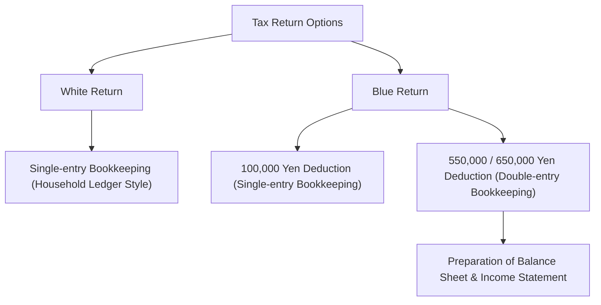

## 1. Introduction: An Interface Named the Self-Assessment Taxation System

The final tax return (確定申告, *kakutei shinkoku*) is the most crucial interface through which the state and individuals conduct economic transactions. Japan's tax system is based on the principle of the "self-assessment taxation system" (申告納税制度), where taxpayers calculate their own income and tax liability, and report it to the national tax authorities. However, because this process is automated for most salaried workers via the "withholding tax system" (源泉徴収制度) and "year-end adjustment" (年末調整), there are limited opportunities for many to be conscious of the overall self-assessment framework.

In this article, we delve deeply into Japan's tax return filing mechanism—from the historical background of withholding tax and the 10 categories of income, to the bookkeeping differences between Blue and White returns, and the mechanics of various tax deductions.

## 2. Historical Background of Withholding Tax and Year-End Adjustment

### The Birth of Withholding Tax

The origin of Japan's withholding tax system dates back to 1940 (Showa 15), before World War II. Under a tax reform aimed at war financing, the system was introduced where employers who pay salaries deduct taxes directly at the source and remit them to the state, ensuring more reliable and efficient tax collection. This system reduced the taxpayer's psychological burden of paying taxes (so-called "tax pain") while providing the government with a stable stream of revenue.

### Year-End Adjustment: Settling Withheld Taxes

Withholding tax is ultimately collected as an "estimate." If family dependents change or life insurance premiums are paid during the year, a discrepancy arises between the estimated amount withheld and the actual tax owed. The "year-end adjustment" fills this gap. Employers recalculate annual income and deductions on behalf of employees, reconciling any excess or shortfall. Consequently, most company employees do not need to file a final tax return.

However, freelancers, sole proprietors, individuals with multiple income streams, or those wishing to claim specific deductions (such as the first-year home mortgage deduction or high medical expense deductions) must file a tax return themselves.

## 3. The Progressive Tax Rate Structure of Income Tax

Japan's income tax uses a "graduated progressive tax" structure. Under this system, progressively higher tax rates are applied as income increases. The tax rate is divided into seven brackets ranging from 5% to a maximum of 45%:

- Up to 1,950,000 yen: 5%
- Over 1,950,000 yen up to 3,300,000 yen: 10%
- Over 3,300,000 yen up to 6,950,000 yen: 20%
- Over 6,950,000 yen up to 9,000,000 yen: 23%
- Over 9,000,000 yen up to 18,000,000 yen: 33%
- Over 18,000,000 yen up to 40,000,000 yen: 40%
- Over 40,000,000 yen: 45%

Crucially, the highest tax rate is not applied to one's entire income, but only to the portion exceeding each threshold. This structure strikes a balance between income redistribution and preserving work incentives.

## 4. The 10 Categories of Income

The Income Tax Act classifies income into 10 categories based on its nature, defining distinct calculation rules for each. This complexity is one reason filing a tax return can seem daunting.

1. **Interest Income**: Interest from bank deposits, public and corporate bonds, etc.
2. **Dividend Income**: Dividends from corporate shares, profit distributions from investment trusts, etc.
3. **Real Estate Income**: Income generated from leasing land or buildings.
4. **Business Income**: Income arising from agriculture, fisheries, manufacturing, wholesale, retail, services, and other businesses. Freelance earnings often fall here.
5. **Employment (Salary) Income**: Salaries, wages, and bonuses earned by company employees and part-time workers.
6. **Retirement Income**: Severance pay and retirement benefits. Special calculations apply to ease the tax burden.
7. **Timber Income**: Income derived from harvesting and transferring timber / forest property.
8. **Capital Gains (Transfer Income)**: Income from transferring assets such as land, buildings, stocks, and golf club memberships.
9. **Occasional (Temporary) Income**: Non-recurring income such as prize money, racetrack payouts, or lump-sum insurance payouts.
10. **Miscellaneous Income**: Income that does not fit into any of the above 9 categories. This includes public pensions, side business earnings (on a small scale), and profits from cryptocurrency / digital asset trading.

## 5. Bookkeeping Requirements: Blue Return vs. White Return

When sole proprietors or real estate owners file a final tax return, they broadly choose between two filing methods: the "Blue Return" (青色申告) and the "White Return" (白色申告).

### White Return: Simple Single-Entry Bookkeeping

The White Return permits bookkeeping using "single-entry bookkeeping," similar to a household ledger. Taxpayers simply need to record daily income and expenses without needing prior special approval. However, tax benefits are minimal. While bookkeeping exemptions previously existed for certain low-income filers, all White Return filers are now required to maintain and preserve bookkeeping records.

### Blue Return: Double-Entry Bookkeeping and Powerful Tax Savings

Filing a Blue Return requires prior approval from the tax office. Its primary advantage is eligibility for the "Special Blue Return Deduction." By meeting the criteria, taxpayers can deduct up to 650,000 yen (or 550,000 yen / 100,000 yen) from taxable income, resulting in significant tax savings.

To qualify for the 650,000 yen or 550,000 yen deduction, strict "double-entry bookkeeping" is mandatory. In double-entry bookkeeping, each transaction is recorded from two perspectives—debit and credit—allowing the preparation of a balance sheet and an income statement. This provides an accurate picture of both financial condition and business performance.

## 6. The Deduction Mechanism

"Income deductions" are deductions subtracted from taxable income to account for taxpayers' personal circumstances (such as family composition, medical conditions, or specific expenditures), ensuring fairness in tax burdens.

### Basic Deduction
A deduction universally applied to all taxpayers. A flat deduction of 480,000 yen is granted if total income is 24 million yen or less. The deduction amount phases out as income increases, dropping to zero above 25 million yen.

### Medical Expense Deduction
If medical expenses paid for oneself or family members during the calendar year (January 1 to December 31) exceed a specific threshold (generally 100,000 yen), the excess amount (up to 2,000,000 yen) can be deducted from income. This covers doctor visits, prescription drugs, and certain over-the-counter medicines under the self-medication taxation scheme.

### Furusato Nozei (Hometown Tax Donation Deduction)
Furusato Nozei is a system where donations made to any chosen municipality allow the portion exceeding 2,000 yen to be deducted from income tax and the following year's resident tax (subject to an upper limit). While practically a prepayment of taxes, it is wildly popular because donors can receive local specialty gift products ("thank-you gifts") from the municipalities. In tax accounting, this is treated under the "Donation Deduction."

## Conclusion

A final tax return is far more than just a procedure to pay taxes; it is a precise interface designed to synchronize financial information between the state and the individual, ensuring an equitable distribution of public burdens. Precisely because the withholding tax system renders this interface largely invisible in daily life, developing a proper understanding of one's income and taxes—and actively utilizing the Blue Return and various deductions—is indispensable for sound personal financial management.
