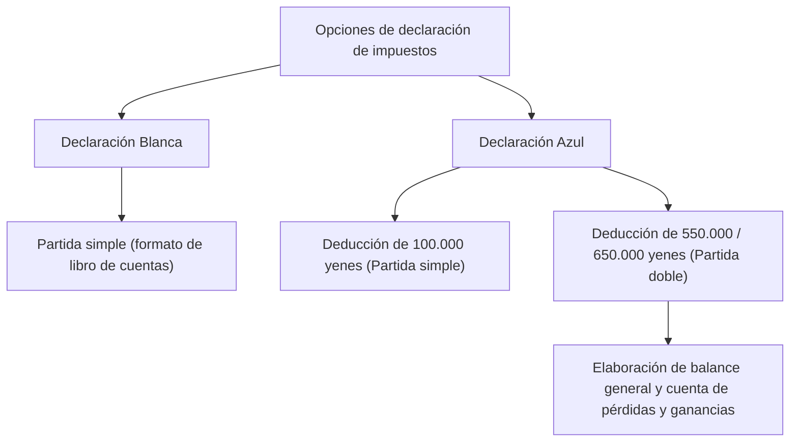

## 1. Introducción: La interfaz llamada sistema de autoliquidación tributaria

La declaración de impuestos (*Kakutei Shinkoku*) es la interfaz más importante para los intercambios económicos entre el Estado y los ciudadanos. El sistema fiscal japonés se basa en el principio del "sistema de declaración y pago voluntario", donde el propio contribuyente calcula sus ingresos e impuestos y los declara ante el Estado. Sin embargo, para la mayoría de los trabajadores asalariados, este proceso está automatizado a través del "sistema de retención en origen" y el "ajuste fiscal de fin de año", lo que limita las oportunidades de ser conscientes del funcionamiento general del sistema tributario de autoliquidación.

En este artículo, explicaremos en profundidad el sistema japonés de declaración de impuestos, desde el trasfondo histórico del sistema de retención en origen hasta las 10 categorías de ingresos, las diferencias en los requisitos contables entre la declaración azul y la declaración blanca, y el mecanismo de las diversas deducciones fiscales.

## 2. Antecedentes históricos de la retención en origen y el ajuste de fin de año

### El nacimiento del sistema de retención en origen

El origen del sistema de retención en origen en Japón se remonta a 1940 (año 15 de la era Shōwa), antes de la Segunda Guerra Mundial. Debido a una reforma fiscal destinada a recaudar fondos para la guerra y con el fin de cobrar los impuestos de forma más segura y eficiente, se introdujo un sistema en el que los empleadores que pagaban salarios retenían directamente el impuesto y lo ingresaban al Estado. Este sistema redujo la sensación de carga fiscal de los contribuyentes (el llamado alivio de la "percepción dolorosa del impuesto") y, al mismo tiempo, permitió al Estado asegurar una fuente de ingresos estable.

### Ajuste de fin de año: La liquidación de la retención en origen

La retención en origen es únicamente un cálculo "aproximado". Si a mitad de año cambian las cargas familiares o se pagan primas de seguros de vida, surge una discrepancia entre la cantidad retenida de forma estimada y el importe exacto del impuesto que corresponde pagar. El "ajuste de fin de año" se encarga de cubrir esta brecha. Las empresas recalculan los ingresos y deducciones anuales en nombre de sus empleados y ajustan cualquier exceso o déficit. Gracias a esto, la mayoría de los empleados de empresa no necesitan presentar una declaración de impuestos.

Sin embargo, los trabajadores autónomos (*freelancers*), propietarios de negocios individuales, personas con múltiples fuentes de ingresos o quienes desean aplicar ciertas deducciones (como la deducción por préstamo hipotecario en el primer año o gastos médicos elevados) deben presentar su declaración de impuestos por cuenta propia.

## 3. Estructura progresiva del impuesto sobre la renta

El impuesto sobre la renta en Japón tiene una estructura de "imposición progresiva por tramos". Se trata de un mecanismo en el que se aplican tasas impositivas progresivamente más altas a medida que aumentan los ingresos. La tasa impositiva se divide en 7 tramos, desde el 5% hasta un máximo del 45%.

- Hasta 1.950.000 yenes: 5%
- Más de 1.950.000 yenes hasta 3.300.000 yenes: 10%
- Más de 3.300.000 yenes hasta 6.950.000 yenes: 20%
- Más de 6.950.000 yenes hasta 9.000.000 yenes: 23%
- Más de 9.000.000 yenes hasta 18.000.000 yenes: 33%
- Más de 18.000.000 yenes hasta 40.000.000 yenes: 40%
- Más de 40.000.000 yenes: 45%

El punto clave aquí es que la tasa impositiva más alta no se aplica a la totalidad de los ingresos, sino únicamente a "la parte que supera una determinada cantidad". De este modo, se equilibra la función redistributiva de los ingresos sin desincentivar en exceso la motivación para trabajar.

## 4. Las 10 categorías de ingresos

La Ley del Impuesto sobre la Renta clasifica los ingresos en 10 tipos según su naturaleza, estableciendo métodos de cálculo diferentes para cada uno de ellos. Esta complejidad es una de las razones por las que la declaración de impuestos resulta tan intrincada.

1. **Rendimientos del capital mobiliario (Intereses)**: Intereses de depósitos, cuentas bancarias, bonos públicos y corporativos, etc.
2. **Rendimientos por dividendos**: Dividendos de acciones y distribuciones de beneficios de fondos de inversión.
3. **Rendimientos del capital inmobiliario**: Ingresos derivados del arrendamiento de terrenos o edificios.
4. **Rendimientos de actividades económicas**: Ingresos procedentes de actividades como agricultura, pesca, manufactura, comercio mayorista, minorista o servicios. Los honorarios de los autónomos suelen incluirse aquí.
5. **Rendimientos del trabajo (Sueldos y salarios)**: Salarios y bonificaciones percibidos por empleados de empresas y trabajadores a tiempo parcial.
6. **Rendimientos por jubilación o indemnizaciones por despido**: Indemnizaciones por jubilación, liquidaciones, etc. Tienen un cálculo especial que reduce la carga impositiva.
7. **Rendimientos forestales**: Ingresos obtenidos por la tala y enajenación de bosques o madera.
8. **Ganancias patrimoniales (Ganancias de capital)**: Ingresos derivados de la transmisión o venta de activos como terrenos, inmuebles, acciones o membresías de golf.
9. **Rentas ocasionales o esporádicas**: Premios de lotería o concursos, pagos por apuestas hípicas, pagos únicos de seguros de vida y otros ingresos que no tienen carácter continuado.
10. **Rentas diversas**: Ingresos que no encajan en ninguna de las 9 categorías anteriores. Incluye pensiones públicas, ingresos por actividades secundarias de pequeña escala, beneficios por transacciones con criptoactivos (criptomonedas), etc.

## 5. Requisitos contables: Declaración Azul vs. Declaración Blanca

Cuando los trabajadores por cuenta propia o propietarios inmobiliarios presentan su declaración de impuestos, existen a grandes rasgos dos modalidades: la "declaración azul" y la "declaración blanca".

### Declaración Blanca: Contabilidad simple de partida simple

La declaración blanca permite llevar un registro contable de "partida simple", similar a un libro de cuentas doméstico. Solo es necesario registrar los ingresos y gastos diarios, y no requiere ninguna solicitud previa especial. Sin embargo, apenas cuenta con ventajas o beneficios fiscales. En el pasado existían exenciones al registro contable, pero hoy en día todos los contribuyentes bajo la modalidad blanca están obligados a llevar registros y conservar sus libros contables.

### Declaración Azul: Contabilidad por partida doble y potentes ventajas fiscales

La declaración azul requiere una solicitud previa de aprobación ante la oficina de impuestos. Su mayor ventaja es el acceso a la "Deducción Especial de la Declaración Azul". Al cumplir con los requisitos, se puede deducir de los ingresos hasta 650.000 yenes (o 550.000 / 100.000 yenes), lo que ofrece un gran beneficio fiscal.

Para acceder a la deducción de 650.000 o 550.000 yenes, se exige una contabilidad estricta por "partida doble". En la contabilidad por partida doble, cada transacción se registra en dos vertientes: "Debe" y "Haber", elaborando el balance de situación y la cuenta de pérdidas y ganancias. Esto permite reflejar con precisión la situación financiera y los resultados de explotación de la actividad.

## 6. El mecanismo de las deducciones fiscales

Las "deducciones del impuesto sobre la renta" son un sistema que resta una determinada cantidad de los ingresos totales teniendo en cuenta las circunstancias personales del contribuyente (composición familiar, enfermedades, gastos extraordinarios, etc.), con el objetivo de garantizar una carga fiscal justa.

### Deducción básica
Es una deducción que se aplica incondicionalmente a todos los contribuyentes. Si el ingreso total anual es igual o inferior a 24 millones de yenes, se aplica una deducción uniforme de 480.000 yenes. A medida que aumentan los ingresos, el importe de la deducción se reduce gradualmente y pasa a ser cero para ingresos superiores a 25 millones de yenes.

### Deducción por gastos médicos
Si los gastos médicos pagados durante el año (del 1 de enero al 31 de diciembre) para uno mismo o sus familiares a cargo superan un importe determinado (en principio 100.000 yenes), se puede deducir de los ingresos el exceso abonado (hasta un máximo de 2 millones de yenes). No solo cubre las visitas médicas y medicamentos con receta, sino también determinados medicamentos de venta libre (bajo el régimen de automedicación tributaria).

### Furusato Nōzei (Deducción por donaciones)
El *Furusato Nōzei* es un sistema mediante el cual, al realizar una donación a cualquier municipio elegido, la parte de la donación que supera los 2.000 yenes se deduce del impuesto sobre la renta y del impuesto de residencia del año siguiente (con ciertos límites según los ingresos). Aunque en la práctica es un pago anticipado de impuestos, es sumamente popular porque los contribuyentes pueden recibir productos locales de agradecimiento por parte del municipio. Fiscalmente se procesa como una "deducción por donaciones".

## Conclusión

La declaración de impuestos no es un mero "trámite para pagar impuestos", sino una interfaz de precisión para sincronizar la información financiera entre el Estado y los ciudadanos y determinar una carga justa. En la época actual, en la que su presencia se desdibuja debido a la automatización del sistema de retención en origen, comprender con precisión los mecanismos de los propios ingresos y tributos, y aprovechar adecuadamente la declaración azul y las diversas deducciones, resulta fundamental para la gestión y consolidación del patrimonio personal.
