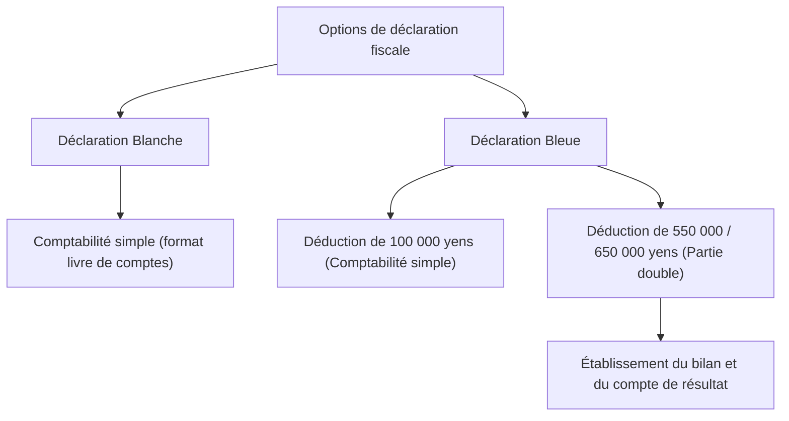

## 1. Introduction : L'interface nommée régime d'imposition déclaratif

La déclaration fiscale (*Kakutei Shinkoku*) constitue l'interface la plus fondamentale pour les échanges économiques entre l'État et l'individu. Le système fiscal japonais repose sur le principe de « l'imposition déclarative », selon lequel le contribuable calcule lui-même ses revenus et le montant de son impôt pour les déclarer à l'administration fiscale. Cependant, pour la majorité des salariés, cette démarche est entièrement automatisée grâce au « prélèvement à la source » et à « l'ajustement de fin d'année », ce qui limite les occasions de prendre conscience du fonctionnement global de l'auto-déclaration fiscale.

Cet article explore en profondeur le système japonais de déclaration de revenus, depuis les origines historiques du prélèvement à la source jusqu'aux dix catégories de revenus, en passant par les exigences comptables comparées de la déclaration bleue et de la déclaration blanche, ainsi que les mécanismes des diverses déductions fiscales.

## 2. Contexte historique du prélèvement à la source et ajustement de fin d'année

### La naissance du système de prélèvement à la source

L'origine du prélèvement à la source au Japon remonte à 1940 (an 15 de l'ère Shōwa), avant la Seconde Guerre mondiale. Dans le cadre d'une réforme fiscale destinée à financer l'effort de guerre et à recouvrer l'impôt de manière plus sûre et plus efficace, un système a été instauré par lequel les employeurs versant les salaires retenaient directement l'impôt pour le reverser à l'État. Ce mécanisme a permis d'atténuer le sentiment de fardeau fiscal chez les contribuables (ce que l'on appelle l'atténuation de la « douleur fiscale ») tout en garantissant à l'État une rentrée de fonds régulière et prévisible.

### L'ajustement de fin d'année : La régularisation du prélèvement à la source

Le prélèvement à la source n'est au départ qu'une estimation forfaitaire. Si le nombre de personnes à charge évolue en cours d'année ou si des primes d'assurance-vie sont payées, un écart apparaît inévitablement entre les montants prélevés à titre estimatif et l'impôt réellement dû. C'est « l'ajustement de fin d'année » qui comble cette différence. L'entreprise recalcule les revenus annuels et les déductions pour le compte de ses salariés et régularise le trop-perçu ou le moins-perçu. Grâce à ce processus, la plupart des employés d'entreprise sont dispensés de déposer une déclaration de revenus.

En revanche, les travailleurs indépendants (*freelances*), les entrepreneurs individuels, les personnes disposant de plusieurs sources de revenus ou celles souhaitant bénéficier de certaines déductions spécifiques (comme la première année du crédit immobilier ou des déductions pour frais médicaux élevés) doivent obligatoirement remplir eux-mêmes leur déclaration d'impôts.

## 3. Structure progressive de l'impôt sur le revenu

L'impôt sur le revenu japonais applique un barème d'« imposition progressive par tranches ». Selon ce système, un taux d'imposition d'autant plus élevé s'applique au fur et à mesure que les revenus augmentent. Le barème est divisé en 7 tranches, allant de 5 % jusqu'à un maximum de 45 %.

- Jusqu'à 1 950 000 yens : 5 %
- De plus de 1 950 000 yens à 3 300 000 yens : 10 %
- De plus de 3 300 000 yens à 6 950 000 yens : 20 %
- De plus de 6 950 000 yens à 9 000 000 yens : 23 %
- De plus de 9 000 000 yens à 18 000 000 yens : 33 %
- De plus de 18 000 000 yens à 40 000 000 yens : 40 %
- Plus de 40 000 000 yens : 45 %

Il est essentiel de noter que le taux le plus élevé ne s'applique pas à l'intégralité des revenus, mais uniquement à « la fraction qui excède chaque seuil ». Cela permet d'assurer une redistribution équitable des richesses sans décourager excessivement la motivation au travail.

## 4. Les 10 catégories de revenus

La loi sur l'impôt sur le revenu classe les revenus en dix catégories distinctes selon leur nature et définit pour chacune un mode de calcul spécifique. Cette diversification est l'une des raisons pour lesquelles la déclaration fiscale peut sembler complexe.

1. **Revenus d'intérêts** : Intérêts perçus sur les dépôts bancaires, obligations publiques ou d'entreprises, etc.
2. **Revenus de dividendes** : Dividendes d'actions et distributions de bénéfices de fonds d'investissement.
3. **Revenus immobiliers** : Revenus tirés de la location de terrains ou de bâtiments.
4. **Revenus professionnels / d'exploitation** : Revenus générés par des activités agricoles, de pêche, industrielles, de commerce de gros ou de détail, et de services. Les rémunérations des freelances y sont généralement rattachées.
5. **Revenus salariaux** : Traitements, salaires et primes perçus par les salariés d'entreprise ou les employés à temps partiel.
6. **Revenus de retraite** : Indemnités de départ à la retraite ou de licenciement. Ils bénéficient d'un abattement fiscal avantageux.
7. **Revenus forestiers** : Revenus issus de la coupe et de la cession de bois ou de forêts.
8. **Plus-values et gains en capital** : Revenus issus de la vente de biens tels que terrains, bâtiments, actions ou titres de participation à des clubs de golf.
9. **Revenus occasionnels** : Gains de loteries, gains aux courses hippiques, capitaux versés au titre d'assurances-vie en versement unique, et autres revenus dépourvus de caractère récurrent.
10. **Revenus divers** : Revenus ne relevant d'aucune des neuf catégories précédentes. Cela englobe les pensions de retraite publiques, les revenus tirés d'activités secondaires accessoires, ainsi que les plus-values réalisées sur les cryptoactifs (cryptomonnaies).

## 5. Exigences comptables : Déclaration Bleue vs Déclaration Blanche

Lorsque les travailleurs indépendants ou les propriétaires bailleurs remplissent leur déclaration fiscale, deux options principales s'offrent à eux : la « déclaration bleue » et la « déclaration blanche ».

### Déclaration Blanche : La simplicité de la comptabilité en partie simple

La déclaration blanche autorise une tenue de livres en « partie simple », à la manière d'un livre de comptes familial. Il suffit d'enregistrer chronologiquement les recettes et les dépenses quotidiennes, sans aucune demande d'approbation préalable. En contrepartie, elle n'accorde pratiquement aucun avantage fiscal. Autrefois, des dispenses de tenue de registres existaient, mais aujourd'hui, l'ensemble des déclarants sous le régime blanc ont l'obligation légale de tenir et conserver leurs livres comptables.

### Déclaration Bleue : Comptabilité en partie double et avantages fiscaux substantiels

La déclaration bleue nécessite le dépôt préalable d'une demande d'agrément auprès du centre des impôts. Son atout majeur réside dans la « Déduction spéciale de la déclaration bleue ». En remplissant les critères requis, il est possible de déduire de ses revenus imposables jusqu'à 650 000 yens (ou 550 000 yens, ou encore 100 000 yens), ce qui procure une économie fiscale très significative.

Pour bénéficier de la déduction de 650 000 yens ou de 550 000 yens, une rigoureuse comptabilité en « partie double » est exigée. Dans ce cadre, chaque transaction est enregistrée sous son double aspect « Débit » et « Crédit », permettant l'établissement d'un bilan comptable et d'un compte de résultat. Cette démarche garantit une vision fidèle de la situation patrimoniale et des résultats économiques de l'activité.

## 6. Les mécanismes des déductions fiscales

Les « déductions fiscales sur le revenu » constituent un dispositif permettant de soustraire un montant défini du revenu imposable en tenant compte de la situation personnelle du contribuable (situation familiale, problèmes de santé, dépenses spécifiques, etc.), afin de garantir l'équité fiscale.

### Déduction de base
Cette déduction s'applique sans condition à l'ensemble des contribuables. Dès lors que le revenu global n'excède pas 24 millions de yens, un montant uniforme de 480 000 yens est déductible. Le montant de cette déduction diminue par paliers au-delà, pour devenir nul au-dessus de 25 millions de yens de revenus.

### Déduction pour frais de santé
Lorsque le total des dépenses de santé engagées au cours de l'année civile (du 1er janvier au 31 décembre) pour soi-même ou les membres de son foyer dépasse un seuil donné (en principe 100 000 yens), la part excédentaire (jusqu'à concurrence de 2 millions de yens) peut être déduite du revenu imposable. Cette déduction couvre les consultations, les frais d'hospitalisation et les médicaments prescrits, ainsi que certains médicaments en vente libre éligibles au régime d'automédication.

### Furusato Nōzei (Déduction pour dons aux collectivités locales)
Le *Furusato Nōzei* est un dispositif qui permet, en faisant un don à la collectivité territoriale de son choix, de déduire la fraction du don excédant 2 000 yens de son impôt sur le revenu et de sa taxe d'habitation de l'année suivante (dans la limite d'un plafond calculé selon les revenus). Bien qu'il s'agisse concrètement d'un paiement anticipé de l'impôt, ce système rencontre un immense succès car les donateurs reçoivent en retour des cadeaux régionaux en guise de remerciement. Sur le plan fiscal, ce dispositif est comptabilisé au titre de la « déduction pour dons ».

## Conclusion

La déclaration de revenus n'est pas une simple « formalité administrative pour payer l'impôt », mais une interface de synchronisation fine des flux financiers entre l'État et le citoyen garantissant une juste répartition de la charge publique. Aujourd'hui, alors que le système de prélèvement à la source a tendance à occulter cette réalité aux yeux du grand public, comprendre la logique de ses revenus et des mécanismes fiscaux, tout en tirant pleinement parti de la déclaration bleue et des diverses déductions, s'avère primordial pour la gestion et la valorisation de son patrimoine personnel.
