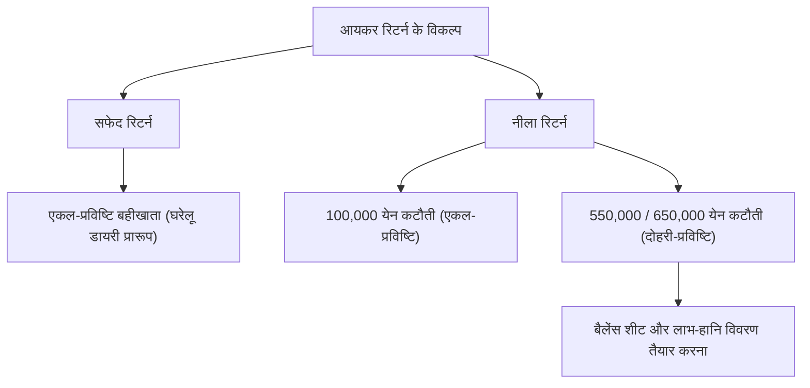

## 1. प्रस्तावना: स्व-मूल्यांकन कराधान प्रणाली नामक इंटरफेस

आयकर रिटर्न (*काकुतेई शिंकोकु*) सरकार और व्यक्ति के बीच आर्थिक लेन-देन का सबसे महत्वपूर्ण इंटरफेस है। जापान की कर प्रणाली "स्व-मूल्यांकन कराधान प्रणाली" के सिद्धांत पर आधारित है, जिसमें करदाता स्वयं अपनी आय और कर राशि की गणना करता है और सरकार के समक्ष इसकी घोषणा करता है। हालांकि, अधिकांश वेतनभोगी कर्मचारियों के लिए यह प्रक्रिया "स्रोत पर कर कटौती प्रणाली" और "वर्ष-अंत समायोजन" द्वारा स्वचालित होती है, इसलिए उन्हें स्व-मूल्यांकन कराधान प्रणाली की समग्र तस्वीर को समझने के सीमित अवसर ही मिल पाते हैं।

इस लेख में, हम स्रोत पर कर कटौती प्रणाली की ऐतिहासिक पृष्ठभूमि से लेकर आय के 10 प्रकारों, नीले रिटर्न और सफेद रिटर्न की बहीखाता आवश्यकताओं के अंतर, और विभिन्न कटौतियों के तंत्र तक जापानी आयकर रिटर्न प्रणाली का गहराई से विश्लेषण करेंगे।

## 2. स्रोत पर कर कटौती प्रणाली की ऐतिहासिक पृष्ठभूमि और वर्ष-अंत समायोजन

### स्रोत पर कर कटौती प्रणाली का उद्भव

जापान में स्रोत पर कर कटौती प्रणाली की शुरुआत द्वितीय विश्व युद्ध से पहले 1940 (शोवा वर्ष 15) में हुई थी। युद्ध के खर्चों को जुटाने के उद्देश्य से किए गए कर सुधारों के तहत, करों को अधिक विश्वसनीय और कुशल तरीके से एकत्र करने के लिए एक ऐसी प्रणाली शुरू की गई, जिसमें वेतन का भुगतान करने वाले नियोक्ता कर की कटौती करके उसे सीधे सरकार के पास जमा करते थे। इस प्रणाली ने करदाताओं के कर-बोझ की अनुभूति (तथाकथित "दर्दनाक कर अनुभूति") को कम किया और साथ ही सरकार के लिए एक स्थिर राजस्व स्रोत सुनिश्चित किया।

### वर्ष-अंत समायोजन: स्रोत पर कटौती का निपटान

स्रोत पर कर कटौती केवल एक "अनुमानित" कटौती होती है। वर्ष के दौरान आश्रितों की संख्या में बदलाव होने या जीवन बीमा प्रीमियम का भुगतान करने की स्थिति में, अनुमानित रूप से काटी गई कर राशि और वास्तव में देय सटीक कर राशि के बीच अंतर आ जाता है। इस अंतर को "वर्ष-अंत समायोजन" के माध्यम से भरा जाता है। कंपनियाँ अपने कर्मचारियों की ओर से वार्षिक आय और कटौतियों की पुनर्गणना करती हैं और अधिक या कम काटी गई राशि का समायोजन करती हैं। इसके परिणामस्वरूप, अधिकांश वेतनभोगी कर्मचारियों को स्वयं आयकर रिटर्न दाखिल करने की आवश्यकता नहीं होती है।

हालांकि, फ्रीलांसरों, व्यक्तिगत व्यवसाय स्वामियों, कई स्रोतों से आय प्राप्त करने वाले व्यक्तियों, या विशेष कटौतियों (जैसे प्रथम वर्ष की आवास ऋण कटौती या भारी चिकित्सा व्यय कटौती) का लाभ उठाने के इच्छुक व्यक्तियों को स्वयं आयकर रिटर्न दाखिल करना पड़ता है।

## 3. आयकर की प्रगतिशील कर संरचना

जापान के आयकर में "अतिरिक्त प्रगतिशील कराधान" की संरचना है। यह एक ऐसा तंत्र है जिसमें आय बढ़ने के साथ-साथ कर की दर भी चरणबद्ध रूप से बढ़ती जाती है। कर की दर 5% से लेकर अधिकतम 45% तक 7 स्तरों में विभाजित है।

- 1,950,000 येन तक: 5%
- 1,950,000 येन से अधिक 3,300,000 येन तक: 10%
- 3,300,000 येन से अधिक 6,950,000 येन तक: 20%
- 6,950,000 येन से अधिक 9,000,000 येन तक: 23%
- 9,000,000 येन से अधिक 18,000,000 येन तक: 33%
- 18,000,000 येन से अधिक 40,000,000 येन तक: 40%
- 40,000,000 येन से अधिक: 45%

यहाँ ध्यान देने योग्य बात यह है कि उच्चतम कर दर पूरी आय पर लागू नहीं होती, बल्कि केवल "एक निश्चित सीमा से अधिक वाले हिस्से" पर ही उच्च कर दर लागू होती है। इससे आय पुनर्वितरण का उद्देश्य भी पूरा होता है और काम करने की प्रेरणा भी बाधित नहीं होती।

## 4. आय के 10 प्रकार

आयकर अधिनियम में आय की प्रकृति के आधार पर इसे 10 श्रेणियों में वर्गीकृत किया गया है और प्रत्येक के लिए गणना की अलग-अलग विधियाँ निर्धारित की गई हैं। यह जटिलता भी आयकर रिटर्न को कठिन बनाने का एक प्रमुख कारण है।

1. **ब्याज आय**: बचत बैंक खातों, सावधि जमा, सरकारी व कॉर्पोरेट बॉन्ड आदि से मिलने वाला ब्याज।
2. **लाभांश आय**: शेयरों के लाभांश और निवेश ट्रस्टों से मिलने वाला लाभ वितरण।
3. **अचल संपत्ति आय**: भूमि या भवनों को किराए पर देने से होने वाली आय।
4. **व्यावसायिक आय**: कृषि, मत्स्य पालन, विनिर्माण, थोक, खुदरा और सेवा जैसे व्यवसायों से होने वाली आय। फ्रीलांसरों का पारिश्रमिक भी अक्सर इसी में शामिल होता है।
5. **वेतन आय**: कंपनी कर्मचारियों और अंशकालिक कामगारों को मिलने वाला वेतन और बोनस।
6. **सेवानिवृत्ति आय**: सेवानिवृत्ति भत्ता या ग्रेच्युटी आदि। इस पर कर भार को कम करने के लिए विशेष गणना की जाती है।
7. **वानिकी आय**: वनों की कटाई और लकड़ी के हस्तांतरण/बिक्री से होने वाली आय।
8. **पूंजीगत लाभ (हस्तांतरण आय)**: भूमि, भवन, शेयर, गोल्फ क्लब सदस्यता जैसी संपत्तियों के हस्तांतरण या बिक्री से होने वाली आय।
9. **आकस्मिक आय**: पुरस्कार राशि, घुड़दौड़ से जीत, जीवन बीमा से एकमुश्त भुगतान आदि जैसी गैर-निरंतर आय।
10. **विविध आय**: उपरोक्त 9 श्रेणियों में से किसी में भी न आने वाली आय। इसमें सार्वजनिक पेंशन, अतिरिक्त काम (साइड बिजनेस) से होने वाली छोटी आय और क्रिप्टो संपत्ति (क्रिप्टोकरेंसी) के व्यापार से होने वाला लाभ शामिल है।

## 5. नीले और सफेद रिटर्न के लिए बहीखाता आवश्यकताएँ

जब व्यक्तिगत व्यवसाय के स्वामी या अचल संपत्ति के मालिक आयकर रिटर्न दाखिल करते हैं, तो मोटे तौर पर दो विकल्प होते हैं: "नीला रिटर्न" और "सफेद रिटर्न"।

### सफेद रिटर्न: एकल-प्रविष्टि बहीखाता पद्धति की सरलता

सफेद रिटर्न में घरेलू हिसाब-किताब की तरह "एकल-प्रविष्टि बहीखाता पद्धति" की अनुमति होती है। इसमें केवल दैनिक आय और व्यय का रिकॉर्ड रखना होता है और इसके लिए किसी विशेष पूर्व-आवेदन की आवश्यकता नहीं होती। हालांकि, इसमें कोई विशेष कर लाभ भी नहीं मिलता है। पहले बहीखाता रखने से छूट देने वाले विशेष प्रावधान थे, लेकिन अब सभी सफेद रिटर्न दाखिल करने वालों के लिए हिसाब रखना और बहीखातों को सुरक्षित रखना अनिवार्य कर दिया गया है।

### नीला रिटर्न: दोहरी-प्रविष्टि बहीखाता पद्धति और बड़ा कर-बचत लाभ

नीला रिटर्न दाखिल करने के लिए पहले से कर कार्यालय में अनुमोदन हेतु आवेदन करना आवश्यक होता है। इसकी सबसे बड़ी विशेषता "नीला रिटर्न विशेष कटौती" का लाभ प्राप्त करना है। आवश्यक शर्तों को पूरा करने पर, आय से अधिकतम 650,000 येन (या 550,000 येन, या 100,000 येन) की कटौती की जा सकती है, जिससे कर में महत्वपूर्ण बचत होती है।

650,000 येन या 550,000 येन की कटौती का लाभ उठाने के लिए "दोहरी-प्रविष्टि बहीखाता पद्धति" द्वारा सख्त रिकॉर्ड रखने की आवश्यकता होती है। दोहरी-प्रविष्टि पद्धति में, प्रत्येक लेन-देन को "डेबिट" और "क्रेडिट" के रूप में दोहरे दृष्टिकोण से दर्ज किया जाता है, और "तुलन पत्र (बैलेंस शीट)" तथा "लाभ-हानि विवरण" तैयार किया जाता है। इससे व्यवसाय की वित्तीय स्थिति और व्यावसायिक परिणामों की सटीक जानकारी मिलती है।

## 6. कर कटौतियों का तंत्र

"आय कटौती" एक ऐसी प्रणाली है जो करदाता की व्यक्तिगत परिस्थितियों (पारिवारिक स्थिति, बीमारी, विशिष्ट व्यय आदि) को ध्यान में रखते हुए कर के बोझ को न्यायसंगत बनाने के लिए कुल आय में से एक निश्चित राशि घटाती है।

### बुनियादी कटौती
यह एक ऐसी कटौती है जो बिना किसी शर्त के सभी करदाताओं पर लागू होती है। यदि कुल आय 24 मिलियन येन या उससे कम है, तो समान रूप से 480,000 येन की कटौती मिलती है। जैसे-जैसे आय बढ़ती है, कटौती की राशि चरणबद्ध रूप से घटती जाती है और 25 मिलियन येन से अधिक होने पर यह शून्य हो जाती है।

### चिकित्सा व्यय कटौती
एक वर्ष (1 जनवरी से 31 दिसंबर) के दौरान स्वयं या परिवार के सदस्यों के इलाज पर किया गया चिकित्सा व्यय यदि एक निश्चित सीमा (सामान्यतः 100,000 येन) से अधिक हो जाता है, तो उस अतिरिक्त राशि (अधिकतम 2 मिलियन येन तक) को आय से काटा जा सकता है। इसमें अस्पताल आने-जाने का खर्च और डॉक्टर द्वारा लिखी गई दवाइयों के साथ-साथ कुछ गैर-पर्चे वाली ओवर-द-काउंटर दवाएं (स्व-चिकित्सा कर प्रणाली के तहत) भी शामिल हैं।

### फुरुसातो नोज़ेई (दान कटौती)
*फुरुसातो नोज़ेई* एक ऐसी प्रणाली है जिसके तहत किसी भी स्थानीय नगरपालिका या निकाय को दान देने पर, 2,000 येन से अधिक की दान राशि को आयकर और अगले वर्ष के निवासी कर से घटाया जाता है (आय अनुसार एक सीमा के अधीन)। व्यावहारिक रूप से यह अग्रिम कर भुगतान ही है, लेकिन चूँकि दानकर्ता नगरपालिकाओं से स्थानीय उपहार या उत्पाद प्राप्त कर सकते हैं, इसलिए यह अत्यंत लोकप्रिय है। गणना के लिहाज से इसे "दान कटौती" के रूप में प्रसंस्कृत किया जाता है।

## निष्कर्ष

आयकर रिटर्न केवल "कर का भुगतान करने की एक कागजी प्रक्रिया" नहीं है, बल्कि यह सरकार और नागरिकों के बीच वित्तीय जानकारी को समन्वयित करने और निष्पक्ष कर निर्धारण करने के लिए एक सटीक इंटरफेस है। आज के समय में जब स्रोत पर कर कटौती प्रणाली के कारण इसकी उपस्थिति अक्सर अनदेखी रह जाती है, अपनी आय और करों की प्रणाली को सही ढंग से समझना तथा नीले रिटर्न और विभिन्न कटौतियों का उचित लाभ उठाना व्यक्तिगत संपत्ति निर्माण और वित्तीय प्रबंधन के लिए अत्यंत महत्वपूर्ण है।
