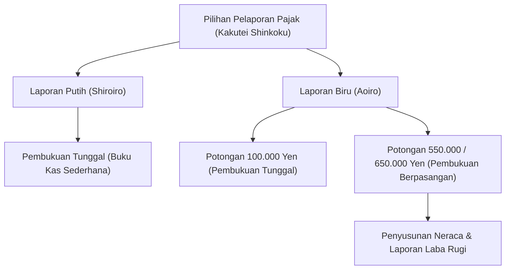

## 1. Pendahuluan: Antarmuka Bernama Sistem Perpajakan Mandiri (Self-Assessment)

Kakutei Shinkoku (pelaporan SPT tahunan) adalah antarmuka paling penting bagi pertukaran ekonomi antara negara dan individu. Sistem perpajakan Jepang berprinsip pada "sistem penetapan mandiri" (shinkoku nozei seido), di mana para wajib pajak secara mandiri menghitung penghasilan dan jumlah pajak mereka, kemudian melaporkannya kepada negara. Namun, bagi sebagian besar penerima upah (karyawan), proses ini diotomatisasi melalui "sistem pemotongan pajak di muka" (gensen choshu) dan "penyesuaian pajak akhir tahun" (nenmatsu chosei), sehingga jarang ada kesempatan untuk menyadari gambaran menyeluruh dari sistem pelaporan mandiri ini.

Artikel ini mengulas secara mendalam sistem pelaporan pajak tahunan di Jepang, mulai dari latar belakang historis sistem pemotongan pajak di muka, 10 klasifikasi penghasilan, perbedaan persyaratan pembukuan antara Laporan Biru (Aoiro Shinkoku) dan Laporan Putih (Shiroiro Shinkoku), hingga mekanisme berbagai pemotongan/pengurangan pajak (deductions).

## 2. Latar Belakang Historis Sistem Pemotongan Pajak di Muka dan Penyesuaian Akhir Tahun

### Lahirnya Sistem Pemotongan Pajak di Muka (Gensen Choshu)

Asal-usul sistem pemotongan pajak di muka di Jepang bermula pada masa pra-Perang Dunia II, tepatnya pada tahun 1940 (Tahun Showa 15). Berdasarkan reformasi pajak yang ditujukan untuk pendanaan perang, diperkenalkan sistem di mana pemberi kerja langsung memotong pajak dari gaji dan menyetorkannya ke kas negara demi pemungutan pajak yang lebih pasti dan efisien. Sistem ini meringankan beban psikologis wajib pajak (mengurangi rasa 'sakit membayar pajak' atau tsuuzeikan), sekaligus memungkinkan negara mengamankan sumber pendapatan fiskal yang stabil.

### Penyesuaian Akhir Tahun (Nenmatsu Chosei): Penyelesaian Pemotongan Pajak di Muka

Pemotongan pajak di muka pada dasarnya hanyalah "perkiraan kasar". Jika terjadi perubahan jumlah tanggungan keluarga di tengah tahun, atau jika ada pembayaran premi asuransi jiwa, akan timbul selisih antara jumlah pajak perkiraan yang dipotong dengan pajak riil yang sebenarnya terutang. Celah inilah yang dijembatani oleh "penyesuaian akhir tahun" (nenmatsu chosei). Perusahaan menghitung ulang pendapatan tahunan dan potongan pajak atas nama karyawan, lalu menyesuaikan kelebihan atau kekurangan pembayaran. Dengan demikian, sebagian besar pekerja kantoran tidak perlu lagi mengajukan SPT sendiri.

Namun, pekerja lepas (freelancer), pemilik usaha perorangan, orang dengan berbagai sumber penghasilan, atau mereka yang ingin mengklaim potongan tertentu (seperti potongan pinjaman perumahan untuk tahun pertama atau biaya medis dalam jumlah besar) harus melakukan pelaporan pajak (kakutei shinkoku) secara mandiri.

## 3. Struktur Pajak Penghasilan Progresif

Pajak penghasilan di Jepang menerapkan struktur "pajak progresif bertingkat" (progressive tax brackets). Artinya, semakin tinggi penghasilan seseorang, semakin tinggi pula tarif pajak yang dikenakan secara bertahap. Tarif pajak dibagi menjadi 7 tingkatan, mulai dari 5% hingga maksimum 45%:

- Hingga 1.950.000 yen: 5%
- Di atas 1.950.000 yen hingga 3.300.000 yen: 10%
- Di atas 3.300.000 yen hingga 6.950.000 yen: 20%
- Di atas 6.950.000 yen hingga 9.000.000 yen: 23%
- Di atas 9.000.000 yen hingga 18.000.000 yen: 33%
- Di atas 18.000.000 yen hingga 40.000.000 yen: 40%
- Di atas 40.000.000 yen: 45%

Poin penting di sini adalah tarif tertinggi tidak dikenakan pada total seluruh penghasilan, melainkan hanya pada "bagian yang melebihi jumlah batas tertentu". Melalui mekanisme ini, tercapai fungsi redistribusi pendapatan tanpa mematikan motivasi untuk bekerja keras.

## 4. 10 Klasifikasi Penghasilan

Undang-Undang Pajak Penghasilan Jepang membagi penghasilan ke dalam 10 kategori sesuai karakteristiknya, masing-masing dengan metode penghitungan yang berbeda. Kompleksitas ini menjadi salah satu alasan mengapa pelaporan pajak sering dianggap rumit.

1. **Penghasilan Bunga (Rishi Shotoku)**: Bunga dari tabungan, deposito, obligasi pemerintah/perusahaan, dll.
2. **Penghasilan Dividen (Haitou Shotoku)**: Dividen saham, distribusi keuntungan reksa dana, dll.
3. **Penghasilan Properti/Real Estat (Fudousan Shotoku)**: Penghasilan dari sewa tanah atau bangunan.
4. **Penghasilan Usaha/Bisnis (Jigyou Shotoku)**: Penghasilan yang bersumber dari kegiatan usaha pertanian, perikanan, manufaktur, grosir, eceran, hingga sektor jasa. Imbalan bagi pekerja lepas (freelancer) umumnya masuk dalam kategori ini.
5. **Penghasilan Gaji (Kyuuyo Shotoku)**: Gaji, upah, dan bonus yang diterima oleh karyawan perusahaan maupun pekerja paruh waktu.
6. **Penghasilan Pensiun/Pesangon (Taishoku Shotoku)**: Uang pesangon atau pensiun. Kategori ini dihitung secara khusus dengan keringanan pajak yang signifikan.
7. **Penghasilan Kehutanan (Sanrin Shotoku)**: Penghasilan dari penebangan atau pengalihan hutan kayu.
8. **Penghasilan Pengalihan/Capital Gain (Jouto Shotoku)**: Penghasilan dari penjualan aset seperti tanah, bangunan, saham, keanggotaan klub golf, dll.
9. **Penghasilan Insidental/Temporer (Ichiji Shotoku)**: Hadiah undian, uang kemenangan pacuan kuda, pembayaran sekaligus asuransi jiwa, dan penghasilan lain yang tidak bersifat berkala/berkelanjutan.
10. **Penghasilan Lain-lain (Zatsu Shotoku)**: Segala penghasilan yang tidak termasuk dalam 9 kategori di atas. Mencakup pensiun publik, penghasilan sampingan (skala kecil), keuntungan perdagangan aset kripto, dll.

## 5. Persyaratan Pembukuan: Laporan Biru (Aoiro) vs Laporan Putih (Shiroiro)

Ketika pemilik usaha perorangan atau pemilik properti mengajukan SPT, umumnya ada dua pilihan pelaporan: "Laporan Biru" (Aoiro Shinkoku) dan "Laporan Putih" (Shiroiro Shinkoku).

### Laporan Putih (Shiroiro Shinkoku): Pembukuan Tunggal yang Sederhana

Laporan Putih memperbolehkan metode pembukuan tunggal (single-entry bookkeeping), mirip dengan catatan buku kas harian. Wajib pajak hanya perlu mencatat pemasukan dan pengeluaran harian tanpa memerlukan izin khusus sebelumnya. Namun, fasilitas keringanan pajak yang diberikan sangat minim. Dahulu terdapat dispensasi kewajiban pembukuan, tetapi saat ini semua pelapor Laporan Putih wajib mencatat dan menyimpan dokumen pembukuan mereka.

### Laporan Biru (Aoiro Shinkoku): Pembukuan Berpasangan dan Manfaat Penghematan Pajak Maksimal

Laporan Biru memerlukan permohonan persetujuan terlebih dahulu ke kantor pajak setempat. Keunggulan terbesarnya adalah hak memperoleh "Pengurangan Khusus Laporan Biru" (Aoiro Shinkoku Tokubetsu Kojyo). Dengan memenuhi kriteria tertentu, wajib pajak dapat mengurangi penghasilan kena pajak hingga 650.000 yen (atau 550.000 yen, 100.000 yen), memberikan efisiensi pajak yang sangat signifikan.

Untuk mendapatkan potongan 650.000 yen atau 550.000 yen, diwajibkan menyusun pembukuan berpasangan (double-entry bookkeeping) yang ketat. Dalam pembukuan berpasangan, setiap transaksi dicatat pada dua sisi yaitu "Debet (Karikata)" dan "Kredit (Kashikata)", serta menghasilkan "Neraca Keuangan (Balance Sheet)" dan "Laporan Laba Rugi". Hal ini memungkinkan pemahaman yang akurat mengenai kondisi keuangan dan kinerja operasional usaha.

## 6. Mekanisme Pengurangan Pajak (Deduksi)

"Pengurangan Penghasilan" (Shotoku Kojyo) adalah skema pemotongan jumlah tertentu dari penghasilan guna memastikan keadilan perpajakan dengan mempertimbangkan kondisi pribadi wajib pajak (seperti susunan keluarga, kondisi kesehatan, atau pengeluaran khusus).

### Dasar Pengurangan (Kiso Kojyo)
Pengurangan yang berlaku bagi semua wajib pajak tanpa syarat khusus. Jika jumlah total penghasilan berada di bawah 24 juta yen, diberikan potongan seragam sebesar 480.000 yen. Nilai potongan ini berkurang secara bertahap seiring bertambahnya penghasilan, dan menjadi nol jika penghasilan melebihi 25 juta yen.

### Potongan Biaya Medis (Iryouhi Kojyo)
Jika biaya medis yang dibayarkan untuk diri sendiri atau keluarga dalam satu tahun (1 Januari - 31 Desember) melebihi batas tertentu (pada umumnya 100.000 yen), kelebihan tersebut (maksimal hingga 2 juta yen) dapat dikurangkan dari penghasilan. Ini tidak hanya mencakup biaya konsultasi dokter dan obat resep, tetapi juga sebagian obat bebas (melalui skema Self-Medication Taxation).

### Furusato Nozei (Pengurangan Donasi)
Furusato Nozei adalah sistem donasi ke pemerintah daerah pilihan, di mana nilai donasi di atas 2.000 yen dapat dipotongkan dari pajak penghasilan dan pajak penduduk tahun berikutnya (dengan batas pagu tertentu). Selain pada dasarnya merupakan pembayaran pajak di muka, program ini sangat populer karena wajib pajak mendapatkan produk/hadiah balasan (kaireihin) dari daerah penerima. Secara administratif pajak, skema ini diproses sebagai "Pengurangan Donasi" (Kifu-kin Kojyo).

## Kesimpulan

Pelaporan pajak (Kakutei Shinkoku) bukan sekadar "prosedur untuk membayar pajak", melainkan antarmuka presisi untuk menyinkronkan data finansial antara negara dan individu serta menentukan kontribusi beban yang adil. Di era modern ketika proses ini sering luput dari perhatian akibat kepraktisan sistem pemotongan pajak di muka, memahami struktur pendapatan dan sistem perpajakan secara mandiri, serta memanfaatkan Laporan Biru dan berbagai potongan pajak yang tersedia dengan tepat, menjadi langkah yang sangat krusial dalam perencanaan dan pengelolaan aset pribadi.
