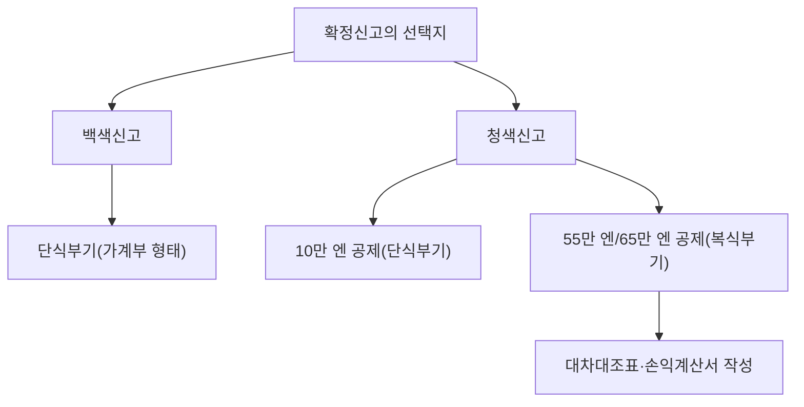

## 1. 서론: 자기신고과세제도라는 이름의 인터페이스

확정신고는 국가와 개인이 경제적 상호작용을 수행하기 위한 가장 중요한 인터페이스입니다. 일본의 세제는 '신고납세제도'를 기본 원칙으로 삼고 있으며, 납세자 본인이 스스로 소득과 세액을 계산하여 국가에 신고하는 체계를 채택하고 있습니다. 그러나 대다수의 급여소득자는 '원천징수제도'와 '연말정산'을 통해 이 과정이 자동화되어 있기 때문에, 자기신고과세제도의 전모를 체감할 기회가 적습니다.

본 글에서는 원천징수제도의 역사적 배경부터 10가지 소득 분류, 청색신고와 백색신고의 장부 요건 차이, 그리고 각종 소득공제의 메커니즘에 이르기까지 일본의 확정신고 제도를 심층적으로 살펴봅니다.

## 2. 원천징수제도의 역사적 배경과 연말정산

### 원천징수제도의 탄생

일본 원천징수제도의 기원은 제2차 세계대전 이전인 1940년(쇼와 15년)으로 거슬러 올라갑니다. 전비 조달을 목적으로 한 세제 개편에 따라, 세금을 보다 확실하고 효율적으로 징수하기 위해 급여를 지급하는 고용주가 세금을 원천공제하여 국가에 납부하는 시스템이 도입되었습니다. 이 제도는 납세자의 심리적 부담감(소위 '통세감(痛税感)')을 완화하는 동시에, 국가로서는 안정적인 재원을 확보할 수 있게 해주었습니다.

### 연말정산: 원천징수의 정산

원천징수는 어디까지나 '개산(대략적인 계산)'에 기반한 징수입니다. 연중에 부양가족 수가 변동되거나 생명보험료를 납부하는 경우, 개산으로 징수된 세액과 본래 납부해야 할 정확한 세액 사이에 차이가 발생합니다. 이 간극을 메우는 것이 바로 '연말정산'입니다. 기업이 직원을 대신해 연간 소득과 공제액을 재계산하여 과부족을 정산합니다. 이로 인해 대다수의 회사원은 확정신고를 직접 진행할 필요가 없습니다.

그러나 프리랜서나 개인사업자, 복수의 수입원을 가진 사람, 혹은 특정 공제(첫해 주택담보대출 공제나 고액 의료비 공제 등)를 적용받으려는 사람은 직접 확정신고를 진행해야 합니다.

## 3. 소득세의 누진과세 구조

일본의 소득세는 '초과누진과세' 구조를 채택하고 있습니다. 이는 소득이 높아질수록 단계적으로 더 높은 세율이 적용되는 방식입니다. 세율은 5%에서 최대 45%까지 7단계로 구분됩니다.

- 1,950,000엔 이하: 5%
- 1,950,000엔 초과 3,300,000엔 이하: 10%
- 3,300,000엔 초과 6,950,000엔 이하: 20%
- 6,950,000엔 초과 9,000,000엔 이하: 23%
- 9,000,000엔 초과 18,000,000엔 이하: 33%
- 18,000,000엔 초과 40,000,000엔 이하: 40%
- 40,000,000엔 초과: 45%

여기서 중요한 점은 전체 소득에 대해 최고 세율이 적용되는 것이 아니라, '일정 금액을 초과한 부분'에 대해서만 높은 세율이 적용된다는 점입니다. 이를 통해 소득 재분배 기능을 수행하면서도 근로 의욕을 과도하게 저해하지 않도록 균형을 유지하고 있습니다.

## 4. 10가지 소득 분류

일본 소득세법에서는 소득의 성격에 따라 10가지로 분류하며, 각각 서로 다른 계산 방법을 규정하고 있습니다. 이러한 복잡성이 확정신고를 어렵게 느끼게 하는 요인 중 하나입니다.

1. **이자소득**: 예적금이나 공사채의 이자 등.
2. **배당소득**: 주식 배당금이나 투자신탁 수익분배금 등.
3. **부동산소득**: 토지나 건물의 임대로 인한 소득.
4. **사업소득**: 농업, 어업, 제조업, 도소매업, 서비스업 등 사업에서 발생하는 소득. 프리랜서의 보수도 대부분 여기에 포함됩니다.
5. **급여소득**: 회사원이나 아르바이트 근로자가 받는 급여 및 상여금.
6. **퇴직소득**: 퇴직금 등. 세 부담을 덜어주기 위한 특별 계산 방식이 적용됩니다.
7. **산림소득**: 산림을 벌채하여 양도함으로써 발생하는 소득.
8. **양도소득**: 토지, 건물, 주식, 골프 회원권 등의 자산을 양도하여 발생하는 소득.
9. **일시소득**: 현상금, 경마 환급금, 생명보험 일시금 등 지속성이 없는 일회성 소득.
10. **잡소득(기타소득)**: 위의 9가지에 해당하지 않는 소득. 공적연금, 소규모 부업 수입, 가상자산(암호화폐) 거래 수익 등이 포함됩니다.

## 5. 청색신고와 백색신고의 장부 요건

개인사업자나 부동산 소유자가 확정신고를 진행할 때, 크게 '청색신고'와 '백색신고'라는 두 가지 방식 중 하나를 선택하게 됩니다.

### 백색신고: 단식부기의 간편한 기장

백색신고는 가계부 형태의 '단식부기' 방식 기장이 허용됩니다. 일상적인 수입과 지출 내역만 기록하면 되며 사전 신청 절차도 필요하지 않습니다. 그러나 세제상의 우대 혜택은 거의 없습니다. 과거에는 기장 의무가 면제되는 특례가 있었지만, 현재는 모든 백색신고 대상자에게도 기장 및 장부 보존이 의무화되어 있습니다.

### 청색신고: 복식부기와 강력한 절세 효과

청색신고를 적용받으려면 사전에 관할 세무서에 승인 신청서를 제출해야 합니다. 가장 큰 특징은 '청색신고 특별공제'를 받을 수 있다는 점입니다. 요건을 충족하면 소득에서 최대 65만 엔(또는 55만 엔, 10만 엔)을 공제받을 수 있어 절세 효과가 매우 큽니다.

65만 엔 또는 55만 엔의 공제를 받기 위해서는 '복식부기'를 통한 엄격한 기장이 요구됩니다. 복식부기에서는 하나의 거래를 '차변(借方)'과 '대변(貸方)'의 양면으로 기록하며, '대차대조표(재무상태표)'와 '손익계산서'를 작성합니다. 이를 통해 사업의 재무 상태와 경영 성과를 정확히 파악할 수 있습니다.

## 6. 공제의 메커니즘

'소득공제'는 납세자의 개인적인 사정(가족 구성, 질병, 특정 지출 등)을 감안하여 담세력에 따른 공평한 과세를 실현하기 위해 소득금액에서 일정액을 차감해 주는 제도입니다.

### 기초공제
모든 납세자에게 무조건적으로 적용되는 공제입니다. 연간 총소득금액이 2,400만 엔 이하인 경우 일률적으로 48만 엔이 공제됩니다. 소득이 높아질수록 공제액이 단계적으로 축소되며, 2,500만 엔을 초과하면 공제액이 0이 됩니다.

### 의료비공제
1년간(1월 1일~12월 31일) 본인 및 생계를 같이하는 가족을 위해 지출한 의료비가 일정 금액(원칙적으로 10만 엔)을 초과할 경우, 그 초과분(최대 200만 엔)을 소득에서 공제받을 수 있습니다. 병원 진료비와 처방약 비용뿐만 아니라 일부 일반의약품(셀프 메디케이션 세제 대상)도 포함됩니다.

### 후루사토 납세(기부금공제)
후루사토 납세는 원하는 지자체를 선택하여 기부하면, 2,000엔을 초과하는 기부금 전액(상한선 존재)이 당해 연도 소득세 및 이듬해 주민세에서 공제되는 제도입니다. 실질적으로는 세금의 선납에 해당하지만, 해당 지자체로부터 특산품 등의 답례품을 받을 수 있어 높은 인기를 얻고 있습니다. 세무 계산상으로는 '기부금공제' 항목으로 처리됩니다.

## 결론

확정신고는 단순한 '세금 납부 절차'를 넘어, 국가와 개인 간에 금융 정보를 동기화하고 공평한 부담을 책정하기 위한 정밀한 인터페이스입니다. 원천징수제도로 인해 그 실체를 체감하기 어려워진 현대 사회일수록, 자신의 소득과 세금 구조를 올바르게 이해하고 청색신고와 각종 소득공제를 전략적으로 활용하는 것이 개인의 자산 형성에 결정적인 역할을 합니다.
