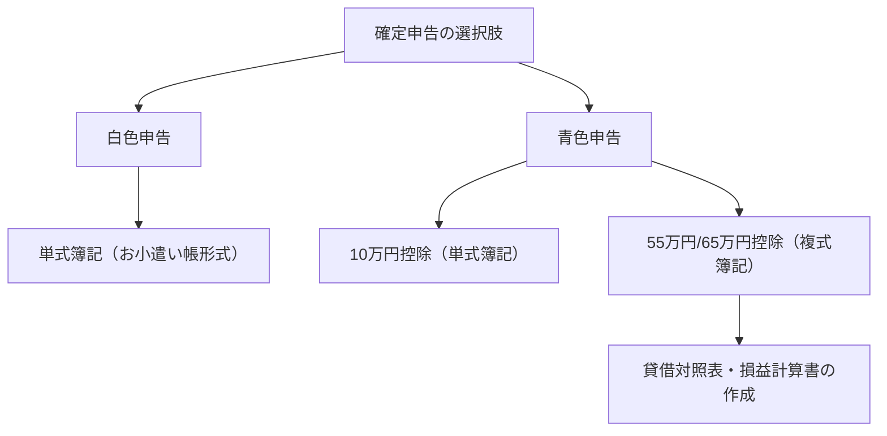

## 1. 序論：自己申告課税制度という名のインターフェース

確定申告は、国家と個人が経済的なやり取りを行うための最も重要なインターフェースです。日本の税制は「申告納税制度」を原則としており、納税者自らが所得と税額を計算し、国に対して申告する仕組みを採用しています。しかし、多くの給与所得者は「源泉徴収制度」と「年末調整」によってこのプロセスが自動化されているため、自己申告課税制度の全体像を意識する機会が限られています。

本記事では、源泉徴収制度の歴史的背景から、10種類の所得分類、青色申告と白色申告の帳簿要件の違い、そして各種控除のメカニズムに至るまで、日本の確定申告制度を深く掘り下げて解説します。

## 2. 源泉徴収制度の歴史的背景と年末調整

### 源泉徴収制度の誕生

日本の源泉徴収制度の起源は、第二次世界大戦前の1940年（昭和15年）に遡ります。戦費調達を目的とした税制改正により、税金をより確実かつ効率的に徴収するため、給与を支払う雇用主が税金を天引きして国に納めるシステムが導入されました。この制度は、納税者の負担感を軽減（いわゆる「痛税感」の緩和）すると同時に、国家にとって安定した財源確保を可能にしました。

### 年末調整：源泉徴収の精算

源泉徴収はあくまで「概算」での徴収です。年の途中で扶養家族が増減したり、生命保険料を支払ったりした場合、概算で徴収された税額と、本来納めるべき正確な税額との間にズレが生じます。この隙間を埋めるのが「年末調整」です。企業が従業員に代わって年間の所得と控除を再計算し、過不足を調整します。これにより、多くの会社員は確定申告を行う必要がなくなっています。

しかし、フリーランスや個人事業主、複数の収入源を持つ人、あるいは特定の控除（初年度の住宅ローン控除や高額な医療費控除など）を受けたい人は、自ら確定申告を行わなければなりません。

## 3. 所得税の累進課税構造

日本の所得税は「超過累進課税」という構造を持っています。これは、所得が高くなるにつれて段階的に高い税率が適用される仕組みです。税率は5%から最大45%まで7段階に分かれています。

- 1,950,000円以下：5%
- 1,950,000円超 3,300,000円以下：10%
- 3,300,000円超 6,950,000円以下：20%
- 6,950,000円超 9,000,000円以下：23%
- 9,000,000円超 18,000,000円以下：33%
- 18,000,000円超 40,000,000円以下：40%
- 40,000,000円超：45%

ここで重要なのは、全体の所得に対して最高税率がかけられるのではなく、「一定の金額を超えた部分」にのみ高い税率が適用されるという点です。これにより、所得再分配の機能を持たせつつ、勤労意欲を過度に削がないようなバランスが図られています。

## 4. 10種類の所得分類

所得税法では、所得の性質に応じて10種類に分類し、それぞれ異なる計算方法を定めています。この複雑さが確定申告を難解にしている一因でもあります。

1. **利子所得**: 預貯金や公社債の利子など。
2. **配当所得**: 株式の配当金や投資信託の収益分配金など。
3. **不動産所得**: 土地や建物の貸付けによる所得。
4. **事業所得**: 農業、漁業、製造業、卸売業、小売業、サービス業などの事業から生じる所得。フリーランスの報酬もここに含まれることが多いです。
5. **給与所得**: 会社員やアルバイトが得る給与や賞与。
6. **退職所得**: 退職金など。税負担が軽減される特別な計算がされます。
7. **山林所得**: 山林を伐採して譲渡したことによる所得。
8. **譲渡所得**: 土地、建物、株式、ゴルフ会員権などの資産を譲渡したことによる所得。
9. **一時所得**: 懸賞の賞金、競馬の払戻金、生命保険の一時金など、継続的でない所得。
10. **雑所得**: 上記9つのいずれにも当てはまらない所得。公的年金や副業の収入（小規模なもの）、暗号資産（仮想通貨）の取引利益などが含まれます。

## 5. 青色申告と白色申告の帳簿要件

個人事業主や不動産オーナーが確定申告を行う際、大きく分けて「青色申告」と「白色申告」の2つの方法があります。

### 白色申告：単式簿記のシンプルな記帳

白色申告は、お小遣い帳のような「単式簿記」での記帳が認められています。収入と支出を日々の記録として残すだけでよく、特別な申請も不要です。しかし、その分、税制上の優遇措置はほとんどありません。かつては記帳義務が免除される特例がありましたが、現在ではすべての白色申告者に記帳と帳簿の保存が義務付けられています。

### 青色申告：複式簿記と強力な節税効果

青色申告は、事前に税務署への承認申請が必要です。最大の特徴は「青色申告特別控除」を受けられる点です。要件を満たすことで、最大65万円（または55万円、10万円）を所得から差し引くことができ、大きな節税効果があります。

65万円または55万円の控除を受けるためには、「複式簿記」による厳密な記帳が求められます。複式簿記では、一つの取引を「借方（かりかた）」と「貸方（かしかた）」の二面的に記録し、「貸借対照表（バランスシート）」と「損益計算書」を作成します。これにより、事業の財政状態と経営成績を正確に把握することができます。

## 6. 控除のメカニズム

「所得控除」とは、納税者の個人的な事情（家族構成や病気、特定の支出など）を考慮し、税負担を公平にするために所得金額から一定額を差し引く制度です。

### 基礎控除
すべての納税者に無条件で適用される控除です。合計所得金額が2,400万円以下であれば、一律48万円が控除されます。所得が高くなるにつれて控除額が段階的に減少し、2,500万円を超えるとゼロになります。

### 医療費控除
1年間（1月1日〜12月31日）に自己や家族のために支払った医療費が一定額（原則10万円）を超える場合、その超過分（最大200万円）を所得から控除できます。通院費や処方箋代だけでなく、一部の市販薬（セルフメディケーション税制）も対象になります。

### ふるさと納税（寄附金控除）
ふるさと納税は、任意の自治体に寄附を行うことで、寄附額のうち2,000円を超える部分が所得税および翌年の住民税から控除される制度です（上限あり）。実質的に税金の前払いでありながら、自治体から返礼品を受け取ることができるため、非常に人気があります。計算上は「寄附金控除」として処理されます。

## 結論

確定申告は、単なる「税金を払うための手続き」ではなく、国家と個人の間で金銭的な情報を同期させ、公平な負担を決定するための精密なインターフェースです。源泉徴収制度によってその存在が意識されにくくなっている現代だからこそ、自らの所得と税金の仕組みを正しく理解し、青色申告や各種控除を適切に活用することが、個人の資産形成において極めて重要となります。
