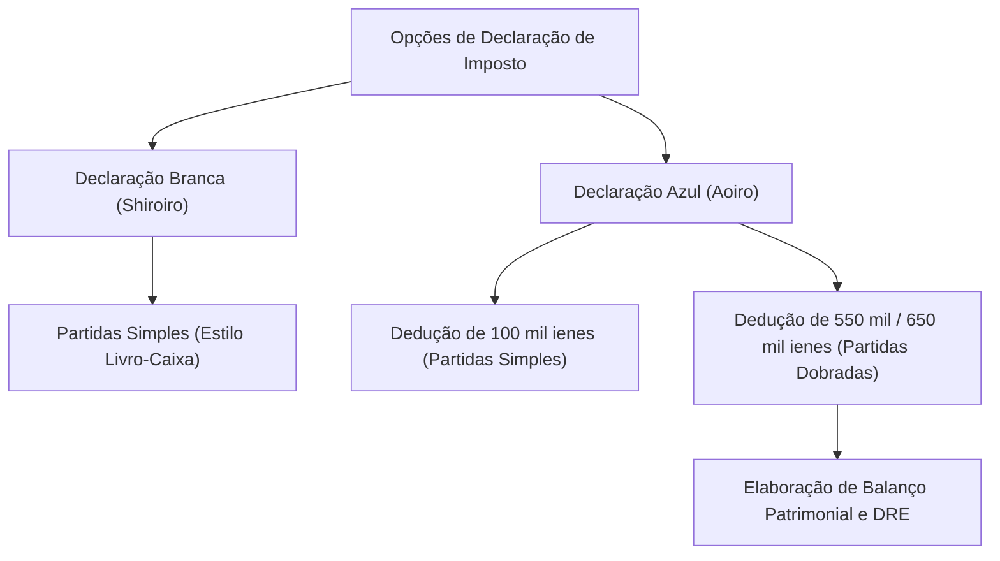

## 1. Introdução: A Interface Chamada Sistema de Autolançamento Tributário

A declaração de imposto de renda (Kakutei Shinkoku) é a interface mais crucial para as interações econômicas entre o Estado e o indivíduo. O sistema tributário japonês adota como princípio o "regime de autolançamento" (shinkoku nozei seido), no qual os próprios contribuintes calculam seus rendimentos e impostos devidos, prestando contas diretamente ao governo. No entanto, para a maioria dos trabalhadores assalariados, esse processo é automatizado por meio da "retenção de impostos na fonte" (gensen choshu) e do "ajuste de fim de ano" (nenmatsu chosei), o que limita a percepção sobre a totalidade do sistema tributário.

Neste artigo, exploraremos a fundo o mecanismo da declaração de impostos no Japão: desde o contexto histórico da retenção na fonte até as 10 categorias de rendimentos, as exigências contábeis entre a Declaração Azul e a Branca, e o funcionamento das principais deduções fiscais.

## 2. Contexto Histórico da Retenção na Fonte e o Ajuste de Fim de Ano

### O Surgimento da Retenção na Fonte (Gensen Choshu)

A origem do sistema de retenção na fonte no Japão remonta a 1940 (ano 15 da era Showa), antes da Segunda Guerra Mundial. Com a reforma tributária voltada para o financiamento dos esforços de guerra, foi implementado um mecanismo no qual os empregadores descontavam os impostos diretamente dos salários e os repassavam ao governo, garantindo uma arrecadação mais segura e eficiente. Essa medida reduziu o desgaste psicológico dos contribuintes (atenuando a chamada 'dor do tributo' ou tsuuzeikan) e, ao mesmo tempo, assegurou uma receita estável para o Estado.

### O Ajuste de Fim de Ano (Nenmatsu Chosei): A Conciliação da Retenção

A retenção mensal na fonte é apenas uma estimativa. Se o número de dependentes mudar ao longo do ano ou se houver pagamento de seguros de vida, haverá uma discrepância entre o valor retido e o imposto real devido. Essa diferença é corrigida pelo "ajuste de fim de ano" (nenmatsu chosei). As empresas recalculam os rendimentos e as deduções em nome de seus funcionários, compensando cobranças excessivas ou pendências. Graças a isso, a maioria dos assalariados não precisa enviar uma declaração própria.

No entanto, profissionais autônomos (freelancers), empresários individuais, pessoas com múltiplas fontes de renda ou aqueles que desejam usufruir de deduções especiais (como a dedução de financiamento imobiliário no primeiro ano ou altas despesas médicas) devem realizar o Kakutei Shinkoku por conta própria.

## 3. Estrutura Progressiva do Imposto de Renda

O imposto de renda japonês baseia-se em uma estrutura de "alíquotas progressivas". Isso significa que, à medida que a renda aumenta, alíquotas mais altas são aplicadas de forma gradual. A tabela é dividida em 7 faixas, variando de 5% a 45%:

- Até 1.950.000 ienes: 5%
- De 1.950.001 a 3.300.000 ienes: 10%
- De 3.300.001 a 6.950.000 ienes: 20%
- De 6.950.001 a 9.000.000 ienes: 23%
- De 9.000.001 a 18.000.000 ienes: 33%
- De 18.000.001 a 40.000.000 ienes: 40%
- Acima de 40.000.000 ienes: 45%

É fundamental compreender que a alíquota máxima não incide sobre o total dos rendimentos, mas apenas sobre a parcela que excede o limite de cada faixa anterior. Esse mecanismo assegura a redistribuição de renda sem desincentivar o esforço produtivo.

## 4. As 10 Categorias de Rendimentos

A Lei do Imposto de Renda japonesa divide os ganhos em 10 categorias segundo sua natureza, aplicando regras específicas de cálculo a cada uma delas. Essa categorização detalhada é um dos fatores que tornam a declaração de impostos complexa:

1. **Rendimentos de Juros (Rishi Shotoku)**: Juros de poupança, depósitos bancários, títulos públicos ou privados.
2. **Rendimentos de Dividendos (Haitou Shotoku)**: Dividendos de ações, distribuições de lucros de fundos de investimento, etc.
3. **Rendimentos Imobiliários (Fudousan Shotoku)**: Rendas obtidas com a locação de terrenos ou imóveis.
4. **Rendimentos Empresariais (Jigyou Shotoku)**: Ganhos decorrentes de atividades na agricultura, pesca, indústria, comércio atacadista/varejista ou serviços. A remuneração de profissionais autônomos (freelancers) costuma ser classificada aqui.
5. **Rendimentos Assalariados (Kyuuyo Shotoku)**: Salários, ordenados e bônus pagos a funcionários de empresas e trabalhadores temporários.
6. **Rendimentos de Rescisão/Aposentadoria (Taishoku Shotoku)**: Verbas rescisórias ou aposentadorias de desligamento. Beneficiam-se de deduções expressivas para amenizar o impacto tributário.
7. **Rendimentos Florestais (Sanrin Shotoku)**: Ganhos provenientes do corte ou cessão de madeira em florestas.
8. **Ganhos de Capital (Jouto Shotoku)**: Lucros com a venda ou cessão de bens como imóveis, terrenos, ações, títulos de clubes de golfe, etc.
9. **Rendimentos Transitórios/Eventuais (Ichiji Shotoku)**: Prêmios de loteria, apostas em corridas de cavalos, resgates únicos de seguro de vida e outros ganhos não recorrentes.
10. **Rendimentos Diversos (Zatsu Shotoku)**: Qualquer rendimento não enquadrado nas 9 categorias anteriores. Inclui aposentadoria pública, receitas de trabalhos extras secundários (de pequeno porte) e lucros com transações de criptoativos.

## 5. Requisitos de Escrituração: Declaração Azul vs Declaração Branca

Ao submeter o Kakutei Shinkoku, empresários individuais e proprietários de imóveis podem optar principalmente por dois regimes: a "Declaração Azul" (Aoiro Shinkoku) ou a "Declaração Branca" (Shiroiro Shinkoku).

### Declaração Branca (Shiroiro Shinkoku): Escrituração Simples em Livro-Caixa

A Declaração Branca admite o método de partidas simples (livro-caixa). Basta registrar as entradas e saídas do dia a dia, sem necessidade de aprovação prévia da Receita. Em contrapartida, quase não oferece benefícios fiscais. Embora no passado houvesse isenção de escrituração para certas faixas, hoje todos os declarantes brancos são obrigados a manter e arquivar seus livros contábeis.

### Declaração Azul (Aoiro Shinkoku): Partidas Dobradas e Vantagens Fiscais Substanciais

Para usufruir da Declaração Azul, é preciso submeter um pedido prévio de aprovação à autoridade tributária. O principal atrativo é a "Dedução Especial da Declaração Azul" (Aoiro Shinkoku Tokubetsu Kojyo). Ao atender a todos os requisitos, é possível deduzir até 650.000 ienes (ou 550.000 / 100.000 ienes) do lucro tributável, proporcionando uma economia significativa.

Para garantir a dedução de 650.000 ou 550.000 ienes, exige-se uma escrituração rigorosa por "partidas dobradas". Cada operação é registrada nas colunas de débito e crédito, gerando o Balanço Patrimonial e a Demonstração do Resultado do Exercício (DRE). Isso permite uma avaliação fiel da saúde financeira e operacional do negócio.

## 6. O Mecanismo das Deduções Fiscais

A "Dedução de Rendimentos" (Shotoku Kojyo) é um dispositivo que subtrai determinados valores da renda bruta antes da apuração do imposto, visando à justiça fiscal ao levar em conta circunstâncias pessoais do contribuinte (composição familiar, condições de saúde, despesas específicas, etc.).

### Dedução Básica (Kiso Kojyo)
Aplicada a todos os contribuintes sem distinção de status. Para quem possui renda total tributável de até 24 milhões de ienes, aplica-se uma dedução padrão de 480.000 ienes. Esse valor decresce progressivamente em rendas superiores, zerando acima de 25 milhões de ienes.

### Dedução de Despesas Médicas (Iryouhi Kojyo)
Quando as despesas com saúde pagas pelo contribuinte e por seus dependentes ao longo do ano civil (1º de janeiro a 31 de dezembro) ultrapassam determinado teto (geralmente 100.000 ienes), o excedente (até o limite de 2 milhões de ienes) pode ser deduzido. Estão cobertas consultas médicas e remédios sob prescrição, bem como determinados medicamentos de venda livre (conforme o regime especial de automedicação).

### Furusato Nozei (Dedução de Doações)
O Furusato Nozei permite que o contribuinte faça doações a municípios de sua escolha e deduza do imposto de renda e do imposto residencial do ano seguinte a quantia que exceder 2.000 ienes (respeitado o teto individual). Na prática, funciona como um adiantamento de tributos acompanhado de produtos típicos de agradecimento enviados pelas cidades recebedoras. Contabilmente, o processo é registrado como dedução de doação (Kifukin Kojyo).

## Conclusão

O Kakutei Shinkoku vai muito além de uma simples obrigação de pagamento: é uma interface refinada para sincronizar dados financeiros entre o cidadão e o Estado, garantindo uma distribuição equitativa das obrigações fiscais. Em um cenário onde a retenção na fonte frequentemente oculta a dinâmica tributária, compreender a estrutura da própria renda e saber aplicar a Declaração Azul e as devidas deduções é um pilar essencial para o planejamento e a construção patrimonial no Japão.
