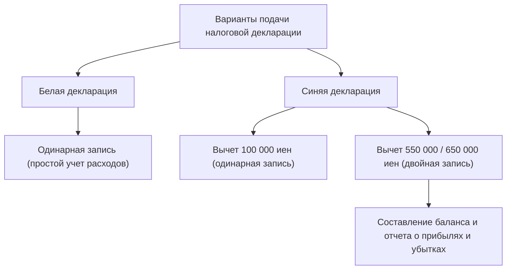

## 1. Введение: интерфейс под названием «система самостоятельного декларирования»

Налоговая декларация (*какутэй синкоку*) — это важнейший интерфейс экономического взаимодействия между государством и частным лицом. Налоговая система Японии опирается на принцип «декларационного налогообложения» (*синкоку нодзэй сэйдо*), согласно которому налогоплательщик самостоятельно рассчитывает свои доходы и сумму налога, после чего подает декларацию в налоговые органы. Однако для большинства наемных работников этот процесс автоматизирован благодаря системе удержания налога у источника (*гэнсэн тёсю*) и годовой корректировке (*нэнмацу тёсэй*), из-за чего они редко задумываются о том, как функционирует система самостоятельного налогообложения в целом.

В этой статье мы подробно разберем японскую систему подачи налоговой декларации: от исторических предпосылок внедрения удержания у источника и 10 категорий доходов до различий в требованиях к бухгалтерскому учету для «синей» и «белой» деклараций, а также механизма налоговых вычетов.

## 2. Исторический контекст удержания у источника и годовая корректировка

### Появление системы удержания у источника

Истоки японской системы удержания налога у источника восходят к 1940 году (15-й год эпохи Сёва), накануне Второй мировой войны. В рамках налоговой реформы, направленной на финансирование военных расходов, для более надежного и эффективного сбора налогов была внедрена схема, при которой работодатель вычитал налог из заработной платы и перечислял его напрямую государству. Эта система сглаживала так называемое «налоговое бремя» налогоплательщиков (психологическую боль от расставания с деньгами) и одновременно гарантировала государству стабильный приток средств в казну.

### Годовая корректировка (нэнмацу тёсэй): окончательный расчет

Удержание налога у источника — это лишь приблизительная, оценочная сумма. Если в течение года у работника меняется число иждивенцев или он оплачивает взносы по страхованию жизни, между удержанной суммой и фактическими налоговыми обязательствами возникает разница. Для устранения этого расхождения существует процедура «годовой корректировки» (*нэнмацу тёсэй*). Компания от имени работника пересчитывает его годовой доход и положенные вычеты, компенсируя переплату или недоплату. Благодаря этому большинству офисных служащих (*сарариманов*) не нужно самостоятельно подавать налоговую декларацию.

Однако фрилансеры, индивидуальные предприниматели, люди с несколькими источниками дохода или те, кто претендует на специальные вычеты (например, ипотечный вычет за первый год или вычет на крупные медицинские расходы), обязаны подавать декларацию самостоятельно.

## 3. Прогрессивная шкала подоходного налога

Подоходный налог в Японии строится по принципу ступенчатой прогрессивной шкалы. Это означает, что с ростом дохода ставка налога повышается поэтапно. Шкала разделена на 7 ступеней — от 5% до максимум 45%:

- До 1 950 000 иен: 5%
- Свыше 1 950 000 до 3 300 000 иен: 10%
- Свыше 3 300 000 до 6 950 000 иен: 20%
- Свыше 6 950 000 до 9 000 000 иен: 23%
- Свыше 9 000 000 до 18 000 000 иен: 33%
- Свыше 18 000 000 до 40 000 000 иен: 40%
- Свыше 40 000 000 иен: 45%

Принципиально важно, что максимальная ставка начисляется не на весь совокупный доход, а исключительно на сумму, превышающую установленный порог. Такой механизм позволяет реализовать функцию перераспределения доходов в обществе, не подавляя при этом мотивацию к труду.

## 4. 10 категорий доходов

Закон о подоходном налоге разделяет доходы на 10 категорий в зависимости от их природы, устанавливая для каждой собственный порядок расчета. Именно это разнообразие делает процедуру подачи декларации достаточно сложной для восприятия.

1. **Процентный доход (*риси сётоку*)**: проценты по банковским вкладам, депозитам, государственным и корпоративным облигациям.
2. **Дивидендный доход (*хайто сётоку*)**: дивиденды по акциям, выплаты из инвестиционных фондов и паев.
3. **Доход от недвижимости (*фудосан сётоку*)**: доход от сдачи в аренду земельных участков и зданий.
4. **Предпринимательский доход (*дзигё сётоку*)**: доходы от деятельности в сфере сельского хозяйства, рыболовства, производства, оптовой и розничной торговли, услуг. Сюда же чаще всего относятся гонорары фрилансеров.
5. **Трудовой доход (*кюё сётоку*)**: заработная плата, премии и оклады сотрудников компаний и почасовых работников.
6. **Выходное пособие (*тайсёку сётоку*)**: выплаты при выходе на пенсию или увольнении со стажем. К ним применяется особый льготный расчет для снижения налоговой нагрузки.
7. **Лесохозяйственный доход (*санрин сётоку*)**: доход от заготовки и реализации древесины из лесных угодий.
8. **Доход от отчуждения имущества (*дзёто сётоку*)**: прибыль от продажи активов, таких как земля, недвижимость, ценные бумаги или членство в гольф-клубах.
9. **Единовременный доход (*итидзи сётоку*)**: разовые, нерегулярные поступления: денежные призы, выигрыши на скачках, единовременные выплаты по страхованию жизни.
10. **Прочий доход (*дзацу сётоку*)**: любые доходы, не вошедшие в предыдущие девять пунктов. Включает государственные пенсии, подработки (небольшого масштаба), прибыль от торговли криптовалютой и т. д.

## 5. Требования к ведению учета: «синяя» и «белая» декларации

Когда индивидуальные предприниматели или владельцы недвижимости подают декларацию, они выбирают один из двух основных вариантов: «синюю» (*аоиро синкоку*) или «белую» (*сироиро синкоку*).

### Белая декларация: простой учет методом одинарной записи

Белая декларация допускает ведение записей по принципу одинарной бухгалтерии, схожей с обычной книгой учета расходов. Достаточно фиксировать ежедневные доходы и расходы, без необходимости предварительно запрашивать разрешение налоговой инспекции. Однако при этом налоговые льготы практически отсутствуют. В прошлом действовали исключения, освобождавшие от обязательного ведения книг, но сейчас все плательщики, выбравшие белую декларацию, обязаны вести учет и хранить документацию.

### Синяя декларация: метод двойной записи и мощная налоговая оптимизация

Для подачи синей декларации требуется предварительно подать заявление и получить одобрение в налоговой инспекции. Главным ее преимуществом является специальный налоговый вычет (*аоиро синкоку токубэцу кодзё*). При соблюдении условий можно вычесть из налогооблагаемого дохода до 650 000 иен (либо 550 000 или 100 000 иен), что обеспечивает ощутимую налоговую экономию.

Чтобы претендовать на вычет в размере 650 000 или 550 000 иен, требуется вести строгий учет методом двойной записи. В бухгалтерском учете с двойной записью каждая операция отражается одновременно по двум сторонам — дебету (*кариката*) и кредиту (*касиката*), с обязательным составлением баланса (*тайсяку тайсёхё*) и отчета о прибылях и убытках (*сонъэки кэйсансё*). Это позволяет максимально достоверно видеть финансовое состояние и результаты деятельности бизнеса.

## 6. Механизм налоговых вычетов

«Налоговый вычет из дохода» (*сётоку кодзё*) — это система, позволяющая уменьшить налогооблагаемую базу на определенную сумму с учетом личных обстоятельств налогоплательщика (состава семьи, болезней, определенных расходов), обеспечивая справедливость налогообложения.

### Базовый вычет (кисо кодзё)
Вычет, автоматически предоставляемый всем налогоплательщикам без каких-либо предварительных условий. При общем годовом доходе не более 24 млн иен сумма вычета составляет 480 000 иен. По мере роста доходов размер вычета ступенчато уменьшается, а при доходе свыше 25 млн иен становится равным нулю.

### Вычет на медицинские расходы (ирёрёхи кодзё)
Если расходы на лечение, лекарства и медицинскую помощь, оплаченные за себя или членов семьи в течение одного календарного года (с 1 января по 31 декабря), превышают установленный порог (как правило, 100 000 иен), сумму превышения (до 2 млн иен) можно вычесть из дохода. Вычет распространяется не только на посещения врачей и рецептурные препараты, но и на часть безрецептурных лекарств (в рамках специальной программы самолечения).

### Программа «Фурусато нодзэй» (вычет на благотворительные пожертвования)
*Фурусато нодзэй* — это программа добровольных пожертвований любому муниципалитету страны, в рамках которой сумма пожертвования за вычетом 2 000 иен уменьшает подоходный налог и налог на проживание (налог резидента) следующего года (в пределах лимита). По сути являясь предоплатой налогов, эта система крайне популярна, поскольку позволяет жертвователям получать ценные подарки (*хэнрэйхин*) от местных властей. С точки зрения налогового расчета она оформляется как вычет за пожертвования (*кифукин кодзё*).

## Заключение

Подача налоговой декларации — это не просто механическая обязанность «заплатить налоги». Это точный финансовый интерфейс между государством и человеком, синхронизирующий финансовую информацию и определяющий справедливое распределение обязательств. В эпоху, когда система удержания налогов у источника делает этот механизм практически невидимым для большинства, глубокое понимание структуры своих доходов и налогов, а также грамотное применение синей декларации и различных вычетов становятся ключевым элементом управления личным капиталом.
