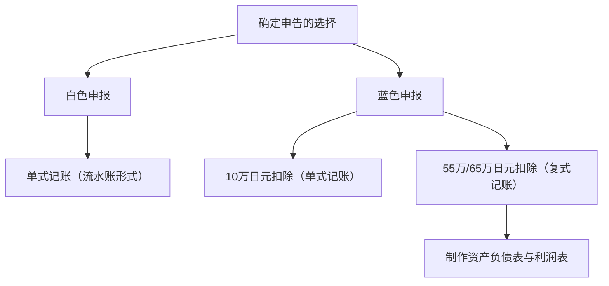

## 1. 引言：名为自主申报纳税制度的交互界面

确定申告（所得税年度申报）是国家与个人进行经济往来最重要的交互界面。日本税制以“申报纳税制度”为基本原则，实行由纳税人自行计算所得额与税额并向税务机关申报的机制。然而，对于多数工薪阶层而言，通过“源泉征收（代扣代缴）制度”与“年末调整”，这一流程几乎被完全自动化处理，导致人们很少有机会意识到自主申报纳税制度的全貌。

本文将从源泉征收制度的历史沿革切入，深入剖析10种所得分类、蓝色申报与白色申报的记账要求差异，以及各类所得扣除机制，全面解读日本的确定申告制度。

## 2. 源泉征收制度的历史背景与年末调整

### 源泉征收制度的诞生

日本源泉征收制度的历史可追溯至第二次世界大战前的1940年（昭和15年）。当时为了筹措军费，政府推行税制改革，为了更可靠、高效地征集税款，引入了由支付薪资的雇主直接从工资中扣缴税款并上缴国家的制度。这一机制在减轻纳税人心理上的“纳税痛感”的同时，也为国家确保了稳定可靠的财政税收来源。

### 年末调整：源泉征收的年终结算

源泉征收在本质上只是一种“预估”性质的扣缴。在一年当中，若雇员的抚养家属人数发生变化，或支付了人身保险费，预扣税额与实际应纳税额之间就会产生差额。填补这一缺口的正是“年末调整”。企业代替员工重新计算全年的所得额与各类扣除，多退少补。正因如此，绝大多数公司职员无须自行办理确定申告。

然而，自由职业者、个体经营者（个人事业主）、拥有多重收入来源的人群，或是希望享受特定税收优惠（例如首年房贷扣除、大额医疗费扣除等）的人，仍必须亲自办理确定申告。

## 3. 个人所得税的累进税率结构

日本的个人所得税采用“超额累进税率”机制。随着所得额的提升，适用的税率按阶梯逐步提高。税率共划分为7个档次，从5%到最高45%不等：

- 1,950,000日元以下：5%
- 超过1,950,000日元至3,300,000日元：10%
- 超过3,300,000日元至6,950,000日元：20%
- 超过6,950,000日元至9,000,000日元：23%
- 超过9,000,000日元至18,000,000日元：33%
- 超过18,000,000日元至40,000,000日元：40%
- 超过40,000,000日元：45%

这里至关重要的一点在于：最高税率并非作用于全部所得，而是仅适用于“超过特定门槛的部分”。这一设计在发挥税收调节贫富差距、促进所得再分配功能的同时，也避免了过度挫伤劳动者的工作积极性。

## 4. 10种所得分类

日本所得税法根据收入性质将其划分为10类，并分别为其制定了不同的核算规则。这种复杂性也是导致确定申告让人感到晦涩难懂的重要原因之一。

1. **利息所得（利子所得）**：存款、公债与公司债的利息等。
2. **股息所得（配当所得）**：股票分红、投资基金收益分配金等。
3. **不动产所得**：出租土地或建筑物产生的所得。
4. **营业所得（事业所得）**：从事农业、渔业、制造业、批发零售业、服务业等商业运营产生的所得，自由职业者的报酬通常也归入此类。
5. **工资薪金所得（给与所得）**：公司职员或兼职打工人员获得的工资、奖金与津贴。
6. **退职所得**：退休金或离职补偿金等。设有专门的减税计算方法以减轻税负。
7. **林业所得（山林所得）**：砍伐或转让山林所产生的所得。
8. **财产转让所得（让渡所得）**：转让土地、房屋、股票、高尔夫球会员证等资产所获得的收益。
9. **偶然所得（一时所得）**：抽奖奖金、赛马返还金、人身保险满期返还金等非持续性所得。
10. **其他所得（杂所得）**：无法归入上述9类的各项收入。包括公共养老金、小规模副业收入、加密资产（虚拟货币）交易利润等。

## 5. 蓝色申报与白色申报的记账要求

个体经营者或不动产业主在办理确定申告时，主要有两种申报方式可供选择：“蓝色申报”与“白色申报”。

### 白色申报：单式记账的简易记录

白色申报允许采用类似日常记账本的“单式记账”方式。只需如实记录日常的收入与开支流水，且无须提前提交特殊申请。然而，白色申报几乎享受不到税法上的特惠优待。虽然过去曾有免除记账义务的过渡特例，但目前所有白色申报者均被强制要求记账并妥善保存账簿凭证。

### 蓝色申报：复式记账与显著的节税效应

选择蓝色申报，必须提前向税务署提交申请并获得批准。其最大的吸引力在于可以享受“蓝色申报特别扣除”。只要符合规定要件，最高可从所得额中扣除65万日元（或55万日元、10万日元），带来可观的节税效益。

若想享受65万或55万日元的顶格扣除，必须采用严谨的“复式记账”。在复式记账体系中，每笔经济交易都需同时从“借方”与“贷方”两个维度进行记录，并编制“资产负债表”和“利润表（损益计算书）”。这不仅有助于税务合规，也能帮助经营者准确把握业务的财务状况与经营成果。

## 6. 所得扣除的运作机制

“所得扣除”是考虑纳税人的家庭结构、健康状况或特定支出等个人实际情况，为实现税负公平而从应纳税所得额中减除一定金额的制度。

### 基础扣除
适用于全体纳税人的无条件基本扣除。只要合计所得额在2400万日元以下，均可享受统一的48万日元税前扣除。随着所得增加，扣除额逐步递减；当所得超过2500万日元时，基础扣除归零。

### 医疗费扣除
在1个自然年（1月1日至12月31日）内，本人及共同生活的家属实际支付的医疗费用如果超过一定限额（原则上为10万日元），超出的部分（最高限额200万日元）可从所得额中扣除。就诊挂号费、处方药费均在此列，部分合规的非处方药支出也可享受自我药疗税制扣除。

### 故乡纳税（寄附金扣除）
故乡纳税（Hometown Tax）是纳税人向自选的地方自治体（地方政府）进行捐款，捐款金额中扣除2000日元自负额后的剩余部分，可全额冲抵所得税及次年个人住民税的制度（设有上限）。这在本质上相当于税款的预缴，但纳税人可同时获赠地方政府回赠的特产谢礼，因此在民间极受欢迎。在税法计算中，该项被归类为“寄附金扣除（捐赠扣除）”。

## 结论

确定申告绝非仅仅是“交税的法定手续”，而是国家与个人之间同步财务信息、裁定公平税负的精密交互界面。在当代社会，源泉征收的自动化让这种交互变得难以察觉。正因如此，透彻理解个人所得与税收运作机理，合理运用蓝色申报及各项法定扣除，对于构筑稳健的个人资产而言显得尤为重要。
