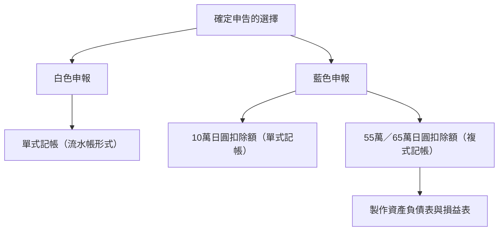

## 1. 引言：名為自主申報納稅制度的交互介面

確定申告（所得稅年度申報）是國家與個人進行經濟互動最重要的介面。日本稅制以「申報納稅制度」為原則，採用納稅義務人自行計算所得與稅額並向稅務機關申報的運作機制。然而，對於多數受薪階級（受雇員工）而言，透過「源泉徵收（就源扣繳）制度」與「年末調整」，這項流程幾乎已被完全自動化，導致許多人甚少有機會意識到自主申報納稅制度的全貌。

本文將從源泉徵收制度的歷史背景切入，深入探討10種所得分類、藍色申報與白色申報在帳簿記錄要件上的差異，以及各項扣除額的運作機制，全面解析日本的確定申告制度。

## 2. 源泉徵收制度的歷史背景與年末調整

### 源泉徵收制度的誕生

日本源泉徵收制度的起源，可追溯至第二次世界大戰前的1940年（昭和15年）。為了籌措戰爭經費並推行稅制改革，官方為了更確實且有效率地徵繳稅收，導入了由發放薪資的雇主直接預扣稅款並繳納給國家的機制。這項制度不僅減輕了納稅人的心理負擔（即所謂緩和「痛稅感」），同時也為國家確保了穩定充裕的財政稅源。

### 年末調整：源泉徵收的年終精算

源泉徵收本質上只是一種「概算（預估）」扣繳。在年度進行中，若員工扶養親屬增減，或繳納了人身保險費，預扣金額與實際應納稅額之間往往會產生落差。填補此一差距的關鍵正是「年末調整」。企業代員工重新核算全年度的實質所得與法定扣除額，並進行多退少補。拜此所賜，絕大多數公司職員無須自行辦理確定申告。

然而，自由職業者、個人事業主（獨資經營者）、擁有多重收入來源者，或是欲申請特定租稅優惠（例如首年度房貸抵減或大額醫療費用扣除額等）的人，依然必須親自辦理確定申告。

## 3. 個人所得稅的累進稅率架構

日本的個人所得稅採用「超額累進稅率」架構。這意味著隨著所得淨額的攀升，將分階段適用更高的稅率。稅率級距劃分為7個等級，自5%至最高45%：

- 1,950,000日圓以下：5%
- 超過1,950,000日圓至3,300,000日圓：10%
- 超過3,300,000日圓至6,950,000日圓：20%
- 超過6,950,000日圓至9,000,000日圓：23%
- 超過9,000,000日圓至18,000,000日圓：33%
- 超過18,000,000日圓至40,000,000日圓：40%
- 超過40,000,000日圓：45%

此處的核心概念在於：最高稅率並非針對全部所得課徵，而是僅適用於「超過門檻金額之部分」。這項機制在發揮所得重分配功能的同時，亦顧及不致過度打擊納稅人的勤勞工作意願。

## 4. 10種所得分類

日本所得稅法依照收入性質將其細分為10大類，並個別規定不同的核算方式。這項複雜性正是確定申告令人感到艱澀難懂的主因之一。

1. **利息所得（利子所得）**：存款、公債及公司債之利息等。
2. **股利所得（配當所得）**：股票股利、投資信託收益分配金等。
3. **不動產所得**：出租土地或房屋建築物所產生之所得。
4. **營業所得（事業所得）**：從事農業、漁業、製造業、批發零售業、服務業等事業經營所產生之所得，自由職業者的接案報酬多半亦歸屬此類。
5. **薪資所得（給與所得）**：受雇員工或打工兼職人員所領取之薪水、獎金及各項津貼。
6. **退職所得**：退休金或離職資遣費等。稅法特別給予優惠計算公式以大幅減輕稅負。
7. **林業所得（山林所得）**：砍伐或轉讓山林木材所得之收益。
8. **財產交易所得（讓渡所得）**：處分或轉讓土地、房屋、股票、高爾夫球會員證等資產之利得。
9. **一時所得**：非經常性、非持續性之收入，例如抽獎獎金、賽馬獎金、壽險滿期給付等。
10. **其他所得（雜所得）**：不屬於上述9種分類之任何所得。包含公營年金、副業收入（小規模者）、加密資產（虛擬貨幣）交易利得等。

## 5. 藍色申報與白色申報的記帳要件

個人事業主或不動產業主在進行確定申告時，主要有「藍色申報」與「白色申報」兩種途徑可供選擇。

### 白色申報：單式記帳的簡易紀錄

白色申報允許使用如同記帳本一般的「單式記帳」。納稅人只需如實記載日常收支流水帳，且事前無須提出任何申請。然而，相對地幾乎無法享有稅務優惠措施。過去雖曾有免除記帳義務之過渡特例，但現行法規已強制規定所有白色申報者均有記帳與保存帳簿之法律義務。

### 藍色申報：複式記帳與顯著的節稅效益

若欲辦理藍色申報，必須事前向稅務署提交申請書並獲核准。其最大的核心優勢在於享有「藍色申報特別扣除額」。符合相關條件者，最高可由所得中扣除65萬日圓（或55萬日圓、10萬日圓），具備極佳的節稅效果。

若要取得65萬或55萬日圓之扣除資格，法規要求必須以嚴謹的「複式記帳」方式記錄。在複式記帳制度下，每筆交易均須從「借方」與「貸方」雙向平行記錄，並編製「資產負債表」與「損益表」。這不僅能滿足法定申報要件，更能精確掌握事業之財務體質與營運成效。

## 6. 各項扣除額的運作機制

「所得扣除額」是考量納税人家庭結構、傷病狀況或特定開支等個人生活處境，為了落實實質課稅與租稅公平，從綜合所得淨額中減除特定金額的制度。

### 基礎扣除額
無條件適用於所有納稅義務人之基本扣除額。只要全年度合計所得在2,400萬日圓以下，均享有一律48萬日圓之所得扣除。所得超過此門檻後扣除額將階梯式遞減，若超過2,500萬日圓則降為零。

### 醫療費扣除額
在1個年度（1月1日至12月31日）內，本人或扶養家屬實際支付的醫療費用若超過指定門檻（原則上為10萬日圓），超過部分（最高上限200萬日圓）可自所得額中扣除。除看診費與處方藥費外，部分特定成藥（符合自我藥療稅制者）亦可計入扣除。

### 故鄉納稅（捐贈扣除額 / 寄附金控除）
故鄉納稅是一項納稅人自由選擇向特定地方自治體（縣市地方政府）進行捐款，捐贈金額扣除2,000日圓自付額後的其餘款項，得以全數自所得稅及次年度住民稅中抵扣的制度（設有上限）。實質上雖屬預繳稅款性質，但因地方政府會回贈極具特色之地方名產，因此在日本民間享有極高人氣。在稅額計算上係以「捐贈扣除額（寄附金控除）」列支。

## 結論

確定申告絕非單純「繳稅的手續」，而是國家與個人之間同步金流資訊、確立公平分擔的精密介面。正是在源泉徵收高度普及、令大眾對其運作感受日趨淡薄的現代社會，深入理解自身的所得與稅制脈絡，妥善善用藍色申報及各項法定扣除額，已成為個人資產管理與財務規劃中至關重要的關鍵環節。
