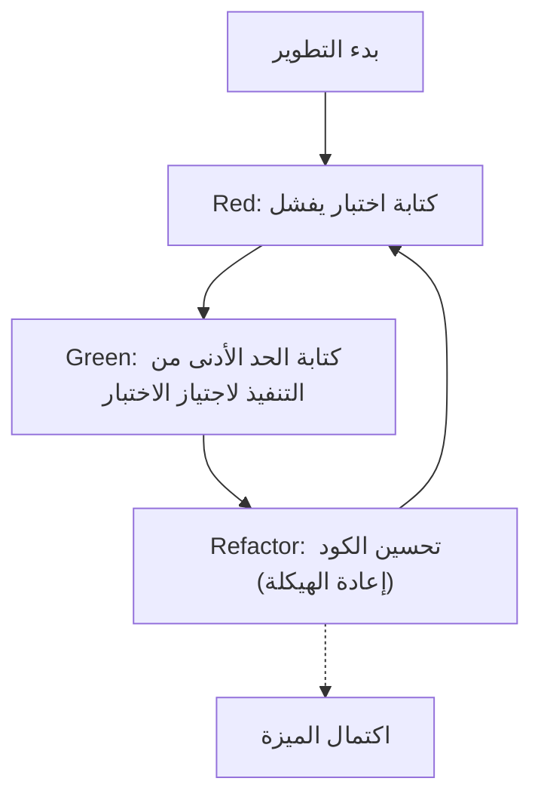
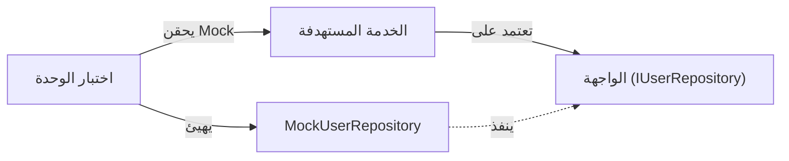

في تطوير البرمجيات الحديثة، الحفاظ على جودة الكود مع إضافة الميزات بسرعة هو هدف أسمى. خصوصاً في لغات معقدة وتتطلب أداءً عالياً مثل C++، الأخطاء في إدارة الذاكرة والسلوكيات غير المحددة (Undefined Behavior) يمكن أن تؤدي بسهولة إلى أعطال فادحة، مما يجعل أهمية الاختبار أعلى من اللغات الأخرى.

في هذه المقالة، سنشرح بشكل مفصل وعملي جداً كيفية تقديم **التطوير الموجه بالاختبار (Test-Driven Development: TDD)** في مشاريع C++. سنغطي بشكل شامل كيفية استخدام إطار عمل اختبار الوحدة **GoogleTest** وإطار عمل الـ Mock **GoogleMock**، بالإضافة إلى طريقة التكوين الحديثة باستخدام نظام البناء **CMake**، وطريقة قياس تغطية الكود (Code Coverage).

## 1. فلسفة التطوير الموجه بالاختبار (TDD) وفوائده

التطوير الموجه بالاختبار (TDD) هو منهجية تطوير برمجيات تقوم على "كتابة الاختبار قبل كتابة التنفيذ". إنها ليست مجرد منهجية اختبار، بل تعمل أيضاً كـ **منهجية تصميم**. من خلال كتابة الاختبارات أولاً، يصبح المطورون واعين بشكل طبيعي بـ "الواجهات سهلة الاستخدام" و "التصميم غير المترابط (Loosely coupled)".

### 1.1 دورة Red-Green-Refactor

يكمن جوهر TDD في دورة "Red-Green-Refactor" التالية.



1. **Red (أحمر)**: في حالة عدم وجود تنفيذ، يتم كتابة اختبار يحدد السلوك المتوقع. نظراً لعدم وجود تنفيذ في هذه المرحلة، سيفشل الاختبار بالضرورة (Red).
2. **Green (أخضر)**: يتم كتابة الحد الأدنى من الكود فقط لجعل الاختبار ينجح (Green). في هذه المرحلة، لا يتم إعطاء الأولوية لجمال الكود أو الأداء.
3. **Refactor (إعادة الهيكلة)**: مع الحفاظ على حالة نجاح الاختبار، يتم التخلص من التكرار وتحسين تصميم الكود. وجود الاختبارات يسمح بتعديل الكود بأمان.

### 1.2 زيادة التكلفة بسبب تأخر اكتشاف الأخطاء

في هندسة البرمجيات، من المعروف أنه كلما تم اكتشاف الخطأ في مرحلة متأخرة من عملية التطوير، زادت تكلفة إصلاحه بشكل أُسّي. يمكن تقريب هذا النموذج لزيادة التكلفة باستخدام المعادلة الرياضية التالية.

$$ Cost(t) = C_0 \times e^{k \cdot t} $$

حيث $Cost(t)$ هي تكلفة الإصلاح في الوقت $t$، و $C_0$ هي تكلفة الإصلاح فور إدخال الخطأ (خط الأساس)، و $k$ هو ثابت. من خلال تقديم TDD، يمكن الحفاظ على $t$ عند الحد الأدنى ومنع الزيادة الأُسّية في التكلفة بشكل استباقي.

## 2. اختيار أدوات الاختبار في C++ وتكوين CMake الحديث

يوجد العديد من أطر عمل الاختبار في C++. هناك Catch2، Boost.Test، doctest وغيرها، ولكن المعيار الصناعي الأكثر استخداماً على نطاق واسع هو **GoogleTest (gtest)**. يتميز GoogleTest بتأكيداته الغنية (assertions)، وإطار عمل Mock قوي (GoogleMock)، وقابلية التوسعة العالية.

### 2.1 إدخال GoogleTest باستخدام `FetchContent` في CMake

في تطوير C++ الحديث، أصبحت إدارة التبعيات الخارجية باستخدام وحدة `FetchContent` الخاصة بـ CMake هي الطريقة السائدة. هذا يوفر عناء إدارة الوحدات الفرعية (submodules) أو تثبيت المكتبات مسبقاً.

يتم كتابة `CMakeLists.txt` في جذر المشروع على النحو التالي:

```cmake
cmake_minimum_required(VERSION 3.14)
project(TddCppExample CXX)

# تحديد معيار C++
set(CMAKE_CXX_STANDARD 17)
set(CMAKE_CXX_STANDARD_REQUIRED ON)

# جعل كود الإنتاج كمكتبة
add_library(core_lib src/Calculator.cpp src/StringUtils.cpp)
target_include_directories(core_lib PUBLIC include)

# تفعيل الاختبارات
enable_testing()

# الحصول على GoogleTest
include(FetchContent)
FetchContent_Declare(
  googletest
  URL https://github.com/google/googletest/archive/refs/tags/v1.14.0.zip
)
# لتجنب تحذيرات البناء في بيئة Windows
set(gtest_force_shared_crt ON CACHE BOOL "" FORCE)
FetchContent_MakeAvailable(googletest)

# إعداد ملف تشغيل الاختبار
add_executable(unit_tests 
    tests/CalculatorTest.cpp 
    tests/StringUtilsTest.cpp
)
target_link_libraries(unit_tests
    PRIVATE
    core_lib
    gtest_main
    gmock
)

# التسجيل في CTest
include(GoogleTest)
gtest_discover_tests(unit_tests)
```

بفضل هذا الإعداد، سيقوم CMake تلقائياً بتنزيل كود المصدر لـ GoogleTest ودمجه في المشروع.

## 3. التطبيق العملي: دورة Red-Green-Refactor باستخدام GoogleTest

من هنا، دعونا نطبق دورة TDD عملياً باستخدام فئة `Calculator` بسيطة كمثال.

### 3.1 المرحلة 1: Red (كتابة اختبار يفشل)

أولاً، نكتب هيكل ملف الترويسة `include/Calculator.h` وكود الاختبار.

**include/Calculator.h (هيكل)**
```cpp
#pragma once

class Calculator {
public:
    int Add(int a, int b);
};
```

**tests/CalculatorTest.cpp (كود الاختبار)**
```cpp
#include <gtest/gtest.h>
#include "Calculator.h"

TEST(CalculatorTest, AddsTwoPositiveNumbers) {
    Calculator calc;
    int result = calc.Add(2, 3);
    EXPECT_EQ(result, 5);
}
```

إذا حاولنا البناء في هذه المرحلة، فسنواجه خطأ في الربط (link error) بسبب عدم وجود تنفيذ لـ `Calculator::Add`، أو ستكون الحالة هي تشغيل الاختبار وفشله (Red).

### 3.2 المرحلة 2: Green (الحد الأدنى من التنفيذ)

نكتب الكود فقط لاجتياز الاختبار.

**src/Calculator.cpp**
```cpp
#include "Calculator.h"

int Calculator::Add(int a, int b) {
    return a + b; // الحد الأدنى من التنفيذ لاجتياز الاختبار
}
```

عند البناء وتشغيل الاختبار الآن، سينجح الاختبار (Green).

### 3.3 المرحلة 3: Refactor (إعادة الهيكلة)

في هذا المثال، الكود بسيط جداً، ولكن مع زيادة تعقيد المتطلبات، نقوم بزيادة قابلية قراءة الكود أو تحسين الأداء في مرحلة إعادة الهيكلة. كود الاختبار نفسه يخضع أيضاً لإعادة الهيكلة. على سبيل المثال، يمكن النظر في تقديم تركيبات الاختبار (`testing::Test` - Test Fixtures) لتوحيد عملية الإعداد (setup).

## 4. الفرق بين `EXPECT_EQ` و `ASSERT_EQ`

عند استخدام GoogleTest، يوجد نوعان من وحدات الماكرو للتأكيدات (assertions) وهما `EXPECT_*` و `ASSERT_*`. من المهم جداً فهم الفرق بينهما لكتابة اختبارات متينة.

- **`EXPECT_EQ(expected, actual)`**: حتى إذا فشل الاختبار، فإنه **يستمر** في تنفيذ دالة الاختبار الحالية. هذا مناسب عندما تريد التحقق من حالات متعددة داخل اختبار واحد.
- **`ASSERT_EQ(expected, actual)`**: إذا فشل الاختبار، فإنه **يوقف (فشل ذريع)** تنفيذ دالة الاختبار الحالية على الفور. يتم استخدامه عندما لا يكون للتحققات اللاحقة أي معنى (مثال: إلغاء مرجعية مؤشر - dereferencing - مباشرة بعد التحقق من أنه ليس `nullptr`).

## 5. حقن التبعية (DI) و Mocking باستخدام GoogleMock

في مشاريع C++ الفعلية، تحدث التبعيات للأنظمة الخارجية مثل الوصول إلى قواعد البيانات، أو الاتصالات الشبكية، أو التحكم في الأجهزة بشكل حتمي. إذا تُركت هذه التبعيات كما هي، فإن اختبار الوحدة يصبح صعباً للغاية.

هنا يأتي دور **حقن التبعية (Dependency Injection: DI)** وإنشاء Mock للواجهات باستخدام **GoogleMock**.



### 5.1 تعريف الواجهة وتنفيذ الفئة المستهدفة

أولاً، نحدد واجهة (فئة تحتوي على دوال افتراضية بحتة - pure virtual functions) تجرد المكونات التي يتم الاعتماد عليها.

```cpp
// include/IUserRepository.h
#pragma once
#include <string>

class IUserRepository {
public:
    virtual ~IUserRepository() = default;
    virtual bool SaveUser(int id, const std::string& name) = 0;
};
```

بعد ذلك، ننشئ فئة خدمة (الهدف من الاختبار) تعتمد على هذه الواجهة. يتم حقن التبعية عن طريق المنشئ (Constructor Injection).

```cpp
// include/UserService.h
#pragma once
#include "IUserRepository.h"
#include <string>

class UserService {
private:
    IUserRepository& repository_;
public:
    UserService(IUserRepository& repository) : repository_(repository) {}

    bool RegisterUser(int id, const std::string& name) {
        if (name.empty()) return false;
        return repository_.SaveUser(id, name);
    }
};
```

### 5.2 إنشاء فئة Mock والاختبار باستخدام GoogleMock

نستخدم ماكرو `MOCK_METHOD` الخاص بـ GoogleMock لعمل Mock للواجهة.

```cpp
// tests/UserServiceTest.cpp
#include <gtest/gtest.h>
#include <gmock/gmock.h>
#include "UserService.h"
#include "IUserRepository.h"

using ::testing::Return;
using ::testing::_;

// تعريف فئة Mock
class MockUserRepository : public IUserRepository {
public:
    MOCK_METHOD(bool, SaveUser, (int id, const std::string& name), (override));
};

TEST(UserServiceTest, RegistersValidUserSuccessfully) {
    MockUserRepository mockRepo;
    UserService service(mockRepo);

    // إعداد القيم المتوقعة: نتوقع أن يتم استدعاء SaveUser مرة واحدة بـ (1, "Kenji") وأن يرجع true
    EXPECT_CALL(mockRepo, SaveUser(1, "Kenji"))
        .Times(1)
        .WillOnce(Return(true));

    // تنفيذ الهدف المراد اختباره
    bool result = service.RegisterUser(1, "Kenji");

    // التأكيد (Assertion)
    EXPECT_TRUE(result);
}

TEST(UserServiceTest, RejectsEmptyNameWithoutCallingRepository) {
    MockUserRepository mockRepo;
    UserService service(mockRepo);

    // نتوقع ألا يتم استدعاء SaveUser إطلاقاً في حالة الاسم الفارغ
    EXPECT_CALL(mockRepo, SaveUser(_, _))
        .Times(0);

    bool result = service.RegisterUser(1, "");

    EXPECT_FALSE(result);
}
```

باستخدام GoogleMock بهذه الطريقة، يمكننا التحقق بدقة من "ما إذا كانت الفئة المستهدفة تتفاعل بشكل صحيح مع تبعياتها (التفاعل)".

## 6. قياس وتصور تغطية الكود

بعد كتابة الاختبارات، لتقييم الجزء الذي يتم تنفيذه (تغطيته) من المشروع بواسطة الاختبارات بشكل موضوعي، نقوم بقياس **تغطية الكود (Code Coverage)**. يتم التعبير عن تغطية الكود ($Coverage$) بالمعادلة التالية:

$$ Coverage = \left( \frac{L_{executed}}{L_{total}} \right) \times 100 \ (\%) $$

حيث $L_{executed}$ هو عدد أسطر الكود التي تم تنفيذها أثناء الاختبار، و $L_{total}$ هو إجمالي عدد أسطر الكود للمشروع بأكمله.

إذا كنت تستخدم GCC أو Clang، فيمكنك استخدام أداتي `gcov` و `lcov` لقياس التغطية.

### 6.1 إضافة خيارات التغطية إلى CMake

لقياس التغطية، تحتاج إلى علامات (flags) مترجم مخصصة. أضف الإعدادات التالية إلى `CMakeLists.txt`.

```cmake
# خيارات بناء التغطية
option(ENABLE_COVERAGE "Enable coverage reporting" OFF)

if(ENABLE_COVERAGE AND CMAKE_CXX_COMPILER_ID MATCHES "GNU|Clang")
    message(STATUS "Coverage enabled")
    target_compile_options(core_lib PRIVATE --coverage -O0 -g)
    target_link_options(core_lib PRIVATE --coverage)
    target_compile_options(unit_tests PRIVATE --coverage -O0 -g)
    target_link_options(unit_tests PRIVATE --coverage)
endif()
```

### 6.2 خطوات إنشاء تقرير التغطية

قم بتفعيل العلامة عند البناء، وبعد تشغيل الاختبارات، استخدم `lcov` لإخراج تقرير HTML.

```bash
# 1. البناء مع تفعيل خيارات التغطية
mkdir build && cd build
cmake .. -DENABLE_COVERAGE=ON
make

# 2. تشغيل الاختبارات
ctest

# 3. جمع بيانات التغطية (تشغيل lcov)
lcov --capture --directory . --output-file coverage.info

# 4. استبعاد ترويسات النظام والمكتبات الخارجية (مثل GoogleTest وما إلى ذلك)
lcov --remove coverage.info '/usr/*' '*/_deps/*' '*/tests/*' --output-file coverage.info

# 5. إنشاء تقرير HTML
genhtml coverage.info --output-directory coverage_report
```

من خلال فتح `coverage_report/index.html` المُنشأ في المتصفح، سيتم إبراز الأسطر التي تم تنفيذها بصرياً باللونين الأخضر والأحمر على مستوى كود المصدر، مما يساعد في تحديد الاختبارات الناقصة (تحديد فجوات التغطية).

## 7. تحديات TDD في مشاريع C++ وأفضل الممارسات

عند تقديم TDD في مشاريع C++، توجد تحديات محددة.

### 7.1 زيادة وقت البناء (وقت الترجمة - Compile Time)
تميل لغة C++ إلى استغراق أوقات ترجمة أطول بسبب الاستخدام المكثف للقوالب (templates) وتضمين الترويسات الكبيرة (headers). نظراً لأن دورة "Red-Green-Refactor" في TDD يجب أن تتم بسرعة، فإن التأخير في وقت البناء يعد أمراً قاتلاً.
**الحل**: استخدم الإعلانات الأمامية (Forward Declaration) ومصطلح Pimpl (Pointer to implementation) لتقليل تبعيات ملفات الترويسة إلى الحد الأدنى. بالإضافة إلى ذلك، فإن تقديم أدوات التخزين المؤقت للبناء مثل Ccache فعال جداً.

### 7.2 إدخال TDD في الكود القديم (Legacy Code)
من الصعب جداً تطبيق TDD لاحقاً على كود أحادي متآلف (Monolithic) ضخم موجود مسبقاً.
**الحل**: بدلاً من إعادة كتابة كل شيء من البداية، يُنصح بإضافة الاختبارات تدريجياً بدءاً من الأجزاء التي تتم فيها إضافة ميزات جديدة أو الأجزاء التي يتم فيها إصلاح الأخطاء (قاعدة الكشافة - Boy Scout Rule)، ووضع قاعدة الكود تدريجياً تحت تحكم TDD (منهجية العمل بفعالية مع الكود القديم - Working Effectively with Legacy Code).

## 8. TDD كـ تصميم برمجي

لا يُعد TDD شبكة أمان للحفاظ على جودة الكود فحسب، بل هو أيضاً محرك لتحسين تصميم كود C++. نتيجة للإجبار على استخدام حقن التبعية (DI) من أجل كتابة الاختبارات، يقل مستوى الارتباط (Coupling) بين الفئات ويزداد مستوى التماسك (Cohesion).

في إعادة الهيكلة، من المهم أيضاً أن نكون واعين بالتعقيد الدوري (McCabe's Cyclomatic Complexity).

$$ M = E - N + 2P $$

($M$: التعقيد، $E$: عدد الحواف (Edges)، $N$: عدد العقد (Nodes)، $P$: عدد المكونات المتصلة)

بوجود الاختبارات، يصبح من الممكن تقسيم الدوال أو استبدالها بتعدد الأشكال (Polymorphism) لتقليل هذا التعقيد دون الخوف من إجراء تغييرات تكسر الكود (Breaking changes).

## الخلاصة

في هذا المقال، شرحنا بالتفصيل كيفية تقديم التطوير الموجه بالاختبار (TDD) باستخدام GoogleTest و GoogleMock في مشاريع C++.
1. تكوين مشروع حديث باستخدام **CMake FetchContent**
2. التطبيق العملي لدورة **Red-Green-Refactor**
3. عمل Mock للواجهات باستخدام **GoogleMock و حقن التبعية (DI)**
4. تصور تغطية الاختبار باستخدام **gcov/lcov**

على الرغم من أن TDD هو نهج يستغرق وقتاً لإتقانه، إلا أن عائد الاستثمار الخاص به لا يُحصى في برمجة الأنظمة التي تتطلب توازناً بين الأداء والأمان مثل لغة C++. نرجو منك البدء في ممارسة TDD تدريجياً من مشروعك القادم، والحصول على كود C++ متين وسهل الصيانة.
