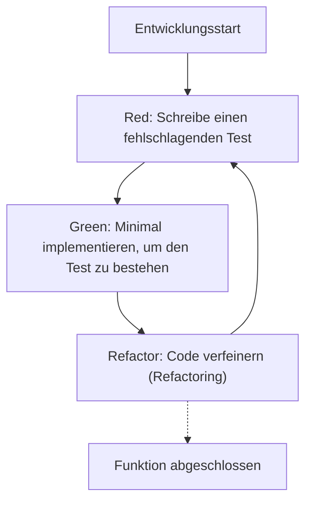
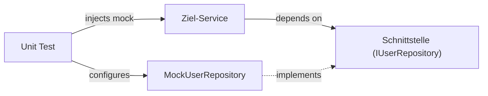

In der modernen Softwareentwicklung ist das schnelle Hinzufügen von Funktionen bei gleichzeitiger Aufrechterhaltung der Codequalität von höchster Bedeutung. Besonders in komplexen und leistungskritischen Sprachen wie C++ können Fehler bei der Speicherverwaltung oder undefiniertes Verhalten (Undefined Behavior) leicht zu fatalen Bugs führen, weshalb die Bedeutung von Tests hier noch größer ist als in anderen Sprachen.

In diesem Artikel werden wir Methoden zur Einführung von **Test-Driven Development (Testgetriebene Entwicklung: TDD)** in C++-Projekten sehr detailliert und praxisnah erklären. Wir behandeln umfassend die Verwendung des Unit-Testing-Frameworks **GoogleTest** und des Mocking-Frameworks **GoogleMock**, eine moderne Konfigurationsmethode mit dem Build-System **CMake** sowie die Messung der Codeabdeckung.

## 1. Die Philosophie und Vorteile der testgetriebenen Entwicklung (TDD)

Test-Driven Development (TDD) ist eine Methode der Softwareentwicklung, bei der "Tests geschrieben werden, bevor die Implementierung geschrieben wird". Dies fungiert nicht nur als Testmethode, sondern auch als **Designmethode**. Durch das vorherige Schreiben von Tests achten Entwickler auf natürliche Weise auf "benutzerfreundliche Schnittstellen" und "lose gekoppeltes Design".

### 1.1 Der Red-Green-Refactor Zyklus

Den Kern von TDD bildet der folgende "Red-Green-Refactor"-Zyklus.



1. **Red (Rot)**: Ohne bestehende Implementierung wird ein Test geschrieben, der das erwartete Verhalten definiert. Da zu diesem Zeitpunkt keine Implementierung vorhanden ist, wird der Test immer fehlschlagen (Red).
2. **Green (Grün)**: Schreibe minimalen Code, der nur dazu dient, den Test erfolgreich zu machen (Green). In dieser Phase haben die Eleganz des Codes und die Leistung keine oberste Priorität.
3. **Refactor (Refactoring)**: Beseitige Duplikate und verbessere das Codedesign, während der Zustand beibehalten wird, in dem die Tests erfolgreich sind. Durch das Vorhandensein von Tests kann der Code sicher geändert werden.

### 1.2 Kostensteigerung durch verzögerte Fehlererkennung

In der Softwaretechnik ist bekannt, dass die Kosten für die Behebung eines Fehlers exponentiell steigen, je später er im Entwicklungsprozess entdeckt wird. Dieses Modell der Kostensteigerung kann durch die folgende mathematische Formel angenähert werden.

$$ Cost(t) = C_0 \times e^{k \cdot t} $$

Hierbei ist $Cost(t)$ die Behebungskosten zum Zeitpunkt $t$, $C_0$ die Behebungskosten unmittelbar nach dem Einbau des Fehlers (Baseline) und $k$ eine Konstante. Durch die Einführung von TDD kann $t$ minimiert und der exponentielle Anstieg der Kosten verhindert werden.

## 2. Auswahl der Testwerkzeuge in C++ und moderne CMake-Konfiguration

In C++ gibt es zahlreiche Test-Frameworks. Dazu gehören Catch2, Boost.Test und doctest, aber der am weitesten verbreitete Industriestandard ist **GoogleTest (gtest)**. GoogleTest besticht durch umfangreiche Assertions, ein leistungsstarkes Mocking-Framework (GoogleMock) und eine hohe Erweiterbarkeit.

### 2.1 Einführung von GoogleTest unter Verwendung von CMake `FetchContent`

In der modernen C++-Entwicklung ist die Verwendung des `FetchContent`-Moduls von CMake zur Verwaltung externer Abhängigkeiten der Mainstream. Dadurch entfällt der Aufwand für die Verwaltung von Submodulen oder die vorherige Installation von Bibliotheken.

Die Datei `CMakeLists.txt` im Stammverzeichnis des Projekts wird wie folgt geschrieben:

```cmake
cmake_minimum_required(VERSION 3.14)
project(TddCppExample CXX)

# Angabe des C++ Standards
set(CMAKE_CXX_STANDARD 17)
set(CMAKE_CXX_STANDARD_REQUIRED ON)

# Bibliothekierung des Produktionscodes
add_library(core_lib src/Calculator.cpp src/StringUtils.cpp)
target_include_directories(core_lib PUBLIC include)

# Aktivierung der Tests
enable_testing()

# Abrufen von GoogleTest
include(FetchContent)
FetchContent_Declare(
  googletest
  URL https://github.com/google/googletest/archive/refs/tags/v1.14.0.zip
)
# Zur Vermeidung von Build-Warnungen in Windows-Umgebungen
set(gtest_force_shared_crt ON CACHE BOOL "" FORCE)
FetchContent_MakeAvailable(googletest)

# Konfiguration der auszuführenden Testdatei
add_executable(unit_tests 
    tests/CalculatorTest.cpp 
    tests/StringUtilsTest.cpp
)
target_link_libraries(unit_tests
    PRIVATE
    core_lib
    gtest_main
    gmock
)

# Registrierung bei CTest
include(GoogleTest)
gtest_discover_tests(unit_tests)
```

Mit dieser Konfiguration lädt CMake den Quellcode von GoogleTest automatisch herunter und integriert ihn in das Projekt.

## 3. Praxis: Red-Green-Refactor Zyklus mit GoogleTest

Lassen Sie uns von hier an den TDD-Zyklus anhand einer einfachen `Calculator`-Klasse in der Praxis anwenden.

### 3.1 Phase 1: Red (Einen fehlschlagenden Test schreiben)

Zuerst schreiben wir das Grundgerüst für die Header-Datei `include/Calculator.h` und den Testcode.

**include/Calculator.h (Grundgerüst)**
```cpp
#pragma once

class Calculator {
public:
    int Add(int a, int b);
};
```

**tests/CalculatorTest.cpp (Testcode)**
```cpp
#include <gtest/gtest.h>
#include "Calculator.h"

TEST(CalculatorTest, AddsTwoPositiveNumbers) {
    Calculator calc;
    int result = calc.Add(2, 3);
    EXPECT_EQ(result, 5);
}
```

Wenn Sie versuchen, zu diesem Zeitpunkt zu kompilieren, erhalten Sie einen Linker-Fehler, da die Implementierung von `Calculator::Add` fehlt, oder der Test schlägt bei der Ausführung fehl (Red).

### 3.2 Phase 2: Green (Minimale Implementierung)

Schreiben Sie den minimalen Code, der nur dazu dient, den Test zu bestehen.

**src/Calculator.cpp**
```cpp
#include "Calculator.h"

int Calculator::Add(int a, int b) {
    return a + b; // Minimale Implementierung, um den Test zu bestehen
}
```

Wenn Sie dies nun kompilieren und den Test ausführen, wird der Test erfolgreich sein (Green).

### 3.3 Phase 3: Refactor (Refactoring)

In diesem Beispiel ist der Code sehr einfach, aber wenn die Anforderungen komplexer werden, erhöhen Sie in der Refactoring-Phase die Lesbarkeit des Codes oder verbessern die Leistung. Der Testcode selbst ist auch ein Ziel für das Refactoring. Zum Beispiel können Sie ein Test-Fixture (`testing::Test`) einführen, um das Setup zu vereinheitlichen.

## 4. Der Unterschied zwischen `EXPECT_EQ` und `ASSERT_EQ`

Wenn Sie GoogleTest verwenden, gibt es zwei Arten von Assertion-Makros: `EXPECT_*` und `ASSERT_*`. Das Verständnis dieses Unterschieds ist sehr wichtig, um robuste Tests zu schreiben.

- **`EXPECT_EQ(expected, actual)`**: Setzt die Ausführung der aktuellen Testfunktion **fort**, auch wenn der Test fehlschlägt. Geeignet, wenn Sie mehrere Zustände in einem einzigen Test überprüfen möchten.
- **`ASSERT_EQ(expected, actual)`**: Bricht die Ausführung der aktuellen Testfunktion sofort **ab (fataler Fehler)**, wenn der Test fehlschlägt. Wird verwendet, wenn eine weitere Überprüfung keinen Sinn mehr ergibt (z.B. bei der Dereferenzierung eines Zeigers, kurz nachdem bestätigt wurde, dass er nicht `nullptr` ist).

## 5. Dependency Injection (DI) und Mocking mit GoogleMock

In echten C++-Projekten treten immer Abhängigkeiten von externen Systemen auf, wie z.B. Datenbankzugriff, Netzwerkkommunikation oder Hardwaresteuerung. Wenn diese Abhängigkeiten unverändert bleiben, werden Unit-Tests sehr schwierig.

Hier kommen **Dependency Injection (DI)** und das Mocking von Schnittstellen mit **GoogleMock** ins Spiel.



### 5.1 Definition der Schnittstelle und Implementierung der Zielklasse

Zuerst definieren wir eine Schnittstelle (eine Klasse mit rein virtuellen Funktionen), die die abhängige Komponente abstrahiert.

```cpp
// include/IUserRepository.h
#pragma once
#include <string>

class IUserRepository {
public:
    virtual ~IUserRepository() = default;
    virtual bool SaveUser(int id, const std::string& name) = 0;
};
```

Als Nächstes erstellen wir eine Service-Klasse (das Testziel), die von dieser Schnittstelle abhängt. Die Abhängigkeit wird über den Konstruktor injiziert (Constructor Injection).

```cpp
// include/UserService.h
#pragma once
#include "IUserRepository.h"
#include <string>

class UserService {
private:
    IUserRepository& repository_;
public:
    UserService(IUserRepository& repository) : repository_(repository) {}

    bool RegisterUser(int id, const std::string& name) {
        if (name.empty()) return false;
        return repository_.SaveUser(id, name);
    }
};
```

### 5.2 Erstellen einer Mock-Klasse mit GoogleMock und Testen

Verwenden Sie das Makro `MOCK_METHOD` von GoogleMock, um die Schnittstelle zu mocken.

```cpp
// tests/UserServiceTest.cpp
#include <gtest/gtest.h>
#include <gmock/gmock.h>
#include "UserService.h"
#include "IUserRepository.h"

using ::testing::Return;
using ::testing::_;

// Definition der Mock-Klasse
class MockUserRepository : public IUserRepository {
public:
    MOCK_METHOD(bool, SaveUser, (int id, const std::string& name), (override));
};

TEST(UserServiceTest, RegistersValidUserSuccessfully) {
    MockUserRepository mockRepo;
    UserService service(mockRepo);

    // Festlegen der Erwartung: Es wird erwartet, dass SaveUser einmal mit (1, "Kenji") aufgerufen wird und true zurückgibt
    EXPECT_CALL(mockRepo, SaveUser(1, "Kenji"))
        .Times(1)
        .WillOnce(Return(true));

    // Ausführung des Testziels
    bool result = service.RegisterUser(1, "Kenji");

    // Assertion
    EXPECT_TRUE(result);
}

TEST(UserServiceTest, RejectsEmptyNameWithoutCallingRepository) {
    MockUserRepository mockRepo;
    UserService service(mockRepo);

    // Es wird erwartet, dass SaveUser bei einem leeren Namen nie aufgerufen wird
    EXPECT_CALL(mockRepo, SaveUser(_, _))
        .Times(0);

    bool result = service.RegisterUser(1, "");

    EXPECT_FALSE(result);
}
```

Durch die Verwendung von GoogleMock auf diese Weise können Sie genau überprüfen, "ob die Zielklasse richtig mit ihren Abhängigkeiten interagiert (Interaktion)".

## 6. Messung und Visualisierung der Codeabdeckung

Nachdem die Tests geschrieben wurden, messen wir die **Codeabdeckung**, um objektiv zu bewerten, welche Teile des Projekts von den Tests ausgeführt (abgedeckt) werden. Die Codeabdeckung ($Coverage$) wird durch die folgende mathematische Formel dargestellt.

$$ Coverage = \left( \frac{L_{executed}}{L_{total}} \right) \times 100 \ (\%) $$

Hierbei ist $L_{executed}$ die Anzahl der Codezeilen, die während des Tests ausgeführt wurden, und $L_{total}$ die Gesamtzahl der Codezeilen im Projekt.

Wenn Sie GCC oder Clang verwenden, können Sie die Codeabdeckung mit den Tools `gcov` und `lcov` messen.

### 6.1 Hinzufügen von Abdeckungsoptionen zu CMake

Um die Abdeckung zu messen, werden spezielle Compiler-Flags benötigt. Fügen Sie die folgende Konfiguration in Ihre `CMakeLists.txt` ein.

```cmake
# Build-Option für die Abdeckung
option(ENABLE_COVERAGE "Enable coverage reporting" OFF)

if(ENABLE_COVERAGE AND CMAKE_CXX_COMPILER_ID MATCHES "GNU|Clang")
    message(STATUS "Coverage enabled")
    target_compile_options(core_lib PRIVATE --coverage -O0 -g)
    target_link_options(core_lib PRIVATE --coverage)
    target_compile_options(unit_tests PRIVATE --coverage -O0 -g)
    target_link_options(unit_tests PRIVATE --coverage)
endif()
```

### 6.2 Verfahren zur Erstellung von Abdeckungsberichten

Aktivieren Sie die Flags beim Kompilieren, führen Sie die Tests aus und geben Sie nach dem Ausführen der Tests mit `lcov` einen HTML-Bericht aus.

```bash
# 1. Kompilieren mit aktivierten Abdeckungsoptionen
mkdir build && cd build
cmake .. -DENABLE_COVERAGE=ON
make

# 2. Ausführung der Tests
ctest

# 3. Sammeln von Abdeckungsdaten (Ausführung von lcov)
lcov --capture --directory . --output-file coverage.info

# 4. Ausschluss von System-Headern und externen Bibliotheken (wie GoogleTest)
lcov --remove coverage.info '/usr/*' '*/_deps/*' '*/tests/*' --output-file coverage.info

# 5. Generierung des HTML-Berichts
genhtml coverage.info --output-directory coverage_report
```

Indem Sie die generierte `coverage_report/index.html` im Browser öffnen, können Sie visuell durch grüne und rote Hervorhebungen auf Quellcodeebene sehen, welche Zeilen ausgeführt wurden, was bei der Identifizierung von Lücken in den Tests (Coverage Holes) hilft.

## 7. Herausforderungen und Best Practices für TDD in C++-Projekten

Bei der Einführung von TDD in C++-Projekten gibt es spezifische Herausforderungen.

### 7.1 Erhöhung der Build-Zeit (Kompilierzeit)
C++ neigt aufgrund der intensiven Nutzung von Templates und der Einbindung großer Header dazu, lange Kompilierzeiten zu haben. Da der "Red-Green-Refactor"-Zyklus in TDD schnell durchgeführt werden muss, ist eine Verzögerung der Build-Zeit fatal.
**Gegenmaßnahme**: Nutzen Sie Forward Declarations (Vorwärtsdeklarationen) und das Pimpl-Idiom (Pointer to implementation), um Header-Abhängigkeiten zu minimieren. Auch die Einführung von Build-Cache-Tools wie Ccache ist effektiv.

### 7.2 Einführung von TDD in Legacy-Code
Es ist äußerst schwierig, TDD nachträglich auf eine bestehende riesige, monolithische Codebasis anzuwenden.
**Gegenmaßnahme**: Anstatt von Anfang an alles neu zu schreiben, wird der Ansatz empfohlen, schrittweise Tests dort hinzuzufügen, wo neue Funktionen implementiert oder Fehler behoben werden (Pfadfinderregel), und die Codebasis nach und nach unter die Kontrolle von TDD zu bringen (eine Methode aus "Working Effectively with Legacy Code").

## 8. TDD als Software-Design

TDD ist ein Sicherheitsnetz zur Aufrechterhaltung der Codequalität und gleichzeitig ein Treiber zur Verbesserung des C++-Codedesigns. Da beim Schreiben von Tests die Dependency Injection (DI) erzwungen wird, verringert sich die Kopplung (Coupling) zwischen den Klassen und die Kohäsion (Cohesion) steigt.

Beim Refactoring ist es auch wichtig, sich der zyklomatischen Komplexität (McCabe's Cyclomatic Complexity) bewusst zu sein.

$$ M = E - N + 2P $$

($M$: Komplexität, $E$: Anzahl der Kanten, $N$: Anzahl der Knoten, $P$: Anzahl der verbundenen Komponenten)

Das Vorhandensein von Tests ermöglicht es, Funktionen aufzuteilen oder durch Polymorphismus zu ersetzen, um diese Komplexität zu reduzieren, ohne Angst vor destruktiven Änderungen haben zu müssen.

## Zusammenfassung

In diesem Artikel haben wir detailliert erklärt, wie man Test-Driven Development (TDD) mit GoogleTest und GoogleMock in C++-Projekten einführt.
1. Moderne Projektkonfiguration mit **CMake FetchContent**
2. Praxis des **Red-Green-Refactor**-Zyklus
3. Mocking von Schnittstellen mit **GoogleMock und Dependency Injection (DI)**
4. Visualisierung der Testabdeckung mit **gcov/lcov**

Obwohl TDD ein Ansatz ist, dessen Beherrschung Zeit erfordert, ist der Return on Investment in der Systemprogrammierung, wie z.B. in C++, wo sowohl Leistung als auch Sicherheit gefordert sind, unermesslich. Bitte versuchen Sie, TDD ab Ihrem nächsten Projekt schrittweise in die Praxis umzusetzen, um robusten und leicht wartbaren C++-Code zu erhalten.
