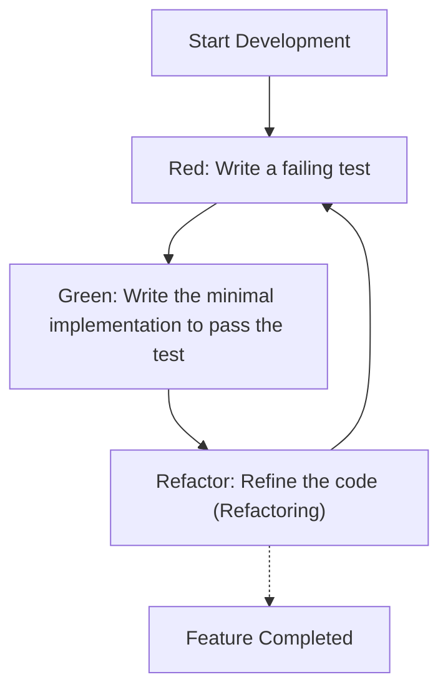
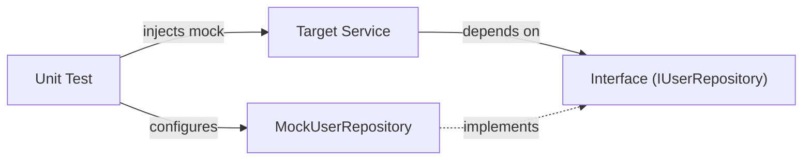

In modern software development, it is a supreme mandate to quickly add features while maintaining code quality. Especially in complex, performance-demanding languages like C++, memory management mistakes and undefined behaviors easily lead to fatal bugs, making testing even more important than in other languages.

In this article, we will explain the method of introducing **Test-Driven Development (TDD)** to a C++ project in a very detailed and practical manner. We comprehensively cover how to use the unit testing framework **GoogleTest** and the mocking framework **GoogleMock**, along with modern configuration methods using the build system **CMake**, and how to measure code coverage.

## 1. The Philosophy and Benefits of Test-Driven Development (TDD)

Test-Driven Development (TDD) is a software development approach where you "write tests before writing the implementation." This functions not merely as a testing method, but also as a **design method**. By writing tests first, developers naturally become conscious of "easy-to-use interfaces" and "loosely coupled designs."

### 1.1 The Red-Green-Refactor Cycle

The core of TDD is the "Red-Green-Refactor" cycle below.



1. **Red**: Write a test that defines the expected behavior without any implementation. Since there is no implementation at this point, the test will always fail (Red).
2. **Green**: Write the minimal amount of code just to make the test pass (Green). At this stage, code elegance and performance are not the top priorities.
3. **Refactor**: Eliminate duplication and improve the code design while keeping the tests passing. Having tests allows you to safely modify the code.

### 1.2 The Increased Cost from Delayed Bug Detection

In software engineering, it is known that the later a bug is found in the development process, the more its fixing cost increases exponentially. This cost increase model can be approximated by the following formula.

$$ Cost(t) = C_0 \times e^{k \cdot t} $$

Here, $Cost(t)$ is the fix cost at time $t$, $C_0$ is the fix cost immediately after the bug is introduced (baseline), and $k$ is a constant. By adopting TDD, you can keep $t$ minimal and prevent the exponential increase of costs.

## 2. Choosing Test Tools in C++ and Modern CMake Configuration

There are many testing frameworks in C++. While Catch2, Boost.Test, doctest, etc. exist, the most widely used industry standard is **GoogleTest (gtest)**. GoogleTest appeals with its rich assertions, powerful mocking framework (GoogleMock), and high extensibility.

### 2.1 Introducing GoogleTest using CMake's `FetchContent`

In modern C++ development, managing external dependencies with CMake's `FetchContent` module is the mainstream approach. This saves the trouble of managing submodules or pre-installing libraries.

The `CMakeLists.txt` at the root of the project should be written as follows:

```cmake
cmake_minimum_required(VERSION 3.14)
project(TddCppExample CXX)

# Specify C++ standard
set(CMAKE_CXX_STANDARD 17)
set(CMAKE_CXX_STANDARD_REQUIRED ON)

# Create a library for production code
add_library(core_lib src/Calculator.cpp src/StringUtils.cpp)
target_include_directories(core_lib PUBLIC include)

# Enable testing
enable_testing()

# Fetch GoogleTest
include(FetchContent)
FetchContent_Declare(
  googletest
  URL https://github.com/google/googletest/archive/refs/tags/v1.14.0.zip
)
# To avoid build warnings in Windows environments
set(gtest_force_shared_crt ON CACHE BOOL "" FORCE)
FetchContent_MakeAvailable(googletest)

# Setup test executable
add_executable(unit_tests 
    tests/CalculatorTest.cpp 
    tests/StringUtilsTest.cpp
)
target_link_libraries(unit_tests
    PRIVATE
    core_lib
    gtest_main
    gmock
)

# Register with CTest
include(GoogleTest)
gtest_discover_tests(unit_tests)
```

With this configuration, CMake will automatically download the GoogleTest source code and integrate it into the project.

## 3. Practice: The Red-Green-Refactor Cycle with GoogleTest

From here, let's practice the TDD cycle using a simple `Calculator` class as an example.

### 3.1 Phase 1: Red (Write a failing test)

First, write the skeleton of the header file `include/Calculator.h` and the test code.

**include/Calculator.h (Skeleton)**
```cpp
#pragma once

class Calculator {
public:
    int Add(int a, int b);
};
```

**tests/CalculatorTest.cpp (Test code)**
```cpp
#include <gtest/gtest.h>
#include "Calculator.h"

TEST(CalculatorTest, AddsTwoPositiveNumbers) {
    Calculator calc;
    int result = calc.Add(2, 3);
    EXPECT_EQ(result, 5);
}
```

If you try to build at this point, you will get a link error because `Calculator::Add` is not implemented, or the test will run and fail (Red).

### 3.2 Phase 2: Green (Minimal implementation)

Write code just to make the test pass.

**src/Calculator.cpp**
```cpp
#include "Calculator.h"

int Calculator::Add(int a, int b) {
    return a + b; // Minimal implementation to pass the test
}
```

If you build and run the test now, the test will succeed (Green).

### 3.3 Phase 3: Refactor

Although the code in this example is very simple, as requirements become more complex, you will improve code readability or performance during the refactoring phase. The test code itself is also subject to refactoring. For example, you might consider introducing a test fixture (`testing::Test`) to share setup code.

## 4. The Difference Between `EXPECT_EQ` and `ASSERT_EQ`

When using GoogleTest, there are two types of assertion macros: `EXPECT_*` and `ASSERT_*`. Understanding their differences is crucial for writing robust tests.

- **`EXPECT_EQ(expected, actual)`**: Even if the test fails, execution of the current test function **continues**. This is suitable when you want to verify multiple states within a single test.
- **`ASSERT_EQ(expected, actual)`**: If the test fails, execution of the current test function is **aborted immediately (fatal failure)**. Use this when further verification is meaningless (e.g., dereferencing a pointer right after checking that it is not `nullptr`).

## 5. Dependency Injection (DI) and Mocking with GoogleMock

In a real C++ project, dependencies on external systems such as database access, network communication, and hardware control inevitably arise. Leaving these dependencies as they are makes unit testing extremely difficult.

This is where **Dependency Injection (DI)** and interface mocking using **GoogleMock** come into play.



### 5.1 Defining the Interface and Implementing the Target Class

First, define an interface (a class with pure virtual functions) that abstracts the dependent component.

```cpp
// include/IUserRepository.h
#pragma once
#include <string>

class IUserRepository {
public:
    virtual ~IUserRepository() = default;
    virtual bool SaveUser(int id, const std::string& name) = 0;
};
```

Next, create a service class (the test target) that depends on this interface. Inject the dependency via the constructor (Constructor Injection).

```cpp
// include/UserService.h
#pragma once
#include "IUserRepository.h"
#include <string>

class UserService {
private:
    IUserRepository& repository_;
public:
    UserService(IUserRepository& repository) : repository_(repository) {}

    bool RegisterUser(int id, const std::string& name) {
        if (name.empty()) return false;
        return repository_.SaveUser(id, name);
    }
};
```

### 5.2 Creating a Mock Class and Testing with GoogleMock

Use GoogleMock's `MOCK_METHOD` macro to mock the interface.

```cpp
// tests/UserServiceTest.cpp
#include <gtest/gtest.h>
#include <gmock/gmock.h>
#include "UserService.h"
#include "IUserRepository.h"

using ::testing::Return;
using ::testing::_;

// Define the mock class
class MockUserRepository : public IUserRepository {
public:
    MOCK_METHOD(bool, SaveUser, (int id, const std::string& name), (override));
};

TEST(UserServiceTest, RegistersValidUserSuccessfully) {
    MockUserRepository mockRepo;
    UserService service(mockRepo);

    // Set expectations: Expect SaveUser to be called once with (1, "Kenji") and return true
    EXPECT_CALL(mockRepo, SaveUser(1, "Kenji"))
        .Times(1)
        .WillOnce(Return(true));

    // Execute the test target
    bool result = service.RegisterUser(1, "Kenji");

    // Assertion
    EXPECT_TRUE(result);
}

TEST(UserServiceTest, RejectsEmptyNameWithoutCallingRepository) {
    MockUserRepository mockRepo;
    UserService service(mockRepo);

    // Expect SaveUser to never be called if the name is empty
    EXPECT_CALL(mockRepo, SaveUser(_, _))
        .Times(0);

    bool result = service.RegisterUser(1, "");

    EXPECT_FALSE(result);
}
```

By using GoogleMock in this way, you can accurately verify whether "the target class interacts correctly with its dependencies (interaction)."

## 6. Measuring and Visualizing Code Coverage

After writing tests, we measure **code coverage** to objectively evaluate which parts of the project are executed (covered) by the tests. Code coverage ($Coverage$) is expressed by the following formula.

$$ Coverage = \left( \frac{L_{executed}}{L_{total}} \right) \times 100 \ (\%) $$

Here, $L_{executed}$ is the number of lines of code executed during the test, and $L_{total}$ is the total number of lines of code in the project.

If you are using GCC or Clang, you can measure coverage using the `gcov` and `lcov` tools.

### 6.1 Adding Coverage Options to CMake

To measure coverage, dedicated compiler flags are required. Add the following configuration to `CMakeLists.txt`.

```cmake
# Coverage build option
option(ENABLE_COVERAGE "Enable coverage reporting" OFF)

if(ENABLE_COVERAGE AND CMAKE_CXX_COMPILER_ID MATCHES "GNU|Clang")
    message(STATUS "Coverage enabled")
    target_compile_options(core_lib PRIVATE --coverage -O0 -g)
    target_link_options(core_lib PRIVATE --coverage)
    target_compile_options(unit_tests PRIVATE --coverage -O0 -g)
    target_link_options(unit_tests PRIVATE --coverage)
endif()
```

### 6.2 Procedure for Generating Coverage Reports

Enable the flag during build, run the tests, and then use `lcov` to output an HTML report.

```bash
# 1. Build with coverage option enabled
mkdir build && cd build
cmake .. -DENABLE_COVERAGE=ON
make

# 2. Run tests
ctest

# 3. Collect coverage data (run lcov)
lcov --capture --directory . --output-file coverage.info

# 4. Exclude system headers and external libraries (like GoogleTest)
lcov --remove coverage.info '/usr/*' '*/_deps/*' '*/tests/*' --output-file coverage.info

# 5. Generate HTML report
genhtml coverage.info --output-directory coverage_report
```

By opening the generated `coverage_report/index.html` in a browser, the executed lines are visually highlighted in green and red on a source code basis, helping identify untested parts (identifying coverage holes).

## 7. Challenges and Best Practices of TDD in C++ Projects

When introducing TDD in a C++ project, there are unique challenges.

### 7.1 Increased Build (Compile) Times
C++ tends to have long compile times due to heavy use of templates and large header inclusions. Because the "Red-Green-Refactor" cycle in TDD needs to be fast, delays in build times are fatal.
**Countermeasure**: Utilize Forward Declarations and the Pimpl (Pointer to implementation) idiom to minimize header file dependencies. Additionally, introducing a build cache tool like Ccache is effective.

### 7.2 Introducing TDD to Legacy Code
Applying TDD retroactively to an existing massive monolithic codebase is extremely difficult.
**Countermeasure**: Rather than rewriting everything from scratch, it is recommended to incrementally add tests to areas where new features are added or bugs are fixed (the Boy Scout Rule), gradually bringing the codebase under TDD control (the approach from *Working Effectively with Legacy Code*).

## 8. TDD as Software Design

TDD is a safety net for maintaining code quality and simultaneously a driver for improving C++ code design. As a result of being forced to use dependency injection (DI) to write tests, the coupling between classes decreases, and cohesion increases.

During refactoring, it is also important to be conscious of McCabe's Cyclomatic Complexity.

$$ M = E - N + 2P $$

($M$: Complexity, $E$: Number of edges, $N$: Number of nodes, $P$: Number of connected components)

The existence of tests allows you to split functions or replace them with polymorphism to lower this complexity without fearing destructive changes.

## Conclusion

In this article, we explained in detail how to introduce Test-Driven Development (TDD) using GoogleTest and GoogleMock to a C++ project.
1. Modern project configuration using **CMake FetchContent**
2. Practicing the **Red-Green-Refactor** cycle
3. Interface mocking using **GoogleMock and Dependency Injection (DI)**
4. Visualizing test coverage with **gcov/lcov**

Although TDD is an approach that takes time to master, its return on investment is immeasurable in system programming like C++, where both performance and safety are required. By all means, start practicing TDD little by little in your next project to obtain robust and maintainable C++ code.
