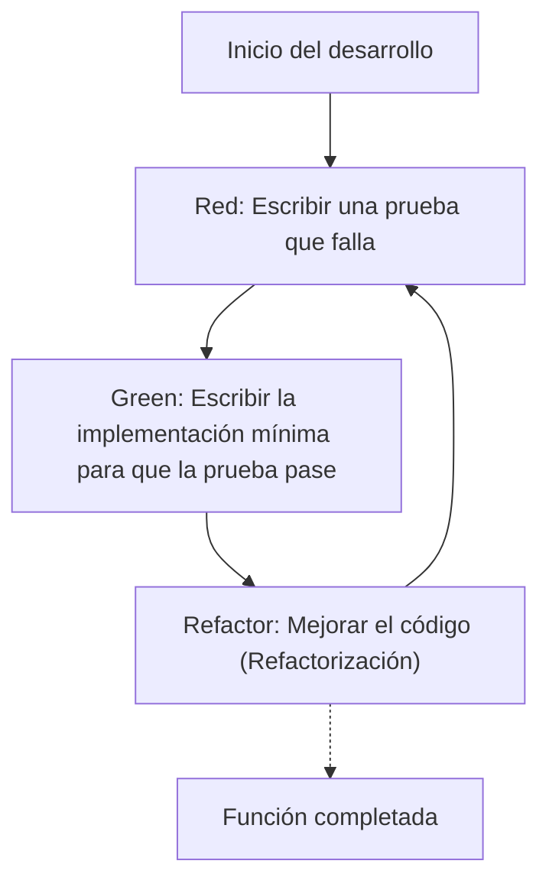
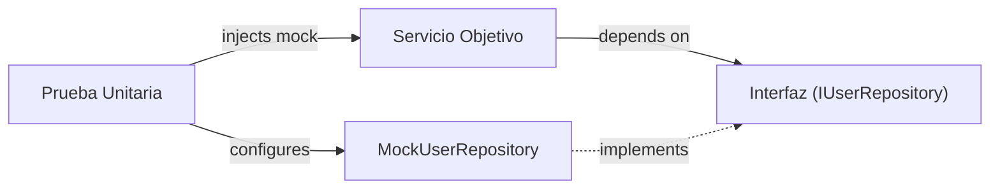

En el desarrollo de software moderno, agregar características rápidamente manteniendo la calidad del código es una prioridad máxima. Especialmente en lenguajes complejos y exigentes en rendimiento como C++, los errores de gestión de memoria y el comportamiento indefinido (Undefined Behavior) pueden llevar fácilmente a errores fatales, lo que hace que la importancia de las pruebas sea mayor que en otros lenguajes.

En este artículo, explicaremos de manera muy detallada y práctica el método para introducir el **Desarrollo Guiado por Pruebas (Test-Driven Development: TDD)** en proyectos C++. Cubriremos de manera exhaustiva cómo utilizar el marco de pruebas unitarias **GoogleTest** y el marco de simulación (mocking) **GoogleMock**, además de cómo configurarlos de manera moderna utilizando el sistema de construcción **CMake**, y cómo medir la cobertura de código.

## 1. La filosofía y los beneficios del Desarrollo Guiado por Pruebas (TDD)

El Desarrollo Guiado por Pruebas (TDD) es una metodología de desarrollo de software que consiste en "escribir las pruebas antes de escribir la implementación". Esto no es solo una técnica de prueba, sino que también funciona como un **método de diseño**. Al escribir primero la prueba, el desarrollador naturalmente se vuelve consciente de "interfaces fáciles de usar" y un "diseño de bajo acoplamiento".

### 1.1 El ciclo Red-Green-Refactor

El núcleo de TDD es el ciclo de "Red-Green-Refactor" (Rojo-Verde-Refactorizar) que se muestra a continuación.



1. **Red (Rojo)**: Sin ninguna implementación, se escribe una prueba que defina el comportamiento esperado. Como no hay implementación en este punto, la prueba inevitablemente fallará (Red).
2. **Green (Verde)**: Se escribe el código mínimo necesario solo para que la prueba tenga éxito (Green). En esta etapa, la belleza del código o su rendimiento no son la máxima prioridad.
3. **Refactor (Refactorizar)**: Manteniendo el estado en el que las pruebas pasan, se elimina la duplicación y se mejora el diseño del código. Al tener pruebas, se puede modificar el código de forma segura.

### 1.2 El aumento del costo por el retraso en descubrir errores

En la ingeniería de software, es sabido que cuanto más tarde se descubra un error en el proceso de desarrollo, el costo de corregirlo aumenta exponencialmente. Este modelo de aumento de costos a veces se aproxima mediante la siguiente fórmula matemática.

$$ Cost(t) = C_0 \times e^{k \cdot t} $$

Aquí, $Cost(t)$ es el costo de reparación en el tiempo $t$, $C_0$ es el costo de reparación inmediatamente después de que se introdujo el error (línea base), y $k$ es una constante. Al introducir TDD, se puede mantener $t$ al mínimo y evitar que el costo aumente exponencialmente.

## 2. Selección de herramientas de prueba en C++ y configuración moderna con CMake

Existen numerosos marcos de prueba en C++. Aunque existen Catch2, Boost.Test, doctest, etc., el más utilizado como estándar de la industria es **GoogleTest (gtest)**. GoogleTest es atractivo por sus ricas aserciones, su potente marco de simulación (GoogleMock) y su alta extensibilidad.

### 2.1 Introducción de GoogleTest utilizando `FetchContent` de CMake

En el desarrollo moderno con C++, el enfoque principal para gestionar dependencias externas es usar el módulo `FetchContent` de CMake. Esto ahorra el esfuerzo de gestionar submódulos o instalar bibliotecas por adelantado.

El `CMakeLists.txt` en la raíz del proyecto se escribe de la siguiente manera.

```cmake
cmake_minimum_required(VERSION 3.14)
project(TddCppExample CXX)

# Especificar el estándar de C++
set(CMAKE_CXX_STANDARD 17)
set(CMAKE_CXX_STANDARD_REQUIRED ON)

# Crear biblioteca del código de producción
add_library(core_lib src/Calculator.cpp src/StringUtils.cpp)
target_include_directories(core_lib PUBLIC include)

# Habilitar pruebas
enable_testing()

# Obtener GoogleTest
include(FetchContent)
FetchContent_Declare(
  googletest
  URL https://github.com/google/googletest/archive/refs/tags/v1.14.0.zip
)
# Para evitar advertencias de compilación en el entorno Windows
set(gtest_force_shared_crt ON CACHE BOOL "" FORCE)
FetchContent_MakeAvailable(googletest)

# Configuración del ejecutable de las pruebas
add_executable(unit_tests 
    tests/CalculatorTest.cpp 
    tests/StringUtilsTest.cpp
)
target_link_libraries(unit_tests
    PRIVATE
    core_lib
    gtest_main
    gmock
)

# Registro en CTest
include(GoogleTest)
gtest_discover_tests(unit_tests)
```

Con esta configuración, CMake descarga automáticamente el código fuente de GoogleTest y lo integra en tu proyecto.

## 3. Práctica: Ciclo Red-Green-Refactor con GoogleTest

A partir de aquí, practicaremos el ciclo TDD utilizando una clase simple `Calculator` como tema.

### 3.1 Fase 1: Red (Escribir una prueba que falla)

Primero, escribimos el esqueleto del archivo de cabecera `include/Calculator.h` y el código de la prueba.

**include/Calculator.h (Esqueleto)**
```cpp
#pragma once

class Calculator {
public:
    int Add(int a, int b);
};
```

**tests/CalculatorTest.cpp (Código de prueba)**
```cpp
#include <gtest/gtest.h>
#include "Calculator.h"

TEST(CalculatorTest, AddsTwoPositiveNumbers) {
    Calculator calc;
    int result = calc.Add(2, 3);
    EXPECT_EQ(result, 5);
}
```

Si intentas compilar en este punto, ocurrirá un error de enlace porque `Calculator::Add` no tiene implementación, o el estado será que la prueba se ejecuta y falla (Red).

### 3.2 Fase 2: Green (Implementación mínima)

Escribimos el código mínimo necesario solo para que la prueba pase.

**src/Calculator.cpp**
```cpp
#include "Calculator.h"

int Calculator::Add(int a, int b) {
    return a + b; // Implementación mínima para que la prueba pase
}
```

Ahora, al compilar y ejecutar las pruebas, la prueba tendrá éxito (Green).

### 3.3 Fase 3: Refactor (Refactorización)

En este ejemplo el código es muy simple, pero a medida que los requisitos se vuelven más complejos, mejorarás la legibilidad del código o su rendimiento en la fase de refactorización. El propio código de la prueba también es objeto de refactorización. Por ejemplo, podrías considerar introducir una fixture de prueba (`testing::Test`) para compartir la configuración.

## 4. Diferencia entre `EXPECT_EQ` y `ASSERT_EQ`

Al usar GoogleTest, existen dos tipos de macros de aserción: `EXPECT_*` y `ASSERT_*`. Entender las diferencias entre ellas es muy importante para escribir pruebas robustas.

- **`EXPECT_EQ(expected, actual)`**: Incluso si la prueba falla, **continúa** con la ejecución de la función de prueba actual. Es adecuado cuando deseas verificar múltiples estados en una sola prueba.
- **`ASSERT_EQ(expected, actual)`**: Si la prueba falla, **interrumpe (fallo fatal)** inmediatamente la ejecución de la función de prueba actual. Se utiliza cuando las verificaciones posteriores no tendrían sentido (por ejemplo, si vas a desreferenciar un puntero justo después de asegurarte de que no es `nullptr`).

## 5. Inyección de Dependencias (DI) y creación de mocks con GoogleMock

En proyectos C++ reales, siempre surgen dependencias de sistemas externos, como acceso a bases de datos, comunicaciones de red o control de hardware. Si se dejan estas dependencias tal cual, las pruebas unitarias se vuelven extremadamente difíciles.

Aquí es donde entra en juego la **Inyección de Dependencias (Dependency Injection: DI)** y la creación de mocks (simulaciones) para interfaces usando **GoogleMock**.



### 5.1 Definición de la interfaz e implementación de la clase objetivo

Primero, definimos una interfaz (una clase con funciones virtuales puras) que abstraiga el componente del que dependemos.

```cpp
// include/IUserRepository.h
#pragma once
#include <string>

class IUserRepository {
public:
    virtual ~IUserRepository() = default;
    virtual bool SaveUser(int id, const std::string& name) = 0;
};
```

Luego, creamos una clase de servicio (el objetivo de la prueba) que dependa de esta interfaz. Inyectamos la dependencia a través del constructor (Constructor Injection).

```cpp
// include/UserService.h
#pragma once
#include "IUserRepository.h"
#include <string>

class UserService {
private:
    IUserRepository& repository_;
public:
    UserService(IUserRepository& repository) : repository_(repository) {}

    bool RegisterUser(int id, const std::string& name) {
        if (name.empty()) return false;
        return repository_.SaveUser(id, name);
    }
};
```

### 5.2 Creación de una clase mock y pruebas con GoogleMock

Utilizamos la macro `MOCK_METHOD` de GoogleMock para crear un mock de la interfaz.

```cpp
// tests/UserServiceTest.cpp
#include <gtest/gtest.h>
#include <gmock/gmock.h>
#include "UserService.h"
#include "IUserRepository.h"

using ::testing::Return;
using ::testing::_;

// Definición de la clase mock
class MockUserRepository : public IUserRepository {
public:
    MOCK_METHOD(bool, SaveUser, (int id, const std::string& name), (override));
};

TEST(UserServiceTest, RegistersValidUserSuccessfully) {
    MockUserRepository mockRepo;
    UserService service(mockRepo);

    // Configuración de expectativas: Se espera que SaveUser sea llamado 1 vez con (1, "Kenji") y devuelva true
    EXPECT_CALL(mockRepo, SaveUser(1, "Kenji"))
        .Times(1)
        .WillOnce(Return(true));

    // Ejecución del objetivo de la prueba
    bool result = service.RegisterUser(1, "Kenji");

    // Aserción
    EXPECT_TRUE(result);
}

TEST(UserServiceTest, RejectsEmptyNameWithoutCallingRepository) {
    MockUserRepository mockRepo;
    UserService service(mockRepo);

    // Se espera que SaveUser no sea llamado ni una sola vez en caso de un nombre vacío
    EXPECT_CALL(mockRepo, SaveUser(_, _))
        .Times(0);

    bool result = service.RegisterUser(1, "");

    EXPECT_FALSE(result);
}
```

Al utilizar GoogleMock de esta manera, puedes verificar con precisión "si la clase objetivo está interactuando correctamente con su dependencia (interacción)".

## 6. Medición y visualización de la cobertura de código

Después de escribir las pruebas, medimos la **cobertura de código** para evaluar objetivamente qué partes del proyecto se ejecutan (están cubiertas) durante las pruebas. La cobertura de código ($Coverage$) se expresa con la siguiente fórmula:

$$ Coverage = \left( \frac{L_{executed}}{L_{total}} \right) \times 100 \ (\%) $$

Aquí, $L_{executed}$ es el número de líneas de código ejecutadas durante las pruebas, y $L_{total}$ es el número total de líneas de código en el proyecto.

Si usas GCC o Clang, puedes medir la cobertura usando las herramientas `gcov` y `lcov`.

### 6.1 Añadir opciones de cobertura a CMake

Para medir la cobertura, necesitas indicadores (flags) específicos del compilador. Agrega la siguiente configuración al `CMakeLists.txt`.

```cmake
# Opciones de compilación para la cobertura
option(ENABLE_COVERAGE "Enable coverage reporting" OFF)

if(ENABLE_COVERAGE AND CMAKE_CXX_COMPILER_ID MATCHES "GNU|Clang")
    message(STATUS "Coverage enabled")
    target_compile_options(core_lib PRIVATE --coverage -O0 -g)
    target_link_options(core_lib PRIVATE --coverage)
    target_compile_options(unit_tests PRIVATE --coverage -O0 -g)
    target_link_options(unit_tests PRIVATE --coverage)
endif()
```

### 6.2 Procedimiento para generar el informe de cobertura

Habilita los indicadores durante la compilación y, después de ejecutar las pruebas, usa `lcov` para generar un informe HTML.

```bash
# 1. Compilar habilitando las opciones de cobertura
mkdir build && cd build
cmake .. -DENABLE_COVERAGE=ON
make

# 2. Ejecutar las pruebas
ctest

# 3. Recopilar datos de cobertura (ejecutar lcov)
lcov --capture --directory . --output-file coverage.info

# 4. Excluir cabeceras del sistema y bibliotecas externas (como GoogleTest, etc.)
lcov --remove coverage.info '/usr/*' '*/_deps/*' '*/tests/*' --output-file coverage.info

# 5. Generar informe HTML
genhtml coverage.info --output-directory coverage_report
```

Al abrir el `coverage_report/index.html` generado en un navegador, se resaltarán visualmente en verde y rojo las líneas que se han ejecutado por código fuente, lo que es útil para identificar las omisiones en las pruebas (identificación de agujeros de cobertura).

## 7. Desafíos del TDD en proyectos C++ y mejores prácticas

Existen desafíos específicos al introducir TDD en proyectos C++.

### 7.1 Aumento del tiempo de compilación (build time)
C++ tiende a tener tiempos de compilación largos debido al uso extensivo de plantillas (templates) y la inclusión de grandes archivos de cabecera. Dado que el ciclo "Red-Green-Refactor" del TDD debe realizarse rápidamente, los retrasos en el tiempo de compilación son críticos.
**Solución**: Utiliza declaraciones anticipadas (Forward Declarations) y el modismo Pimpl (Pointer to implementation) para minimizar las dependencias en los archivos de cabecera. Además, es efectivo introducir herramientas de caché de compilación como Ccache.

### 7.2 Introducción de TDD en código heredado (Legacy Code)
Aplicar TDD a un código monolítico enorme existente suele ser extremadamente difícil.
**Solución**: En lugar de reescribir todo desde el principio, se recomienda un enfoque en el que se añadan pruebas gradualmente desde las partes donde se agregan nuevas funciones o donde se corrigen errores (la regla del boy scout), poniendo poco a poco la base de código bajo el control del TDD (técnicas de Working Effectively with Legacy Code).

## 8. TDD como diseño de software

TDD es una red de seguridad para mantener la calidad del código, pero al mismo tiempo es un motor que mejora el diseño del código C++. Como resultado de verse obligado a utilizar la inyección de dependencias (DI) para escribir las pruebas, el acoplamiento (Coupling) entre clases disminuye, y la cohesión (Cohesion) aumenta.

En la refactorización, también es importante tener en cuenta la complejidad ciclomática (McCabe's Cyclomatic Complexity).

$$ M = E - N + 2P $$

($M$: Complejidad, $E$: Número de aristas (edges), $N$: Número de nodos (nodes), $P$: Número de componentes conectados)

La existencia de pruebas te permite dividir funciones o sustituirlas por polimorfismo para reducir esta complejidad, sin miedo a introducir cambios que rompan el código.

## Conclusión

En este artículo, explicamos detalladamente cómo introducir el Desarrollo Guiado por Pruebas (TDD) en un proyecto C++ utilizando GoogleTest y GoogleMock.
1. Configuración moderna del proyecto usando **CMake FetchContent**
2. Práctica del ciclo **Red-Green-Refactor**
3. Creación de mocks para interfaces mediante **GoogleMock e Inyección de Dependencias (DI)**
4. Visualización de la cobertura de pruebas con **gcov/lcov**

Aunque TDD es un enfoque que lleva tiempo dominar, en la programación de sistemas como en C++, donde se requiere tanto rendimiento como seguridad, su retorno de inversión es incalculable. Te animamos a que apliques TDD poco a poco en tu próximo proyecto para obtener un código C++ robusto y fácil de mantener.
