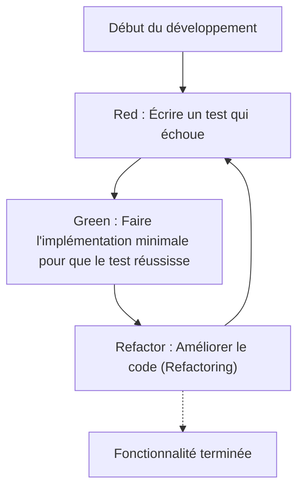
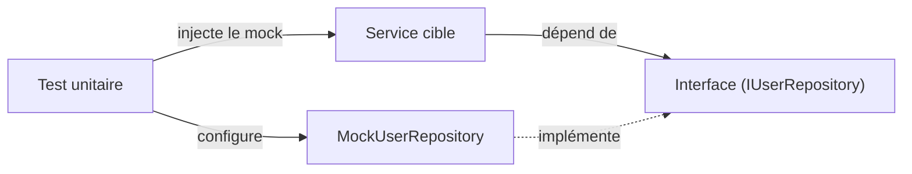

Dans le développement de logiciels modernes, ajouter rapidement des fonctionnalités tout en maintenant la qualité du code est une nécessité absolue. En particulier dans des langages complexes et exigeants en performances comme le C++, les erreurs de gestion de mémoire ou les comportements indéfinis (Undefined Behavior) conduisent facilement à des bugs fatals, ce qui rend l'importance des tests encore plus grande que dans d'autres langages.

Dans cet article, nous expliquerons de manière très détaillée et pratique comment introduire le **développement dirigé par les tests (Test-Driven Development : TDD)** dans un projet C++. Nous aborderons de manière exhaustive l'utilisation du framework de tests unitaires **GoogleTest** et du framework de mock **GoogleMock**, ainsi que la méthode de configuration moderne avec le système de build **CMake**, et comment mesurer la couverture de code.

## 1. La philosophie et les avantages du développement dirigé par les tests (TDD)

Le développement dirigé par les tests (TDD) est une méthode de développement logiciel qui consiste à « écrire des tests avant d'écrire l'implémentation ». Cela ne fonctionne pas seulement comme une méthode de test, mais aussi comme une **méthode de conception**. En écrivant les tests d'abord, les développeurs prennent naturellement conscience de créer une « interface facile à utiliser » et une « conception faiblement couplée ».

### 1.1 Le cycle Red-Green-Refactor

Au cœur du TDD se trouve le cycle suivant : « Red-Green-Refactor ».



1. **Red (Rouge)** : En l'absence d'implémentation, écrire un test qui définit le comportement attendu. À ce stade, comme il n'y a pas d'implémentation, le test échoue toujours (Red).
2. **Green (Vert)** : Écrire le code minimal nécessaire uniquement pour faire réussir le test (Green). À cette étape, la beauté du code ou les performances ne sont pas la priorité absolue.
3. **Refactor (Refactoring / Remaniement)** : Tout en maintenant le test au vert, éliminer les duplications et améliorer la conception du code. La présence des tests permet de modifier le code en toute sécurité.

### 1.2 L'augmentation des coûts due au retard dans la découverte des bugs

En génie logiciel, il est bien connu que plus la découverte d'un bug se produit tard dans le processus de développement, plus son coût de correction augmente de manière exponentielle. Ce modèle d'augmentation des coûts est parfois approximé par la formule mathématique suivante :

$$ Cost(t) = C_0 \times e^{k \cdot t} $$

Ici, $Cost(t)$ est le coût de correction au temps $t$, $C_0$ est le coût de correction (ligne de base) immédiatement après l'introduction du bug, et $k$ est une constante. L'introduction du TDD permet de maintenir $t$ à un niveau minimal, empêchant ainsi l'augmentation exponentielle des coûts.

## 2. Le choix des outils de test en C++ et la configuration moderne avec CMake

Il existe de nombreux frameworks de test en C++, tels que Catch2, Boost.Test, doctest, etc., mais le plus largement utilisé comme standard de l'industrie est **GoogleTest (gtest)**. GoogleTest séduit par la richesse de ses assertions, son puissant framework de mock (GoogleMock) et sa grande extensibilité.

### 2.1 Introduction de GoogleTest via `FetchContent` de CMake

Dans le développement C++ moderne, la gestion des dépendances externes se fait couramment en utilisant le module `FetchContent` de CMake. Cela permet d'éviter la gestion des sous-modules ou l'installation préalable de bibliothèques.

Le fichier `CMakeLists.txt` à la racine du projet s'écrit de la manière suivante :

```cmake
cmake_minimum_required(VERSION 3.14)
project(TddCppExample CXX)

# Spécification du standard C++
set(CMAKE_CXX_STANDARD 17)
set(CMAKE_CXX_STANDARD_REQUIRED ON)

# Transformation du code de production en bibliothèque
add_library(core_lib src/Calculator.cpp src/StringUtils.cpp)
target_include_directories(core_lib PUBLIC include)

# Activation des tests
enable_testing()

# Récupération de GoogleTest
include(FetchContent)
FetchContent_Declare(
  googletest
  URL https://github.com/google/googletest/archive/refs/tags/v1.14.0.zip
)
# Pour éviter les avertissements de compilation dans un environnement Windows
set(gtest_force_shared_crt ON CACHE BOOL "" FORCE)
FetchContent_MakeAvailable(googletest)

# Configuration de l'exécutable de test
add_executable(unit_tests 
    tests/CalculatorTest.cpp 
    tests/StringUtilsTest.cpp
)
target_link_libraries(unit_tests
    PRIVATE
    core_lib
    gtest_main
    gmock
)

# Enregistrement dans CTest
include(GoogleTest)
gtest_discover_tests(unit_tests)
```

Grâce à cette configuration, CMake téléchargera automatiquement le code source de GoogleTest et l'intégrera au projet.

## 3. Pratique : Le cycle Red-Green-Refactor avec GoogleTest

À partir d'ici, nous allons mettre en pratique le cycle TDD en prenant comme exemple une simple classe `Calculator`.

### 3.1 Phase 1 : Red (Écrire un test qui échoue)

Tout d'abord, nous écrivons le squelette du fichier d'en-tête `include/Calculator.h` et le code de test.

**include/Calculator.h (Squelette)**
```cpp
#pragma once

class Calculator {
public:
    int Add(int a, int b);
};
```

**tests/CalculatorTest.cpp (Code de test)**
```cpp
#include <gtest/gtest.h>
#include "Calculator.h"

TEST(CalculatorTest, AddsTwoPositiveNumbers) {
    Calculator calc;
    int result = calc.Add(2, 3);
    EXPECT_EQ(result, 5);
}
```

Si l'on essaie de compiler à ce stade, on obtiendra une erreur d'édition de liens (link) car l'implémentation de `Calculator::Add` n'existe pas, ou si le test est exécuté, il échouera (Red).

### 3.2 Phase 2 : Green (Implémentation minimale)

Nous écrivons le code nécessaire uniquement pour faire réussir le test.

**src/Calculator.cpp**
```cpp
#include "Calculator.h"

int Calculator::Add(int a, int b) {
    return a + b; // L'implémentation minimale pour passer le test
}
```

En compilant et en exécutant le test maintenant, le test réussira (Green).

### 3.3 Phase 3 : Refactor (Refactoring / Remaniement)

Dans cet exemple, le code est très simple, mais à mesure que les exigences se complexifient, la phase de refactoring permet d'améliorer la lisibilité du code ou d'optimiser les performances. Le code de test lui-même est aussi sujet au refactoring. Par exemple, on peut envisager d'introduire des "fixtures" de test (`testing::Test`) pour mutualiser la configuration.

## 4. Différence entre `EXPECT_EQ` et `ASSERT_EQ`

Lors de l'utilisation de GoogleTest, il existe deux types de macros d'assertion : `EXPECT_*` et `ASSERT_*`. Comprendre leurs différences est très important pour écrire des tests robustes.

- **`EXPECT_EQ(expected, actual)`** : Même si le test échoue, l'exécution de la fonction de test actuelle **continue**. C'est adapté lorsque l'on souhaite vérifier plusieurs états au sein d'un seul test.
- **`ASSERT_EQ(expected, actual)`** : Si le test échoue, l'exécution de la fonction de test actuelle est **interrompue (échec fatal)** sur-le-champ. C'est utilisé lorsque les vérifications suivantes n'ont plus de sens (ex : déréférencer un pointeur juste après avoir vérifié qu'il n'est pas `nullptr`).

## 5. Injection de dépendances (DI) et Mocking avec GoogleMock

Dans un projet C++ réel, il y a toujours des dépendances envers des systèmes externes, comme l'accès aux bases de données, les communications réseau, le contrôle de matériel, etc. Si on laisse ces dépendances telles quelles, les tests unitaires deviennent très difficiles.

C'est là qu'interviennent l'**injection de dépendances (Dependency Injection : DI)** et le "mocking" d'interfaces avec **GoogleMock**.



### 5.1 Définition de l'interface et implémentation de la classe cible

Tout d'abord, nous définissons une interface (une classe avec des fonctions virtuelles pures) qui fait l'abstraction du composant dont on dépend.

```cpp
// include/IUserRepository.h
#pragma once
#include <string>

class IUserRepository {
public:
    virtual ~IUserRepository() = default;
    virtual bool SaveUser(int id, const std::string& name) = 0;
};
```

Ensuite, nous créons la classe de service (cible du test) qui dépend de cette interface. Nous injectons la dépendance via le constructeur (Constructor Injection).

```cpp
// include/UserService.h
#pragma once
#include "IUserRepository.h"
#include <string>

class UserService {
private:
    IUserRepository& repository_;
public:
    UserService(IUserRepository& repository) : repository_(repository) {}

    bool RegisterUser(int id, const std::string& name) {
        if (name.empty()) return false;
        return repository_.SaveUser(id, name);
    }
};
```

### 5.2 Création de la classe mock avec GoogleMock et test

Nous utilisons la macro `MOCK_METHOD` de GoogleMock pour créer le mock de l'interface.

```cpp
// tests/UserServiceTest.cpp
#include <gtest/gtest.h>
#include <gmock/gmock.h>
#include "UserService.h"
#include "IUserRepository.h"

using ::testing::Return;
using ::testing::_;

// Définition de la classe mock
class MockUserRepository : public IUserRepository {
public:
    MOCK_METHOD(bool, SaveUser, (int id, const std::string& name), (override));
};

TEST(UserServiceTest, RegistersValidUserSuccessfully) {
    MockUserRepository mockRepo;
    UserService service(mockRepo);

    // Configuration de l'attente : on s'attend à ce que SaveUser soit appelée 1 fois avec (1, "Kenji") et retourne true
    EXPECT_CALL(mockRepo, SaveUser(1, "Kenji"))
        .Times(1)
        .WillOnce(Return(true));

    // Exécution de la cible du test
    bool result = service.RegisterUser(1, "Kenji");

    // Assertion
    EXPECT_TRUE(result);
}

TEST(UserServiceTest, RejectsEmptyNameWithoutCallingRepository) {
    MockUserRepository mockRepo;
    UserService service(mockRepo);

    // On s'attend à ce que SaveUser ne soit jamais appelée dans le cas d'un nom vide
    EXPECT_CALL(mockRepo, SaveUser(_, _))
        .Times(0);

    bool result = service.RegisterUser(1, "");

    EXPECT_FALSE(result);
}
```

En utilisant GoogleMock de cette manière, on peut vérifier précisément « si la classe cible interagit correctement avec ses dépendances (interaction) ».

## 6. Mesure et visualisation de la couverture de code

Après avoir écrit les tests, afin d'évaluer objectivement quelles parties du projet sont exécutées (couvertes) par les tests, on mesure la **couverture de code**. La couverture de code ($Coverage$) est représentée par la formule suivante :

$$ Coverage = \left( \frac{L_{executed}}{L_{total}} \right) \times 100 \ (\%) $$

Ici, $L_{executed}$ est le nombre de lignes de code exécutées pendant les tests, et $L_{total}$ est le nombre total de lignes de code du projet.

Si vous utilisez GCC ou Clang, vous pouvez mesurer la couverture à l'aide des outils `gcov` et `lcov`.

### 6.1 Ajout des options de couverture à CMake

Pour mesurer la couverture, des drapeaux (flags) de compilation spécifiques sont nécessaires. Ajoutez la configuration suivante à `CMakeLists.txt`.

```cmake
# Options de compilation pour la couverture
option(ENABLE_COVERAGE "Enable coverage reporting" OFF)

if(ENABLE_COVERAGE AND CMAKE_CXX_COMPILER_ID MATCHES "GNU|Clang")
    message(STATUS "Coverage enabled")
    target_compile_options(core_lib PRIVATE --coverage -O0 -g)
    target_link_options(core_lib PRIVATE --coverage)
    target_compile_options(unit_tests PRIVATE --coverage -O0 -g)
    target_link_options(unit_tests PRIVATE --coverage)
endif()
```

### 6.2 Procédure de génération du rapport de couverture

Activez le flag lors de la compilation, puis utilisez `lcov` pour générer un rapport HTML après avoir exécuté les tests.

```bash
# 1. Compiler en activant les options de couverture
mkdir build && cd build
cmake .. -DENABLE_COVERAGE=ON
make

# 2. Exécution des tests
ctest

# 3. Collecte des données de couverture (exécution de lcov)
lcov --capture --directory . --output-file coverage.info

# 4. Exclusion des en-têtes du système et des bibliothèques externes (GoogleTest, etc.)
lcov --remove coverage.info '/usr/*' '*/_deps/*' '*/tests/*' --output-file coverage.info

# 5. Génération du rapport HTML
genhtml coverage.info --output-directory coverage_report
```

En ouvrant `coverage_report/index.html` généré dans votre navigateur, les lignes exécutées seront visuellement mises en évidence en vert et en rouge au niveau du code source, ce qui sera utile pour identifier les omissions de tests (trous de couverture).

## 7. Défis du TDD dans les projets C++ et meilleures pratiques

L'introduction du TDD dans les projets C++ présente des défis spécifiques.

### 7.1 Augmentation du temps de build (temps de compilation)
En C++, les temps de compilation ont tendance à s'allonger en raison de l'utilisation intensive des templates et de l'inclusion massive d'en-têtes. Comme le cycle « Red-Green-Refactor » du TDD doit être effectué rapidement, un retard dans le temps de compilation est fatal.
**Solution** : Minimisez les dépendances des fichiers d'en-tête en utilisant des déclarations anticipées (Forward Declarations) et l'idiome Pimpl (Pointer to implementation). L'introduction d'outils de cache de compilation tels que Ccache est également efficace.

### 7.2 Introduction du TDD sur du code legacy (hérité)
Appliquer rétroactivement le TDD à un énorme code monolithique existant est extrêmement difficile.
**Solution** : Plutôt que de tout réécrire depuis le début, il est recommandé d'adopter une approche consistant à ajouter des tests de manière incrémentale sur les parties où de nouvelles fonctionnalités sont ajoutées ou là où des bugs sont corrigés (la règle du Boy Scout), plaçant ainsi progressivement la base de code sous le contrôle du TDD (Méthode de "Working Effectively with Legacy Code").

## 8. Le TDD comme conception logicielle

Le TDD est un filet de sécurité pour maintenir la qualité du code, mais c'est aussi un moteur pour améliorer la conception du code C++. Étant donné que vous êtes contraint d'utiliser l'injection de dépendances (DI) pour pouvoir écrire des tests, le couplage (Coupling) entre les classes diminue et la cohésion (Cohesion) augmente.

Lors du refactoring, il est également important de prêter attention à la complexité cyclomatique (Complexité cyclomatique de McCabe).

$$ M = E - N + 2P $$

($M$ : Complexité, $E$ : Nombre d'arêtes, $N$ : Nombre de nœuds, $P$ : Nombre de composantes connexes)

L'existence de tests permet de diviser les fonctions ou de les remplacer par du polymorphisme afin de réduire cette complexité, sans craindre de casser le code existant.

## Résumé

Dans cet article, nous avons expliqué en détail comment introduire le développement dirigé par les tests (TDD) à l'aide de GoogleTest et GoogleMock dans un projet C++.
1. Configuration de projet moderne en utilisant **CMake FetchContent**
2. Pratique du cycle **Red-Green-Refactor**
3. Mocking d'interfaces en utilisant **GoogleMock et l'injection de dépendances (DI)**
4. Visualisation de la couverture de code par **gcov/lcov**

Bien que le TDD soit une approche qui demande du temps pour être maîtrisée, le retour sur investissement est inestimable dans la programmation système où l'équilibre entre performances et sécurité est requis, comme en C++. Nous vous invitons à pratiquer progressivement le TDD dès votre prochain projet pour obtenir un code C++ robuste et facile à maintenir.
