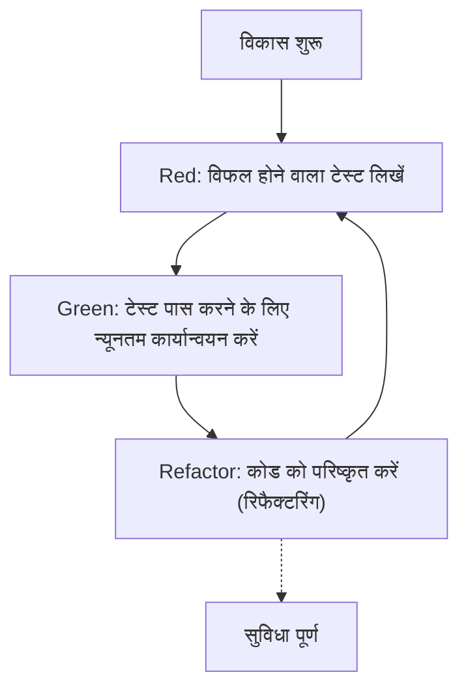
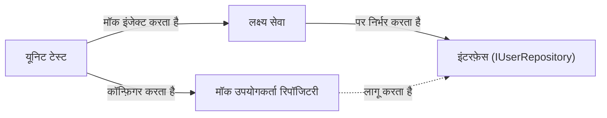

आधुनिक सॉफ्टवेयर विकास में, कोड की गुणवत्ता बनाए रखते हुए तेजी से नई सुविधाएँ जोड़ना एक अत्यंत महत्वपूर्ण कार्य है। विशेष रूप से C++ जैसी जटिल और उच्च-प्रदर्शन वाली भाषाओं में, मेमोरी प्रबंधन की गलतियाँ या अपरिभाषित व्यवहार (Undefined Behavior) आसानी से गंभीर बग का कारण बन सकते हैं, इसलिए अन्य भाषाओं की तुलना में यहाँ परीक्षण (testing) का महत्व और भी अधिक है।

इस लेख में, हम C++ प्रोजेक्ट्स में **टेस्ट-ड्रिवन डेवलपमेंट (Test-Driven Development: TDD)** लागू करने के तरीकों को बहुत ही विस्तृत और व्यावहारिक रूप से समझाएंगे। हम यूनिट टेस्टिंग फ्रेमवर्क **GoogleTest** और मॉकिंग फ्रेमवर्क **GoogleMock** के उपयोग, बिल्ड सिस्टम **CMake** का उपयोग करके आधुनिक कॉन्फ़िगरेशन के तरीके, और कोड कवरेज मापने के तरीकों को व्यापक रूप से कवर करेंगे।

## 1. टेस्ट-ड्रिवन डेवलपमेंट (TDD) का दर्शन और लाभ

टेस्ट-ड्रिवन डेवलपमेंट (TDD) एक सॉफ्टवेयर विकास पद्धति है जिसमें "कार्यान्वयन (implementation) लिखने से पहले टेस्ट लिखा जाता है"। यह केवल एक परीक्षण पद्धति नहीं है, बल्कि एक **डिज़ाइन पद्धति** के रूप में भी कार्य करता है। पहले टेस्ट लिखने से, डेवलपर्स स्वाभाविक रूप से "उपयोग में आसान इंटरफेस" और "ढीले युग्मित (loosely coupled) डिज़ाइन" के प्रति जागरूक हो जाते हैं।

### 1.1 Red-Green-Refactor चक्र

TDD के मूल में निम्नलिखित "Red-Green-Refactor" चक्र है।



1. **Red (लाल)**: बिना किसी कार्यान्वयन के, अपेक्षित व्यवहार को परिभाषित करने वाला एक टेस्ट लिखें। चूँकि इस समय कोई कार्यान्वयन नहीं है, टेस्ट निश्चित रूप से विफल (Red) होगा।
2. **Green (हरा)**: टेस्ट को सफल (Green) बनाने के लिए केवल न्यूनतम कोड लिखें। इस स्तर पर, कोड की सुंदरता या प्रदर्शन सर्वोच्च प्राथमिकता नहीं है।
3. **Refactor (रिफैक्टरिंग)**: टेस्ट पास होने की स्थिति को बनाए रखते हुए, डुप्लीकेशन हटाएं और कोड के डिज़ाइन में सुधार करें। टेस्ट होने से, आप सुरक्षित रूप से कोड में बदलाव कर सकते हैं।

### 1.2 बग खोजने में देरी के कारण लागत में वृद्धि

सॉफ्टवेयर इंजीनियरिंग में, यह ज्ञात है कि विकास प्रक्रिया में बग जितनी देर से पाया जाता है, उसे ठीक करने की लागत चरघातांकी (exponentially) रूप से बढ़ जाती है। लागत वृद्धि के इस मॉडल का अनुमान अक्सर निम्नलिखित सूत्र से लगाया जाता है।

$$ Cost(t) = C_0 \times e^{k \cdot t} $$

यहाँ, $Cost(t)$ समय $t$ पर सुधार की लागत है, $C_0$ बग पेश किए जाने के तुरंत बाद की सुधार लागत (बेसलाइन) है, और $k$ एक स्थिरांक है। TDD को लागू करके, $t$ को न्यूनतम रखा जा सकता है, जिससे लागत की चरघातांकी वृद्धि को रोका जा सकता है।

## 2. C++ में टेस्ट टूल्स का चयन और आधुनिक CMake कॉन्फ़िगरेशन

C++ के लिए कई टेस्टिंग फ्रेमवर्क उपलब्ध हैं। इनमें Catch2, Boost.Test, doctest आदि शामिल हैं, लेकिन उद्योग मानक के रूप में सबसे व्यापक रूप से **GoogleTest (gtest)** का उपयोग किया जाता है। GoogleTest अपने समृद्ध असर्शन (assertions), शक्तिशाली मॉकिंग फ्रेमवर्क (GoogleMock), और उच्च एक्स्टेंसिबिलिटी (extensibility) के लिए जाना जाता है।

### 2.1 CMake के `FetchContent` का उपयोग करके GoogleTest को शामिल करना

आधुनिक C++ विकास में, बाहरी निर्भरता (dependencies) को प्रबंधित करने के लिए CMake के `FetchContent` मॉड्यूल का उपयोग करना मुख्यधारा है। इससे सबमॉड्यूल (submodules) को प्रबंधित करने या लाइब्रेरीज़ को पहले से इंस्टॉल करने की परेशानी बच जाती है।

प्रोजेक्ट के रूट में स्थित `CMakeLists.txt` को इस प्रकार लिखा जाता है।

```cmake
cmake_minimum_required(VERSION 3.14)
project(TddCppExample CXX)

# C++ मानक निर्दिष्ट करना
set(CMAKE_CXX_STANDARD 17)
set(CMAKE_CXX_STANDARD_REQUIRED ON)

# उत्पादन कोड को लाइब्रेरी बनाना
add_library(core_lib src/Calculator.cpp src/StringUtils.cpp)
target_include_directories(core_lib PUBLIC include)

# परीक्षण सक्षम करना
enable_testing()

# GoogleTest प्राप्त करना
include(FetchContent)
FetchContent_Declare(
  googletest
  URL https://github.com/google/googletest/archive/refs/tags/v1.14.0.zip
)
# Windows परिवेश में बिल्ड चेतावनियों से बचने के लिए
set(gtest_force_shared_crt ON CACHE BOOL "" FORCE)
FetchContent_MakeAvailable(googletest)

# टेस्ट एक्ज़ीक्यूटेबल कॉन्फ़िगरेशन
add_executable(unit_tests 
    tests/CalculatorTest.cpp 
    tests/StringUtilsTest.cpp
)
target_link_libraries(unit_tests
    PRIVATE
    core_lib
    gtest_main
    gmock
)

# CTest के साथ पंजीकृत करना
include(GoogleTest)
gtest_discover_tests(unit_tests)
```

इस सेटिंग के साथ, CMake स्वचालित रूप से GoogleTest का सोर्स कोड डाउनलोड करेगा और इसे प्रोजेक्ट में एकीकृत कर देगा।

## 3. अभ्यास: GoogleTest के साथ Red-Green-Refactor चक्र

अब, आइए एक सरल `Calculator` क्लास के उदाहरण के साथ TDD चक्र का अभ्यास करें।

### 3.1 चरण 1: Red (विफल होने वाला टेस्ट लिखें)

सबसे पहले, हम हेडर फाइल `include/Calculator.h` का कंकाल (skeleton) और टेस्ट कोड लिखेंगे।

**include/Calculator.h (कंकाल)**
```cpp
#pragma once

class Calculator {
public:
    int Add(int a, int b);
};
```

**tests/CalculatorTest.cpp (टेस्ट कोड)**
```cpp
#include <gtest/gtest.h>
#include "Calculator.h"

TEST(CalculatorTest, AddsTwoPositiveNumbers) {
    Calculator calc;
    int result = calc.Add(2, 3);
    EXPECT_EQ(result, 5);
}
```

इस बिंदु पर, यदि आप निर्माण (build) करने का प्रयास करते हैं, तो `Calculator::Add` के कार्यान्वयन की कमी के कारण आपको एक लिंक त्रुटि (link error) मिलेगी, या यदि आप परीक्षण चलाते हैं, तो यह विफल (Red) हो जाएगा।

### 3.2 चरण 2: Green (न्यूनतम कार्यान्वयन)

अब हम केवल परीक्षण पास करने के लिए न्यूनतम कोड लिखेंगे।

**src/Calculator.cpp**
```cpp
#include "Calculator.h"

int Calculator::Add(int a, int b) {
    return a + b; // टेस्ट पास करने के लिए न्यूनतम कार्यान्वयन
}
```

यदि आप अब निर्माण करते हैं और परीक्षण चलाते हैं, तो परीक्षण सफल (Green) होगा।

### 3.3 चरण 3: Refactor (रिफैक्टरिंग)

इस उदाहरण में, कोड बहुत सरल है, लेकिन जैसे-जैसे आवश्यकताएं अधिक जटिल होती जाती हैं, आप रिफैक्टरिंग चरण के दौरान कोड की पठनीयता (readability) में सुधार कर सकते हैं या प्रदर्शन को बढ़ा सकते हैं। टेस्ट कोड भी रिफैक्टरिंग के अधीन है। उदाहरण के लिए, आप सेटअप लॉजिक को साझा करने के लिए टेस्ट फिक्स्चर (`testing::Test`) का उपयोग कर सकते हैं।

## 4. `EXPECT_EQ` और `ASSERT_EQ` के बीच अंतर

GoogleTest का उपयोग करते समय, दो प्रकार के असर्शन मैक्रोज़ (assertion macros) होते हैं: `EXPECT_*` और `ASSERT_*`। मजबूत परीक्षण लिखने के लिए इनके बीच के अंतर को समझना बहुत महत्वपूर्ण है।

- **`EXPECT_EQ(expected, actual)`**: यदि परीक्षण विफल हो जाता है, तो यह वर्तमान परीक्षण फ़ंक्शन का निष्पादन **जारी** रखता है। यह तब उपयुक्त होता है जब आप एक ही परीक्षण के भीतर कई स्थितियों को सत्यापित करना चाहते हैं।
- **`ASSERT_EQ(expected, actual)`**: यदि परीक्षण विफल हो जाता है, तो यह तुरंत वर्तमान परीक्षण फ़ंक्शन के निष्पादन को **रोक (घातक विफलता)** देता है। इसका उपयोग तब किया जाता है जब आगे के सत्यापन का कोई अर्थ न हो (उदाहरण के लिए: यह जाँचने के बाद कि पॉइंटर `nullptr` नहीं है, उसे डीरेफ़रेंस करना)।

## 5. डिपेंडेंसी इंजेक्शन (DI) और GoogleMock के साथ मॉकिंग

वास्तविक C++ प्रोजेक्ट्स में, बाहरी सिस्टम जैसे डेटाबेस एक्सेस, नेटवर्क संचार, या हार्डवेयर नियंत्रण पर निर्भरता हमेशा मौजूद होती है। यदि इन निर्भरताओं को वैसे ही छोड़ दिया जाए, तो यूनिट टेस्टिंग बहुत मुश्किल हो जाती है।

यहीं पर **डिपेंडेंसी इंजेक्शन (Dependency Injection: DI)** और **GoogleMock** का उपयोग करके इंटरफेस की मॉकिंग काम आती है।



### 5.1 इंटरफ़ेस को परिभाषित करना और लक्ष्य वर्ग को लागू करना

सबसे पहले, हम निर्भरता (dependency) घटक को अमूर्त (abstract) करने वाला एक इंटरफ़ेस (विशुद्ध रूप से वर्चुअल फ़ंक्शन वाली एक क्लास) परिभाषित करते हैं।

```cpp
// include/IUserRepository.h
#pragma once
#include <string>

class IUserRepository {
public:
    virtual ~IUserRepository() = default;
    virtual bool SaveUser(int id, const std::string& name) = 0;
};
```

इसके बाद, हम एक सेवा वर्ग (परीक्षण के अधीन) बनाते हैं जो इस इंटरफ़ेस पर निर्भर करता है। हम कंस्ट्रक्टर (Constructor Injection) के माध्यम से निर्भरता को इंजेक्ट करते हैं।

```cpp
// include/UserService.h
#pragma once
#include "IUserRepository.h"
#include <string>

class UserService {
private:
    IUserRepository& repository_;
public:
    UserService(IUserRepository& repository) : repository_(repository) {}

    bool RegisterUser(int id, const std::string& name) {
        if (name.empty()) return false;
        return repository_.SaveUser(id, name);
    }
};
```

### 5.2 GoogleMock का उपयोग करके मॉक क्लास बनाना और परीक्षण करना

हम इंटरफ़ेस का मॉक बनाने के लिए GoogleMock के `MOCK_METHOD` मैक्रो का उपयोग करेंगे।

```cpp
// tests/UserServiceTest.cpp
#include <gtest/gtest.h>
#include <gmock/gmock.h>
#include "UserService.h"
#include "IUserRepository.h"

using ::testing::Return;
using ::testing::_;

// मॉक क्लास की परिभाषा
class MockUserRepository : public IUserRepository {
public:
    MOCK_METHOD(bool, SaveUser, (int id, const std::string& name), (override));
};

TEST(UserServiceTest, RegistersValidUserSuccessfully) {
    MockUserRepository mockRepo;
    UserService service(mockRepo);

    // अपेक्षाओं को सेट करना: उम्मीद है कि SaveUser को (1, "Kenji") के साथ 1 बार बुलाया जाएगा और यह true लौटाएगा
    EXPECT_CALL(mockRepo, SaveUser(1, "Kenji"))
        .Times(1)
        .WillOnce(Return(true));

    // लक्ष्य का निष्पादन
    bool result = service.RegisterUser(1, "Kenji");

    // असर्शन
    EXPECT_TRUE(result);
}

TEST(UserServiceTest, RejectsEmptyNameWithoutCallingRepository) {
    MockUserRepository mockRepo;
    UserService service(mockRepo);

    // खाली नाम के मामले में, उम्मीद है कि SaveUser को कभी नहीं बुलाया जाएगा
    EXPECT_CALL(mockRepo, SaveUser(_, _))
        .Times(0);

    bool result = service.RegisterUser(1, "");

    EXPECT_FALSE(result);
}
```

इस तरह GoogleMock का उपयोग करके, हम सटीक रूप से यह सत्यापित कर सकते हैं कि "क्या लक्ष्य क्लास अपनी निर्भरताओं के साथ सही ढंग से संपर्क (interact) कर रही है"।

## 6. कोड कवरेज मापना और विज़ुअलाइज़ करना

परीक्षण लिखने के बाद, हम निष्पक्ष रूप से यह मूल्यांकन करने के लिए **कोड कवरेज** मापते हैं कि परीक्षणों द्वारा हमारे प्रोजेक्ट का कौन सा भाग निष्पादित (कवर) किया गया है। कोड कवरेज ($Coverage$) को निम्नलिखित सूत्र द्वारा दर्शाया जाता है:

$$ Coverage = \left( \frac{L_{executed}}{L_{total}} \right) \times 100 \ (\%) $$

यहाँ, $L_{executed}$ परीक्षणों के दौरान निष्पादित कोड लाइनों की संख्या है, और $L_{total}$ संपूर्ण प्रोजेक्ट में कोड लाइनों की कुल संख्या है।

यदि आप GCC या Clang का उपयोग कर रहे हैं, तो आप कवरेज मापने के लिए `gcov` और `lcov` टूल का उपयोग कर सकते हैं।

### 6.1 CMake में कवरेज विकल्प जोड़ना

कवरेज मापने के लिए, हमें विशिष्ट कंपाइलर झंडे (flags) की आवश्यकता होती है। `CMakeLists.txt` में निम्नलिखित सेटिंग्स जोड़ें।

```cmake
# कवरेज बिल्ड विकल्प
option(ENABLE_COVERAGE "Enable coverage reporting" OFF)

if(ENABLE_COVERAGE AND CMAKE_CXX_COMPILER_ID MATCHES "GNU|Clang")
    message(STATUS "Coverage enabled")
    target_compile_options(core_lib PRIVATE --coverage -O0 -g)
    target_link_options(core_lib PRIVATE --coverage)
    target_compile_options(unit_tests PRIVATE --coverage -O0 -g)
    target_link_options(unit_tests PRIVATE --coverage)
endif()
```

### 6.2 कवरेज रिपोर्ट तैयार करने की प्रक्रिया

निर्माण करते समय झंडे को सक्षम करें, परीक्षण चलाएं, और फिर HTML रिपोर्ट उत्पन्न करने के लिए `lcov` का उपयोग करें।

```bash
# 1. कवरेज विकल्पों को सक्षम करके निर्माण करें
mkdir build && cd build
cmake .. -DENABLE_COVERAGE=ON
make

# 2. परीक्षण चलाएं
ctest

# 3. कवरेज डेटा एकत्र करें (lcov निष्पादित करें)
lcov --capture --directory . --output-file coverage.info

# 4. सिस्टम हेडर और बाहरी लाइब्रेरीज़ (GoogleTest आदि) को छोड़ें
lcov --remove coverage.info '/usr/*' '*/_deps/*' '*/tests/*' --output-file coverage.info

# 5. HTML रिपोर्ट जनरेट करें
genhtml coverage.info --output-directory coverage_report
```

उत्पन्न की गई `coverage_report/index.html` को ब्राउज़र में खोलने पर, आप दृश्य रूप से (हरे और लाल रंग में) देख पाएंगे कि कौन सी पंक्तियाँ स्रोत कोड के स्तर पर निष्पादित की गई थीं, जिससे छूटे हुए परीक्षणों (coverage holes) को पहचानने में मदद मिलती है।

## 7. C++ प्रोजेक्ट्स में TDD की चुनौतियाँ और सर्वोत्तम अभ्यास

जब आप C++ प्रोजेक्ट्स में TDD लागू करते हैं, तो कुछ विशिष्ट चुनौतियाँ आती हैं।

### 7.1 बिल्ड समय (संकलन समय) में वृद्धि
C++ में, टेम्प्लेट (templates) के व्यापक उपयोग और बड़ी हेडर फ़ाइलों के समावेशन के कारण, संकलन (compilation) समय लंबा हो सकता है। चूँकि TDD के "Red-Green-Refactor" चक्र को जल्दी-जल्दी दोहराने की आवश्यकता होती है, इसलिए बिल्ड समय में देरी घातक हो सकती है।
**समाधान**: फॉरवर्ड डिक्लेरेशन (Forward Declaration) और Pimpl (Pointer to implementation) इडियम का उपयोग करके हेडर फ़ाइलों की निर्भरता को कम करें। इसके अलावा, Ccache जैसे बिल्ड कैशिंग टूल पेश करना भी प्रभावी हो सकता है।

### 7.2 लिगेसी कोड में TDD का परिचय देना
मौजूदा बड़े और मोनोलिथिक कोड में बाद में TDD लागू करना अत्यंत कठिन हो सकता है।
**समाधान**: शुरुआत से सब कुछ फिर से लिखने के बजाय, उन हिस्सों से परीक्षण जोड़ना शुरू करें जहाँ आप नई सुविधाएँ जोड़ रहे हैं या बग फिक्स कर रहे हैं (बॉय स्काउट रूल)। कोडबेस को धीरे-धीरे TDD के नियंत्रण में लाने के दृष्टिकोण (Working Effectively with Legacy Code में वर्णित विधि) की अनुशंसा की जाती है।

## 8. सॉफ्टवेयर डिज़ाइन के रूप में TDD

TDD न केवल कोड की गुणवत्ता बनाए रखने के लिए एक सुरक्षा जाल (safety net) है, बल्कि यह C++ कोड डिज़ाइन को बेहतर बनाने वाला एक चालक (driver) भी है। चूंकि परीक्षण लिखने के लिए डिपेंडेंसी इंजेक्शन (DI) को लागू करना आवश्यक हो जाता है, इसके परिणामस्वरूप कक्षाओं के बीच युग्मन (Coupling) कम हो जाता है और सामंजस्य (Cohesion) बढ़ जाता है।

रिफैक्टरिंग के दौरान, साइक्लोमैटिक जटिलता (McCabe's Cyclomatic Complexity) के प्रति जागरूक होना भी महत्वपूर्ण है।

$$ M = E - N + 2P $$

($M$: जटिलता, $E$: किनारों की संख्या (edges), $N$: नोड्स की संख्या, $P$: जुड़े हुए घटकों की संख्या)

परीक्षणों के अस्तित्व के कारण, आप जटिलता को कम करने के लिए कार्यों को विभाजित कर सकते हैं या उन्हें पॉलीमॉर्फिज्म से बदल सकते हैं, और यह सब बिना किसी विनाशकारी परिवर्तन के डर के किया जा सकता है।

## निष्कर्ष

इस लेख में, हमने विस्तार से बताया है कि C++ प्रोजेक्ट्स में GoogleTest और GoogleMock का उपयोग करके टेस्ट-ड्रिवन डेवलपमेंट (TDD) कैसे लागू किया जाए।
1. **CMake FetchContent** का उपयोग करके आधुनिक प्रोजेक्ट संरचना
2. **Red-Green-Refactor** चक्र का अभ्यास
3. **GoogleMock और डिपेंडेंसी इंजेक्शन (DI)** का उपयोग करके इंटरफेस की मॉकिंग
4. **gcov/lcov** के माध्यम से टेस्ट कवरेज का विज़ुअलाइज़ेशन

हालाँकि TDD को सीखने में समय लग सकता है, लेकिन C++ जैसी सिस्टम प्रोग्रामिंग में, जहाँ प्रदर्शन और सुरक्षा दोनों की आवश्यकता होती है, इसका निवेश पर प्रतिफल (ROI) असीमित है। अपने अगले प्रोजेक्ट से ही धीरे-धीरे TDD का अभ्यास करना शुरू करें और मजबूत और आसानी से मेंटेन होने वाले C++ कोड प्राप्त करें।
