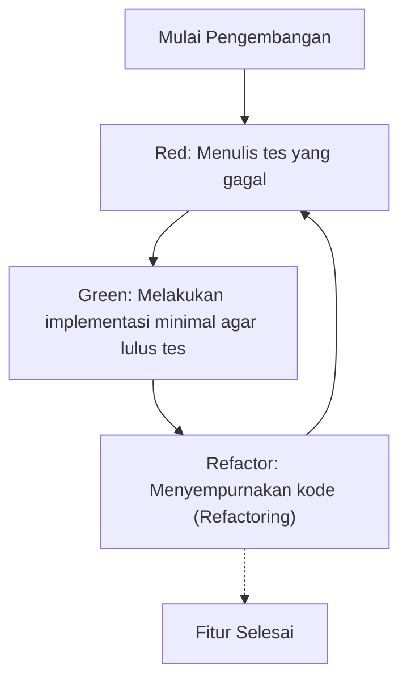
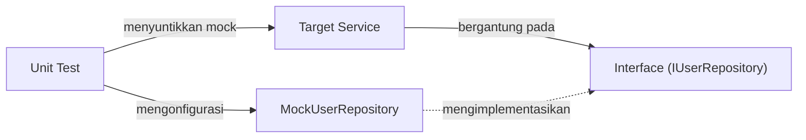

Dalam pengembangan perangkat lunak modern, menambahkan fitur dengan cepat sambil mempertahankan kualitas kode merupakan tugas yang sangat penting. Terutama dalam bahasa pemrograman yang kompleks dan menuntut performa tinggi seperti C++, kesalahan manajemen memori atau perilaku yang tidak terdefinisi (Undefined Behavior) dapat dengan mudah menyebabkan bug yang fatal, sehingga pentingnya pengujian (testing) lebih tinggi dibandingkan bahasa lain.

Pada artikel ini, kami akan menjelaskan secara detail dan praktis tentang metode untuk menerapkan **Test-Driven Development (TDD)** pada proyek C++. Kami akan membahas secara komprehensif mulai dari cara penggunaan framework unit test **GoogleTest** dan framework mock **GoogleMock**, metode konfigurasi modern menggunakan sistem build **CMake**, hingga metode pengukuran code coverage.

## 1. Filosofi dan Manfaat Test-Driven Development (TDD)

Test-Driven Development (TDD) adalah metode pengembangan perangkat lunak dengan pendekatan "menulis tes sebelum menulis implementasi". Ini bukan sekadar metode pengujian, tetapi juga berfungsi sebagai **metode desain**. Dengan menulis tes terlebih dahulu, para pengembang secara alami akan menyadari pentingnya "antarmuka (interface) yang mudah digunakan" dan "desain yang loosely coupled (ketergantungan rendah)".

### 1.1 Siklus Red-Green-Refactor

Inti dari TDD adalah siklus "Red-Green-Refactor" berikut ini.



1. **Red (Merah)**: Menulis tes yang mendefinisikan perilaku yang diharapkan saat implementasi belum ada. Pada tahap ini, karena tidak ada implementasi, tes pasti akan gagal (Red).
2. **Green (Hijau)**: Menulis kode minimal hanya untuk membuat tes berhasil (Green). Pada tahap ini, keindahan kode atau performa bukanlah prioritas utama.
3. **Refactor (Refactoring)**: Menghilangkan duplikasi dan memperbaiki desain kode sambil mempertahankan status kelulusan tes. Dengan adanya tes, Anda dapat mengubah kode dengan aman.

### 1.2 Peningkatan Biaya akibat Keterlambatan Penemuan Bug

Dalam rekayasa perangkat lunak (software engineering), diketahui bahwa semakin lambat bug ditemukan dalam proses pengembangan, biaya perbaikannya akan meningkat secara eksponensial. Model peningkatan biaya ini kadang-kadang didekati dengan rumus matematika berikut.

$$ Cost(t) = C_0 \times e^{k \cdot t} $$

Di mana, $Cost(t)$ adalah biaya perbaikan pada waktu $t$, $C_0$ adalah biaya perbaikan sesaat setelah bug dimasukkan (baseline), dan $k$ adalah konstanta. Dengan menerapkan TDD, Anda dapat menjaga $t$ seminimal mungkin dan mencegah peningkatan biaya yang eksponensial.

## 2. Pemilihan Alat Pengujian di C++ dan Konfigurasi CMake Modern

Ada banyak framework pengujian di C++. Catch2, Boost.Test, doctest adalah beberapa di antaranya, tetapi yang paling banyak digunakan sebagai standar industri adalah **GoogleTest (gtest)**. GoogleTest menarik karena memiliki assertions yang kaya, framework mocking yang kuat (GoogleMock), dan tingkat ekstensibilitas (extensibility) yang tinggi.

### 2.1 Menerapkan GoogleTest menggunakan `FetchContent` pada CMake

Dalam pengembangan C++ modern, mengelola dependensi eksternal menggunakan modul `FetchContent` dari CMake merupakan cara yang paling umum (mainstream). Hal ini menghemat waktu Anda untuk mengelola submodule atau menginstal library sebelumnya.

`CMakeLists.txt` yang berada di root proyek ditulis seperti berikut.

```cmake
cmake_minimum_required(VERSION 3.14)
project(TddCppExample CXX)

# Menentukan standar C++
set(CMAKE_CXX_STANDARD 17)
set(CMAKE_CXX_STANDARD_REQUIRED ON)

# Membuat library dari production code
add_library(core_lib src/Calculator.cpp src/StringUtils.cpp)
target_include_directories(core_lib PUBLIC include)

# Mengaktifkan pengujian
enable_testing()

# Mendapatkan GoogleTest
include(FetchContent)
FetchContent_Declare(
  googletest
  URL https://github.com/google/googletest/archive/refs/tags/v1.14.0.zip
)
# Untuk menghindari peringatan build di lingkungan Windows
set(gtest_force_shared_crt ON CACHE BOOL "" FORCE)
FetchContent_MakeAvailable(googletest)

# Pengaturan file eksekusi untuk tes
add_executable(unit_tests 
    tests/CalculatorTest.cpp 
    tests/StringUtilsTest.cpp
)
target_link_libraries(unit_tests
    PRIVATE
    core_lib
    gtest_main
    gmock
)

# Mendaftarkan ke CTest
include(GoogleTest)
gtest_discover_tests(unit_tests)
```

Dengan konfigurasi ini, CMake akan secara otomatis mengunduh source code GoogleTest dan mengintegrasikannya ke dalam proyek.

## 3. Praktik: Siklus Red-Green-Refactor dengan GoogleTest

Mulai dari sini, mari kita praktikkan siklus TDD dengan menggunakan kelas `Calculator` yang sederhana.

### 3.1 Fase 1: Red (Menulis tes yang gagal)

Pertama, tulis skeleton dari file header `include/Calculator.h` dan kode tesnya.

**include/Calculator.h (Skeleton)**
```cpp
#pragma once

class Calculator {
public:
    int Add(int a, int b);
};
```

**tests/CalculatorTest.cpp (Kode Tes)**
```cpp
#include <gtest/gtest.h>
#include "Calculator.h"

TEST(CalculatorTest, AddsTwoPositiveNumbers) {
    Calculator calc;
    int result = calc.Add(2, 3);
    EXPECT_EQ(result, 5);
}
```

Pada saat mencoba mem-build kode ini, Anda akan mendapatkan error link (karena implementasi `Calculator::Add` belum ada) atau status tes berjalan dan gagal (Red).

### 3.2 Fase 2: Green (Implementasi Minimal)

Tulis kode minimal hanya untuk membuat tes lulus.

**src/Calculator.cpp**
```cpp
#include "Calculator.h"

int Calculator::Add(int a, int b) {
    return a + b; // Implementasi minimal agar tes lulus
}
```

Setelah mem-build dan menjalankan tes ini, tes akan berhasil (Green).

### 3.3 Fase 3: Refactor (Refactoring)

Dalam contoh ini kode sangat sederhana, tetapi seiring dengan semakin kompleksnya persyaratan (requirements), Anda akan meningkatkan keterbacaan (readability) kode atau memperbaiki performa pada fase refactoring. Kode tes itu sendiri juga merupakan subjek untuk refactoring. Misalnya, Anda bisa mempertimbangkan untuk memperkenalkan test fixture (`testing::Test`) untuk membuat setup tes menjadi umum.

## 4. Perbedaan antara `EXPECT_EQ` dan `ASSERT_EQ`

Saat menggunakan GoogleTest, ada 2 jenis macro assertion, yaitu `EXPECT_*` dan `ASSERT_*`. Memahami perbedaan ini sangat penting dalam menulis tes yang kuat (robust).

- **`EXPECT_EQ(expected, actual)`**: Meskipun tes gagal, eksekusi fungsi tes saat ini akan **dilanjutkan**. Hal ini cocok ketika Anda ingin memverifikasi beberapa kondisi/status di dalam satu tes.
- **`ASSERT_EQ(expected, actual)`**: Jika tes gagal, eksekusi fungsi tes saat ini akan **dihentikan (kegagalan fatal)** saat itu juga. Hal ini digunakan jika verifikasi selanjutnya tidak akan bermakna (Contoh: Melakukan dereference segera setelah memastikan bahwa pointer bukan `nullptr`).

## 5. Dependency Injection (DI) dan Mocking dengan GoogleMock

Dalam proyek C++ yang sesungguhnya, dependensi pada sistem eksternal seperti akses database, komunikasi jaringan (network), dan kontrol perangkat keras pasti akan terjadi. Jika dependensi ini dibiarkan begitu saja, unit testing akan menjadi sangat sulit.

Di sinilah **Dependency Injection (DI)** dan pembuatan mock antarmuka menggunakan **GoogleMock** mulai berperan.



### 5.1 Definisi Interface dan Implementasi Kelas Target

Pertama, tentukan antarmuka yang mengabstraksi komponen yang bergantung (kelas dengan pure virtual function).

```cpp
// include/IUserRepository.h
#pragma once
#include <string>

class IUserRepository {
public:
    virtual ~IUserRepository() = default;
    virtual bool SaveUser(int id, const std::string& name) = 0;
};
```

Selanjutnya, buat kelas layanan (target tes) yang bergantung pada antarmuka ini. Suntikkan dependensi (Constructor Injection) melalui constructor.

```cpp
// include/UserService.h
#pragma once
#include "IUserRepository.h"
#include <string>

class UserService {
private:
    IUserRepository& repository_;
public:
    UserService(IUserRepository& repository) : repository_(repository) {}

    bool RegisterUser(int id, const std::string& name) {
        if (name.empty()) return false;
        return repository_.SaveUser(id, name);
    }
};
```

### 5.2 Pembuatan Kelas Mock dan Pengujian dengan GoogleMock

Gunakan macro `MOCK_METHOD` dari GoogleMock untuk melakukan mocking pada antarmuka.

```cpp
// tests/UserServiceTest.cpp
#include <gtest/gtest.h>
#include <gmock/gmock.h>
#include "UserService.h"
#include "IUserRepository.h"

using ::testing::Return;
using ::testing::_;

// Definisi kelas Mock
class MockUserRepository : public IUserRepository {
public:
    MOCK_METHOD(bool, SaveUser, (int id, const std::string& name), (override));
};

TEST(UserServiceTest, RegistersValidUserSuccessfully) {
    MockUserRepository mockRepo;
    UserService service(mockRepo);

    // Pengaturan nilai ekspektasi: Diharapkan SaveUser dipanggil 1 kali dengan argumen (1, "Kenji") dan mengembalikan nilai true
    EXPECT_CALL(mockRepo, SaveUser(1, "Kenji"))
        .Times(1)
        .WillOnce(Return(true));

    // Menjalankan target tes
    bool result = service.RegisterUser(1, "Kenji");

    // Assertion
    EXPECT_TRUE(result);
}

TEST(UserServiceTest, RejectsEmptyNameWithoutCallingRepository) {
    MockUserRepository mockRepo;
    UserService service(mockRepo);

    // Jika namanya kosong, diharapkan SaveUser tidak pernah dipanggil sama sekali
    EXPECT_CALL(mockRepo, SaveUser(_, _))
        .Times(0);

    bool result = service.RegisterUser(1, "");

    EXPECT_FALSE(result);
}
```

Dengan menggunakan GoogleMock seperti ini, Anda dapat memverifikasi secara akurat "apakah kelas target berinteraksi dengan benar dengan dependensinya".

## 6. Pengukuran dan Visualisasi Code Coverage

Setelah menulis tes, untuk mengevaluasi secara objektif bagian mana dari proyek yang telah dieksekusi (tercakup) oleh tes, kami akan mengukur **code coverage**. Code coverage ($Coverage$) dinyatakan dengan rumus berikut.

$$ Coverage = \left( \frac{L_{executed}}{L_{total}} \right) \times 100 \ (\%) $$

Di mana, $L_{executed}$ adalah jumlah baris kode yang dieksekusi selama tes berjalan, dan $L_{total}$ adalah total baris kode pada seluruh proyek.

Jika menggunakan GCC atau Clang, Anda dapat mengukur coverage menggunakan alat (tool) `gcov` dan `lcov`.

### 6.1 Menambahkan Opsi Coverage ke CMake

Untuk mengukur coverage, diperlukan flag compiler khusus. Tambahkan konfigurasi berikut ke `CMakeLists.txt`.

```cmake
# Opsi build coverage
option(ENABLE_COVERAGE "Enable coverage reporting" OFF)

if(ENABLE_COVERAGE AND CMAKE_CXX_COMPILER_ID MATCHES "GNU|Clang")
    message(STATUS "Coverage enabled")
    target_compile_options(core_lib PRIVATE --coverage -O0 -g)
    target_link_options(core_lib PRIVATE --coverage)
    target_compile_options(unit_tests PRIVATE --coverage -O0 -g)
    target_link_options(unit_tests PRIVATE --coverage)
endif()
```

### 6.2 Prosedur Menghasilkan Laporan Coverage

Aktifkan flag saat mem-build kode, lalu jalankan tes dan gunakan `lcov` untuk menghasilkan output laporan berupa HTML.

```bash
# 1. Mengaktifkan opsi coverage lalu build
mkdir build && cd build
cmake .. -DENABLE_COVERAGE=ON
make

# 2. Menjalankan tes
ctest

# 3. Mengumpulkan data coverage (menjalankan lcov)
lcov --capture --directory . --output-file coverage.info

# 4. Mengecualikan system header dan library eksternal (GoogleTest, dll.)
lcov --remove coverage.info '/usr/*' '*/_deps/*' '*/tests/*' --output-file coverage.info

# 5. Menghasilkan Laporan HTML
genhtml coverage.info --output-directory coverage_report
```

Dengan membuka `coverage_report/index.html` yang dihasilkan pada browser web Anda, baris mana yang dieksekusi akan disorot (highlight) secara visual dengan warna hijau dan merah pada setiap source code. Ini akan berguna untuk mengidentifikasi bagian kode yang terlewat oleh tes (menemukan coverage hole).

## 7. Tantangan TDD pada Proyek C++ dan Best Practices

Ketika menerapkan TDD pada proyek C++, ada beberapa tantangan (kendala) yang spesifik (khas).

### 7.1 Peningkatan Waktu Build (Waktu Kompilasi)
C++ cenderung memiliki waktu kompilasi yang lama karena sering menggunakan template (template metaprogramming) dan include header dalam jumlah besar. Karena siklus "Red-Green-Refactor" dalam TDD harus dilakukan dengan cepat, penundaan waktu build (kompilasi) sangatlah fatal.
**Solusi**: Manfaatkan Forward Declaration dan idiom Pimpl (Pointer to implementation) untuk meminimalkan dependensi file header. Selain itu, memperkenalkan tool build cache seperti Ccache juga cukup efektif.

### 7.2 Menerapkan TDD pada Legacy Code
Menerapkan TDD di kemudian hari pada kode monolitik besar yang sudah ada, sangatlah sulit.
**Solusi**: Jangan menulis ulang seluruh kode dari awal. Direkomendasikan untuk secara bertahap menambahkan tes mulai dari bagian di mana fitur baru ditambahkan atau di mana perbaikan bug dilakukan (Boy Scout Rule), kemudian secara perlahan menempatkan basis kode (codebase) di bawah kendali TDD (sebuah metode dari "Working Effectively with Legacy Code").

## 8. TDD sebagai Desain Perangkat Lunak

Selain sebagai jaring pengaman untuk mempertahankan kualitas kode, TDD juga bertindak sebagai pendorong (driver) untuk meningkatkan desain kode C++. Karena untuk menulis tes, Dependency Injection (DI) akan "dipaksakan", yang mengakibatkan Coupling (tingkat ketergantungan) antarkelas menurun, dan Cohesion (kepaduan) meningkat.

Selama tahap refactoring, penting juga untuk menyadari tentang Cyclomatic Complexity (McCabe's Cyclomatic Complexity).

$$ M = E - N + 2P $$

($M$: Kompleksitas, $E$: Jumlah edge, $N$: Jumlah node, $P$: Jumlah komponen terhubung)

Dengan adanya tes, Anda dapat memecah fungsi atau menggantinya dengan polimorfisme (polymorphism) untuk menurunkan kompleksitas ini tanpa takut akan terjadinya perubahan yang merusak (breaking changes).

## Kesimpulan

Pada artikel ini, kami telah menjelaskan secara terperinci cara menerapkan Test-Driven Development (TDD) menggunakan GoogleTest dan GoogleMock pada proyek C++.
1. Konfigurasi proyek modern menggunakan **CMake FetchContent**
2. Mempraktikkan siklus **Red-Green-Refactor**
3. Pembuatan mock antarmuka menggunakan **GoogleMock dan Dependency Injection (DI)**
4. Visualisasi test coverage dengan **gcov/lcov**

Meskipun TDD adalah sebuah pendekatan yang membutuhkan waktu untuk dipelajari dan dikuasai, pengembalian investasinya (Return on Investment) tidak ternilai harganya dalam sistem pemrograman (system programming) di mana keseimbangan antara performa dan keamanan adalah hal yang wajib, seperti dalam bahasa C++. Cobalah untuk mempraktikkan TDD sedikit demi sedikit pada proyek Anda berikutnya, dan dapatkan kode C++ yang kuat (robust) dan mudah dipelihara.
