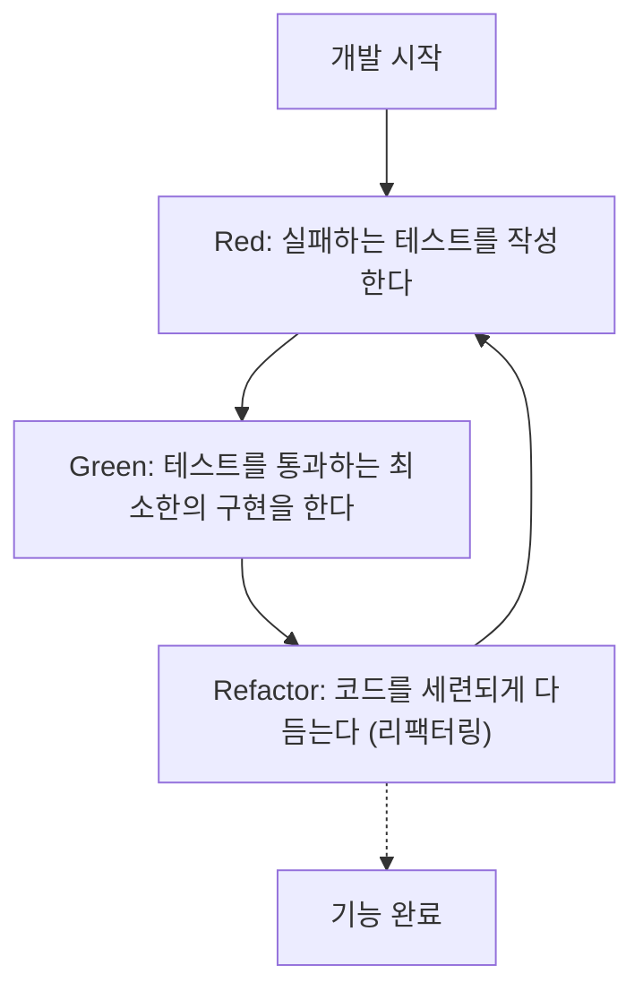
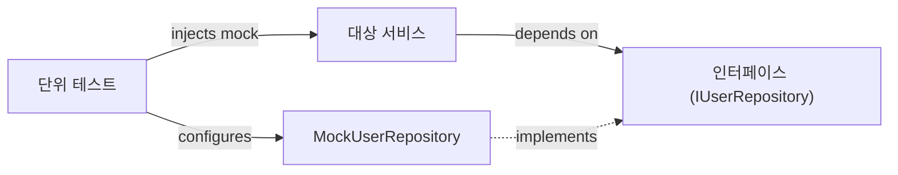

현대 소프트웨어 개발에 있어서, 코드의 품질을 유지하면서 신속하게 기능을 추가해 나가는 것은 지상 과제입니다. 특히 C++과 같이 복잡하고 퍼포먼스가 요구되는 언어에서는, 메모리 관리의 실수나 미정의 동작(Undefined Behavior)이 치명적인 버그로 이어지기 쉬워, 테스트의 중요성은 다른 언어 이상으로 높다고 할 수 있습니다.

본 기사에서는, C++ 프로젝트에서 **테스트 주도 개발(Test-Driven Development: TDD)**을 도입하기 위한 수법을, 매우 상세하고 실전적으로 해설합니다. 단위 테스트 프레임워크인 **GoogleTest** 및 모의 프레임워크인 **GoogleMock**의 사용 방법, 나아가 빌드 시스템인 **CMake**를 사용한 모던 구성 방법, 코드 커버리지의 측정 방법까지 망라하여 다룹니다.

## 1. 테스트 주도 개발(TDD)의 철학과 메리트

테스트 주도 개발(TDD)은, "구현을 작성하기 전에 테스트를 작성한다"는 소프트웨어 개발 수법입니다. 이것은 단순한 테스트 수법이 아니라, **설계 수법**으로서도 기능합니다. 테스트를 먼저 작성함으로써, 개발자는 자연스럽게 "사용하기 쉬운 인터페이스"나 "느슨하게 결합된 설계"를 의식하게 됩니다.

### 1.1 Red-Green-Refactor 사이클

TDD의 핵심을 이루는 것이, 이하의 "Red-Green-Refactor" 사이클입니다.



1. **Red (빨강)**: 구현이 없는 상태에서, 기대하는 동작을 정의하는 테스트를 작성합니다. 이 시점에서는 구현이 없기 때문에, 테스트는 반드시 실패(Red)합니다.
2. **Green (초록)**: 테스트를 성공시키기(Green) 위한, 최소한의 코드만을 작성합니다. 이 단계에서는 코드의 아름다움이나 퍼포먼스는 최우선시되지 않습니다.
3. **Refactor (리팩터링)**: 테스트가 통과하는 상태를 유지한 채로, 중복을 배제하고 코드의 설계를 개선합니다. 테스트가 있음으로써 안전하게 코드를 변경할 수 있습니다.

### 1.2 버그 발견의 지연에 따른 비용 증대

소프트웨어 공학에서, 버그 발견이 개발 프로세스의 후반이 될수록 그 수정 비용은 지수함수적으로 증대하는 것으로 알려져 있습니다. 이 비용 증가 모델은, 다음과 같은 수식으로 근사될 수 있습니다.

$$ Cost(t) = C_0 \times e^{k \cdot t} $$

여기서 $Cost(t)$는 시간 $t$에서의 수정 비용, $C_0$는 버그가 심어진 직후의 수정 비용(베이스라인), $k$는 상수입니다. TDD를 도입함으로써 $t$를 극소로 유지하고, 비용의 지수함수적인 증대를 미연에 방지할 수 있습니다.

## 2. C++에서의 테스트 도구 선택과 모던 CMake 구성

C++에는 수많은 테스트 프레임워크가 존재합니다. Catch2, Boost.Test, doctest 등이 있지만, 업계 표준으로서 가장 널리 사용되는 것이 **GoogleTest (gtest)**입니다. GoogleTest는 풍부한 어서션, 강력한 모의화 프레임워크(GoogleMock), 그리고 높은 확장성이 매력입니다.

### 2.1 CMake의 `FetchContent`를 이용한 GoogleTest 도입

모던 C++ 개발에서 외부 의존 관계 관리는 CMake의 `FetchContent` 모듈을 사용하는 것이 주류입니다. 이를 통해 서브 모듈을 관리하거나 사전에 라이브러리를 설치하는 수고를 덜 수 있습니다.

프로젝트의 루트에 있는 `CMakeLists.txt`는 다음과 같이 기술합니다.

```cmake
cmake_minimum_required(VERSION 3.14)
project(TddCppExample CXX)

# C++ 표준 지정
set(CMAKE_CXX_STANDARD 17)
set(CMAKE_CXX_STANDARD_REQUIRED ON)

# 프로덕션 코드 라이브러리화
add_library(core_lib src/Calculator.cpp src/StringUtils.cpp)
target_include_directories(core_lib PUBLIC include)

# 테스트 활성화
enable_testing()

# GoogleTest 가져오기
include(FetchContent)
FetchContent_Declare(
  googletest
  URL https://github.com/google/googletest/archive/refs/tags/v1.14.0.zip
)
# Windows 환경에서의 빌드 경고 회피용
set(gtest_force_shared_crt ON CACHE BOOL "" FORCE)
FetchContent_MakeAvailable(googletest)

# 테스트 실행 파일 설정
add_executable(unit_tests 
    tests/CalculatorTest.cpp 
    tests/StringUtilsTest.cpp
)
target_link_libraries(unit_tests
    PRIVATE
    core_lib
    gtest_main
    gmock
)

# CTest 등록
include(GoogleTest)
gtest_discover_tests(unit_tests)
```

이 설정으로, CMake가 자동으로 GoogleTest의 소스 코드를 다운로드하고 프로젝트에 통합해 줍니다.

## 3. 실전: GoogleTest에 의한 Red-Green-Refactor 사이클

지금부터는 간단한 `Calculator` 클래스를 소재로 TDD 사이클을 실천해 보겠습니다.

### 3.1 페이즈 1: Red (실패하는 테스트를 작성한다)

먼저, 헤더 파일 `include/Calculator.h`의 스켈레톤과 테스트 코드를 작성합니다.

**include/Calculator.h (스켈레톤)**
```cpp
#pragma once

class Calculator {
public:
    int Add(int a, int b);
};
```

**tests/CalculatorTest.cpp (테스트 코드)**
```cpp
#include <gtest/gtest.h>
#include "Calculator.h"

TEST(CalculatorTest, AddsTwoPositiveNumbers) {
    Calculator calc;
    int result = calc.Add(2, 3);
    EXPECT_EQ(result, 5);
}
```

이 시점에서 빌드하려고 하면, `Calculator::Add`의 구현이 없기 때문에 링크 에러가 발생하거나, 혹은 테스트를 실행하여 실패하는 상태(Red)가 됩니다.

### 3.2 페이즈 2: Green (최소한의 구현)

테스트를 통과시키기 위한 코드만을 작성합니다.

**src/Calculator.cpp**
```cpp
#include "Calculator.h"

int Calculator::Add(int a, int b) {
    return a + b; // 테스트를 통과시키기 위한 최소한의 구현
}
```

이제 빌드하여 테스트를 실행하면, 테스트가 성공(Green)합니다.

### 3.3 페이즈 3: Refactor (리팩터링)

이 예제에서는 코드가 매우 단순하지만, 요구사항이 복잡해짐에 따라 리팩터링 페이즈에서 코드의 가독성을 높이거나 퍼포먼스를 개선합니다. 테스트 코드 자체도 리팩터링의 대상입니다. 예를 들어, 테스트 픽스처(`testing::Test`)를 도입하여 셋업을 공통화하는 것을 고려해 볼 수 있습니다.

## 4. `EXPECT_EQ`와 `ASSERT_EQ`의 차이

GoogleTest를 사용할 때, 어서션 매크로로 `EXPECT_*`와 `ASSERT_*` 2종류가 존재합니다. 이들의 차이를 이해하는 것은 견고한 테스트를 작성하는 데 매우 중요합니다.

- **`EXPECT_EQ(expected, actual)`**: 테스트가 실패해도 현재 테스트 함수의 실행을 **계속**합니다. 하나의 테스트 내에서 여러 상태를 검증하고 싶을 때 적합합니다.
- **`ASSERT_EQ(expected, actual)`**: 테스트가 실패할 경우, 그 즉시 현재 테스트 함수의 실행을 **중단(치명적 실패)**합니다. 이후의 검증이 의미가 없을 경우(예: 포인터가 `nullptr`이 아님을 확인한 직후에 역참조하는 경우)에 사용합니다.

## 5. 의존성 주입(DI)과 GoogleMock을 통한 모의화

실제 C++ 프로젝트에서는 데이터베이스 접근, 네트워크 통신, 하드웨어 제어 등 외부 시스템에 대한 의존이 반드시 발생합니다. 이러한 의존 관계를 그대로 두면 단위 테스트가 매우 곤란해집니다.

그래서 등장하는 것이 **의존성 주입(Dependency Injection: DI)**과 **GoogleMock**을 사용한 인터페이스의 모의화입니다.



### 5.1 인터페이스 정의와 대상 클래스의 구현

우선, 의존하는 컴포넌트를 추상화한 인터페이스(순수 가상 함수를 가진 클래스)를 정의합니다.

```cpp
// include/IUserRepository.h
#pragma once
#include <string>

class IUserRepository {
public:
    virtual ~IUserRepository() = default;
    virtual bool SaveUser(int id, const std::string& name) = 0;
};
```

다음으로, 이 인터페이스에 의존하는 서비스 클래스(테스트 대상)를 생성합니다. 생성자를 통해 의존성을 주입(Constructor Injection)합니다.

```cpp
// include/UserService.h
#pragma once
#include "IUserRepository.h"
#include <string>

class UserService {
private:
    IUserRepository& repository_;
public:
    UserService(IUserRepository& repository) : repository_(repository) {}

    bool RegisterUser(int id, const std::string& name) {
        if (name.empty()) return false;
        return repository_.SaveUser(id, name);
    }
};
```

### 5.2 GoogleMock을 사용한 모의 클래스 작성과 테스트

GoogleMock의 `MOCK_METHOD` 매크로를 사용하여 인터페이스를 모의화합니다.

```cpp
// tests/UserServiceTest.cpp
#include <gtest/gtest.h>
#include <gmock/gmock.h>
#include "UserService.h"
#include "IUserRepository.h"

using ::testing::Return;
using ::testing::_;

// 모의 클래스 정의
class MockUserRepository : public IUserRepository {
public:
    MOCK_METHOD(bool, SaveUser, (int id, const std::string& name), (override));
};

TEST(UserServiceTest, RegistersValidUserSuccessfully) {
    MockUserRepository mockRepo;
    UserService service(mockRepo);

    // 기댓값 설정: SaveUser가 (1, "Kenji")로 1회 호출되고, true를 반환할 것을 기대함
    EXPECT_CALL(mockRepo, SaveUser(1, "Kenji"))
        .Times(1)
        .WillOnce(Return(true));

    // 테스트 대상 실행
    bool result = service.RegisterUser(1, "Kenji");

    // 어서션
    EXPECT_TRUE(result);
}

TEST(UserServiceTest, RejectsEmptyNameWithoutCallingRepository) {
    MockUserRepository mockRepo;
    UserService service(mockRepo);

    // 빈 이름인 경우 SaveUser가 한 번도 호출되지 않음을 기대함
    EXPECT_CALL(mockRepo, SaveUser(_, _))
        .Times(0);

    bool result = service.RegisterUser(1, "");

    EXPECT_FALSE(result);
}
```

이처럼 GoogleMock을 사용함으로써 "대상 클래스가 의존 대상과 올바르게 상호 작용하고 있는지"를 정확하게 검증할 수 있습니다.

## 6. 코드 커버리지 측정과 시각화

테스트를 작성한 후, 프로젝트의 어느 부분이 테스트로 실행되었는지(커버되었는지)를 객관적으로 평가하기 위해 **코드 커버리지**를 측정합니다. 코드 커버리지($Coverage$)는 이하의 수식으로 나타냅니다.

$$ Coverage = \left( \frac{L_{executed}}{L_{total}} \right) \times 100 \ (\%) $$

여기서 $L_{executed}$는 테스트 중에 실행된 코드 행 수, $L_{total}$은 프로젝트 전체의 코드 행 수입니다.

GCC나 Clang을 사용하는 경우, `gcov` 및 `lcov` 도구를 사용하여 커버리지를 측정할 수 있습니다.

### 6.1 CMake에 커버리지 옵션 추가

커버리지를 측정하려면 전용 컴파일러 플래그가 필요합니다. `CMakeLists.txt`에 다음 설정을 추가합니다.

```cmake
# 커버리지 빌드 옵션
option(ENABLE_COVERAGE "Enable coverage reporting" OFF)

if(ENABLE_COVERAGE AND CMAKE_CXX_COMPILER_ID MATCHES "GNU|Clang")
    message(STATUS "Coverage enabled")
    target_compile_options(core_lib PRIVATE --coverage -O0 -g)
    target_link_options(core_lib PRIVATE --coverage)
    target_compile_options(unit_tests PRIVATE --coverage -O0 -g)
    target_link_options(unit_tests PRIVATE --coverage)
endif()
```

### 6.2 커버리지 리포트 생성 절차

빌드 시 플래그를 활성화하고 테스트를 실행한 후, `lcov`를 사용하여 HTML 리포트를 출력합니다.

```bash
# 1. 커버리지 옵션을 활성화하여 빌드
mkdir build && cd build
cmake .. -DENABLE_COVERAGE=ON
make

# 2. 테스트 실행
ctest

# 3. 커버리지 데이터 수집 (lcov 실행)
lcov --capture --directory . --output-file coverage.info

# 4. 시스템 헤더나 외부 라이브러리(GoogleTest 등) 제외
lcov --remove coverage.info '/usr/*' '*/_deps/*' '*/tests/*' --output-file coverage.info

# 5. HTML 리포트 생성
genhtml coverage.info --output-directory coverage_report
```

생성된 `coverage_report/index.html`을 브라우저에서 열면, 소스 코드 단위로 어떤 줄이 실행되었는지 녹색과 빨간색으로 시각적으로 강조 표시되어 테스트의 누락(커버리지 홀의 특정)을 파악하는 데 유용합니다.

## 7. C++ 프로젝트에서의 TDD 과제와 모범 사례

C++ 프로젝트에서 TDD를 도입할 때는 특유의 과제가 존재합니다.

### 7.1 빌드 시간(컴파일 시간)의 증가
C++은 템플릿의 다용이나 대규모 헤더 인클루드로 인해 컴파일 시간이 길어지기 쉽습니다. TDD의 "Red-Green-Refactor" 사이클은 신속하게 진행되어야 하므로, 빌드 시간 지연은 치명적입니다.
**대책**: 전방 선언(Forward Declaration)이나 Pimpl(Pointer to implementation) 이디엄을 활용하여 헤더 파일의 의존 관계를 최소한으로 억제합시다. 또한 Ccache와 같은 빌드 캐시 도구의 도입도 효과적입니다.

### 7.2 레거시 코드에 TDD 도입
기존의 거대한 모놀리식 코드에 뒤늦게 TDD를 적용하는 것은 극히 어렵습니다.
**대책**: 처음부터 전부 다시 작성하는 것이 아니라, 새로운 기능을 추가하는 부분이나 버그 수정을 실시하는 곳(보이스카우트 규칙)부터 단계적으로 테스트를 추가하여, 조금씩 코드 베이스를 TDD의 컨트롤 하에 두는 접근법(Working Effectively with Legacy Code의 수법)이 권장됩니다.

## 8. 소프트웨어 설계로서의 TDD

TDD는 코드 품질을 유지하기 위한 방어망임과 동시에, C++의 코드 설계를 향상시키는 원동력이기도 합니다. 테스트를 작성하기 위해 의존성 주입(DI)이 강제된 결과, 클래스 간의 결합도(Coupling)가 낮아지고 응집도(Cohesion)가 높아집니다.

리팩터링에 있어서 순환 복잡도(McCabe's Cyclomatic Complexity)를 의식하는 것도 중요합니다.

$$ M = E - N + 2P $$

($M$: 복잡도, $E$: 간선 수, $N$: 노드 수, $P$: 연결 성분 수)

테스트가 존재함으로써 이 복잡도를 낮추기 위한 함수의 분할이나 다형성으로의 대체를, 파괴적인 변경을 두려워하지 않고 실행할 수 있게 됩니다.

## 요약

본 기사에서는 C++ 프로젝트에 대해 GoogleTest 및 GoogleMock을 사용한 테스트 주도 개발(TDD)의 도입 방법을 상세히 해설했습니다.
1. **CMake FetchContent**를 사용한 모던 프로젝트 구성
2. **Red-Green-Refactor** 사이클 실천
3. **GoogleMock과 의존성 주입(DI)**을 사용한 인터페이스 모의화
4. **gcov/lcov**에 의한 테스트 커버리지 시각화

TDD는 습득에 시간이 걸리는 접근법이지만, C++처럼 퍼포먼스와 안전성의 양립이 요구되는 시스템 프로그래밍에서 그 투자 대비 효과는 헤아릴 수 없습니다. 꼭 다음 프로젝트부터 조금씩 TDD를 실천하여 견고하고 유지보수하기 쉬운 C++ 코드를 얻으시기 바랍니다.
