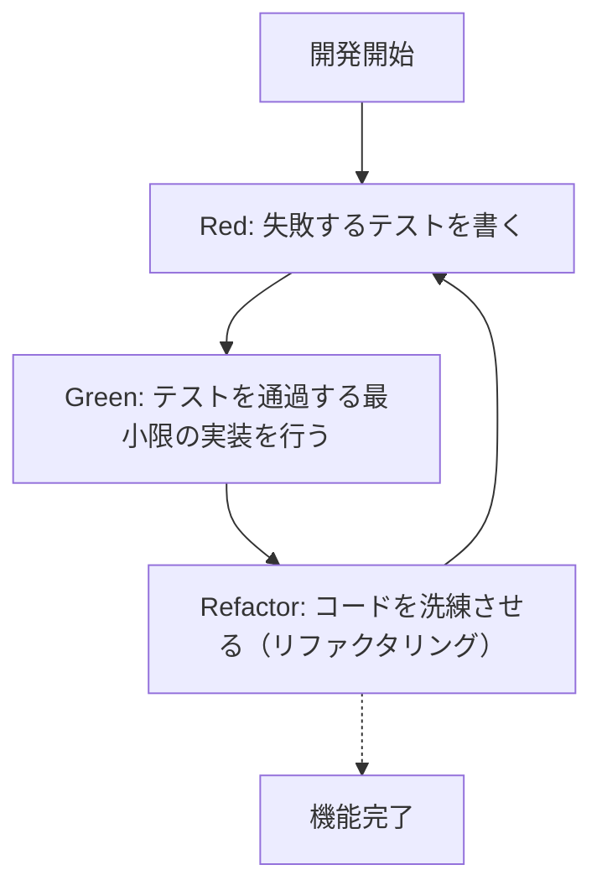
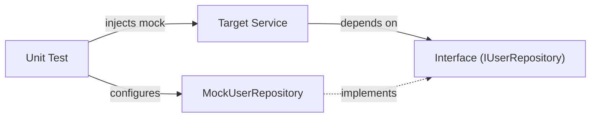

現代のソフトウェア開発において、コードの品質を維持しながら迅速に機能を追加していくことは至上命題です。特にC++のような複雑でパフォーマンスが要求される言語においては、メモリ管理のミスや未定義動作（Undefined Behavior）が致命的なバグにつながりやすく、テストの重要性は他の言語以上に高いと言えます。

本記事では、C++プロジェクトにおいて**テスト駆動開発（Test-Driven Development: TDD）**を導入するための手法を、非常に詳細かつ実践的に解説します。単体テストフレームワークである**GoogleTest**およびモックフレームワークである**GoogleMock**の使用方法、さらにビルドシステムである**CMake**を使ったモダンな構成方法、コードカバレッジの測定方法までを網羅的に取り上げます。

## 1. テスト駆動開発（TDD）の哲学とメリット

テスト駆動開発（TDD）は、「実装を書く前にテストを書く」というソフトウェア開発手法です。これは単なるテスト手法ではなく、**設計手法**としても機能します。テストを先に書くことで、開発者は自然と「使いやすいインターフェース」や「疎結合な設計」を意識するようになります。

### 1.1 Red-Green-Refactor サイクル

TDDの中核をなすのが、以下の「Red-Green-Refactor」のサイクルです。



1. **Red（赤）**: 実装がない状態で、期待する振る舞いを定義するテストを書きます。この時点では実装がないため、テストは必ず失敗（Red）します。
2. **Green（緑）**: テストを成功させる（Green）ためだけの、最小限のコードを書きます。この段階では、コードの美しさやパフォーマンスは最優先されません。
3. **Refactor（リファクタリング）**: テストが通る状態を維持したまま、重複を排除し、コードの設計を改善します。テストがあることで、安全にコードを変更できます。

### 1.2 バグ発見の遅延によるコストの増大

ソフトウェア工学において、バグの発見が開発プロセスの後半になればなるほど、その修正コストは指数関数的に増大することが知られています。このコスト増加のモデルは、次のような数式で近似されることがあります。

$$ Cost(t) = C_0 \times e^{k \cdot t} $$

ここで、$Cost(t)$ は時間 $t$ における修正コスト、$C_0$ はバグが埋め込まれた直後の修正コスト（ベースライン）、$k$ は定数です。TDDを導入することで、$t$ を極小に保ち、コストの指数関数的な増大を未然に防ぐことができます。

## 2. C++におけるテストツールの選択とモダンなCMake構成

C++には数多くのテストフレームワークが存在します。Catch2、Boost.Test、doctestなどがありますが、業界標準として最も広く使われているのが**GoogleTest（gtest）**です。GoogleTestは豊富なアサーション、強力なモック化フレームワーク（GoogleMock）、そして拡張性の高さが魅力です。

### 2.1 CMakeの `FetchContent` を利用したGoogleTestの導入

モダンなC++開発において、外部依存関係の管理はCMakeの `FetchContent` モジュールを使うのが主流です。これにより、サブモジュールを管理したり事前にライブラリをインストールしたりする手間が省けます。

プロジェクトのルートにある `CMakeLists.txt` は次のように記述します。

```cmake
cmake_minimum_required(VERSION 3.14)
project(TddCppExample CXX)

# C++標準の指定
set(CMAKE_CXX_STANDARD 17)
set(CMAKE_CXX_STANDARD_REQUIRED ON)

# プロダクションコードのライブラリ化
add_library(core_lib src/Calculator.cpp src/StringUtils.cpp)
target_include_directories(core_lib PUBLIC include)

# テストの有効化
enable_testing()

# GoogleTestの取得
include(FetchContent)
FetchContent_Declare(
  googletest
  URL https://github.com/google/googletest/archive/refs/tags/v1.14.0.zip
)
# Windows環境でのビルド警告回避のため
set(gtest_force_shared_crt ON CACHE BOOL "" FORCE)
FetchContent_MakeAvailable(googletest)

# テスト実行ファイルの設定
add_executable(unit_tests 
    tests/CalculatorTest.cpp 
    tests/StringUtilsTest.cpp
)
target_link_libraries(unit_tests
    PRIVATE
    core_lib
    gtest_main
    gmock
)

# CTestへの登録
include(GoogleTest)
gtest_discover_tests(unit_tests)
```

この設定により、CMakeが自動的にGoogleTestのソースコードをダウンロードし、プロジェクトに統合してくれます。

## 3. 実践：GoogleTestによる Red-Green-Refactor サイクル

ここからは、簡単な `Calculator` クラスを題材に、TDDのサイクルを実践してみましょう。

### 3.1 フェーズ 1: Red (失敗するテストを書く)

まず、ヘッダファイル `include/Calculator.h` のスケルトンと、テストコードを書きます。

**include/Calculator.h (スケルトン)**
```cpp
#pragma once

class Calculator {
public:
    int Add(int a, int b);
};
```

**tests/CalculatorTest.cpp (テストコード)**
```cpp
#include <gtest/gtest.h>
#include "Calculator.h"

TEST(CalculatorTest, AddsTwoPositiveNumbers) {
    Calculator calc;
    int result = calc.Add(2, 3);
    EXPECT_EQ(result, 5);
}
```

この時点でビルドしようとすると、`Calculator::Add` の実装がないためリンクエラー、あるいはテストを実行して失敗する状態（Red）になります。

### 3.2 フェーズ 2: Green (最小限の実装)

テストを通過させるためだけのコードを書きます。

**src/Calculator.cpp**
```cpp
#include "Calculator.h"

int Calculator::Add(int a, int b) {
    return a + b; // テストを通すための最小限の実装
}
```

これでビルドしてテストを実行すると、テストが成功（Green）します。

### 3.3 フェーズ 3: Refactor (リファクタリング)

この例ではコードが非常にシンプルですが、要件が複雑化していくにつれ、リファクタリングのフェーズでコードの可読性を高めたり、パフォーマンスを改善したりします。テストコード自体もリファクタリングの対象です。例えば、テストフィクスチャ（`testing::Test`）を導入してセットアップを共通化することが考えられます。

## 4. `EXPECT_EQ` と `ASSERT_EQ` の違い

GoogleTestを使用する際、アサーションマクロとして `EXPECT_*` と `ASSERT_*` の2種類が存在します。これらの違いを理解することは、堅牢なテストを書く上で非常に重要です。

- **`EXPECT_EQ(expected, actual)`**: テストが失敗しても、現在のテスト関数の実行を**継続**します。1つのテスト内で複数の状態を検証したい場合に適しています。
- **`ASSERT_EQ(expected, actual)`**: テストが失敗した場合、その場で現在のテスト関数の実行を**中断（致命的失敗）**します。これ以降の検証が意味を持たない場合（例：ポインタが `nullptr` でないことを確認した直後にデリファレンスする場合）に使用します。

## 5. 依存性の注入（DI）とGoogleMockによるモック化

実際のC++プロジェクトでは、データベースアクセス、ネットワーク通信、ハードウェア制御など、外部システムへの依存が必ず発生します。これらの依存関係をそのままにしておくと、単体テストが非常に困難になります。

そこで登場するのが**依存性の注入（Dependency Injection: DI）**と、**GoogleMock**を使ったインターフェースのモック化です。



### 5.1 インターフェースの定義とターゲットクラスの実装

まず、依存するコンポーネントを抽象化したインターフェース（純粋仮想関数を持つクラス）を定義します。

```cpp
// include/IUserRepository.h
#pragma once
#include <string>

class IUserRepository {
public:
    virtual ~IUserRepository() = default;
    virtual bool SaveUser(int id, const std::string& name) = 0;
};
```

次に、このインターフェースに依存するサービスクラス（テスト対象）を作成します。コンストラクタ経由で依存性を注入（Constructor Injection）します。

```cpp
// include/UserService.h
#pragma once
#include "IUserRepository.h"
#include <string>

class UserService {
private:
    IUserRepository& repository_;
public:
    UserService(IUserRepository& repository) : repository_(repository) {}

    bool RegisterUser(int id, const std::string& name) {
        if (name.empty()) return false;
        return repository_.SaveUser(id, name);
    }
};
```

### 5.2 GoogleMockを使ったモッククラスの作成とテスト

GoogleMockの `MOCK_METHOD` マクロを使用して、インターフェースをモック化します。

```cpp
// tests/UserServiceTest.cpp
#include <gtest/gtest.h>
#include <gmock/gmock.h>
#include "UserService.h"
#include "IUserRepository.h"

using ::testing::Return;
using ::testing::_;

// モッククラスの定義
class MockUserRepository : public IUserRepository {
public:
    MOCK_METHOD(bool, SaveUser, (int id, const std::string& name), (override));
};

TEST(UserServiceTest, RegistersValidUserSuccessfully) {
    MockUserRepository mockRepo;
    UserService service(mockRepo);

    // 期待値の設定：SaveUserが(1, "Kenji")で1回呼ばれ、trueを返すことを期待する
    EXPECT_CALL(mockRepo, SaveUser(1, "Kenji"))
        .Times(1)
        .WillOnce(Return(true));

    // テスト対象の実行
    bool result = service.RegisterUser(1, "Kenji");

    // アサーション
    EXPECT_TRUE(result);
}

TEST(UserServiceTest, RejectsEmptyNameWithoutCallingRepository) {
    MockUserRepository mockRepo;
    UserService service(mockRepo);

    // 空の名前の場合はSaveUserが一度も呼ばれないことを期待する
    EXPECT_CALL(mockRepo, SaveUser(_, _))
        .Times(0);

    bool result = service.RegisterUser(1, "");

    EXPECT_FALSE(result);
}
```

このようにGoogleMockを使用することで、「対象クラスが依存先と正しくやり取りしているか（相互作用）」を正確に検証することができます。

## 6. コードカバレッジの測定と可視化

テストを書いた後、プロジェクトのどの部分がテストで実行されているか（カバーされているか）を客観的に評価するために、**コードカバレッジ**を測定します。コードカバレッジ（$Coverage$）は以下の数式で表されます。

$$ Coverage = \left( \frac{L_{executed}}{L_{total}} \right) \times 100 \ (\%) $$

ここで、$L_{executed}$ はテスト中に実行されたコード行数、$L_{total}$ はプロジェクト全体のコード行数です。

GCCやClangを使用している場合、`gcov` および `lcov` ツールを使用してカバレッジを測定できます。

### 6.1 CMakeへのカバレッジオプションの追加

カバレッジを測定するには、専用のコンパイラフラグが必要です。`CMakeLists.txt` に以下の設定を追加します。

```cmake
# カバレッジビルドオプション
option(ENABLE_COVERAGE "Enable coverage reporting" OFF)

if(ENABLE_COVERAGE AND CMAKE_CXX_COMPILER_ID MATCHES "GNU|Clang")
    message(STATUS "Coverage enabled")
    target_compile_options(core_lib PRIVATE --coverage -O0 -g)
    target_link_options(core_lib PRIVATE --coverage)
    target_compile_options(unit_tests PRIVATE --coverage -O0 -g)
    target_link_options(unit_tests PRIVATE --coverage)
endif()
```

### 6.2 カバレッジレポートの生成手順

ビルド時にフラグを有効にし、テストを実行した後に `lcov` を使ってHTMLレポートを出力します。

```bash
# 1. カバレッジオプションを有効にしてビルド
mkdir build && cd build
cmake .. -DENABLE_COVERAGE=ON
make

# 2. テストの実行
ctest

# 3. カバレッジデータの収集 (lcovの実行)
lcov --capture --directory . --output-file coverage.info

# 4. システムヘッダや外部ライブラリ（GoogleTest等）の除外
lcov --remove coverage.info '/usr/*' '*/_deps/*' '*/tests/*' --output-file coverage.info

# 5. HTMLレポートの生成
genhtml coverage.info --output-directory coverage_report
```

生成された `coverage_report/index.html` をブラウザで開くことで、ソースコード単位でどの行が実行されたかが緑と赤で視覚的にハイライトされ、テストの抜け漏れ（カバレッジホールの特定）に役立ちます。

## 7. C++プロジェクトにおけるTDDの課題とベストプラクティス

C++プロジェクトでTDDを導入する際には、特有の課題が存在します。

### 7.1 ビルド時間（コンパイル時間）の増加
C++はテンプレートの多用や大規模なヘッダのインクルードにより、コンパイル時間が長くなりがちです。TDDの「Red-Green-Refactor」サイクルは迅速に行われる必要があるため、ビルド時間の遅延は致命的です。
**対策**: 前方宣言（Forward Declaration）やPimpl（Pointer to implementation）イディオムを活用し、ヘッダファイルの依存関係を最小限に抑えましょう。また、Ccacheなどのビルドキャッシュツールの導入も効果的です。

### 7.2 レガシーコードへのTDD導入
既存の巨大なモノリシックコードに後からTDDを適用するのは困難を極めます。
**対策**: 最初から全てを書き直すのではなく、新機能を追加する部分や、バグ修正を行う箇所（ボーイスカウトルール）から段階的にテストを追加し、少しずつコードベースをTDDのコントロール下に置いていくアプローチ（Working Effectively with Legacy Codeの手法）が推奨されます。

## 8. ソフトウェア設計としてのTDD

TDDはコード品質を保つための防護ネットであると同時に、C++のコード設計を向上させるドライバーでもあります。テストを書くために依存関係の注入（DI）を強制される結果、クラス間の結合度（Coupling）が下がり、凝集度（Cohesion）が高まります。

リファクタリングにおいて、循環的複雑度（McCabe's Cyclomatic Complexity）を意識することも大切です。

$$ M = E - N + 2P $$

（$M$: 複雑度, $E$: エッジ数, $N$: ノード数, $P$: 連結成分数）

テストが存在することで、この複雑度を下げるための関数の分割やポリモーフィズムへの置き換えを、破壊的変更を恐れることなく実行できるようになります。

## まとめ

本記事では、C++プロジェクトに対してGoogleTestおよびGoogleMockを用いたテスト駆動開発（TDD）の導入方法を詳細に解説しました。
1. **CMake FetchContent** を使ったモダンなプロジェクト構成
2. **Red-Green-Refactor** のサイクル実践
3. **GoogleMock と 依存性の注入 (DI)** を用いたインターフェースのモック化
4. **gcov/lcov** によるテストカバレッジの可視化

TDDは習得に時間がかかるアプローチではありますが、C++のようにパフォーマンスと安全性の両立が求められるシステムプログラミングにおいて、その投資対効果は計り知れません。ぜひ、次のプロジェクトから少しずつTDDを実践し、堅牢でメンテナンスしやすいC++コードを手に入れてください。
