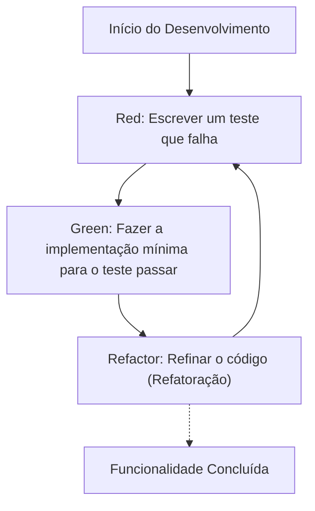
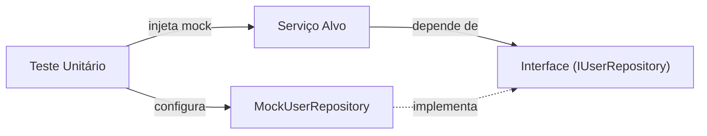

No desenvolvimento de software moderno, é fundamental adicionar novos recursos rapidamente e, ao mesmo tempo, manter a qualidade do código. Especialmente em linguagens complexas e focadas em desempenho, como C++, erros de gerenciamento de memória e comportamentos indefinidos (Undefined Behavior) podem facilmente levar a bugs fatais, tornando a importância dos testes ainda maior do que em outras linguagens.

Neste artigo, explicaremos de forma muito detalhada e prática como introduzir o **Desenvolvimento Orientado a Testes (Test-Driven Development: TDD)** em projetos C++. Cobriremos de forma abrangente como usar o framework de testes unitários **GoogleTest** e o framework de mock **GoogleMock**, além de como configurar um ambiente moderno com o sistema de build **CMake**, e como medir a cobertura de código (code coverage).

## 1. A Filosofia e os Benefícios do Desenvolvimento Orientado a Testes (TDD)

O Desenvolvimento Orientado a Testes (TDD) é uma abordagem de desenvolvimento de software onde "os testes são escritos antes da implementação". Mais do que apenas uma técnica de teste, ele também funciona como uma **metodologia de design**. Ao escrever o teste primeiro, os desenvolvedores naturalmente começam a se preocupar em criar "interfaces fáceis de usar" e "designs com baixo acoplamento".

### 1.1 O Ciclo Red-Green-Refactor

O núcleo do TDD é o seguinte ciclo "Red-Green-Refactor".



1. **Red (Vermelho)**: Com a implementação vazia, você escreve um teste que define o comportamento esperado. Neste ponto, como não há implementação, o teste obrigatoriamente falhará (Red).
2. **Green (Verde)**: Você escreve o código mínimo necessário apenas para fazer o teste passar (Green). Nesta fase, a beleza ou o desempenho do código não são as principais prioridades.
3. **Refactor (Refatoração)**: Mantendo o teste passando, você elimina duplicações e melhora o design do código. Ter testes permite que você modifique o código com segurança.

### 1.2 O Aumento de Custos Devido ao Atraso na Descoberta de Bugs

Na engenharia de software, é sabido que quanto mais tarde um bug for descoberto no processo de desenvolvimento, o custo para corrigi-lo aumentará exponencialmente. Esse modelo de aumento de custos pode ser aproximado pela seguinte fórmula:

$$ Cost(t) = C_0 \times e^{k \cdot t} $$

Onde $Cost(t)$ é o custo de correção no tempo $t$, $C_0$ é o custo de correção imediatamente após o bug ter sido introduzido (linha de base), e $k$ é uma constante. Ao adotar o TDD, é possível manter $t$ mínimo, prevenindo o aumento exponencial dos custos antecipadamente.

## 2. Seleção de Ferramentas de Teste e Configuração Moderna de CMake em C++

Existem muitos frameworks de teste em C++. Há opções como Catch2, Boost.Test e doctest, mas o **GoogleTest (gtest)** é o mais amplamente utilizado como padrão da indústria. O GoogleTest é atraente devido às suas ricas asserções, um poderoso framework de mock (GoogleMock) e alta extensibilidade.

### 2.1 Introdução ao GoogleTest Utilizando o `FetchContent` do CMake

No desenvolvimento C++ moderno, a gestão de dependências externas usando o módulo `FetchContent` do CMake tornou-se o padrão. Isso elimina o incômodo de gerenciar submódulos ou instalar bibliotecas previamente.

O arquivo `CMakeLists.txt` na raiz do projeto é escrito da seguinte forma:

```cmake
cmake_minimum_required(VERSION 3.14)
project(TddCppExample CXX)

# Especificação do padrão C++
set(CMAKE_CXX_STANDARD 17)
set(CMAKE_CXX_STANDARD_REQUIRED ON)

# Criação da biblioteca do código de produção
add_library(core_lib src/Calculator.cpp src/StringUtils.cpp)
target_include_directories(core_lib PUBLIC include)

# Habilitação de testes
enable_testing()

# Obtenção do GoogleTest
include(FetchContent)
FetchContent_Declare(
  googletest
  URL https://github.com/google/googletest/archive/refs/tags/v1.14.0.zip
)
# Para evitar avisos de build em ambientes Windows
set(gtest_force_shared_crt ON CACHE BOOL "" FORCE)
FetchContent_MakeAvailable(googletest)

# Configuração do executável de testes
add_executable(unit_tests 
    tests/CalculatorTest.cpp 
    tests/StringUtilsTest.cpp
)
target_link_libraries(unit_tests
    PRIVATE
    core_lib
    gtest_main
    gmock
)

# Registro no CTest
include(GoogleTest)
gtest_discover_tests(unit_tests)
```

Com essa configuração, o CMake fará automaticamente o download do código-fonte do GoogleTest e o integrará ao projeto.

## 3. Prática: O Ciclo Red-Green-Refactor com GoogleTest

A partir daqui, vamos praticar o ciclo TDD usando uma classe `Calculator` simples como exemplo.

### 3.1 Fase 1: Red (Escrever um teste que falha)

Primeiro, escrevemos o esqueleto do arquivo de cabeçalho `include/Calculator.h` e o código de teste.

**include/Calculator.h (Esqueleto)**
```cpp
#pragma once

class Calculator {
public:
    int Add(int a, int b);
};
```

**tests/CalculatorTest.cpp (Código de teste)**
```cpp
#include <gtest/gtest.h>
#include "Calculator.h"

TEST(CalculatorTest, AddsTwoPositiveNumbers) {
    Calculator calc;
    int result = calc.Add(2, 3);
    EXPECT_EQ(result, 5);
}
```

Se tentarmos compilar neste ponto, haverá um erro de linkagem porque a implementação de `Calculator::Add` não existe, ou o teste executará e falhará (Red).

### 3.2 Fase 2: Green (Implementação mínima)

Escrevemos apenas o código para fazer o teste passar.

**src/Calculator.cpp**
```cpp
#include "Calculator.h"

int Calculator::Add(int a, int b) {
    return a + b; // Implementação mínima para passar no teste
}
```

Agora, ao compilar e executar o teste, ele será bem-sucedido (Green).

### 3.3 Fase 3: Refactor (Refatoração)

Neste exemplo o código é muito simples, mas à medida que os requisitos se tornam mais complexos, na fase de refatoração você melhora a legibilidade do código e seu desempenho. O próprio código de teste também é alvo de refatoração. Por exemplo, pode-se considerar a introdução de *test fixtures* (`testing::Test`) para centralizar a configuração comum.

## 4. Diferença entre `EXPECT_EQ` e `ASSERT_EQ`

Ao usar o GoogleTest, existem dois tipos de macros de asserção: `EXPECT_*` e `ASSERT_*`. Entender a diferença entre elas é crucial para escrever testes robustos.

- **`EXPECT_EQ(expected, actual)`**: Mesmo se o teste falhar, a execução da função de teste atual **continua**. É adequado para quando você deseja verificar vários estados dentro de um único teste.
- **`ASSERT_EQ(expected, actual)`**: Se o teste falhar, ele **interrompe (falha fatal)** a execução da função de teste atual imediatamente. É usado quando verificações subsequentes não fariam sentido (por exemplo, ao desreferenciar um ponteiro logo após garantir que ele não seja `nullptr`).

## 5. Injeção de Dependência (DI) e Mocking com GoogleMock

Em projetos C++ do mundo real, sempre ocorrem dependências de sistemas externos, como acesso a banco de dados, comunicação de rede e controle de hardware. Se você deixar essas dependências como estão, os testes unitários se tornam muito difíceis.

É aí que entram a **Injeção de Dependência (Dependency Injection: DI)** e a criação de mocks de interfaces usando **GoogleMock**.



### 5.1 Definição da Interface e Implementação da Classe Alvo

Primeiro, definimos uma interface que abstrai o componente dependente (uma classe com funções virtuais puras).

```cpp
// include/IUserRepository.h
#pragma once
#include <string>

class IUserRepository {
public:
    virtual ~IUserRepository() = default;
    virtual bool SaveUser(int id, const std::string& name) = 0;
};
```

Em seguida, criamos a classe de serviço (alvo do teste) que depende dessa interface. Injetamos a dependência através do construtor (Constructor Injection).

```cpp
// include/UserService.h
#pragma once
#include "IUserRepository.h"
#include <string>

class UserService {
private:
    IUserRepository& repository_;
public:
    UserService(IUserRepository& repository) : repository_(repository) {}

    bool RegisterUser(int id, const std::string& name) {
        if (name.empty()) return false;
        return repository_.SaveUser(id, name);
    }
};
```

### 5.2 Criação e Teste da Classe Mock Usando GoogleMock

Usamos a macro `MOCK_METHOD` do GoogleMock para criar um mock da interface.

```cpp
// tests/UserServiceTest.cpp
#include <gtest/gtest.h>
#include <gmock/gmock.h>
#include "UserService.h"
#include "IUserRepository.h"

using ::testing::Return;
using ::testing::_;

// Definição da classe mock
class MockUserRepository : public IUserRepository {
public:
    MOCK_METHOD(bool, SaveUser, (int id, const std::string& name), (override));
};

TEST(UserServiceTest, RegistersValidUserSuccessfully) {
    MockUserRepository mockRepo;
    UserService service(mockRepo);

    // Configuração de expectativa: Esperamos que SaveUser seja chamado 1 vez com (1, "Kenji") e retorne true
    EXPECT_CALL(mockRepo, SaveUser(1, "Kenji"))
        .Times(1)
        .WillOnce(Return(true));

    // Execução do alvo do teste
    bool result = service.RegisterUser(1, "Kenji");

    // Asserção
    EXPECT_TRUE(result);
}

TEST(UserServiceTest, RejectsEmptyNameWithoutCallingRepository) {
    MockUserRepository mockRepo;
    UserService service(mockRepo);

    // Esperamos que SaveUser não seja chamado caso o nome esteja vazio
    EXPECT_CALL(mockRepo, SaveUser(_, _))
        .Times(0);

    bool result = service.RegisterUser(1, "");

    EXPECT_FALSE(result);
}
```

Dessa forma, usando o GoogleMock, podemos verificar com precisão "se a classe alvo está interagindo corretamente com suas dependências (interação)".

## 6. Medição e Visualização da Cobertura de Código

Depois de escrever os testes, para avaliar objetivamente qual parte do projeto está sendo executada (coberta) pelos testes, medimos a **cobertura de código**. A cobertura de código ($Coverage$) é expressa pela seguinte fórmula:

$$ Coverage = \left( \frac{L_{executed}}{L_{total}} \right) \times 100 \ (\%) $$

Onde $L_{executed}$ é o número de linhas de código executadas durante os testes, e $L_{total}$ é o número total de linhas de código do projeto.

Se você estiver usando GCC ou Clang, pode medir a cobertura usando as ferramentas `gcov` e `lcov`.

### 6.1 Adicionando Opções de Cobertura ao CMake

Para medir a cobertura, são necessárias flags de compilador específicas. Adicione a seguinte configuração ao `CMakeLists.txt`:

```cmake
# Opção de build para cobertura
option(ENABLE_COVERAGE "Enable coverage reporting" OFF)

if(ENABLE_COVERAGE AND CMAKE_CXX_COMPILER_ID MATCHES "GNU|Clang")
    message(STATUS "Coverage enabled")
    target_compile_options(core_lib PRIVATE --coverage -O0 -g)
    target_link_options(core_lib PRIVATE --coverage)
    target_compile_options(unit_tests PRIVATE --coverage -O0 -g)
    target_link_options(unit_tests PRIVATE --coverage)
endif()
```

### 6.2 Procedimento para Geração de Relatórios de Cobertura

Habilite a flag durante a compilação, execute os testes e, em seguida, use o `lcov` para gerar um relatório HTML.

```bash
# 1. Compilar com a opção de cobertura ativada
mkdir build && cd build
cmake .. -DENABLE_COVERAGE=ON
make

# 2. Executar os testes
ctest

# 3. Coletar dados de cobertura (execução do lcov)
lcov --capture --directory . --output-file coverage.info

# 4. Excluir headers do sistema e bibliotecas externas (GoogleTest, etc.)
lcov --remove coverage.info '/usr/*' '*/_deps/*' '*/tests/*' --output-file coverage.info

# 5. Gerar o relatório HTML
genhtml coverage.info --output-directory coverage_report
```

Ao abrir o arquivo `coverage_report/index.html` gerado no navegador, você poderá ver visualmente em nível de código-fonte quais linhas foram executadas destacadas em verde e vermelho, o que ajuda a identificar partes não testadas (buracos de cobertura).

## 7. Desafios e Melhores Práticas do TDD em Projetos C++

Ao introduzir o TDD em projetos C++, existem desafios específicos.

### 7.1 Aumento no Tempo de Build (Tempo de Compilação)
Devido ao uso frequente de templates e à inclusão de grandes headers, os tempos de compilação em C++ tendem a ser longos. Como o ciclo "Red-Green-Refactor" do TDD precisa ser feito rapidamente, atrasos no tempo de build podem ser fatais.
**Solução**: Utilize *Forward Declarations* (Declarações Antecipadas) e o idioma Pimpl (Pointer to implementation) para minimizar as dependências nos arquivos de cabeçalho. Além disso, a introdução de ferramentas de cache de build como o Ccache também é eficaz.

### 7.2 Introdução do TDD em Código Legado
Aplicar TDD tardiamente a um código monolítico enorme já existente é extremamente difícil.
**Solução**: Em vez de reescrever tudo desde o início, recomenda-se adicionar testes gradualmente onde novos recursos estão sendo adicionados ou bugs estão sendo corrigidos (regra do escoteiro), trazendo a base de código aos poucos para sob o controle do TDD (A abordagem do livro *Working Effectively with Legacy Code*).

## 8. TDD como Design de Software

O TDD é tanto uma rede de segurança para manter a qualidade do código quanto um motor para melhorar o design do código C++. Como resultado de ser forçado a usar a Injeção de Dependência (DI) para escrever testes, o acoplamento (Coupling) entre classes diminui e a coesão (Cohesion) aumenta.

Na refatoração, também é importante estar ciente da Complexidade Ciclomática (Complexidade Ciclomática de McCabe).

$$ M = E - N + 2P $$

($M$: Complexidade, $E$: Número de arestas, $N$: Número de nós, $P$: Número de componentes conectados)

A existência de testes permite que você execute a divisão de funções e substituição por polimorfismo para reduzir essa complexidade, sem medo de introduzir alterações destrutivas (breaking changes).

## Conclusão

Neste artigo, explicamos detalhadamente como introduzir o Desenvolvimento Orientado a Testes (TDD) usando GoogleTest e GoogleMock em projetos C++.
1. Configuração de projeto moderna usando **CMake FetchContent**
2. Prática do ciclo **Red-Green-Refactor**
3. Mocking de interface usando **GoogleMock e Injeção de Dependência (DI)**
4. Visualização da cobertura de testes com **gcov/lcov**

Embora o TDD seja uma abordagem que leva tempo para ser dominada, na programação de sistemas como C++, onde é exigido um equilíbrio entre desempenho e segurança, o retorno sobre o investimento é imensurável. Por favor, comece a praticar o TDD gradualmente no seu próximo projeto para obter um código C++ robusto e fácil de manter.
