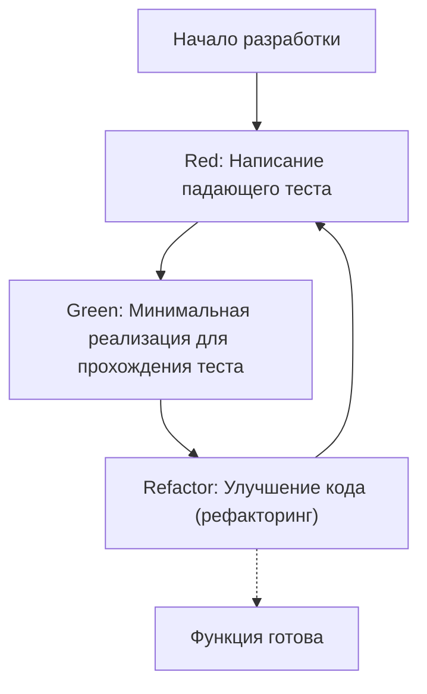
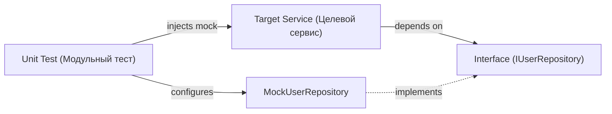

В современной разработке программного обеспечения добавление новых функций с сохранением высокого качества кода является первостепенной задачей. В частности, в таком сложном и требовательном к производительности языке, как C++, ошибки управления памятью и неопределенное поведение (Undefined Behavior) легко приводят к фатальным багам, поэтому важность тестирования здесь даже выше, чем в других языках.

В этой статье мы подробно и с практической точки зрения объясним, как внедрить **разработку через тестирование (Test-Driven Development: TDD)** в проекты на C++. Мы всесторонне рассмотрим использование фреймворка для модульного тестирования **GoogleTest** и фреймворка для моков **GoogleMock**, современный способ настройки с использованием системы сборки **CMake**, а также методы измерения покрытия кода.

## 1. Философия и преимущества разработки через тестирование (TDD)

Разработка через тестирование (TDD) — это методология разработки программного обеспечения, при которой «тесты пишутся до написания реализации». Это не просто метод тестирования, но и **метод проектирования**. Заблаговременное написание тестов естественным образом заставляет разработчиков задумываться об «удобных интерфейсах» и «слабо связанном дизайне».

### 1.1 Цикл Red-Green-Refactor

Ядром TDD является следующий цикл «Red-Green-Refactor»:



1. **Red (Красный)**: Пишется тест, который определяет ожидаемое поведение при отсутствии реализации. На этом этапе тест всегда завершается неудачей (Red), так как реализации еще нет.
2. **Green (Зеленый)**: Пишется минимальный объем кода, необходимый только для того, чтобы тест прошел успешно (Green). На этом этапе красота кода или производительность не являются приоритетами.
3. **Refactor (Рефакторинг)**: При сохранении успешного прохождения тестов устраняется дублирование и улучшается архитектура кода. Наличие тестов позволяет безопасно вносить изменения.

### 1.2 Увеличение затрат из-за задержки обнаружения багов

В программной инженерии известно, что чем позже в процессе разработки обнаруживается баг, тем экспоненциально выше становятся затраты на его исправление. Эта модель увеличения затрат иногда аппроксимируется следующей формулой:

$$ Cost(t) = C_0 \times e^{k \cdot t} $$

Где $Cost(t)$ — стоимость исправления в момент времени $t$, $C_0$ — стоимость исправления сразу после внесения бага (базовая линия), а $k$ — константа. Внедрение TDD позволяет поддерживать $t$ на минимальном уровне, предотвращая экспоненциальный рост затрат.

## 2. Выбор инструментов тестирования для C++ и современная конфигурация CMake

В C++ существует множество фреймворков для тестирования, таких как Catch2, Boost.Test, doctest и другие, однако в качестве отраслевого стандарта наиболее широко используется **GoogleTest (gtest)**. Привлекательность GoogleTest заключается в богатом наборе утверждений (assertions), мощном фреймворке для создания моков (GoogleMock) и высокой расширяемости.

### 2.1 Внедрение GoogleTest с помощью `FetchContent` в CMake

В современной разработке на C++ для управления внешними зависимостями всё чаще используется модуль `FetchContent` в CMake. Это избавляет от необходимости управлять подмодулями или предварительно устанавливать библиотеки.

Файл `CMakeLists.txt` в корне проекта описывается следующим образом:

```cmake
cmake_minimum_required(VERSION 3.14)
project(TddCppExample CXX)

# Указание стандарта C++
set(CMAKE_CXX_STANDARD 17)
set(CMAKE_CXX_STANDARD_REQUIRED ON)

# Создание библиотеки из продакшен-кода
add_library(core_lib src/Calculator.cpp src/StringUtils.cpp)
target_include_directories(core_lib PUBLIC include)

# Включение тестирования
enable_testing()

# Получение GoogleTest
include(FetchContent)
FetchContent_Declare(
  googletest
  URL https://github.com/google/googletest/archive/refs/tags/v1.14.0.zip
)
# Для избежания предупреждений сборки в Windows
set(gtest_force_shared_crt ON CACHE BOOL "" FORCE)
FetchContent_MakeAvailable(googletest)

# Настройка исполняемого файла тестов
add_executable(unit_tests 
    tests/CalculatorTest.cpp 
    tests/StringUtilsTest.cpp
)
target_link_libraries(unit_tests
    PRIVATE
    core_lib
    gtest_main
    gmock
)

# Регистрация в CTest
include(GoogleTest)
gtest_discover_tests(unit_tests)
```

Благодаря этой настройке CMake автоматически загрузит исходный код GoogleTest и интегрирует его в ваш проект.

## 3. Практика: Цикл Red-Green-Refactor с GoogleTest

Теперь давайте применим цикл TDD на практике, используя в качестве примера простой класс `Calculator`.

### 3.1 Фаза 1: Red (Написание падающего теста)

Сначала напишем каркас заголовочного файла `include/Calculator.h` и код теста.

**include/Calculator.h (каркас)**
```cpp
#pragma once

class Calculator {
public:
    int Add(int a, int b);
};
```

**tests/CalculatorTest.cpp (код теста)**
```cpp
#include <gtest/gtest.h>
#include "Calculator.h"

TEST(CalculatorTest, AddsTwoPositiveNumbers) {
    Calculator calc;
    int result = calc.Add(2, 3);
    EXPECT_EQ(result, 5);
}
```

Если попытаться выполнить сборку на этом этапе, произойдет ошибка линковки из-за отсутствия реализации `Calculator::Add`, либо тест завершится неудачей (Red).

### 3.2 Фаза 2: Green (Минимальная реализация)

Напишем код исключительно для того, чтобы пройти тест.

**src/Calculator.cpp**
```cpp
#include "Calculator.h"

int Calculator::Add(int a, int b) {
    return a + b; // Минимальная реализация для прохождения теста
}
```

Теперь после сборки и запуска тест пройдет успешно (Green).

### 3.3 Фаза 3: Refactor (Рефакторинг)

В этом примере код очень прост, но по мере усложнения требований на этапе рефакторинга повышается читаемость кода и улучшается производительность. Сам код тестов также подлежит рефакторингу. Например, можно внедрить фикстуры тестов (`testing::Test`), чтобы вынести общую настройку.

## 4. Разница между `EXPECT_EQ` и `ASSERT_EQ`

При использовании GoogleTest существуют два типа макросов утверждений: `EXPECT_*` и `ASSERT_*`. Понимание разницы между ними крайне важно для написания надежных тестов.

- **`EXPECT_EQ(expected, actual)`**: Даже если проверка не удалась, выполнение текущей функции теста **продолжается**. Это подходит для случаев, когда вы хотите проверить несколько состояний в одном тесте.
- **`ASSERT_EQ(expected, actual)`**: Если проверка не удалась, выполнение текущей функции теста немедленно **прерывается (фатальный сбой)**. Используется тогда, когда последующие проверки лишены смысла (например, при разыменовании указателя сразу после проверки того, что он не равен `nullptr`).

## 5. Внедрение зависимостей (DI) и создание моков с GoogleMock

В реальных проектах на C++ неизбежно возникают зависимости от внешних систем, таких как доступ к базе данных, сетевое взаимодействие, управление оборудованием и так далее. Если оставить эти зависимости как есть, модульное тестирование станет крайне сложным.

Здесь на помощь приходят **внедрение зависимостей (Dependency Injection: DI)** и создание моков для интерфейсов с использованием **GoogleMock**.



### 5.1 Определение интерфейса и реализация целевого класса

Сначала мы определяем интерфейс, абстрагирующий зависимый компонент (класс с чисто виртуальными функциями).

```cpp
// include/IUserRepository.h
#pragma once
#include <string>

class IUserRepository {
public:
    virtual ~IUserRepository() = default;
    virtual bool SaveUser(int id, const std::string& name) = 0;
};
```

Затем мы создаем класс сервиса (объект тестирования), который зависит от этого интерфейса. Зависимость внедряется через конструктор (Constructor Injection).

```cpp
// include/UserService.h
#pragma once
#include "IUserRepository.h"
#include <string>

class UserService {
private:
    IUserRepository& repository_;
public:
    UserService(IUserRepository& repository) : repository_(repository) {}

    bool RegisterUser(int id, const std::string& name) {
        if (name.empty()) return false;
        return repository_.SaveUser(id, name);
    }
};
```

### 5.2 Создание мок-класса с использованием GoogleMock и тестирование

Для создания мока интерфейса используем макрос `MOCK_METHOD` из GoogleMock.

```cpp
// tests/UserServiceTest.cpp
#include <gtest/gtest.h>
#include <gmock/gmock.h>
#include "UserService.h"
#include "IUserRepository.h"

using ::testing::Return;
using ::testing::_;

// Определение мок-класса
class MockUserRepository : public IUserRepository {
public:
    MOCK_METHOD(bool, SaveUser, (int id, const std::string& name), (override));
};

TEST(UserServiceTest, RegistersValidUserSuccessfully) {
    MockUserRepository mockRepo;
    UserService service(mockRepo);

    // Настройка ожиданий: ожидается, что SaveUser будет вызван 1 раз с параметрами (1, "Kenji") и вернет true
    EXPECT_CALL(mockRepo, SaveUser(1, "Kenji"))
        .Times(1)
        .WillOnce(Return(true));

    // Выполнение тестируемого метода
    bool result = service.RegisterUser(1, "Kenji");

    // Проверка (Assertion)
    EXPECT_TRUE(result);
}

TEST(UserServiceTest, RejectsEmptyNameWithoutCallingRepository) {
    MockUserRepository mockRepo;
    UserService service(mockRepo);

    // Ожидается, что при пустом имени SaveUser не будет вызван ни разу
    EXPECT_CALL(mockRepo, SaveUser(_, _))
        .Times(0);

    bool result = service.RegisterUser(1, "");

    EXPECT_FALSE(result);
}
```

Используя GoogleMock таким образом, мы можем точно проверить, «правильно ли целевой класс взаимодействует со своими зависимостями (взаимодействие)».

## 6. Измерение и визуализация покрытия кода (Code Coverage)

После написания тестов измеряется **покрытие кода**, чтобы объективно оценить, какая часть проекта выполняется (покрывается) тестами. Покрытие кода ($Coverage$) выражается следующей формулой:

$$ Coverage = \left( \frac{L_{executed}}{L_{total}} \right) \times 100 \ (\%) $$

Где $L_{executed}$ — количество строк кода, выполненных во время тестов, а $L_{total}$ — общее количество строк кода в проекте.

Если вы используете GCC или Clang, вы можете измерить покрытие с помощью инструментов `gcov` и `lcov`.

### 6.1 Добавление опций покрытия кода в CMake

Для измерения покрытия необходимы специальные флаги компилятора. Добавьте следующие настройки в `CMakeLists.txt`:

```cmake
# Опция сборки с покрытием
option(ENABLE_COVERAGE "Enable coverage reporting" OFF)

if(ENABLE_COVERAGE AND CMAKE_CXX_COMPILER_ID MATCHES "GNU|Clang")
    message(STATUS "Coverage enabled")
    target_compile_options(core_lib PRIVATE --coverage -O0 -g)
    target_link_options(core_lib PRIVATE --coverage)
    target_compile_options(unit_tests PRIVATE --coverage -O0 -g)
    target_link_options(unit_tests PRIVATE --coverage)
endif()
```

### 6.2 Процесс генерации отчета о покрытии

Включите флаг при сборке, выполните тесты, а затем используйте `lcov` для создания отчета в формате HTML.

```bash
# 1. Сборка с включенной опцией покрытия
mkdir build && cd build
cmake .. -DENABLE_COVERAGE=ON
make

# 2. Выполнение тестов
ctest

# 3. Сбор данных о покрытии (запуск lcov)
lcov --capture --directory . --output-file coverage.info

# 4. Исключение системных заголовков и внешних библиотек (GoogleTest и др.)
lcov --remove coverage.info '/usr/*' '*/_deps/*' '*/tests/*' --output-file coverage.info

# 5. Генерация HTML-отчета
genhtml coverage.info --output-directory coverage_report
```

Открыв сгенерированный файл `coverage_report/index.html` в браузере, вы сможете визуально увидеть (с зеленой и красной подсветкой), какие строки исходного кода были выполнены, что поможет выявить пробелы в тестах (определить так называемые "дыры" в покрытии).

## 7. Проблемы и лучшие практики TDD в проектах на C++

При внедрении TDD в проекты на C++ возникают специфические проблемы.

### 7.1 Увеличение времени сборки (времени компиляции)
В C++ время компиляции часто бывает долгим из-за интенсивного использования шаблонов и включения больших заголовочных файлов. Поскольку цикл TDD «Red-Green-Refactor» должен выполняться быстро, задержки во времени сборки могут быть фатальными.
**Решение**: Сведите к минимуму зависимости заголовочных файлов, используя предварительные объявления (Forward Declaration) и идиому Pimpl (Pointer to implementation). Также эффективным будет использование инструментов кэширования сборки, таких как Ccache.

### 7.2 Внедрение TDD в унаследованный (legacy) код
Применить TDD к уже существующему, огромному монолитному коду задним числом крайне сложно.
**Решение**: Рекомендуется не переписывать все с самого начала, а добавлять тесты поэтапно: в местах добавления новых функций или при исправлении багов (правило бойскаута). Таким образом, можно постепенно брать кодовую базу под контроль TDD (подход из книги "Эффективная работа с унаследованным кодом").

## 8. TDD как инструмент проектирования программного обеспечения

TDD служит не только страховкой для поддержания качества кода, но и драйвером улучшения архитектуры C++ кода. Необходимость написания тестов заставляет использовать внедрение зависимостей (DI), в результате чего снижается связность (Coupling) между классами и повышается их сплоченность (Cohesion).

При рефакторинге также важно учитывать цикломатическую сложность (цикломатическая сложность Маккейба).

$$ M = E - N + 2P $$

($M$: Сложность, $E$: Количество ребер, $N$: Количество узлов, $P$: Количество компонент связности)

Наличие тестов позволяет разделять функции для снижения этой сложности или заменять их на полиморфизм, не опасаясь внести разрушительные изменения.

## Заключение

В этой статье мы подробно рассмотрели способы внедрения разработки через тестирование (TDD) в проекты на C++ с использованием GoogleTest и GoogleMock.
1. Современная конфигурация проекта с использованием **CMake FetchContent**
2. Практика цикла **Red-Green-Refactor**
3. Создание моков для интерфейсов с использованием **GoogleMock и внедрения зависимостей (DI)**
4. Визуализация покрытия тестами с помощью **gcov/lcov**

Хотя TDD требует времени на освоение, в системном программировании, где, как в C++, необходимо соблюдать баланс между производительностью и безопасностью, отдача от этих инвестиций огромна. Обязательно начните постепенно применять TDD в своем следующем проекте, чтобы получить надежный и легко поддерживаемый C++ код.
