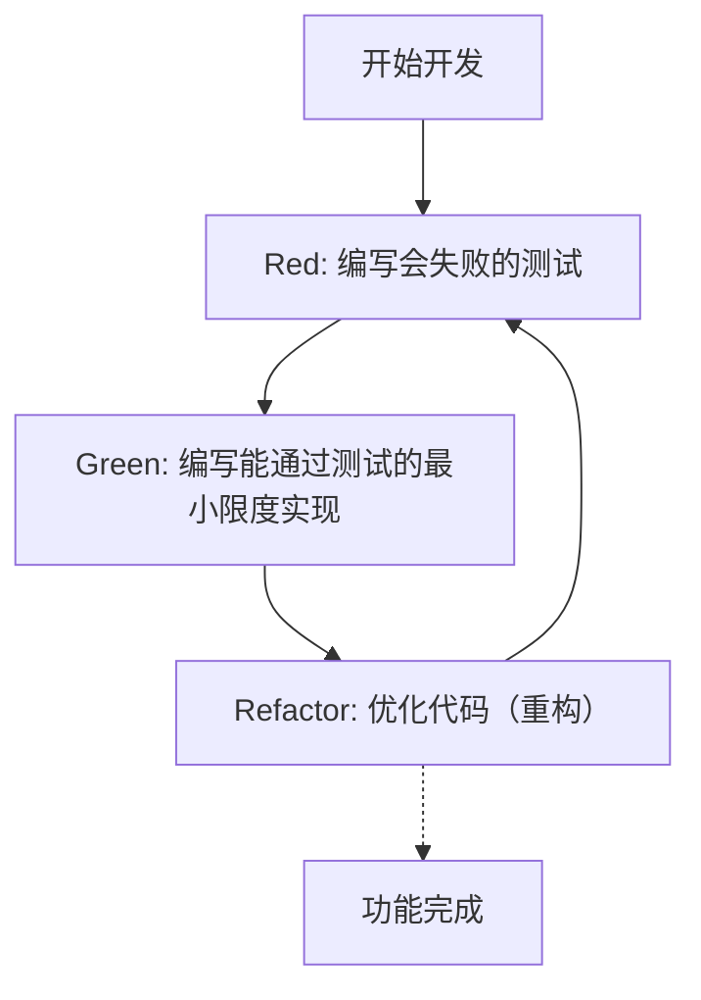
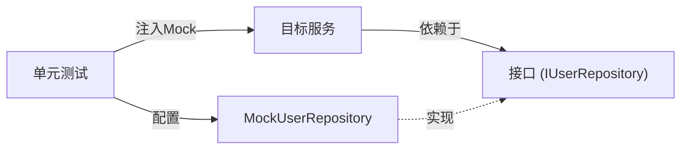

现代软件开发中，在保持代码质量的同时快速添加新功能是首要任务。特别是在C++这种复杂且对性能要求极高的语言中，内存管理错误或未定义行为（Undefined Behavior）很容易导致致命的Bug，因此测试的重要性比其他语言更高。

本文将极其详细且实用性强地讲解如何在C++项目中引入**测试驱动开发（Test-Driven Development: TDD）**的方法。我们将全面涵盖单元测试框架**GoogleTest**和Mock框架**GoogleMock**的使用方法，以及如何使用构建系统**CMake**进行现代化的配置，甚至包括代码覆盖率的测量方法。

## 1. 测试驱动开发（TDD）的哲学与优势

测试驱动开发（TDD）是一种“在编写实现之前先编写测试”的软件开发方法。这不仅仅是一种测试方法，更起到**设计方法**的作用。通过先编写测试，开发者会自然而然地关注“易用的接口”和“松耦合的设计”。

### 1.1 Red-Green-Refactor 循环

TDD的核心在于以下的“Red-Green-Refactor”循环。



1. **Red（红）**: 在没有实现的情况下，编写定义期望行为的测试。因为此时还没有实现代码，测试必定会失败（Red）。
2. **Green（绿）**: 编写仅为了让测试通过（Green）的最小限度代码。在这个阶段，代码的优雅性和性能并不是最优先考虑的。
3. **Refactor（重构）**: 在保持测试通过的状态下，消除重复代码并改善代码设计。因为有了测试的保障，我们可以安全地修改代码。

### 1.2 Bug发现延迟导致的成本增加

在软件工程中，众所周知，发现Bug的时间越靠后，修复它的成本就会呈指数级增加。这种成本增加模型可以用以下数学公式来近似表示：

$$ Cost(t) = C_0 \times e^{k \cdot t} $$

这里，$Cost(t)$ 是时间 $t$ 时的修复成本，$C_0$ 是Bug刚被引入时的修复成本（基线），$k$ 是常数。通过引入TDD，可以使 $t$ 保持在极小值，从而防范成本指数级的增加。

## 2. C++中的测试工具选择与现代CMake配置

C++中有许多测试框架，如Catch2、Boost.Test、doctest等，但作为行业标准被最广泛使用的是**GoogleTest（gtest）**。GoogleTest的魅力在于其丰富的断言、强大的Mock框架（GoogleMock）以及高度的可扩展性。

### 2.1 利用 CMake 的 `FetchContent` 引入 GoogleTest

在现代C++开发中，管理外部依赖项的主流方法是使用CMake的 `FetchContent` 模块。这样可以省去管理子模块或提前安装库的麻烦。

项目根目录下的 `CMakeLists.txt` 可以这样编写：

```cmake
cmake_minimum_required(VERSION 3.14)
project(TddCppExample CXX)

# 指定C++标准
set(CMAKE_CXX_STANDARD 17)
set(CMAKE_CXX_STANDARD_REQUIRED ON)

# 生产代码的库化
add_library(core_lib src/Calculator.cpp src/StringUtils.cpp)
target_include_directories(core_lib PUBLIC include)

# 启用测试
enable_testing()

# 获取GoogleTest
include(FetchContent)
FetchContent_Declare(
  googletest
  URL https://github.com/google/googletest/archive/refs/tags/v1.14.0.zip
)
# 避免Windows环境下的构建警告
set(gtest_force_shared_crt ON CACHE BOOL "" FORCE)
FetchContent_MakeAvailable(googletest)

# 设置测试可执行文件
add_executable(unit_tests 
    tests/CalculatorTest.cpp 
    tests/StringUtilsTest.cpp
)
target_link_libraries(unit_tests
    PRIVATE
    core_lib
    gtest_main
    gmock
)

# 注册到CTest
include(GoogleTest)
gtest_discover_tests(unit_tests)
```

通过此设置，CMake将自动下载GoogleTest的源代码并将其集成到项目中。

## 3. 实践：使用 GoogleTest 进行 Red-Green-Refactor 循环

接下来，我们以一个简单的 `Calculator` 类为题材，实践一下TDD的循环。

### 3.1 阶段 1: Red (编写会失败的测试)

首先，编写头文件 `include/Calculator.h` 的骨架，以及测试代码。

**include/Calculator.h (骨架)**
```cpp
#pragma once

class Calculator {
public:
    int Add(int a, int b);
};
```

**tests/CalculatorTest.cpp (测试代码)**
```cpp
#include <gtest/gtest.h>
#include "Calculator.h"

TEST(CalculatorTest, AddsTwoPositiveNumbers) {
    Calculator calc;
    int result = calc.Add(2, 3);
    EXPECT_EQ(result, 5);
}
```

此时如果尝试构建，会因为缺少 `Calculator::Add` 的实现而发生链接错误，或者测试运行后处于失败状态（Red）。

### 3.2 阶段 2: Green (最小限度实现)

编写仅仅为了让测试通过的代码。

**src/Calculator.cpp**
```cpp
#include "Calculator.h"

int Calculator::Add(int a, int b) {
    return a + b; // 为了让测试通过的最小限度实现
}
```

现在进行构建并运行测试，测试就会成功（Green）。

### 3.3 阶段 3: Refactor (重构)

在这个例子中代码非常简单，但随着需求的复杂化，在重构阶段我们需要提高代码的可读性，或者改善性能。测试代码本身也是重构的对象。例如，可以考虑引入测试夹具（`testing::Test`）来实现初始化的通用化。

## 4. `EXPECT_EQ` 与 `ASSERT_EQ` 的区别

使用GoogleTest时，存在两种断言宏：`EXPECT_*` 和 `ASSERT_*`。理解它们之间的区别对于编写健壮的测试非常重要。

- **`EXPECT_EQ(expected, actual)`**: 即使测试失败，也会**继续**执行当前的测试函数。适合在一个测试内验证多个状态的情况。
- **`ASSERT_EQ(expected, actual)`**: 如果测试失败，会立即**中断**当前测试函数的执行（致命失败）。适用于后续的验证已经失去意义的情况（例如：在确认指针不为 `nullptr` 之后立即对其进行解引用的情况）。

## 5. 依赖注入（DI）与使用 GoogleMock 进行 Mock 化

在实际的C++项目中，必然会产生对外部系统（如数据库访问、网络通信、硬件控制等）的依赖。如果将这些依赖关系原封不动地保留，单元测试将变得非常困难。

这时就需要用到**依赖注入（Dependency Injection: DI）**，以及使用**GoogleMock**对接口进行Mock化。



### 5.1 接口的定义与目标类的实现

首先，定义一个抽象了依赖组件的接口（带有纯虚函数的类）。

```cpp
// include/IUserRepository.h
#pragma once
#include <string>

class IUserRepository {
public:
    virtual ~IUserRepository() = default;
    virtual bool SaveUser(int id, const std::string& name) = 0;
};
```

接着，创建一个依赖于该接口的服务类（测试对象）。通过构造函数注入依赖项（Constructor Injection）。

```cpp
// include/UserService.h
#pragma once
#include "IUserRepository.h"
#include <string>

class UserService {
private:
    IUserRepository& repository_;
public:
    UserService(IUserRepository& repository) : repository_(repository) {}

    bool RegisterUser(int id, const std::string& name) {
        if (name.empty()) return false;
        return repository_.SaveUser(id, name);
    }
};
```

### 5.2 使用 GoogleMock 创建 Mock 类并进行测试

使用 GoogleMock 的 `MOCK_METHOD` 宏来对接口进行Mock化。

```cpp
// tests/UserServiceTest.cpp
#include <gtest/gtest.h>
#include <gmock/gmock.h>
#include "UserService.h"
#include "IUserRepository.h"

using ::testing::Return;
using ::testing::_;

// Mock类的定义
class MockUserRepository : public IUserRepository {
public:
    MOCK_METHOD(bool, SaveUser, (int id, const std::string& name), (override));
};

TEST(UserServiceTest, RegistersValidUserSuccessfully) {
    MockUserRepository mockRepo;
    UserService service(mockRepo);

    // 设置期望值：期望SaveUser被以(1, "Kenji")调用1次，并返回true
    EXPECT_CALL(mockRepo, SaveUser(1, "Kenji"))
        .Times(1)
        .WillOnce(Return(true));

    // 执行测试对象
    bool result = service.RegisterUser(1, "Kenji");

    // 断言
    EXPECT_TRUE(result);
}

TEST(UserServiceTest, RejectsEmptyNameWithoutCallingRepository) {
    MockUserRepository mockRepo;
    UserService service(mockRepo);

    // 名字为空时，期望SaveUser一次也不会被调用
    EXPECT_CALL(mockRepo, SaveUser(_, _))
        .Times(0);

    bool result = service.RegisterUser(1, "");

    EXPECT_FALSE(result);
}
```

像这样使用GoogleMock，就可以准确地验证“目标类是否正确地与依赖项进行了交互”。

## 6. 代码覆盖率的测量与可视化

编写完测试后，为了客观评估项目中有多少部分在测试中被执行了（被覆盖了），我们需要测量**代码覆盖率**。代码覆盖率（$Coverage$）可以用以下公式表示：

$$ Coverage = \left( \frac{L_{executed}}{L_{total}} \right) \times 100 \ (\%) $$

这里，$L_{executed}$ 是测试中执行的代码行数，$L_{total}$ 是整个项目的代码行数。

如果使用的是GCC或Clang，可以使用 `gcov` 和 `lcov` 工具来测量覆盖率。

### 6.1 向 CMake 添加覆盖率选项

要测量覆盖率，需要专门的编译器标志。在 `CMakeLists.txt` 中添加以下配置。

```cmake
# 覆盖率构建选项
option(ENABLE_COVERAGE "Enable coverage reporting" OFF)

if(ENABLE_COVERAGE AND CMAKE_CXX_COMPILER_ID MATCHES "GNU|Clang")
    message(STATUS "Coverage enabled")
    target_compile_options(core_lib PRIVATE --coverage -O0 -g)
    target_link_options(core_lib PRIVATE --coverage)
    target_compile_options(unit_tests PRIVATE --coverage -O0 -g)
    target_link_options(unit_tests PRIVATE --coverage)
endif()
```

### 6.2 覆盖率报告的生成步骤

在构建时启用标志，运行测试后，使用 `lcov` 输出HTML报告。

```bash
# 1. 启用覆盖率选项并进行构建
mkdir build && cd build
cmake .. -DENABLE_COVERAGE=ON
make

# 2. 运行测试
ctest

# 3. 收集覆盖率数据 (运行lcov)
lcov --capture --directory . --output-file coverage.info

# 4. 排除系统头文件或外部库（如GoogleTest等）
lcov --remove coverage.info '/usr/*' '*/_deps/*' '*/tests/*' --output-file coverage.info

# 5. 生成HTML报告
genhtml coverage.info --output-directory coverage_report
```

通过在浏览器中打开生成的 `coverage_report/index.html`，可以直观地看到以源代码行级别用绿色和红色高亮显示的执行情况，有助于发现测试遗漏（识别覆盖率盲点）。

## 7. C++项目中的 TDD 挑战与最佳实践

在C++项目中引入TDD时，存在一些特有的挑战。

### 7.1 构建时间（编译时间）的增加
由于C++大量使用模板并包含大规模头文件，编译时间往往较长。而TDD的“Red-Green-Refactor”循环需要快速进行，因此构建时间的延迟是致命的。
**对策**: 活用前向声明（Forward Declaration）和 Pimpl（Pointer to implementation）惯用法，将头文件的依赖关系降至最低。此外，引入如 Ccache 等构建缓存工具也非常有效。

### 7.2 在遗留代码中引入 TDD
想要在庞大的现有单体代码中事后应用TDD是极其困难的。
**对策**: 建议采用《修改代码的艺术 (Working Effectively with Legacy Code)》中的方法，不要一开始就全部重写，而是从添加新功能的部分或修复Bug的地方（童子军规则）逐步添加测试，一点一点地将代码库置于TDD的控制之下。

## 8. 作为软件设计的 TDD

TDD不仅是保持代码质量的安全网，也是提升C++代码设计的驱动力。由于编写测试强制要求实施依赖注入（DI），其结果是类之间的耦合度（Coupling）降低，内聚度（Cohesion）提高。

在重构时，意识到圈复杂度（McCabe's Cyclomatic Complexity）也很重要。

$$ M = E - N + 2P $$

（$M$: 复杂度, $E$: 边数, $N$: 节点数, $P$: 连通分量数）

因为有测试的存在，为了降低这种复杂度而进行函数拆分或替换为多态时，我们就可以毫无对破坏性变更的恐惧地去执行。

## 总结

本文详细讲解了如何在C++项目中使用GoogleTest和GoogleMock引入测试驱动开发（TDD）的方法。
1. 使用 **CMake FetchContent** 进行现代化的项目配置
2. 实践 **Red-Green-Refactor** 循环
3. 使用 **GoogleMock 和依赖注入 (DI)** 对接口进行Mock化
4. 使用 **gcov/lcov** 可视化测试覆盖率

虽然TDD是一项需要时间去掌握的方法，但在像C++这样同时需要性能和安全性的系统编程中，它的投资回报是不可估量的。请务必在你的下一个项目中逐步实践TDD，以获得稳健且易于维护的C++代码。
