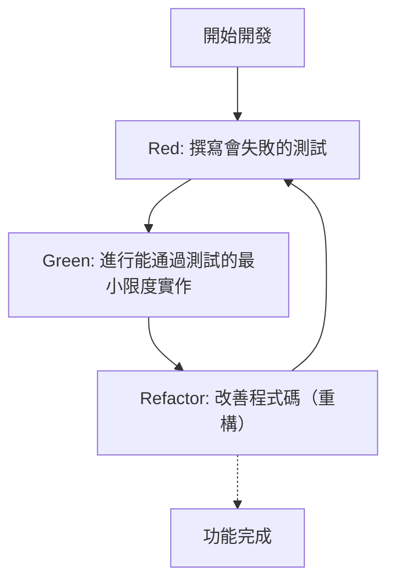
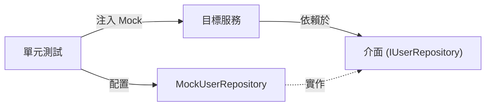

在現代的軟體開發中，在維持程式碼品質的同時迅速添加新功能，是至關重要的任務。特別是在 C++ 這種要求效能且複雜的語言中，記憶體管理的失誤或未定義行為（Undefined Behavior）很容易導致致命的錯誤（Bug），因此測試的重要性比其他語言來得更高。

本文將針對在 C++ 專案中導入**測試驅動開發（Test-Driven Development: TDD）**的方法，進行非常詳細且具實踐性的解說。內容將全面涵蓋單元測試框架 **GoogleTest** 及 Mock 框架 **GoogleMock** 的使用方法，還有如何使用建置系統 **CMake** 進行現代化的配置，以及程式碼覆蓋率（Code Coverage）的測量方法。

## 1. 測試驅動開發（TDD）的哲學與優勢

測試驅動開發（TDD）是一種「在撰寫實作前先寫測試」的軟體開發方法。這不僅僅是一種測試方法，它也發揮了**設計方法**的作用。透過先寫測試，開發者會自然而然地意識到「易於使用的介面」與「低耦合的設計」。

### 1.1 Red-Green-Refactor 循環

TDD 的核心是以下被稱為「Red-Green-Refactor」的循環。



1. **Red（紅）**: 在沒有實作的狀態下，撰寫定義期望行為的測試。因為此時尚未實作，測試必定會失敗（Red）。
2. **Green（綠）**: 撰寫僅為了讓測試成功（Green）的最小限度程式碼。在這個階段，程式碼的美觀或效能不是最優先的。
3. **Refactor（重構）**: 在維持測試通過的狀態下，消除重複，改善程式碼的設計。有了測試，就能安全地修改程式碼。

### 1.2 錯誤發現延遲所增加的成本

在軟體工程中，眾所周知，越是在開發流程的後期才發現錯誤，其修復成本就會呈現指數級增長。這種成本增加的模型，有時會用以下公式來近似。

$$ Cost(t) = C_0 \times e^{k \cdot t} $$

這裡的 $Cost(t)$ 是時間 $t$ 時的修復成本，$C_0$ 是錯誤剛被植入時的修復成本（基準線），$k$ 是常數。透過導入 TDD，可以將 $t$ 保持在極小值，防範成本呈指數級增長。

## 2. C++ 測試工具的選擇與現代化 CMake 配置

C++ 中存在著許多的測試框架，例如 Catch2、Boost.Test、doctest 等，但作為業界標準最廣泛被使用的是 **GoogleTest（gtest）**。GoogleTest 的魅力在於其豐富的斷言（Assertion）、強大的 Mock 框架（GoogleMock）以及高度的擴充性。

### 2.1 利用 CMake 的 `FetchContent` 導入 GoogleTest

在現代的 C++ 開發中，管理外部依賴關係的主流方式是使用 CMake 的 `FetchContent` 模組。這可以省去管理子模組（Submodule）或事先安裝函式庫的麻煩。

專案根目錄的 `CMakeLists.txt` 撰寫如下：

```cmake
cmake_minimum_required(VERSION 3.14)
project(TddCppExample CXX)

# 指定 C++ 標準
set(CMAKE_CXX_STANDARD 17)
set(CMAKE_CXX_STANDARD_REQUIRED ON)

# 產品程式碼函式庫化
add_library(core_lib src/Calculator.cpp src/StringUtils.cpp)
target_include_directories(core_lib PUBLIC include)

# 啟用測試
enable_testing()

# 取得 GoogleTest
include(FetchContent)
FetchContent_Declare(
  googletest
  URL https://github.com/google/googletest/archive/refs/tags/v1.14.0.zip
)
# 為避免 Windows 環境下的建置警告
set(gtest_force_shared_crt ON CACHE BOOL "" FORCE)
FetchContent_MakeAvailable(googletest)

# 設定測試執行檔
add_executable(unit_tests 
    tests/CalculatorTest.cpp 
    tests/StringUtilsTest.cpp
)
target_link_libraries(unit_tests
    PRIVATE
    core_lib
    gtest_main
    gmock
)

# 註冊至 CTest
include(GoogleTest)
gtest_discover_tests(unit_tests)
```

透過此設定，CMake 會自動下載 GoogleTest 的原始碼並整合進專案中。

## 3. 實踐：GoogleTest 的 Red-Green-Refactor 循環

接下來，我們以簡單的 `Calculator` 類別為題材，實際演練 TDD 的循環。

### 3.1 階段 1: Red (撰寫會失敗的測試)

首先，撰寫標頭檔 `include/Calculator.h` 的骨架（Skeleton），以及測試程式碼。

**include/Calculator.h (骨架)**
```cpp
#pragma once

class Calculator {
public:
    int Add(int a, int b);
};
```

**tests/CalculatorTest.cpp (測試程式碼)**
```cpp
#include <gtest/gtest.h>
#include "Calculator.h"

TEST(CalculatorTest, AddsTwoPositiveNumbers) {
    Calculator calc;
    int result = calc.Add(2, 3);
    EXPECT_EQ(result, 5);
}
```

在這個階段嘗試建置的話，會因為沒有 `Calculator::Add` 的實作而發生連結錯誤，或是執行測試後處於失敗的狀態（Red）。

### 3.2 階段 2: Green (最小限度的實作)

撰寫僅為了讓測試通過的程式碼。

**src/Calculator.cpp**
```cpp
#include "Calculator.h"

int Calculator::Add(int a, int b) {
    return a + b; // 為了通過測試的最小限度實作
}
```

建置並執行測試後，測試將會成功（Green）。

### 3.3 階段 3: Refactor (重構)

雖然在這個例子中程式碼非常簡單，但隨著需求變複雜，在重構階段會提升程式碼的易讀性，或是改善效能。測試程式碼本身也是重構的對象。例如，可以考慮導入測試治具（Test Fixture，`testing::Test`）來將設定（Setup）共用化。

## 4. `EXPECT_EQ` 與 `ASSERT_EQ` 的差異

在使用 GoogleTest 時，有 `EXPECT_*` 與 `ASSERT_*` 兩種斷言巨集（Macro）。理解它們的差異對於撰寫穩健的測試來說非常重要。

- **`EXPECT_EQ(expected, actual)`**: 即使測試失敗，也會**繼續**執行當前的測試函式。適合在單個測試中想要驗證多個狀態的情況。
- **`ASSERT_EQ(expected, actual)`**: 當測試失敗時，會當場**中斷（致命失敗）**當前測試函式的執行。使用在後續的驗證已經沒有意義的情況（例：確認指標不是 `nullptr` 之後立刻進行反參照（Dereference））。

## 5. 依賴注入（DI）與 GoogleMock 的 Mock 化

在實際的 C++ 專案中，必定會發生對外部系統的依賴，如資料庫存取、網路通訊、硬體控制等。如果將這些依賴關係放著不管，單元測試會變得非常困難。

這時就要用到**依賴注入（Dependency Injection: DI）**，以及使用 **GoogleMock** 進行介面的 Mock 化。



### 5.1 介面的定義與目標類別的實作

首先，定義將依賴的元件抽象化後的介面（帶有純虛擬函式的類別）。

```cpp
// include/IUserRepository.h
#pragma once
#include <string>

class IUserRepository {
public:
    virtual ~IUserRepository() = default;
    virtual bool SaveUser(int id, const std::string& name) = 0;
};
```

接著，建立依賴於此介面的服務類別（測試目標）。透過建構子注入（Constructor Injection）依賴性。

```cpp
// include/UserService.h
#pragma once
#include "IUserRepository.h"
#include <string>

class UserService {
private:
    IUserRepository& repository_;
public:
    UserService(IUserRepository& repository) : repository_(repository) {}

    bool RegisterUser(int id, const std::string& name) {
        if (name.empty()) return false;
        return repository_.SaveUser(id, name);
    }
};
```

### 5.2 使用 GoogleMock 建立 Mock 類別與測試

使用 GoogleMock 的 `MOCK_METHOD` 巨集將介面 Mock 化。

```cpp
// tests/UserServiceTest.cpp
#include <gtest/gtest.h>
#include <gmock/gmock.h>
#include "UserService.h"
#include "IUserRepository.h"

using ::testing::Return;
using ::testing::_;

// 建立 Mock 類別
class MockUserRepository : public IUserRepository {
public:
    MOCK_METHOD(bool, SaveUser, (int id, const std::string& name), (override));
};

TEST(UserServiceTest, RegistersValidUserSuccessfully) {
    MockUserRepository mockRepo;
    UserService service(mockRepo);

    // 設定期望值：期待 SaveUser 被以 (1, "Kenji") 呼叫 1 次，並回傳 true
    EXPECT_CALL(mockRepo, SaveUser(1, "Kenji"))
        .Times(1)
        .WillOnce(Return(true));

    // 執行測試目標
    bool result = service.RegisterUser(1, "Kenji");

    // 斷言
    EXPECT_TRUE(result);
}

TEST(UserServiceTest, RejectsEmptyNameWithoutCallingRepository) {
    MockUserRepository mockRepo;
    UserService service(mockRepo);

    // 名字為空時，期待 SaveUser 一次也不會被呼叫
    EXPECT_CALL(mockRepo, SaveUser(_, _))
        .Times(0);

    bool result = service.RegisterUser(1, "");

    EXPECT_FALSE(result);
}
```

如此一來，透過使用 GoogleMock，就能夠準確地驗證「目標類別是否與依賴對象正確地互動」。

## 6. 程式碼覆蓋率的測量與視覺化

在寫完測試後，為了客觀評估專案中哪部分被測試執行過（被覆蓋），我們需要測量**程式碼覆蓋率（Code Coverage）**。程式碼覆蓋率（$Coverage$）以下列公式表示：

$$ Coverage = \left( \frac{L_{executed}}{L_{total}} \right) \times 100 \ (\%) $$

這裡的 $L_{executed}$ 是測試中執行的程式碼行數，$L_{total}$ 是專案整體的程式碼行數。

如果是使用 GCC 或 Clang，可以使用 `gcov` 與 `lcov` 工具來測量覆蓋率。

### 6.1 在 CMake 中加入覆蓋率選項

為了測量覆蓋率，需要專用的編譯器旗標。在 `CMakeLists.txt` 中加入以下設定。

```cmake
# 覆蓋率建置選項
option(ENABLE_COVERAGE "Enable coverage reporting" OFF)

if(ENABLE_COVERAGE AND CMAKE_CXX_COMPILER_ID MATCHES "GNU|Clang")
    message(STATUS "Coverage enabled")
    target_compile_options(core_lib PRIVATE --coverage -O0 -g)
    target_link_options(core_lib PRIVATE --coverage)
    target_compile_options(unit_tests PRIVATE --coverage -O0 -g)
    target_link_options(unit_tests PRIVATE --coverage)
endif()
```

### 6.2 覆蓋率報告的產生步驟

在建置時啟用旗標，並在執行測試後使用 `lcov` 輸出 HTML 報告。

```bash
# 1. 啟用覆蓋率選項並建置
mkdir build && cd build
cmake .. -DENABLE_COVERAGE=ON
make

# 2. 執行測試
ctest

# 3. 收集覆蓋率資料 (執行 lcov)
lcov --capture --directory . --output-file coverage.info

# 4. 排除系統標頭檔與外部函式庫（如 GoogleTest）
lcov --remove coverage.info '/usr/*' '*/_deps/*' '*/tests/*' --output-file coverage.info

# 5. 產生 HTML 報告
genhtml coverage.info --output-directory coverage_report
```

使用瀏覽器打開產生的 `coverage_report/index.html`，可以透過綠色與紅色視覺化地以原始碼為單位顯示哪一行被執行過，有助於找出測試遺漏的部分（尋找 Coverage Hole）。

## 7. C++ 專案中 TDD 的課題與最佳實踐

在 C++ 專案導入 TDD 時，存在著特有的課題。

### 7.1 建置時間（編譯時間）的增加
由於 C++ 大量使用樣板（Template）以及大型標頭檔的引入（Include），編譯時間往往會變長。TDD 的「Red-Green-Refactor」循環必須快速進行，因此建置時間的延遲是致命的。
**對策**: 善用前置宣告（Forward Declaration）與 Pimpl（Pointer to implementation）慣用語，將標頭檔的依賴關係降到最低。此外，導入如 Ccache 等建置快取工具也非常有效。

### 7.2 在遺留程式碼（Legacy Code）中導入 TDD
要在現有龐大的單體式（Monolithic）程式碼中事後應用 TDD 是非常困難的。
**對策**: 建議不要一開始就重寫全部，而是從新增功能的部分或是修復錯誤的地方（童子軍規則）階段性地加入測試，一步步將程式碼庫納入 TDD 的控制之下（即《Working Effectively with Legacy Code》書中的手法）。

## 8. 作為軟體設計的 TDD

TDD 是維持程式碼品質的安全網，同時也是提升 C++ 程式碼設計的驅動力。為了撰寫測試而強制進行的依賴注入（DI），其結果會降低類別間的耦合度（Coupling），並提高內聚度（Cohesion）。

在重構時，意識到循環複雜度（McCabe's Cyclomatic Complexity）也是很重要的。

$$ M = E - N + 2P $$

（$M$: 複雜度, $E$: 邊數, $N$: 節點數, $P$: 連通元件數）

因為有了測試，就可以在不畏懼破壞性變更的情況下，執行降低複雜度的函式分割或替換成多型（Polymorphism）。

## 總結

本文詳細解說了如何在 C++ 專案中使用 GoogleTest 與 GoogleMock 導入測試驅動開發（TDD）的方法。
1. 使用 **CMake FetchContent** 的現代化專案配置
2. 實踐 **Red-Green-Refactor** 循環
3. 使用 **GoogleMock 與 依賴注入 (DI)** 進行介面 Mock 化
4. 透過 **gcov/lcov** 將測試覆蓋率視覺化

雖然 TDD 是需要時間學習的方法，但在像是 C++ 這種要求兼顧效能與安全性的系統程式設計中，其投資報酬率是無可估量的。請務必在下一個專案中慢慢實踐 TDD，獲得堅固且易於維護的 C++ 程式碼。
