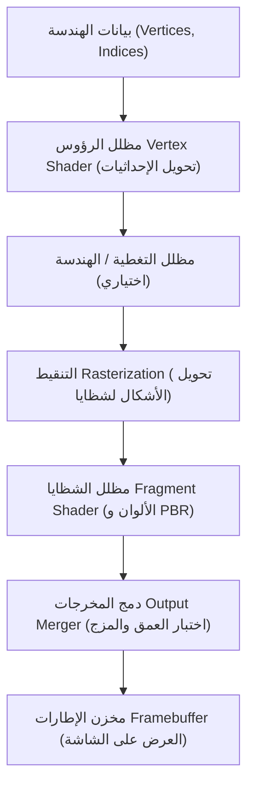

# تقنيات الألعاب: تطور محركات الرسوميات ثلاثية الأبعاد (Unreal Engine و Unity)

في مجالات الترفيه الرقمي الحديث، ولا سيما ألعاب الفيديو والإنتاج السينمائي الافتراضي، يمثل تطور محركات الرسوميات ثلاثية الأبعاد (3D Graphics Engines) إحدى أعظم القفزات التقنية في تاريخ علوم الحاسوب. فما بدأ في تسعينيات القرن الماضي بمضلعات خشنة وتظليل مسطح، تطور اليوم إلى أنظمة معالجة فائقة تعمل في الوقت الفعلي وتنتج عوالم افتراضية تكاد لا تختلف عن الواقع الفيزيائي.

يقدم هذا المقال دراسة تقنية شاملة لتاريخ ومكونات محركات الألعاب ثلاثية الأبعاد: من خط أنابيب التصيير (Rendering Pipeline) والتصيير القائم على الفيزياء (PBR)، مروراً بابتكارات محرك Unreal Engine 5 الرائدة (Nanite و Lumen)، والأنظمة المعمارية لمحرك Unity (مثل URP و HDRP و DOTS)، وصولاً إلى تتبع الأشعة المسرع عتادياً وتكامل الذكاء الاصطناعي في ترقية الدقة.

## 1. خط أنابيب التصيير ثلاثي الأبعاد: التطور والتحولات المعمارية

لفهم محركات الرسوميات، لا بد من الإلمام بمفهوم **خط أنابيب التصيير (Rendering Pipeline)**. اعتمدت معالجات الرسوميات (GPU) في البداية على **خط الأنابيب ثابت الوظائف (Fixed-Function Pipeline)**، حيث كانت خوارزميات الإضاءة وتحويل الإحداثيات مدمجة في الدوائر الإلكترونية، مما حد كثيراً من حرية المطورين الفنية.

وفي مطلع الألفية الجديدة، أحدثت **المظللات القابلة للبرمجة (Programmable Shaders)** ثورة جذرية. وأصبح بإمكان المبرمجين التحكم المباشر في معالج الرسوميات عبر مراحل متخصصة:
- **مظلل الرؤوس (Vertex Shader)**: يتولى حساب تحويل الإحداثيات ثلاثية الأبعاد وتشكيل الهياكل العظمية وحركة الشخصيات.
- **مظلل الشظايا / البكسل (Fragment Shader)**: يحدد لون كل بكسل على الشاشة، ويحسب خامات المواد وتأثيرات الإضاءة.

وفي الوقت الحاضر، يتجه خط الأنابيب نحو معالجات الحوسبة العامة عبر **مظللات الشبكات (Mesh Shaders)** ومظللات الحوسبة (Compute Shaders)، مما يتيح التعامل مع البيانات الهندسية الضخمة بمرونة فائقة.

## 2. التصيير القائم على الفيزياء (PBR): ثورة محاكاة المواد

كانت النقلة الفاصلة في الواقعية البصرية هي الاعتماد الشامل لتقنية **التصيير القائم على الفيزياء (Physically Based Rendering: PBR)** في العقد الثاني من القرن الحادي والعشرين. قبل PBR، كانت الألعاب تعتمد على نماذج تجريبية تقريبية مثل نموذج فونغ (Phong)، مما كان يتطلب رسم خرائط لمعان يدوية تبدو مصطنعة بمجرد تغير الإضاءة المحيطة.

يحاكي PBR بدقة السلوك الفيزيائي للموجات الضوئية مستنداً إلى **معادلة التصيير (Rendering Equation)** الشهيرة التي صاغها جيمس كاجيا:

$$ L_o(x, \omega_o) = L_e(x, \omega_o) + \int_{\Omega} f_r(x, \omega_i, \omega_o) L_i(x, \omega_i) (\omega_i \cdot n) d \omega_i $$

حيث:
- $L_o(x, \omega_o)$ هو الإشعاع الطيفي المنبعث من النقطة $x$ في الاتجاه $\omega_o$ نحو الكاميرا.
- $L_e(x, \omega_o)$ هو الإشعاع الذاتي المنبعث من المادة إذا كانت مضيئة.
- $\int_{\Omega}$ يمثل التكامل على نصف الكرة لجميع اتجاهات الضوء الساقط $\omega_i$.
- $f_r(x, \omega_i, \omega_o)$ هي دالة توزيع الانعكاس ثنائي الاتجاه (BRDF) التي تصف تشتت الضوء على الأسطح الدقيقة.
- $L_i(x, \omega_i)$ هو الضوء الساقط على النقطة $x$ من الاتجاه $\omega_i$.
- $(\omega_i \cdot n)$ هو معامل التوهين الهندسي وفق قانون جيب التمام للامبرت.

وتقوم محركات مثل Unreal Engine و Unity بحساب حلول تقريبية لهذه المعادلة في أجزاء من الثانية بالاعتماد على نموذج Cook-Torrance وتوزيع GGX. ولا يحتاج الفنان الرقمي سوى ضبط ثلاثة معايير فيزيائية بديهية:
- **اللون الأساسي (Albedo)**: اللون الصافي للخامة دون أي ظلال مطبوعة.
- **الخشونة (Roughness)**: مدى نعومة أو خشونة السطح، والتي تحدد درجة وضوح أو ضبابية الانعكاسات.
- **المعدنية (Metallic)**: تميز بين السلوك البصري للمواد العازلة والمواد المعدنية الموصلة.

## 3. ابتكارات Unreal Engine 5: تقنيتا Nanite و Lumen

يُعد محرك **Unreal Engine (UE)** من شركة Epic Games رائداً في رسوميات الألعاب الفائقة. ومع إطلاق Unreal Engine 5، قدم المحرك ابتكارين غيرا قواعد تطوير الألعاب:

### تقنية Nanite: هندسة المضلعات الدقيقة الافتراضية
في الماضي، كان المطورون يضطرون لقضاء شهور في إنشاء مستويات تفاصيل متعددة (LOD) يدوياً وضغط التفاصيل في خرائط نتوءات لتفادي انهيار الأداء.

ألغت تقنية Nanite الحاجة لإنشاء مستويات LOD يدوياً، حيث تسمح باستيراد نماذج سينمائية تتكون من مئات الملايين من المضلعات مباشرة داخل المحرك. وتقوم التقنية بتقسيم المجسم إلى مجموعات عنقودية من 128 مثلثاً، ولا تقوم بتصيير سوى المضلعات الدقيقة التي تتطابق مع دقة بكسلات الشاشة في الوقت الفعلي.

### تقنية Lumen: الإضاءة الشاملة والانعكاسات الديناميكية
حلت تقنية Lumen محل الإجراء التقليدي الطويل لخبز خرائط الإضاءة الثابتة (Lightmaps)، مقدمة نظام **إضاءة شاملة (Global Illumination)** ديناميكياً بالكامل. عندما تسقط أشعة الشمس داخل مدخل كهف مظلم، تحسب Lumen ارتدادات الضوء غير المباشرة في أجزاء من الثانية لتنير أعماق الكهف بنعومة طبيعية. وإذا دمر اللاعب جداراً أو تغير وقت اليوم، تتكيف الإضاءة فورياً بالاعتماد على حقول المسافات (SDF) وتتبع الأشعة العتادي.

## 4. تطور محرك Unity: المرونة البرمجية وحزمة DOTS

يحظى محرك **Unity** من شركة Unity Technologies بشعبية طاغية تغطي أكثر من نصف الإنتاجات التفاعلية في العالم، بفضل دعمه المتميز لمختلف المنصات من الهواتف المحمولة إلى نظارات الواقع الافتراضي والحواسيب المتقدمة.

### خطوط الأنابيب البرمجية: URP و HDRP
لتلبية تباين قدرات الأجهزة، طورت Unity خطوط تصيير قابلة للبرمجة (Scriptable Render Pipelines):
- **URP (Universal Render Pipeline)**: مصمم لتحقيق أعلى كفاءة في استهلاك الطاقة والأداء للأجهزة المحمولة ومنصة نينتندو سويتش ونظارات VR المستقلة.
- **HDRP (High Definition Render Pipeline)**: مصمم للحواسيب القوية ومنصات الألعاب الحديثة، للاستفادة الكاملة من الحوسبة المتقدمة والإضاءة الفيزيائية الشبيهة بأفلام هوليوود.

### تقنية DOTS: حزمة التكنولوجيا الموجهة بالبيانات
التحول الأبرز في Unity هو الانتقال من البرمجة كائنية التوجه (OOP) إلى التصميم الموجه بالبيانات (DOD) عبر **DOTS**. وباستخدام C# Job System ومترجم Burst ونظام المكونات الكيانية (ECS)، تستغل تقنية DOTS ذاكرة التخزين المؤقت للمعالج (CPU Cache) بأعلى كفاءة ممكنة، مما يتيح محاكاة مئات الآلاف من العناصر المستقلة (مثل الحشود الضخمة والمعارك الفضائية) بمعدل 60 إطاراً في الثانية دون أي تباطؤ.

## 5. تتبع الأشعة العتادي وترقية الدقة بالذكاء الاصطناعي

أصبحت الرسوميات الحديثة مرتبطة ارتباطاً وثيقاً بوحدات المعالجة العتادية المتخصصة وخوارزميات الذكاء الاصطناعي.

ومع توفر أنوية تتبع الأشعة (RT Cores) في بطاقات NVIDIA RTX و AMD RDNA، انتقلت تقنية **تتبع المسار (Path Tracing)** من مزارع التصيير السينمائية إلى حواسيب اللاعبين المنزلية. وتحسب المحركات الظلال الناعمة والانعكاسات الحقيقية عبر إطلاق أشعة الضوء ومقاطعتها مباشرة مع الهياكل الهندسية (BVH).

ولمعالجة العبء الحسابي الضخم لتتبع الأشعة، تدمج المحركات تقنيات رفع الدقة باستخدام الشبكات العصبية العميقة:
- **NVIDIA DLSS (الاستعيان الفائق بالتعلم العميق)**
- **AMD FSR (الدقة الفائقة FidelityFX)**
- **Intel XeSS**

من خلال تصيير المشهد بدقة أقل ثم إعادة بنائه بذكاء إلى دقة 4K فائقة الوضوح باستخدام متجهات الحركة والذكاء الاصطناعي، تتضاعف سرعة الإطارات مع الحفاظ التام على جودة الصورة.

## 6. ما وراء الألعاب: التوسع في الصناعات المتقدمة

تجاوزت محركات الرسوميات ثلاثية الأبعاد أسوار صناعة ألعاب الفيديو، وباتت قدرتها على المحاكاة الفيزيائية في الوقت الفعلي تقود ثورة في مجالات متعددة:

- **الإنتاج السينمائي الافتراضي (Virtual Production)**: في إنتاج أعمال هوليوودية مثل *The Mandalorian*، يقف الممثلون أمام شاشات LED عملاقة يعرض عليها محرك Unreal Engine بيئات ثلاثية الأبعاد تتفاعل فورياً مع حركة الكاميرا.
- **الهندسة المعمارية والسيارات**: يبني المهندسون نسخاً رقمية مطابقة (Digital Twins) لاختبار ديناميكا الهواء في أنفاق الرياح الافتراضية ومحاكاة دراسات الإضاءة الطبيعية قبل البدء في تصنيع النماذج الأولية.
- **تدريب مركبات القيادة الذاتية**: تُبنى بيئات مدن ثلاثية الأبعاد لمحاكاة الظروف المناخية القاسية والحوادث الطارئة لتدريب الذكاء الاصطناعي للمركبات ذاتية القيادة عبر ملايين الكيلومترات الافتراضية بأمان تام.

## الخاتمة: تحرير الطاقات الإبداعية

لطالما كان تاريخ محركات الرسوميات صراعاً مستمراً ضد القيود العتادية، حيث كان المطور يقضي وقتاً طويلاً في ضغط المجسمات وتزييف الظلال والإضاءة.

لكن التقنيات المعاصرة مثل Nanite و Lumen و DOTS حررت المبدعين من تلك القيود. واليوم، يستطيع المطور التركيز كلياً على سرد القصص الممتعة وتصميم أساليب لعب استثنائية. ومع التنافس المحموم بين Unreal Engine و Unity، تستمر الحدود الفاصلة بين الواقع الفيزيائي والعالم الرقمي في التلاشي يوماً بعد يوم.
