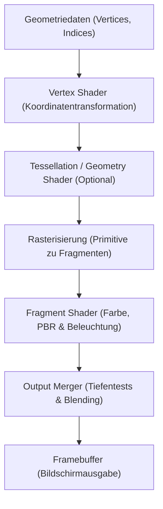

# Gaming-Technologie: Die Evolution der 3D-Grafik-Engines (Unreal Engine & Unity)

In der modernen digitalen Unterhaltung – insbesondere bei Videospielen und virtuellen Filmproduktionen – gehört die Entwicklung von 3D-Grafik-Engines zu den spektakulärsten Fortschritten der Informatik. Was in den 1990er Jahren mit groben Polygonen und flachen Schattierungen begann, hat sich zu Echtzeit-Renderingsystemen entwickelt, die virtuelle Welten erzeugen, die von der physischen Realität kaum mehr zu unterscheiden sind.

Dieser Artikel analysiert die Geschichte und die technische Architektur moderner 3D-Engines: von der Rendering-Pipeline und dem physikbasierten Rendern (PBR) über die Meilensteine der Unreal Engine 5 (Nanite, Lumen) und die modularen Systeme von Unity (URP, HDRP, DOTS) bis hin zum Hardware-Raytracing und dem Einsatz künstlicher Intelligenz.

## 1. Die 3D-Rendering-Pipeline: Evolution und Paradigmenwechsel

Um 3D-Engines zu verstehen, muss man die **Rendering-Pipeline** betrachten. Frühe Grafikprozessoren (GPUs) basierten auf einer **festverdrahteten Pipeline (Fixed-Function Pipeline)**, bei der Koordinatentransformationen und Beleuchtungsmodelle fest in der Hardware verankert waren. Entwickler hatten kaum Möglichkeiten, eigene visuelle Stile zu programmieren.

Anfang der 2000er Jahre leitete die Einführung **programmierbarer Shader** eine Revolution ein. Entwickler erhielten direkten Zugriff auf die Grafikhardware durch spezialisierte Shader-Stufen:
- **Vertex Shader**: Berechnet 3D-Koordinaten, Knochenanimationen (Skinning) und Vertex-Transformationen.
- **Fragment Shader / Pixel Shader**: Berechnet auf Pixelebene Texturen, Beleuchtung und Farbmischung.

Heutige Pipelines entwickeln sich mit **Mesh Shadern** und Compute Shadern weiter zu hochflexiblen, berechnungsgesteuerten Architekturen, die enorme Geometrie-Mengen parallel verarbeiten können.

## 2. Physically Based Rendering (PBR): Die Material-Revolution

Der entscheidende Durchbruch für zeitgemäßen Fotorealismus war die Standardisierung des **Physically Based Rendering (PBR)** in den 2010er Jahren. Zuvor verwendeten Spiele empirische Beleuchtungsmodelle (wie Phong oder Blinn-Phong), bei denen Grafiker Glanzkarten manuell zeichnen mussten, die bei wechselndem Licht unnatürlich wirkten.

PBR simuliert das physikalische Verhalten von Lichtwellen auf Basis der berühmten **Rendering-Gleichung** von James Kajiya:

$$ L_o(x, \omega_o) = L_e(x, \omega_o) + \int_{\Omega} f_r(x, \omega_i, \omega_o) L_i(x, \omega_i) (\omega_i \cdot n) d \omega_i $$

Wobei:
- $L_o(x, \omega_o)$ die vom Punkt $x$ in Richtung $\omega_o$ abgestrahlte Leuchtdichte darstellt (Kamerastrahl).
- $L_e(x, \omega_o)$ die Eigenemission von Lichtquellen bezeichnet.
- $\int_{\Omega}$ das Halbkugel-Integral über alle einfallenden Lichtrichtungen $\omega_i$ ist.
- $f_r(x, \omega_i, \omega_o)$ die BRDF (Bidirektionale Reflektanzverteilungsfunktion) ist, welche die mikroskopische Lichtstreuung beschreibt.
- $L_i(x, \omega_i)$ das aus Richtung $\omega_i$ einfallende Licht darstellt.
- $(\omega_i \cdot n)$ der geometrische Abschwächungsfaktor nach dem Lambertschen Kosinusgesetz ist.

Engines wie Unreal Engine und Unity berechnen Näherungen dieser Gleichung in Millisekunden über das Cook-Torrance-Mikrofacettenmodell mit GGX-Verteilung. Grafiker müssen lediglich drei physikalische Parameter festlegen:
- **Albedo (Basisfarbe)**: Die reine Eigenfarbe ohne einkalkulierte Schatten.
- **Rauheit (Roughness)**: Die mikroskopische Oberflächenstruktur, welche die Schärfe von Reflexionen steuert.
- **Metallizität (Metallic)**: Unterscheidet die optischen Eigenschaften elektrischer Nichtleiter (Dielektrika) von leitenden Metallen.

## 3. Die Innovationen der Unreal Engine 5: Nanite und Lumen

Die von Epic Games entwickelte **Unreal Engine (UE)** gilt seit jeher als Maßstab für High-End-Grafik. Die Unreal Engine 5 führte zwei bahnbrechende Technologien ein, die jahrzehntealte Kompromisse in der Spieleentwicklung beendeten:

### Nanite: Virtualisierte Mikropolygon-Geometrie
Bislang mussten Entwickler zeitaufwendig mehrere Detailstufen (LOD, Level of Detail) von Hand erstellen und feine Details auf Normal-Maps reduzieren, um Speicher und Bildraten zu schonen.

Nanite macht manuelle LODs überflüssig. Es erlaubt den direkten Import von 3D-Modellen mit Millionen oder Milliarden Polygonen in Kinoqualität. Nanite unterteilt die Geometrie hierarchisch in Cluster von je 128 Dreiecken und streamt nur diejenigen Mikropolygone in den Grafikspeicher, die der Bildschirmauflösung entsprechen. Grafiker müssen sich nicht länger um Polygon-Limits sorgen.

### Lumen: Vollständig dynamische Global Illumination
Lumen ersetzt das herkömmliche Vorberechnen (Baken) statischer Lightmaps durch ein vollständig dynamisches **Global-Illumination-System (GI)**. Wenn Sonnenlicht durch den Eingang einer Höhle fällt, berechnet Lumen in Echtzeit mehrfache indirekte Lichtstreuungen, die das Höhleninnere erhellen. Wird eine Wand zerstört oder ändert sich der Sonnenstand, passt sich das Licht sofort an – basierend auf Screen-Space-Tracing, Distanzfeldern (SDF) und Hardware-Raytracing.

## 4. Die Evolution von Unity: Skalierbarkeit und DOTS

Die von Unity Technologies entwickelte **Unity-Engine** treibt über die Hälfte aller weltweiten interaktiven Produktionen an – geschätzt für ihre unvergleichliche Cross-Platform-Fähigkeit vom Smartphone über VR-Headsets bis hin zu High-End-PCs.

### Modulare Pipelines: URP und HDRP
Um den extrem unterschiedlichen Hardware-Anforderungen gerecht zu werden, führte Unity die Scriptable Render Pipelines (SRP) ein:
- **URP (Universal Render Pipeline)**: Perfektioniert für Energieeffizienz und hohe Bildraten auf Smartphones, Nintendo Switch und Standalone-VR-Geräten.
- **HDRP (High Definition Render Pipeline)**: Entwickelt für moderne PCs und Next-Gen-Konsolen; nutzt Compute Shader und physikalische Beleuchtung für fotorealistische Darstellungen auf Kino-Niveau.

### DOTS: Der datenorientierte Technologie-Stack
Eine weitere fundamentale Neuerung ist der Wechsel von der klassischen objektorientierten Programmierung (OOP) zum datenorientierten Design mit **DOTS**. Mithilfe des C# Job Systems, des Burst-Compilers und des Entity Component Systems (ECS) wird der CPU-Cache optimal ausgenutzt. Dadurch lassen sich Hunderttausende eigenständige Einheiten (riesige Menschenmassen, Weltraumschlachten) stabil mit 60 FPS simulieren und darstellen.

## 5. Hardware-Raytracing und Deep-Learning-Upscaling

Die moderne Grafikgeneration basiert auf der engen Symbiose von dedizierter Hardwarebeschleunigung und künstlicher Intelligenz.

Durch spezielle RT-Cores in NVIDIA-RTX- und AMD-RDNA-Grafikkarten hat das physikalisch exakte **Path Tracing (Pfadverfolgung)** Einzug in Spiele gehalten. Die Engines berechnen Umgebungsverdeckung, weiche Kontaktschatten und Reflexionen, indem Lichtstrahlen direkt gegen Beschleunigungsstrukturen (BVH) getestet werden.

Um den extremen Rechenaufwand des Raytracings zu bewältigen, integrieren moderne Engines neuronale Upscaling-Technologien:
- **NVIDIA DLSS (Deep Learning Super Sampling)**
- **AMD FSR (FidelityFX Super Resolution)**
- **Intel XeSS**

Indem das Bild in niedrigerer Auflösung berechnet und anschließend mithilfe von KI-Netzwerken und Bewegungsvektoren verlustfrei auf 4K hochskaliert wird, verdoppeln sich die Bildraten bei gleichbleibender Bildschärfe.

## 6. Jenseits von Videospielen: Industrielle Transformation

3D-Engines beschränken sich längst nicht mehr auf die Gaming-Branche. Ihre Fähigkeit zur physikalisch genauen Echtzeitsimulation verändert viele Industrien:

- **Virtuelle Filmproduktion**: Bei Produktionen wie *The Mandalorian* werden reale Schauspieler vor riesigen LED-Wänden gefilmt, auf denen die Unreal Engine Hintergründe synchron zur Kamerabewegung in Echtzeit anzeigt.
- **Architektur und Automobilindustrie**: Architekten und Autobauer nutzen Unity und Unreal Engine, um millimetergenaue digitale Zwillinge (Digital Twins) zu erstellen und Strömungssimulationen im virtuellen Windkanal durchzuführen, noch bevor physische Prototypen existieren.
- **Autonomes Fahren**: In detailgetreu simulierten virtuellen Großstädten mit variierendem Wetter trainieren KI-Systeme das autonome Fahren über Millionen unfallfreie Testkilometer.

## Fazit: Die Befreiung der kreativen Vision

Die Geschichte der 3D-Engines war über Jahrzehnte ein permanenter Kampf gegen Hardwarebeschränkungen. Entwickler mussten viel Zeit damit verbringen, Polygone zu reduzieren, Texturen zu komprimieren und Licht vorzuberechnen.

Mit Technologien wie Nanite, Lumen und DOTS sind diese Hürden gefallen. Entwickler können sich voll und ganz auf fesselndes Gameplay, innovative Mechaniken und emotionale Geschichten konzentrieren. Angetrieben vom Wettbewerb zwischen Unreal Engine und Unity verschwimmt die Grenze zwischen physischer und virtueller Realität rasanter als je zuvor.
