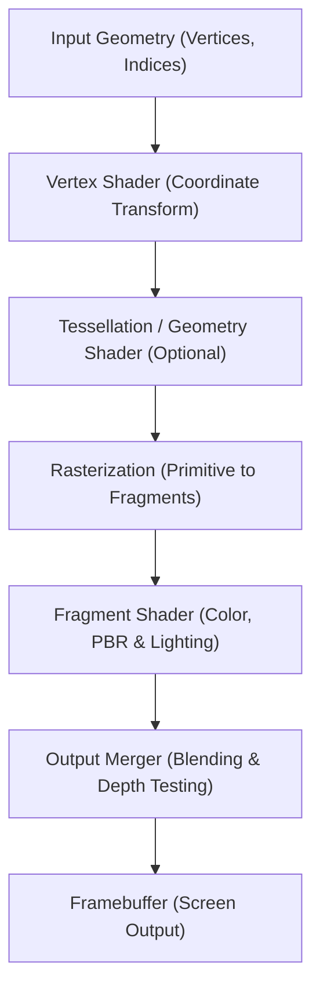

# Game Technology: The Evolution of 3D Graphics Engines (Unreal Engine & Unity)

In modern digital entertainment—particularly video games and cinematic virtual production—the evolution of 3D graphics engines represents one of the most remarkable technical leaps in computer science. What began in the 1990s as flat-shaded, low-polygon blocky shapes has evolved into real-time rendering systems capable of generating virtual worlds virtually indistinguishable from physical reality.

This article explores the comprehensive history and technical architecture of 3D graphics engines: from rendering pipelines and Physically Based Rendering (PBR) to the architectural innovations of Unreal Engine 5 (Nanite, Lumen), Unity's scalable systems (URP, HDRP, DOTS), real-time hardware ray tracing, and the convergence of AI with graphics.

## 1. The Rendering Pipeline: Architecture and Paradigm Shifts

Understanding real-time graphics engines requires grasping the concept of the **graphics rendering pipeline**. Early graphics processing units (GPUs) operated under a rigid **fixed-function pipeline**, where hardware logic for transformation and lighting was hardwired, offering developers very limited aesthetic freedom.

The paradigm shifted fundamentally in the early 2000s with the introduction of **programmable shaders**. Developers gained direct control over GPU hardware through specialized shading stages:
- **Vertex Shader**: Computes 3D coordinates, skinning, and vertex animations.
- **Fragment Shader (Pixel Shader)**: Computes surface texturing, light interactions, and final pixel colors.

Today, pipelines are evolving even further toward compute-driven architectures, utilizing **Mesh Shaders** and general-purpose GPU compute shaders.

## 2. Physically Based Rendering (PBR): The Material Revolution

The defining turning point in modern visual fidelity was the industry-wide standardization of **Physically Based Rendering (PBR)** during the 2010s. Prior to PBR, game artists used heuristic shading models (such as Phong or Blinn-Phong), which required hand-tweaked specular maps that broke down under dynamic lighting conditions.

PBR simulates the physical behavior of electromagnetic light waves interacting with physical surfaces, grounded in the fundamental **Rendering Equation** formulated by James Kajiya:

$$ L_o(x, \omega_o) = L_e(x, \omega_o) + \int_{\Omega} f_r(x, \omega_i, \omega_o) L_i(x, \omega_i) (\omega_i \cdot n) d \omega_i $$

Where:
- $L_o(x, \omega_o)$ is the outgoing spectral radiance from surface point $x$ along direction $\omega_o$.
- $L_e(x, \omega_o)$ is the self-emitted radiance from light-emitting materials.
- $\int_{\Omega}$ represents the hemispherical integral over all incoming incident light directions $\omega_i$.
- $f_r(x, \omega_i, \omega_o)$ is the Bidirectional Reflectance Distribution Function (BRDF), defining microfacet light scattering.
- $L_i(x, \omega_i)$ is the incoming radiance arriving at point $x$.
- $(\omega_i \cdot n)$ represents Lambert's cosine law, accounting for surface tilt relative to the light vector.

Engines like Unreal Engine and Unity solve approximations of this integral in real time using microfacet theory (typically the Cook-Torrance BRDF model with GGX distribution). Artists define materials using three intuitive, physical parameters:
- **Albedo (Base Color)**: Surface reflectance without baked shadows.
- **Roughness**: Microscopic surface irregularities governing reflection blurriness.
- **Metallic**: Distinguishes non-conductive dielectrics from conductive metals.

## 3. Unreal Engine 5 Innovations: Nanite and Lumen

Epic Games' **Unreal Engine (UE)** has consistently pushed the envelope of real-time visual fidelity. With the release of Unreal Engine 5, Epic introduced two revolutionary architectural breakthroughs that overturned decades of game development compromises:

### Nanite: Virtualized Micropolygon Geometry
Historically, game developers spent months manually creating multiple **Levels of Detail (LODs)** and baking high-poly sculpts into 2D normal maps to preserve memory and frame rates.

Nanite eliminates LOD authoring entirely. It allows artists to import cinema-quality assets containing tens of millions of polygons directly into the engine. Nanite partitions geometry into hierarchical clusters of 128 triangles, dynamically streaming and rendering only the micropolygons corresponding to individual screen pixels. Geometric detail is virtually infinite without memory exhaustion.

### Lumen: Fully Dynamic Global Illumination
Lumen replaces traditional static lightmap baking with a fully dynamic **Global Illumination (GI)** and reflection architecture. When light enters a room, Lumen calculates multi-bounce indirect diffuse reflections in milliseconds. If a player demolishes a wall or the time of day shifts, lighting updates instantaneously. Lumen leverages a hybrid pipeline, combining screen-space tracing with signed distance fields (SDF) and hardware ray tracing.

## 4. Unity's Evolution: Scalability and Performance

Unity Technologies' **Unity** engine commands an immense share of the global interactive market, prized for its unmatched cross-platform flexibility from mobile phones to high-end PCs and XR headsets.

### Modular Rendering Pipelines: URP and HDRP
To address diverse hardware targets, Unity replaced its legacy rendering engine with Scriptable Render Pipelines (SRP):
- **Universal Render Pipeline (URP)**: Highly optimized for performance and power efficiency across mobile devices, Nintendo Switch, and VR headsets.
- **High Definition Render Pipeline (HDRP)**: Engineered for high-end PCs and modern consoles, utilizing compute shaders, volumetric fog, and physically based lighting comparable to top-tier cinema production.

### DOTS: Data-Oriented Technology Stack
Unity pioneered a fundamental computing shift from traditional Object-Oriented Programming (OOP) to Data-Oriented Design via **DOTS**. By orchestrating the C# Job System, the Burst Compiler, and the Entity Component System (ECS), DOTS aligns memory structures with CPU cache lines. This enables the simulation and rendering of hundreds of thousands of independent entities (such as massive crowds or planetary physics simulations) at stable 60 FPS.

## 5. Hardware Ray Tracing and the AI Revolution

The modern graphics engine is inseparable from real-time hardware acceleration and artificial intelligence.

With dedicated RT cores on NVIDIA RTX and AMD RDNA architectures, real-time **Path Tracing** has moved from offline render farms to desktop gaming rigs. Engines natively compute physically exact ambient occlusion, mirror reflections, and soft contact shadows by casting rays directly into bounding volume hierarchies (BVH).

To offset the immense computational cost of tracing billions of light paths per second, modern engines integrate deep learning super-resolution frameworks:
- **NVIDIA DLSS (Deep Learning Super Sampling)**
- **AMD FSR (FidelityFX Super Resolution)**
- **Intel XeSS**

By rendering at lower native resolutions and reconstructing pristine 4K frames using temporal motion vectors and neural tensor cores, AI upscaling preserves photorealism while doubling frame rates.

## 6. Beyond Video Games: The Industrial Expansion

3D graphics engines have outgrown their original entertainment silo. Their real-time simulation capabilities are reshaping global industries:

- **Virtual Production and Film**: Hollywood productions like *The Mandalorian* employ giant LED stages (The Volume) powered by Unreal Engine. Photorealistic digital sets update in real time with camera tracking, eliminating traditional green-screen post-production.
- **Automotive and Architectural Digital Twins**: Automotive designers and architects build interactive digital twins to simulate aerodynamics, structural acoustics, and daylight studies before physical prototypes are manufactured.
- **Autonomous Vehicle Simulation**: Synthetic 3D environments train autonomous AI models across simulated rainstorms, blizzards, and hazardous driving scenarios safely and scalably.

## Conclusion: Liberating the Creative Mind

The history of 3D graphics engines was once a story of constant compromise against hardware constraints—baking textures, reducing polygon counts, and faking dynamic illumination.

Today, technologies like Nanite, Lumen, and DOTS have liberated creators from these technical bottlenecks. Developers can focus on storytelling, world design, and engaging gameplay mechanics rather than polygon budgets. As Unreal Engine and Unity continue to push the boundaries of real-time photorealism, the line between the physical world and the digital metaverse continues to dissolve.
